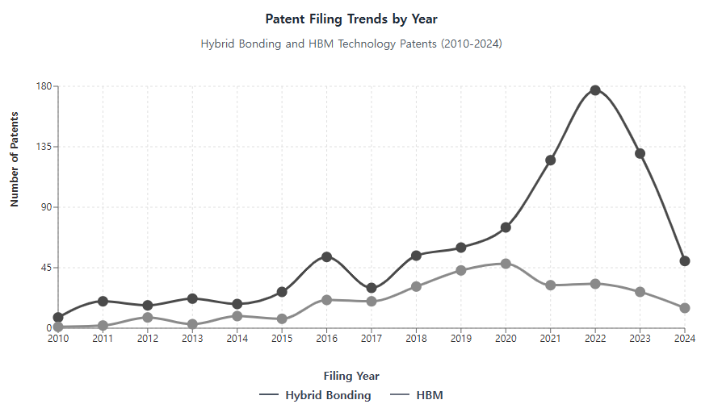
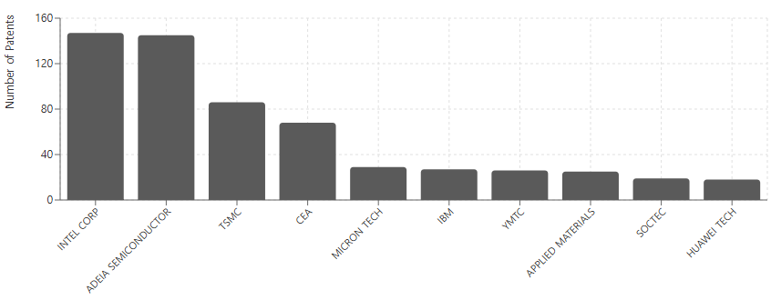
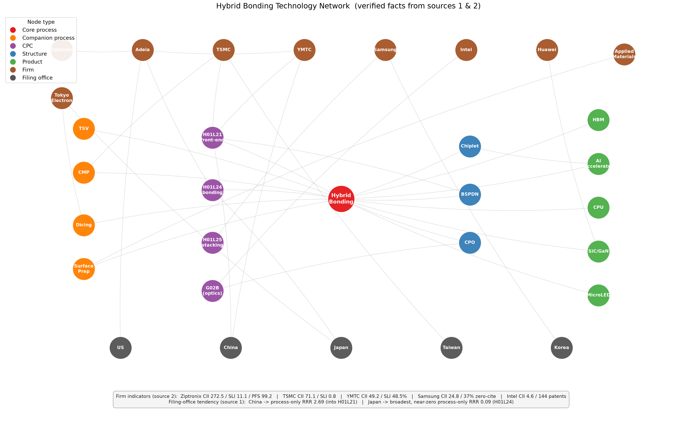

# 전공정과 후공정은 특허에서 융합하는가: 반도체 하이브리드 본딩 특허로 본 산업 내 기술융합, 침투의 결정요인, 그리고 국가·기업의 전략 방향

**Do the front end and the back end converge in patents? Intra-industry technological convergence, determinants of penetration, and national and corporate strategies in semiconductor hybrid bonding**

**이형규**
[대학명] 기술경영학과 ([기관 이메일])

> *국문 저널 투고용 원고 Rev1. 영문판(`manuscript_v1.md`)과 동일한 데이터·모형·수치를 사용하되, 서론과 이론적 배경을 다음의 논리로 재구성하였다: ① 무어의 법칙 종언과 전공정 미세화의 한계 → ② 접합 기반 후공정의 부상 → ③ 후공정의 전공정 의존 = 산업 내 융합 → ④ 기술 연구는 많으나 특허 관점 분석은 드묾 → ⑤ 기반기술과 전방 응용이 넓은 GPT 후보로서 하이브리드 본딩 선정 → ⑥ 전·후공정은 특허에서 실제로 수렴하는가 → ⑦ 침투의 결정요인과 국가·기업의 전략 방향. 형식은 국내 KCI 저널(예: 지능정보연구; 김민구 외, 2022)의 체재를 따른다.*

---

## 국문 초록

반도체 산업은 반세기 동안 회로 선폭을 줄이는 전공정 미세화로 성능을 향상시켜 왔으나, 무어의 법칙은 물리적·경제적 한계에 이르렀다. 이에 따라 칩을 어떻게 분할·적층·연결하는가를 다루는 접합 기반 후공정의 중요성이 커지고 있다. 그런데 후공정의 핵심 기술인 하이브리드 본딩은 화학적 기계연마·표면 활성화·정밀 정렬 등 전공정 역량을 요구하므로, 이는 서로 다른 산업 간의 융합이 아니라 *같은 산업 안에서 공정 단계를 가로지르는 융합* 의 성격을 갖는다. 이 현상에 대한 공학적 연구는 많으나 특허의 관점에서 분석한 연구는 드물다. 본 연구는 기반기술과 전방 응용이 모두 넓어 반도체 산업의 범용기술(GPT) 후보로 볼 수 있는 하이브리드 본딩을 대상으로, 유럽특허청 PATSTAT에서 추출한 특허출원 928건(출원–CPC 레코드 5,277건)을 분석하였다. 융합은 개별 특허 수준에서 '경계 넘기', 즉 접합·인터커넥트(H01L24)로 분류된 출원이 제조공정(H01L21)도 함께 청구하는지로 조작화하였다. 분석 결과, 첫째, 출원의 63.6%가 전공정 기호를 보유하고 최빈 전략은 두 단계를 결합한 통합형(45.8%)이어서 전·후공정은 특허에서 실제로 수렴하고 있으나, 그 수렴은 경계를 넘는 특허의 단순 증가가 아니라 순수 전공정 청구가 통합형 청구로 대체되는 '재구성'의 형태로 진행되었다. 둘째, 침투의 결정요인으로는 기술범위가 가장 강력하여 CPC 서브클래스 1개당 전공정 청구 승산이 약 27% 높아졌다. 셋째, 국가·기업 전략은 출원청에 뚜렷한 흔적을 남겨, 중국 출원청 출원은 범위가 좁고 공정 단독형 성향이 강한 추격형인 반면 일본 출원청 출원은 범위가 넓고 공정 단독형이 거의 없는 장비·소재 공급형이며, 기업 수준에서는 원천특허형(Adeia), 전공정 내재화형(TSMC), 추격 자립형(YMTC)이 구분되었다. 본 연구는 기술융합 이론을 산업 내·공정단계 간 사례로 확장하고, 국가·기업의 전략 수립에 시사점을 제공한다.

**주제어:** 기술융합, 하이브리드 본딩, 첨단 패키징, 범용기술, 특허 분석, 다항 로짓, PATSTAT

---

## 1. 서론

### 1.1 무어의 법칙의 종언과 전공정 미세화의 한계

지난 50여 년간 반도체 산업의 성능 향상은 회로 선폭을 줄이는 전공정(front-end) 미세화에 의존해 왔다. 그러나 7nm 이하 공정에서는 터널링 효과와 같은 물리적 한계와 EUV 노광 장비 비용의 기하급수적 상승이라는 경제적 한계가 동시에 나타나면서, 비용 대비 성능 개선의 속도가 현저히 둔화되었다(이종호·오철, 2022). 단일 칩(monolithic die)의 크기는 노광 장비의 레티클 한계(약 858㎟)에 부딪혔고, 칩이 커질수록 수율은 급감한다(박지민, 2019). 이러한 상황은 무어의 법칙이 사실상 종언을 맞았으며 향후의 성능 향상은 트랜지스터 내부가 아니라 그 바깥에서 찾아야 함을 의미한다(Khan et al., 2018). 국제반도체기술로드맵(ITRS)이 디지털 기능의 소형화를 뜻하는 "More Moore"와 나란히 기능의 다양화를 뜻하는 "More-than-Moore"를 제시한 것도 같은 인식의 표현이다(Arden et al., 2010).

### 1.2 접합 기반 후공정의 부상

미세화의 대안으로 부상한 것이 이종 집적(heterogeneous integration)이다. 거대한 단일 칩을 기능 단위의 칩렛(chiplet)으로 분할하고 이를 패키징 단계에서 수직·수평으로 재조립하여 시스템 성능을 극대화하는 접근으로, 고성능 로직만 최선단 공정으로 제작하고 I/O·캐시는 성숙 공정으로 만들어 제조 원가를 크게 낮출 수 있다(Iyer, 2016; 박지민, 2019). 그 결과 패키징은 더 이상 칩을 보호하는 후행 조립 공정이 아니라 성능·전력·면적·비용(PPAC)을 결정하는 주체로 재정의되었고(오유진, 2025), 부가가치 창출의 무게중심은 전공정에서 후공정으로 구조적으로 이동하고 있다(Lau, 2022). 이 전환에서 성능을 좌우하는 결정적 요인은 개별 칩이 아니라 칩과 칩을 잇는 인터커넥트, 곧 *접합(bonding)* 기술이다. 마이크로범프가 약 10–20µm 피치에서 쇼트와 저항 증가의 한계에 봉착하자(김기윤·이성주, 2024), 범프 없이 구리 패드와 절연막을 상온에서 직접 접합하여 피치를 1µm 이하로 낮추는 하이브리드 본딩이 차세대 인터커넥트의 핵심으로 부상하였다(Lau, 2021; 김민규 외, 2025).

### 1.3 후공정의 전공정 의존: 산업 내 기술융합

여기서 본 연구의 문제의식이 출발한다. 하이브리드 본딩은 분류상 후공정 기술이지만, 그 수율을 결정하는 공정—서브나노미터 수준의 화학적 기계연마(CMP), 플라즈마·화학적 표면 활성화, 파티클 제어, 서브미크론 정렬—은 본래 전공정(CPC H01L21)의 역량이다. 즉 후공정의 고도화가 전공정 기술을 *요구* 한다. 이는 정보통신과 가전, 식품과 제약처럼 서로 다른 산업이 만나는 기술융합(Kodama, 1992; Hacklin et al., 2009)과는 다르다. 하나의 산업 안에서 오랫동안 분업되어 온 두 공정 단계—파운드리·IDM이 담당해 온 전공정과 OSAT가 담당해 온 후공정(Macher and Mowery, 2004; Kapoor, 2013)—사이의 인터페이스가 불안정해지면서 일어나는 *산업 내(intra-industry)·공정단계 간(cross-stage) 융합* 이다. 산업계에서는 이미 TSMC·Intel·Samsung 등이 첨단 패키징을 OSAT에 맡기지 않고 내재화하고 있으며(지일용, 2025; Lau, 2022), 이는 산업 아키텍처—누가 무엇을 하고 누가 가치를 획득하는가—의 재편을 의미한다(Jacobides et al., 2006).

### 1.4 연구 공백: 기술 연구는 많으나 특허의 관점은 드물다

하이브리드 본딩에 관한 공학적·소재적 연구는 풍부하다. 접합 메커니즘, 표면 처리, 열처리 조건, 정렬 정밀도, 칩렛 이종 집적에서의 제조 난제를 다룬 리뷰가 이어지고 있다(Iyer, 2016; Lau, 2021, 2022). 그러나 이 기술을 *특허의 관점* 에서, 특히 전·후공정의 융합이라는 관점에서 정량 분석한 연구는 드물다. 특허 랜드스케이프를 다룬 산업 보고서(KnowMade/Yole Group, 2024)는 출원인 순위와 규모를 제시하지만 융합의 구조와 결정요인을 묻지는 않는다. 국내의 특허 기반 반도체 연구는 국가 단위 비교(이찬우, 2020; 오철, 2024), 텍스트 마이닝 기반 동향 파악(오유진, 2025), Problem–Solution 분석(김민규 외, 2025), 파운드리 기술경쟁력 비교(지일용, 2025) 등 상위 수준의 동향 파악에 머물러 있다. 인접 산업인 디스플레이에서는 김민구 외(2022)가 PATSTAT과 IPC·키워드 결합 검색으로 OLED 특허를 수집하고 하위 기술군별 동향과 전방 인용·독창성·다양성으로 측정한 기술 가치를 비교하여, 특허 데이터가 산업 전체의 기술 흐름과 전략적 선택지를 드러낼 수 있음을 보였다. 그러나 이 접근 역시 기술군 *간* 의 가치 비교이지 공정 단계 *간* 의 융합을 묻지는 않는다. 결국 "전공정과 후공정이 특허 위에서 실제로 융합하고 있는가, 어떤 특허가 경계를 넘으며, 국가와 기업은 이 융합에서 어떤 전략적 위치를 취하는가"는 답해지지 않은 질문으로 남아 있다.

### 1.5 왜 하이브리드 본딩인가: 기반기술과 전방 응용이 넓은 범용기술 후보

산업 내 융합을 검토할 사례로 하이브리드 본딩을 선정한 이유는 이 기술이 반도체 산업의 범용기술(General Purpose Technology, GPT) 후보라는 데 있다. GPT는 여러 산업에 광범위하게 적용되고(pervasiveness), 지속적으로 개선되며(improvement), 보완적 혁신을 촉발하는(innovation spawning) 기술을 가리킨다(Bresnahan and Trajtenberg, 1995; Hall and Trajtenberg, 2004). 하이브리드 본딩은 두 방향 모두에서 넓다. *후방(기반기술)* 으로는 CMP·실리콘 관통 전극(TSV)·표면 활성화·정렬 계측·다이싱·접합 소재와 전용 장비의 동반 발전을 요구하며(금연욱·김의석, 2023), *전방(응용)* 으로는 CMOS 이미지센서와 3D NAND의 W2W 접합에서 출발하여 HBM, AI 가속기의 캐시 적층(AMD 3D V-Cache), 칩렛 기반 3D 로직, 실리콘 포토닉스(CPO), SiC·GaN 전력반도체의 고방열 접합, MicroLED 대량 전사에 이르기까지 확장되고 있다(우징원·남은영, 2023; 김민규 외, 2025). 기반기술이 넓기 때문에 전공정과의 융합이 필연적이고, 응용이 넓기 때문에 융합의 결과가 산업 전체에 파급된다. 이 두 성질이 결합된 기술이야말로 "산업 내 융합이 특허에서 어떻게 나타나는가"를 관찰하기에 가장 적합한 창(window)이다.

### 1.6 연구질문과 논문의 구성

이에 본 연구는 유럽특허청 PATSTAT에서 추출한 하이브리드 본딩 특허출원 928건을 이용하여 세 가지 질문에 답한다.

- **RQ1(수렴).** 전공정과 후공정은 특허의 관점에서 실제로 융합·수렴하고 있는가? 그 수렴은 시간에 따라 어떤 형태로 진행되었는가?
- **RQ2(결정요인).** 후공정 특허가 전공정 영역으로 침투하는 정도는 특허의 어떤 속성—기술범위, 출원 시점, 출원청—에 의해 결정(연관)되는가?
- **RQ3(전략).** 이 침투 양상에서 드러나는 각 국가(출원청)와 기업의 전략 방향은 무엇인가?

이를 위해 융합을 개별 특허 수준에서 *경계 넘기(boundary spanning)*, 즉 접합·인터커넥트(H01L24)로 분류된 출원이 제조공정(H01L21)도 함께 청구하는가로 조작화하고, 기술융합 이론과 반도체 산업 아키텍처 이론으로부터 가설을 도출하여 이항·다항 로짓으로 검정한다. 제2장은 이론적 배경과 가설을, 제3장은 데이터와 방법을, 제4장은 분석 결과를 RQ1–RQ3의 순서로 제시한다. 제5장은 이론적·실무적 함의와 한계를 논의하고 제6장에서 결론을 맺는다.

## 2. 이론적 배경 및 선행연구

### 2.1 기술융합 이론: 산업 간에서 산업 내로

한 영역에서 개발된 기술이 다른 영역으로 이동한다는 생각은 Rosenberg(1963)의 공작기계 산업 연구로 거슬러 올라간다. 그는 총기·재봉틀·자전거를 위해 개발된 공정이 서로에게 적용될 수 있음을 기업들이 깨닫는 과정을 기술적 수렴(technological convergence)이라 불렀다. Kodama(1992)는 이전에는 분리되어 있던 기술 분야를 결합하여 어느 쪽도 단독으로는 갖지 못한 역량을 창출하는 *기술융합(technology fusion)* 을 제시하고, 이것이 돌파형 연구와 다른 R&D 조직을 요구한다고 하였다. 이후 연구는 기술의 융합과 시장·산업의 융합을 구분하였다. Gambardella와 Torrisi(1998)는 전자산업에서 기술의 융합이 곧 시장의 융합을 뜻하지는 않음을 보였고, Athreye와 Keeble(2000)은 컴퓨팅 융합이 소유구조와 기업 경계를 재편함을 추적하였으며, Fai와 von Tunzelmann(2001)은 특허로 대기업의 기술 역량이 산업 간에 수렴하는지를 검토하였다. Hacklin et al.(2009)은 융합이 지식→기술→응용→산업 융합의 단계로 공진화한다고 보았고, Curran과 Leker(2011)는 과학·기술·시장·산업 융합을 특허·논문 지표로 모니터링하는 방법을 정식화하였다. 이 흐름은 Sick과 Bröring(2022)의 리뷰, 융합 패턴의 유형론(Geum et al., 2016), 첨단기술 환경의 융합 평가 프레임워크(Sick et al., 2019), 융합 산업에서의 전략적 선택(Hacklin et al., 2013)으로 이어졌으며, 최근에는 협력혁신 등 융합의 동인을 기업 수준에서 추정하는 연구(Caviggioli, 2016; Hwang, 2020)가 더해졌다.

이 문헌의 공통점은 *서로 다른 산업* 의 만남을 다룬다는 것이다. 정보통신과 컴퓨팅, 식품과 제약(Bröring et al., 2006; Curran et al., 2010), 나노와 바이오(No and Park, 2010)가 전형적 사례다. 한 산업 안에서 그 산업 자체의 가치사슬 단계를 가로지르는 융합은 같은 도구로 검토되지 않았다. 본 연구는 이 공백을 겨냥한다.

### 2.2 반도체 가치사슬의 수직분업과 인터페이스의 불안정화

반도체 산업은 수직분업과 산업 아키텍처에 관한 연구가 축적된 대표적 산업이다. Langlois와 Steinmueller(1999)는 산업 구조의 진화에 따라 경쟁우위가 기업과 국가 사이를 이동해 온 역사를, Macher와 Mowery(2004)는 설계–제조–조립을 분리하여 팹리스·파운드리·OSAT를 낳은 수직 전문화를, Brown과 Linden(2009)은 이 아키텍처가 재협상된 연속적 위기를 기술하였다. Kapoor(2013)는 분업의 바람 속에서도 단계를 가로지르는 통합 역량을 유지한 기업이 기술 전환을 다르게 헤쳐 나갔고 그 선택이 산업 아키텍처를 형성했음을 보였다. Kapoor와 Adner(2012)는 DRAM 산업에서 기업이 *만드는 것* 과 *아는 것* 을 구분하고, 부품과 시스템이 상호의존적일 때 생산 경계보다 넓은 지식 경계가 우위를 준다는 것을 발견하였다. 이는 기술적 상호의존이 높을 때 기업이 "만드는 것보다 더 많이 안다"는 Brusoni et al.(2001)의 명제와 일치한다. Adner와 Kapoor(2010)는 반도체 리소그래피 생태계에서 혁신 난제의 위치가 새 기술 세대의 수혜자를 결정함을 보였다.

수직분업은 단계 간 *안정적 인터페이스* 를 전제한다. Ernst(2005)는 칩 설계의 모듈성이 복잡성 증가 앞에서 한계를 갖는다고 지적하였고, Jacobides et al.(2006)은 산업 아키텍처가 그 자체로 경쟁의 대상이며 단계 간 상호의존을 바꾸는 혁신이 아키텍처의 재협상을 부른다고 주장하였다. 하이브리드 본딩은 바로 그런 혁신이다. 수율이 전공정에 자리한 역량에 달려 있으므로 제조와 패키징의 인터페이스는 더 이상 안정적이지 않으며, 그 결과는 두 산업 사이가 아닌 한 산업의 두 단계 사이의 융합이다. 무어의 법칙 종언 문헌이 일반적 수준에서 예견하고(Arden et al., 2010; Iyer, 2016; Khan et al., 2018) 패키징 공학 문헌이 기술적으로 기술해 온(Lau, 2021, 2022) 이 현상을, 발명의 기록 속에서 관찰하는 방법이 빠져 있었다.

### 2.3 특허 기반 융합 측정과 '경계를 넘는 특허'

특허는 분류 코드가 각 발명을 기술 분야에 위치시키고 인용이 분야 간 지식 흐름을 기록하므로 융합 측정에 가장 널리 쓰인다(Curran and Leker, 2011). 측정 전통은 세 갈래다. 첫째, 공동분류로부터 *분야 수준 지수* 를 구축하는 전통이다. Cho와 Kim(2014)은 인쇄전자 IPC 공출현·인용 네트워크에 엔트로피·중력 개념을 적용하였고, Lee et al.(2015)은 대규모 삼극특허로 융합 패턴을 예측하였으며, Jeong et al.(2015)은 융합의 발전단계를, Kwon et al.(2020)은 대규모 특허 분석으로 기술 주도 산업융합을 예측하였으며, Karvonen과 Kässi(2013)는 특허 인용으로 융합의 초기 단계를 분석하였다. 둘째, *텍스트·표상 학습* 으로 분류가 따라잡기 전의 융합을 탐지하는 전통이다(Preschitschek et al., 2013; Zhu and Motohashi, 2022). 셋째, 융합의 *동인* 을 추정하는 전통이다(Caviggioli, 2016; Hwang, 2020). 국내에서는 김민구 외(2022)가 PATSTAT에서 IPC 집합과 키워드를 결합한 하이브리드 검색(Benson and Magee, 2013)으로 OLED 특허를 수집하고 토픽모델로 하위 기술군을 도출한 뒤, 기술군별 전방 인용·다양성(1−HHI)·독창성으로 기술 가치를 비교하였다. 이 연구는 데이터 구축 절차와 지표 설계에서 본 연구의 직접적 참조점이 된다.

본 연구는 신호의 선택—공동분류—에서는 첫째 전통에 속하지만 분석 단위에서 갈라진다. 공동분류를 분야 수준 지수로 집계하는 대신 각 특허의 이항 속성, 즉 후공정 접합 클래스(H01L24)로 분류된 발명이 전공정 제조 기호(H01L21)도 보유하는가를 정의하고, 이를 *경계를 넘는 특허* 라 부른다. 이 속성은 발명 수준의 융합으로 직접 해석되고 표준 이산선택 모형으로 추정할 수 있으며, 분야 수준 지수가 평균해 버리는 특허 간 전략적 이질성을 보존한다. 설명변수에는 두 갈래의 특허 연구가 정보를 준다. *특허 범위* 에 관해서는 Lerner(1994)가 분류 클래스 수로 범위를 측정하고 그 경제적 가치를 보였고, Marco et al.(2019)이 청구항 기반으로 이를 정교화하였으며, 반도체에서는 Hall과 Ziedonis(2001)가 1980년대 중반 이후의 특허 급증을, Ziedonis(2004)가 파편화된 기술 시장에서의 포트폴리오 확대를 기록하였다. *관할권 차이* 에 관해서는 중국 특허가 보조금 정책과 추격 동학의 영향을 받는다는 증거(Hu and Jefferson, 2009; Dang and Motohashi, 2015; Grimes and Du, 2022), 일본의 1988년 다항 청구 개혁(Sakakibara and Branstetter, 2001)과 장비·소재 강점(Langlois and Steinmueller, 1999), 그리고 후발자가 특정 생산 단계의 내재화에 집중한다는 추격 이론(Lee and Lim, 2001)이 있다.

### 2.4 범용기술(GPT)로서의 잠재력과 사례 선정의 근거

GPT 문헌은 특허 데이터로 범용성을 식별하는 방법을 제시해 왔다. Hall과 Trajtenberg(2004)는 일반성(generality) 지수·피인용·클래스 성장으로, Petralia(2020)는 개선성·범용성·보완성의 3차원 지표로 GPT를 지도화하였으며, 김민구 외(2022)는 기술군의 다양성(1−HHI)과 독창성(Jaffe et al., 1993의 후방 인용 기반 지수)을 기술 가치의 구성요소로 사용하였다. 하이브리드 본딩이 이러한 기준에서 GPT인지는 별도의 검정을 요한다. 본 연구는 일반성 지수를 직접 산출하지 않으므로 GPT 판정을 단정하지 않고, 제1.5절에서 기술한 넓은 기반기술과 넓은 전방 응용을 *사례 선정의 근거* 로만 삼는다. 다만 산업 내 융합의 관점에서 GPT적 성격은 중요한 함의를 갖는다. 기반기술이 넓을수록 전공정과의 융합은 필연적이고, 응용이 넓을수록 융합의 결과는 여러 제품·산업으로 파급된다. 따라서 하이브리드 본딩에서 관찰되는 경계 넘기의 구조는 다른 융합형 공정기술에도 이전 가능한 일반적 패턴일 가능성이 높다.

### 2.5 연구가설

이상의 논의로부터 RQ2·RQ3에 대응하는 네 가지 가설을 도출한다.

*기술범위.* 경계 넘기가 융합의 한 형태라면, 더 많은 기술 클래스에 걸치는 특허가 그중에 전공정 클래스를 포함할 가능성이 높다. 웨이퍼 준비에서 접합된 적층까지의 전체 공정 흐름을 청구하는 특허는 필연적으로 제조에 닿는 반면, 조립 단계나 접합 구조만 청구하는 특허는 그렇지 않다(Lerner, 1994; Ziedonis, 2004).

> **H1.** 하이브리드 본딩 특허의 기술범위가 넓을수록 전/후공정 경계를 넘을, 즉 접합(H01L24)에 더하여 제조공정(H01L21)을 청구할 가능성이 높다.

*성숙.* 융합의 단계 모형(Hacklin et al., 2009; Jeong et al., 2015)은 기술이 성숙하면서 융합의 *형태* 가 변한다고 함의한다. 초기 발명은 직접 접합을 가능케 한 제조 단계—표면 준비, 저온 어닐링, 평탄화—에 관한 것이어서 공정 발명으로 분류되었으나, 기술이 W2W에서 D2W로 이동하면서 발명은 접합된 구조와 통합된 적층으로 옮겨갔다(Lau, 2021).

> **H2.** 하이브리드 본딩이 성숙함에 따라, 특허가 공정 단독형을 취할 확률은 조립 수준 청구 대비 감소하는 반면, 통합형(경계를 넘는) 형태를 취할 확률은 감소하지 않는다.

*관할권과 산업 아키텍처.* 추격 이론과 중국 특허의 증거는 중국 출원청 출원이 특정 제조 단계의 내재화에 집중—범위가 좁고 공정 단독형이 많음—할 것임을, 일본 기업의 장비·소재 강점과 다항 청구 관행은 일본 출원청 출원이 넓고 통합 지향적이며 공정 단독형이 드물 것임을 시사한다.

> **H3a.** 중국 출원청 출원은 미국 출원청 출원보다 공정 지향적(H01L21 청구)일 가능성, 특히 공정 단독형을 취할 가능성이 높다.

> **H3b.** 일본 출원청 출원은 미국 출원청 출원보다 기술범위가 넓고 공정 단독형을 취할 가능성이 낮다.

이 가설들은 특허 속성과 경계 넘기 사이의 연관에 관한 것이며 인과효과를 주장하지 않는다(제5.3절).

## 3. 연구 방법

### 3.1 데이터 구축

데이터는 유럽특허청의 PATSTAT Global 2025년판에서 추출하였다(European Patent Office, 2025). 특허 수집에는 김민구 외(2022)와 마찬가지로 분류 코드와 키워드를 결합하는 하이브리드 검색(Benson and Magee, 2013)을 적용하였다. 1차로 CPC H01L21(반도체 장치 제조를 위한 공정·장치)과 H01L24(반도체 바디의 연결·분리 배치) 및 그 인덱싱 코드로 후보 집합을 추출하고, 2차로 공정 특성을 반영하는 키워드(*hybrid bonding*, *direct bonding*, *Cu–Cu*, *copper to copper*, *metal-oxide bond*)를 AND 조건으로 결합하여 위양성을 제거하였다(부록 A, 그림 A1). 그 결과 출원–CPC 레코드 5,277건이 확보되었고, 출원 단위로 응집하면 1968–2024년에 출원된 고유 출원 928건이 된다. 모든 기호는 H01L 아래에 있으며 본 연구의 전/후공정 경계를 정의하는 H01L21과 H01L24로 나뉜다. 비교군인 HBM 특허(약 2,330 레코드)는 같은 절차로 구축하여 기술적 비교(그림 1)에만 사용하였다.

### 3.2 변수

표 1은 변수를 정의한다. *기술범위(breadth)* 는 출원에 부여된 고유 CPC 서브클래스 기호의 수(Lerner, 1994), *has_process* 는 H01L21 기호를 하나라도 보유하면 1인 경계 넘기 지표, *tech_cat* 은 조립 단독형(H01L24만)·통합형(둘 다)·공정 단독형(H01L21만)의 세 전략 유형, *ccode* 는 출원청(미국 기준, 8수준), *yc* 는 표본 최초 출원 이후 경과 연수다.

**표 1.** 변수 정의

| 변수 | 정의 | 유형 |
|---|---|---|
| breadth | 출원의 고유 CPC 서브클래스 기호 수(기술범위) | 카운트, 1–21 |
| has_process | H01L21(제조공정) 기호 보유 시 1, 아니면 0 | 이항 |
| tech_cat | 조립 단독형(H01L24만) / 통합형(둘 다) / 공정 단독형(H01L21만) | 범주, 3 |
| ccode | 출원청: US(기준), CN, KR, TW, JP, EP, WO, 기타 | 범주, 8 |
| yc | 출원연도(표본 최초 출원 이후 경과 연수) | 연속 |

기술범위는 평균 5.69개(표준편차 4.07, 범위 1–21)다. 출원청별로는 미국 382건, 중국 175건, PCT 113건, EPO 83건, 대만 75건, 한국 58건, 일본 26건, 기타 16건이다. 전략 유형별로는 통합형 425건(45.8%), 조립 단독형 338건(36.4%), 공정 단독형 165건(17.8%)이며, 전공정 기호를 보유한 출원은 590건(63.6%)이다. 관할권 변수는 출원청이지 출원인 국적이 아니고 WO·EP는 국제·지역 경로이므로, 출원청 간 차이는 발명의 기원과 출원·보호 전략을 함께 반영한다는 점을 일관되게 전제한다.

### 3.3 분석 모형

모형은 종속변수의 통계적 성격을 따른다. 기술범위는 카운트이므로 OLS를 벤치마크로 이분산성(Breusch–Pagan)과 잔차 도표를 점검한 뒤 Poisson과 음이항을 추정하고 과산포를 검정한다(Hausman et al., 1984; Cameron and Trivedi, 2013). 경계 넘기는 이산선택으로 모형화한다. 이항 로짓은 기술범위·연도·출원청으로 *has_process* 를 예측하며 승산비(OR)와 ROC 곡선 하면적(AUC)으로 평가하고(Hosmer et al., 2013), 다항 로짓(McFadden, 1974)은 조립 단독형을 기준으로 *tech_cat* 을 모형화하여 상대위험비(RRR)로 보고한다. 다항 로짓은 무관 대안의 독립성(IIA)에 의존하므로 추정치를 기준 범주 대비 상대적 경향으로 해석하고 절대 확률에 관한 인과적 진술은 삼간다.

## 4. 분석 결과

### 4.1 하이브리드 본딩 생태계 개관

그림 1은 공정 기술인 하이브리드 본딩과 이에 의존하는 제품인 HBM의 연간 출원을 비교한다. 두 시계열은 2010년대 후반까지 함께 움직였으나(2019년 56건 대 41건), 2020년 갈라지기 시작하여(71건 대 45건) 2021년 하이브리드 본딩 출원은 118건으로 전년 대비 약 66% 급증한 반면 HBM은 30건 안팎에서 정체하였다. 기술의 개발이 제품보다 앞서 달린 것으로, 가능화(enabling) 공정에서 기대되는 양상이다. 그림 4는 928건 표본의 장기 프로필로, 2010년 이전 미미하던 활동이 2010년대 후반 급상승하여 2022년경 정점에 이르며, 2023–2024년의 하락은 공개 시차 인공물이다.

출원인 구조는 집중되어 있다. 상위 10개 출원인이 순위 특허의 58.5%를 차지하며(그림 2), Intel과 Adeia—직접접합 인터커넥트의 원천인 Ziptronix·Invensas를 흡수한 라이선싱 기업—가 선두이고 TSMC와 프랑스 CEA가 뒤를 잇는다. 이는 TSMC·Adeia·YMTC·Intel·Samsung을 선도 출원인으로 지목한 독립적 산업 분석(KnowMade/Yole Group, 2024)과 부합한다. 전력반도체·방산 기업의 출원은 응용이 로직·메모리를 넘어 확장됨을 보여준다.

Narin et al.(1987, 1997)과 Ernst(2003)를 따라 산출한 인용 기반 지표는 세 전략 유형을 분리한다(표 2). *원천기업* Ziptronix와 핵심 발명가는 특허당 270회 이상 인용되고 무인용이 없으며 과학연계와 시장 커버리지가 가장 높아, 생태계의 나머지가 라이선스하거나 우회 설계해야 하는 진입장벽을 구축하였다. *선도 제조사* TSMC는 높은 인용 영향력과 매우 낮은 과학연계를 결합한 엔지니어링 주도형으로, 현시 기술우위(Soete, 1987)가 인터커넥트·비아 충전·다마신·평탄화 등 *H01L21 전공정 코드* 에 집중되어 있다. SoIC 플랫폼이 체현하는 전공정 내재화의 패턴이다. *추격 진입자* YMTC는 Adeia의 원천기술을 라이선스한 뒤 자체 W2W "X-Stacking" NAND 공정을 개발하였으며, 26건이 모두 인용되고 인용 정점이 출원 2년 후로 매우 빠르다. 반면 Intel은 최다 특허(144건)에도 평균 인용 영향력이 가장 낮고 Samsung의 무인용 비율은 3분의 1을 넘는다. 장비사 중 Applied Materials는 표면 처리·클러스터 툴에, Tokyo Electron은 정렬 계측에 집중한다. 그림 3은 이 생태계를 기술 네트워크로 요약한다.

**표 2.** 주요 출원인의 생태계 지표(출처: 동일 PATSTAT 추출에 대한 출원인 수준 분석; 보충자료 S1)

| 출원인(유형) | 특허당 인용 | 무인용 비율 | 과학연계 | 시장 커버리지(평균 시장규모 / 글로벌 특허비율) | 전략적 해석 |
|---|---:|---:|---:|---|---|
| Ziptronix / Tong Qin-Yi(원천, IP) | 272.5 / 281.4 | 0% / 0% | 11.08 / 7.91 | 18.75 / 99.2%; 19.17 / 95.5% | 원천 특허; 진입장벽 |
| Invensas → Adeia(IP 라이선서) | — | — | 27.79 / 10.49 | — | 과학 기반 라이선싱 플랫폼 |
| TSMC(파운드리) | 71.1 | 3.6% | 0.79 | 5.25 / 92.6% | 엔지니어링 주도; 전공정 코드를 패키징에 내재화(SoIC) |
| YMTC(메모리, 추격) | 49.2 | 0% (26건) | 논문인용특허비율 48.5% | 11.69 / 99.7% | 라이선스 후 자체 W2W NAND; 인용 정점 2년차 |
| Intel(IDM) | 4.6 | 22.8% (144건) | 0.33 | — | 최대 포트폴리오, 최저 영향력 |
| Samsung(메모리/파운드리) | 24.8 | 37.3% (11건) | — | 2.61 / 45.1% | 양적 규모 대비 인용 영향력 부족 |
| Micron(메모리) | — | — | 0.03 | 3.88 / 85.9% | 엔지니어링 주도 |
| Applied Materials / Tokyo Electron(장비) | — | — | 0.08 / — | — | 표면 준비·클러스터 툴; 정렬 계측 |

*주:* 과학연계는 특허당 비특허문헌 인용의 평균 수, YMTC는 논문을 인용한 특허의 비율. "—"는 원 분석에서 보고되지 않음.

### 4.2 RQ1: 전공정과 후공정은 특허에서 수렴하는가

첫 번째 질문에 대한 답은 세 층위의 증거로 구성된다.

*(1) 수준.* 후공정(H01L24) 기술로 추출된 928건 중 590건(63.6%)이 전공정(H01L21) 기호를 함께 보유한다. 전략 유형으로 보면 두 단계를 한 발명 안에 결합한 통합형이 425건(45.8%)으로 최빈이고, 조립 단독형 338건(36.4%), 공정 단독형 165건(17.8%)이 뒤를 잇는다(표 3). 즉 하이브리드 본딩 특허의 표준적 형태는 "후공정 접합 특허"가 아니라 "전공정 공정을 포함하는 접합 특허"다. 경계 넘기는 주변 현상이 아니라 최빈 현상이다.

**표 3.** 전략 유형의 분포(N = 928)

| 전략 유형 | 정의 | 건수 | 비중 |
|---|---|---:|---:|
| 통합형(integrated) | H01L24 + H01L21 | 425 | 45.8% |
| 조립 단독형(assembly-only) | H01L24만 | 338 | 36.4% |
| 공정 단독형(process-only) | H01L21만 | 165 | 17.8% |
| (전공정 기호 보유 = 통합형 + 공정 단독형) | | 590 | 63.6% |

*(2) 거시 정합.* 이 특허 수준의 수렴은 생태계 수준의 증거와 같은 방향을 가리킨다. 선도 파운드리 TSMC의 현시 기술우위가 다마신·CMP 등 전공정 코드에 집중되어 있고, 전공정 장비사인 Applied Materials와 Tokyo Electron이 후공정 접합의 표면 처리와 정렬 계측에서 상위 출원인으로 등장한다(표 2). "부가가치가 전공정에서 후공정으로 이동한다"는 거시 명제와 "후공정 특허가 전공정 영역을 청구한다"는 미시 증거가 동일 모집단·동일 기간에서 함께 관찰되는 것이다.

*(3) 시간적 형태.* 그러나 특허 기록은 "과거에는 따로 놀았고 지금은 합쳐졌다"는 단순한 서사를 그대로 확인해 주지는 않는다. 표본의 2010년 이전 출원이 극소수여서 전/후 시기 분할 비교는 통계적으로 의미가 없으며, 대신 연도 추세를 모형에 넣어 형태의 변화를 본다. 제4.3절의 다항 로짓(표 6)에 따르면 공정 단독형의 상대위험은 연간 약 8.7%씩 감소한 반면(RRR 0.913, p < 0.01) 통합형의 상대위험은 평탄하다(RRR 0.993, 비유의). 줄어든 것은 순수 전공정 청구이지 경계 넘기가 아니다. 초기에는 직접 접합을 가능케 한 제조 단계 자체가 발명이었고, 기술이 W2W에서 D2W로 성숙하면서 발명의 중심이 접합 구조와 통합 적층으로 옮겨가 전공정 지식은 특허 *그 자체* 에서 특허가 *포함하는 것* 이 되었다. 수렴은 경계를 넘는 특허의 단조 증가가 아니라 **재구성(recomposition)** —공정 단독형이 통합형과 조립형으로 대체되는 과정—의 형태로 진행되었다. 이것이 RQ1에 대한 본 연구의 답이다.

### 4.3 RQ2: 침투의 결정요인

*기술범위.* 표 4는 기술범위의 음이항 추정치다(OLS·로버스트 OLS·Poisson과의 전체 비교는 부록 B). OLS 잔차는 등분산을 기각하고(Breusch–Pagan p < 0.001) 카운트 특유의 띠 무늬와 깔때기 형태를 보이며, 음이항의 과산포 모수는 크고 정밀하여(ln α = −1.316, α ≈ 0.27) AIC가 Poisson 5,477에서 4,883으로 낮아지므로 음이항을 작업 모형으로 삼는다. 범위는 연간 약 1.4%씩 넓어졌고(IRR 1.014), 미국 대비 중국 출원청은 약 21% 좁으며(IRR 0.785, p < 0.01) PCT는 약 17% 좁고(IRR 0.826, p < 0.01), 일본 출원청은 가장 넓다(IRR ≈ 1.27, p < 0.10). 한국·대만·EPO는 미국과 구분되지 않는다(그림 5).

**표 4.** 기술범위의 결정요인: 음이항(N = 928; 미국 기준; 괄호 안 표준오차; \* p < 0.10, \*\* p < 0.05, \*\*\* p < 0.01)

| | 계수 | IRR |
|---|:---:|:---:|
| 출원연도(yc) | 0.014\*\*\* (0.003) | 1.014 |
| 중국(CN) | −0.242\*\*\* (0.062) | 0.785 |
| 한국(KR) | 0.017 (0.094) | 1.017 |
| 대만(TW) | 0.021 (0.083) | 1.021 |
| 일본(JP) | 0.239\* (0.133) | 1.270 |
| EPO(EP) | −0.007 (0.080) | 0.993 |
| PCT(WO) | −0.191\*\*\* (0.073) | 0.826 |
| 기타 | 0.056 (0.171) | 1.058 |
| 상수 | 1.069\*\*\* (0.175) | |
| ln(α) | −1.316\*\*\* (0.076) | |
| AIC | 4,883.0 | |

*경계 넘기의 결정요인.* 표 5의 이항 로짓에서 기술범위는 지배적 예측변수다. CPC 서브클래스가 하나 늘 때마다 전공정 청구 승산이 약 27% 높아지며(OR 1.267, p < 0.01) H1을 지지한다. 연도 추세는 반대 방향으로(연간 OR 0.946, p < 0.01), 접합·조립 수준 발명이 분야를 지배하면서 공정 지향 출원의 비중이 줄었다. 출원청 중에서는 중국만 유의하게 달라 공정 청구 승산이 65% 높다(OR 1.650, p < 0.05; H3a 지지). 일본의 승산비는 1 미만(0.483)이지만 26건에 기반하여 부정확하다. AUC는 0.707로 수용 가능한 판별력이다(그림 6).

**표 5.** 경계 넘기의 이항 로짓(has_process). 승산비; 괄호 안 표준오차; \* p < 0.10, \*\* p < 0.05, \*\*\* p < 0.01

| | 승산비 | (SE) |
|---|:---:|:---:|
| 출원연도(yc) | 0.946\*\*\* | (0.011) |
| 기술범위 | 1.267\*\*\* | (0.034) |
| 중국(CN) | 1.650\*\* | (0.338) |
| 한국(KR) | 1.430 | (0.467) |
| 대만(TW) | 1.555 | (0.451) |
| 일본(JP) | 0.483 | (0.233) |
| EPO(EP) | 1.170 | (0.312) |
| PCT(WO) | 1.398 | (0.329) |
| 기타 | 2.132 | (1.307) |
| N = 928; 로그우도 = −547.6; AIC = 1,115.1; AUC = 0.707 | | |

*전략 유형의 결정요인.* 표 6의 다항 로짓은 경계 넘기를 피하는 두 방식—조립에만 머무는 것과 제조에만 머무는 것—을 분리한다. 조립 단독형 대비 기술범위는 특허를 통합형으로 밀고(RRR 1.403, p < 0.01) 공정 단독형에서 멀어지게 한다(RRR 0.905, p < 0.05). 넓은 특허는 두 단계에 걸치고 좁은 특허는 한 단계에 특화한다. 이것이 H1의 더 날카로운 형태다. 범위는 전공정 기호의 단순한 존재가 아니라 한 발명 안에서의 전·후공정 *결합* 과 연관된다. 연도 추세는 공정 단독형만 낮추고(RRR 0.913, p < 0.01) 통합형은 건드리지 않아(RRR 0.993) H2를 지지한다.

**표 6.** 전략 유형의 다항 로짓(기준 = 조립 단독형). 상대위험비; 괄호 안 표준오차; \* p < 0.10, \*\* p < 0.05, \*\*\* p < 0.01

| | 통합형 | (SE) | 공정 단독형 | (SE) |
|---|:---:|:---:|:---:|:---:|
| 출원연도(yc) | 0.993 | (0.015) | 0.913\*\*\* | (0.013) |
| 기술범위 | 1.403\*\*\* | (0.043) | 0.905\*\* | (0.044) |
| 중국(CN) | 1.205 | (0.280) | 2.687\*\*\* | (0.740) |
| 한국(KR) | 1.166 | (0.444) | 1.906 | (0.799) |
| 대만(TW) | 1.312 | (0.422) | 2.102\* | (0.857) |
| 일본(JP) | 1.046 | (0.583) | 0.086\*\*\* | (0.070) |
| EPO(EP) | 1.307 | (0.380) | 0.858 | (0.376) |
| PCT(WO) | 1.126 | (0.302) | 1.997\*\* | (0.645) |
| 기타 | 2.326 | (1.585) | 1.901 | (1.480) |
| N = 928; 로그우도 = −774.5; AIC = 1,589.0 | | | | |

### 4.4 RQ3: 국가와 기업의 전략 방향

*국가(출원청) 수준.* 관할권 대비는 공정 단독형 갈래에 집중된다. 중국 출원청은 미국보다 공정 단독형 특허를 품을 가능성이 훨씬 높고(RRR 2.687, p < 0.01), 대만(RRR 2.102, p < 0.10)과 PCT(RRR 1.997, p < 0.05)도 높은 반면 일본은 거의 그렇지 않다(RRR 0.086, p < 0.01). 통합형 갈래의 출원청 계수는 어느 것도 유의하지 않다. 범위와 시점을 통제하면 경계를 넘는 특허를 내는 성향 자체는 출원청 간에 다르지 않다. 그림 7은 다른 공변량을 평균에 둔 출원청별 공정 단독형 예측 확률로, 중국은 대략 넷 중 하나, 미국은 약 일곱 중 하나, 일본은 약 쉰 중 하나다. 이를 범위 결과(표 4)와 결합하면 세 가지 국가 전략 프로필이 드러난다.

- **중국(추격·내재화형).** 범위가 좁고(−21%) 공정 단독형이 압도적으로 많다. 통합된 적층 전체를 청구하기 전에 특정 제조 단계—표면 처리, 저온 어닐링, 다이싱—를 하나씩 내재화하는 추격 자세(Lee and Lim, 2001)의 프로필이며, 특허 건수를 보상하는 정책(Dang and Motohashi, 2015)이 이를 강화한다. 기업 수준에서 YMTC의 궤적—라이선스 후 독자 W2W 공정 개발, 유난히 빠른 인용 정점—이 같은 자세를 보여준다.
- **일본(장비·소재 공급형).** 범위가 가장 넓고(+27%) 공정 단독형이 사실상 없다. 단일 단계가 아니라 전체 공정 흐름에 걸쳐 특허를 내는 장비·소재 공급사의 프로필로(Langlois and Steinmueller, 1999), Tokyo Electron의 정렬 계측 집중이 이를 예시한다.
- **한국·대만(정면 경쟁형).** 범위와 통합형 갈래에서 미국 기준 근처에 있어, 미국 출원인과 정면 경쟁하는 메모리 제조사와 파운드리의 프로필이다. 다만 대만의 높은 공정 단독형 경향(10% 수준)은 TSMC의 다마신·평탄화 코드 집중이 보여주듯 파운드리가 전공정 패키징 역량을 내재화하는 양상과 부합한다.

*기업 수준.* 표 2의 지표와 위의 계량 결과를 결합하면 기업 전략은 네 유형으로 정리된다(표 7). 원천특허형(Adeia 계열)은 과학 기반 원천 특허로 진입장벽을 구축하고 라이선싱으로 가치를 획득한다. 전공정 내재화형(TSMC)은 CMP·다마신 등 전공정 역량을 접합 공정에 투입하여 통합형 청구를 쓰고, SoIC 같은 플랫폼으로 고객을 종속(lock-in)시킨다(지일용, 2025). 추격 자립형(YMTC)은 라이선스에서 출발해 독자 공정으로 이행하며 공정 단독형 청구를 축적한다. 양적 우위·질적 과제형(Intel·Samsung)은 특허 수는 많으나 인용 영향력이 낮아 질적 고도화가 과제다. 장비·소재형(Applied Materials, Tokyo Electron)은 전·후공정 인터페이스—표면 처리, 정렬—에서 방어 가능한 위치를 점한다.

**표 7.** 국가·기업 전략 유형의 종합

| 수준 | 유형 | 특허 프로필(범위 / 전략 유형) | 대표 주체 | 근거 |
|---|---|---|---|---|
| 국가 | 추격·내재화형 | 좁음 / 공정 단독형↑ | 중국 출원청 | IRR 0.785\*\*\*; RRR 2.687\*\*\* |
| 국가 | 장비·소재 공급형 | 넓음 / 공정 단독형 거의 없음 | 일본 출원청 | IRR 1.270\*; RRR 0.086\*\*\* |
| 국가 | 정면 경쟁형 | 미국 수준 / 통합형 미국 수준 | 한국·대만 출원청 | 범위·통합형 계수 비유의 |
| 기업 | 원천특허형 | 높은 CII·SLI·PFS | Adeia(Ziptronix·Invensas) | 표 2 |
| 기업 | 전공정 내재화형 | 전공정 코드 RTA 집중, 통합형 | TSMC | 표 2; 지일용(2025) |
| 기업 | 추격 자립형 | 빠른 인용 정점, 높은 SLI | YMTC | 표 2 |
| 기업 | 양적 우위·질적 과제형 | 다수 특허, 낮은 CII | Intel, Samsung | 표 2 |
| 기업 | 장비·소재형 | 표면 처리·정렬 계측 | Applied Materials, Tokyo Electron | 표 2 |

### 4.5 가설 검정 요약과 강건성

표 8은 가설 검정 결과를 요약한다. H1은 이항·다항 모두에서, H2는 다항에서, H3a는 두 명세와 범위 모형에서 지지되며, H3b는 공정 단독형(강하게)과 범위(10% 수준)에서 지지되고 이항 로짓의 일본 계수는 기대 방향이나 부정확하다.

**표 8.** 가설과 결과 요약

| 가설 | 예측 | 증거 | 판정 |
|---|---|---|---|
| H1 | 범위↑ → 경계 넘기↑ | OR 1.267\*\*\*(표 5); RRR 통합형 1.403\*\*\*, 공정 단독형 0.905\*\*(표 6) | 지지 |
| H2 | 공정 단독형↓, 통합형 유지 | RRR 공정 단독형 0.913\*\*\*/년; 통합형 0.993(비유의) | 지지 |
| H3a | 중국 출원청 = 공정 지향 | OR 1.650\*\*; RRR 2.687\*\*\*; 범위 IRR 0.785\*\*\* | 지지 |
| H3b | 일본 출원청 = 넓고 공정 단독형 드묾 | IRR 1.270\*; RRR 0.086\*\*\*; OR 0.483(비유의) | 대체로 지지 |

강건성에 관해 세 가지를 확인하였다. 첫째, 연도와 중국 출원청 효과의 부호·유의성은 OLS·로버스트 OLS·Poisson·음이항에서 동일하며(부록 B), 표준오차 보정으로 정밀도를 잃는 것은 일본 계수뿐이다. 둘째, 2023–2024년의 출원 감소는 공개 시차 인공물로 추세의 방향보다 최근 수준에 영향을 미치나, 공정 단독형의 감소를 절단된 연도로 외삽하지는 않는다. 셋째, IIA 가정을 요구하지 않는 이항 로짓이 범위·시간·중국 출원청에 대해 다항 로짓과 같은 질적 결론을 준다.

## 5. 논의

### 5.1 이론적 기여

*산업 내 융합으로의 확장.* 기술융합 문헌은 융합을 산업 *사이* 의 현상으로 다루어 왔다(Hacklin et al., 2009; Curran and Leker, 2011; Sick and Bröring, 2022). 본 연구는 같은 개념 장치가 한 산업을 *관통하는* 경계에도 적용되며 개별 발명 수준에서 관찰될 수 있음을 보였다. 산업 아키텍처가 분업의 템플릿이라면(Jacobides et al., 2006), 산업 내 융합은 그 템플릿이 재협상되는 메커니즘이다. 단계 간 인터페이스가 안정을 잃고 발명이 그 양쪽을 모두 청구하기 시작한다.

*융합의 미시 메커니즘으로서의 기술범위.* Kodama(1992)의 기술융합은 R&D 조직 수준에서, 융합 지수는 분야 수준에서 정식화되었다. 본 연구는 메커니즘을 개별 발명의 범위에 위치시켰다. 이는 Lerner(1994)와 Ziedonis(2004)의 특허 범위 연구에 융합적 해석을 더한다. 수율이 인접 단계의 역량에 달린 기술에서 범위의 넓음은 보호 전략일 뿐 아니라 청구항 속에서 융합이 취하는 형태다.

*축적이 아닌 재구성.* 융합의 소박한 독해는 경계를 넘는 특허의 비중이 단조 증가할 것이라 예측하지만, 관찰된 것은 통합형의 유지와 공정 단독형의 감소였다. 이는 Hacklin et al.(2009)의 공진화 논리를 단일 기술 안에서 확인한 것이며, "과거에는 분리, 지금은 융합"이라는 산업계의 서사를 특허 데이터로 정교화한다. 수렴은 더 많은 특허가 경계를 넘음으로써가 아니라 경계 넘는 내용이 형태를 바꿈으로써 진행된다.

*산업 아키텍처와 추격의 흔적.* 국가·기업의 전략이 청구항 수준에 체계적 흔적을 남긴다는 발견은, 기업의 통합 선택이 산업 아키텍처를 형성한다는 Kapoor(2013)의 주장을 특허 청구의 수준으로 확장한다. 추격 이론(Lee and Lim, 2001)이 예측하는 단계별 내재화가 중국 출원청의 좁고 공정 지향적인 프로필로, 장비·소재 강점이 일본 출원청의 넓고 통합 지향적인 프로필로 나타난다.

*방법론.* 김민구 외(2022)가 디스플레이 산업에서 보인 PATSTAT 기반 하이브리드 검색과 지표 설계를 이어받되, 기술군 *간* 비교에서 공정 단계 *간* 경계 넘기로 문제를 옮기고, 이를 두 개의 CPC 클래스·하나의 공동분류 규칙·표준 카운트 및 이산선택 추정량이라는 투명하고 재현 가능한 설계로 구현하였다. 이 설계는 하류 단계가 상류 역량을 흡수하기 시작한 다른 공정기술에 그대로 이전할 수 있다.

### 5.2 실무적·정책적 시사점

*후공정(OSAT) 기업.* 전통적 조립·테스트 모형은 제조와의 안정적 인터페이스에 의존했으나 하이브리드 본딩에서 그 인터페이스는 해체되었다. 평탄화와 표면 화학 역량이 없는 조립 전문기업은 가장 가치 있는 청구가 이미 파운드리와 장비사에 점유되어 있음을 발견할 것이다. 경계 넘기가 범위와 연관된다는 결과는 필요한 역량이 단일 공정 단계가 아니라 웨이퍼 준비에서 접합 적층까지의 *흐름* 을 청구할 수 있는 능력임을 시사한다.

*파운드리·IDM.* 첨단 패키징의 내재화는 생산능력 결정이 아니라 Kapoor와 Adner(2012)의 의미에서 지식 경계 결정이다. 지식이 경계를 넘어 확장되는 기업이 기술이 보상하는 통합형 청구를 쓸 수 있다.

*장비·소재 기업.* 일본 출원청 프로필—넓고 통합 지향적이며 공정 단독형이 없음—은 전·후공정 인터페이스에서의 독특하고 방어 가능한 위치를 가리킨다. 표면 처리, 정렬 계측, 접합 소재는 융합의 병목이자 기회다.

*한국 산업과 정책.* 한국의 메모리 제조사는 차세대 HBM을 위해 하이브리드 본딩에 의존하며, 삼성전자는 메모리–파운드리–패키징 일괄 제공의 턴키 전략을 추구하고 있다(지일용, 2025). 본 연구의 결과는 패키징 경쟁력이 패키징 노하우만이 아니라 전공정 역량—CMP, 표면 화학, 정렬 계측—과 이를 통합형 청구로 결합하는 능력에 의해 결정됨을 함의한다. 표 2에서 Samsung의 무인용 비율이 3분의 1을 넘는다는 사실은 양적 팽창을 넘어선 질적 고도화의 필요를 보여주며, 정책적으로는 특허 건수보다 전·후공정을 아우르는 통합형 특허와 소재·장비 인터페이스 역량을 겨냥한 지원이 요구된다. 반면 중국 출원청의 단계별 내재화 프로필은 추격에 효과적이지만 통합형 청구는 남에게 맡기는 전략이며, 한국이 같은 경로를 따를 이유는 없다.

### 5.3 한계와 향후 연구

네 가지 한계가 있다. 첫째, 관할권 변수는 출원청이지 출원인 국적이 아니어서 발명의 기원과 보호 전략이 섞인다. 출원인 식별자와 본사 위치를 연결하면 이를 분리하고 기업 고정효과를 넣을 수 있다. 둘째, 추정치는 연관적이다. 범위와 전략은 공동 결정될 개연성이 있으나 신뢰할 만한 도구변수가 없어 인과 식별을 시도하지 않았다. 셋째, 융합 신호인 CPC 공동분류는 결정론적이고 재현 가능하지만 발명에 뒤처진다. 텍스트 기반 방법(Preschitschek et al., 2013; Zhu and Motohashi, 2022)은 더 이른 탐지를 허용하나 학습 모형에 의존한다. H01L21과 H01L24의 경계가 제도적으로 명확한 본 사례에서는 재현가능성이 더 큰 미덕이라고 판단하였다. 넷째, 하이브리드 본딩의 GPT적 성격은 사례 선정의 근거로만 사용하였고 직접 검정하지 않았다. Hall과 Trajtenberg(2004)의 일반성 지수, Petralia(2020)의 3차원 지표, 김민구 외(2022)가 사용한 다양성·독창성 지수를 본 표본에 적용하는 것이 자연스러운 후속 과제다. 또한 특허의 공동분류 구조는 다대다이므로, 고차 공출현을 보존하는 하이퍼그래프 표현도 향후 과제로 남긴다. 나아가 본 설계는 디스플레이의 첨단 리소그래피, 배터리의 셀-투-팩 통합 등 하류가 상류 역량을 흡수하는 다른 공정기술에도 적용 가능하며, 그러한 비교 연구가 여기서 관찰된 재구성 동학의 일반성을 검증할 것이다.

## 6. 결론

반도체 산업은 전공정 미세화의 한계 앞에서 접합 기반 후공정으로 성능 향상의 무게중심을 옮기고 있으며, 그 핵심 기술인 하이브리드 본딩은 전공정 역량을 요구함으로써 같은 산업 안에서 공정 단계를 가로지르는 융합을 낳고 있다. 본 연구는 이 현상을 공학이 아닌 특허의 관점에서, 기반기술과 전방 응용이 모두 넓은 범용기술 후보인 하이브리드 본딩 특허 928건으로 검토하였다. 전공정과 후공정은 특허에서 실제로 수렴하고 있다. 출원의 63.6%가 전공정을 청구하고 최빈 발명은 두 단계를 통합한다. 그러나 수렴은 경계를 넘는 특허의 단순 증가가 아니라 순수 전공정 청구가 통합형으로 대체되는 재구성의 형태로 진행되었다. 침투의 가장 강력한 결정요인은 기술범위이며, 국가와 기업의 전략은 출원청과 출원인의 프로필에 뚜렷한 흔적—중국의 추격·내재화, 일본의 장비·소재 공급, 한국·대만의 정면 경쟁, 그리고 원천특허·전공정 내재화·추격 자립·장비 소재라는 기업 유형—을 남겼다. 오랫동안 분리되어 있던 전공정과 후공정은 발명의 기록 속에서 만나고 있으며, 그 만남의 구조는 산업 내 사례로 확장된 기술융합 이론과 산업 아키텍처 이론이 함께 설명할 수 있다.

---

## 참고문헌 (References)

### [국내 문헌]

금연욱, 김의석. (2023). 반도체 장비 기업의 유형별 혁신 속성 및 기술지식 영향력 요인 연구. *한국산학기술학회논문지, 24*(7), 176–188.

김기윤, 이성주. (2024). 한국 반도체 기술 네트워크 연구: 데이터 기반 접근법. *정부학연구, 30*(1), 89–116.

김민구, 김용우, 정태현, 김영민. (2022). Organic Light-Emitting Diodes 디스플레이 기술의 특허 동향과 기술적 가치에 관한 탐색적 연구. *지능정보연구, 28*(4), 135–155. https://doi.org/10.13088/jiis.2022.28.4.135

김민규, 설영진, 이승현, 윤장혁. (2025). 특허의 Problem-Solution 분석을 활용한 반도체 기술동향 분석. *지식재산연구, 20*(1), 145–175.

박지민. (2019). *특허 데이터를 활용한 인공지능 반도체 트렌드 및 글로벌 기업 활동 분석* (석사학위논문, 연세대학교).

오유진. (2025). *특허 데이터 기반 텍스트 마이닝을 이용한 반도체 패키징 기술동향 연구* (석사학위논문, 고려대학교 기술경영전문대학원).

오철. (2024). 시스템 반도체 산업에서 미·중 경쟁과 한국의 AI 반도체 산업정책에 대한 시사점. *중국과 중국학, 51*, 1–24.

우징원, 남은영. (2023). 중국 3세대 반도체 산업 발전이 한국에 주는 시사점. *한중사회과학연구, 21*(4), 81–109.

이종호, 오철. (2022). AI 반도체 산업의 기술발전 방향과 후발자의 추격 가능성에 대한 고찰. *한국혁신학회지, 17*(3).

이찬우. (2020). 중국 반도체 산업의 기술혁신 성과 분석: 파운드리 기업 SMIC의 특허 분석을 중심으로. *중국학연구*, 175–208.

지일용. (2025). 특허 자료를 활용한 한국과 대만의 대표 파운드리 기업 간 반도체 공정기술 분야 기술경쟁력 및 차별성 비교 분석. *한국산학기술학회논문지, 26*(6), 841–851.

### [국외 문헌]

Adner, R., & Kapoor, R. (2010). Value creation in innovation ecosystems: How the structure of technological interdependence affects firm performance in new technology generations. *Strategic Management Journal, 31*(3), 306–333.

Arden, W., Brillouët, M., Cogez, P., Graef, M., Huizing, B., & Mahnkopf, R. (2010). *"More-than-Moore" White Paper*. International Technology Roadmap for Semiconductors (ITRS).

Athreye, S., & Keeble, D. (2000). Technological convergence, globalisation and ownership in the UK computer industry. *Technovation, 20*(5), 227–245.

Benson, C. L., & Magee, C. L. (2013). A hybrid keyword and patent class methodology for selecting relevant sets of patents for a technological field. *Scientometrics, 96*(1), 69–82. https://doi.org/10.1007/s11192-012-0930-3

Bresnahan, T. F., & Trajtenberg, M. (1995). General purpose technologies "Engines of growth"? *Journal of Econometrics, 65*(1), 83–108.

Bröring, S., Cloutier, L. M., & Leker, J. (2006). The front end of innovation in an era of industry convergence: Evidence from nutraceuticals and functional foods. *R&D Management, 36*(5), 487–498.

Brown, C., & Linden, G. (2009). *Chips and change: How crisis reshapes the semiconductor industry*. MIT Press.

Brusoni, S., Prencipe, A., & Pavitt, K. (2001). Knowledge specialization, organizational coupling, and the boundaries of the firm: Why do firms know more than they make? *Administrative Science Quarterly, 46*(4), 597–621.

Cameron, A. C., & Trivedi, P. K. (2013). *Regression analysis of count data* (2nd ed.). Cambridge University Press.

Caviggioli, F. (2016). Technology fusion: Identification and analysis of the drivers of technology convergence using patent data. *Technovation, 55–56*, 22–32.

Cho, Y., & Kim, M. (2014). Entropy and gravity concepts as new methodological indexes to investigate technological convergence: Patent network-based approach. *PLOS ONE, 9*(6), e98009. https://doi.org/10.1371/journal.pone.0098009

Curran, C.-S., Bröring, S., & Leker, J. (2010). Anticipating converging industries using publicly available data. *Technological Forecasting and Social Change, 77*(3), 385–395.

Curran, C.-S., & Leker, J. (2011). Patent indicators for monitoring convergence – Examples from NFF and ICT. *Technological Forecasting and Social Change, 78*(2), 256–273.

Dang, J., & Motohashi, K. (2015). Patent statistics: A good indicator for innovation in China? Patent subsidy program impacts on patent quality. *China Economic Review, 35*, 137–155.

Ernst, D. (2005). Complexity and internationalisation of innovation—why is chip design moving to Asia? *International Journal of Innovation Management, 9*(1), 47–73.

Ernst, H. (2003). Patent information for strategic technology management. *World Patent Information, 25*(3), 233–242.

European Patent Office. (2025). *PATSTAT Global (2025 edition)* [Database]. EPO.

Fai, F., & von Tunzelmann, N. (2001). Industry-specific competencies and converging technological systems: Evidence from patents. *Structural Change and Economic Dynamics, 12*(2), 141–170.

Gambardella, A., & Torrisi, S. (1998). Does technological convergence imply convergence in markets? Evidence from the electronics industry. *Research Policy, 27*(5), 445–463.

Geum, Y., Kim, M.-S., & Lee, S. (2016). How industrial convergence happens: A taxonomical approach based on empirical evidences. *Technological Forecasting and Social Change, 107*, 112–120.

Grimes, S., & Du, D. (2022). China's emerging role in the global semiconductor value chain. *Telecommunications Policy, 46*(2), 101959. https://doi.org/10.1016/j.telpol.2020.101959

Hacklin, F., Battistini, B., & von Krogh, G. (2013). Strategic choices in converging industries. *MIT Sloan Management Review, 55*(1), 65–73.

Hacklin, F., Marxt, C., & Fahrni, F. (2009). Coevolutionary cycles of convergence: An extrapolation from the ICT industry. *Technological Forecasting and Social Change, 76*(6), 723–736.

Hall, B. H., & Trajtenberg, M. (2004). *Uncovering GPTs with patent data* (NBER Working Paper No. 10901). National Bureau of Economic Research.

Hall, B. H., & Ziedonis, R. H. (2001). The patent paradox revisited: An empirical study of patenting in the U.S. semiconductor industry, 1979–1995. *RAND Journal of Economics, 32*(1), 101–128.

Hausman, J., Hall, B. H., & Griliches, Z. (1984). Econometric models for count data with an application to the patents–R&D relationship. *Econometrica, 52*(4), 909–938.

Hosmer, D. W., Lemeshow, S., & Sturdivant, R. X. (2013). *Applied logistic regression* (3rd ed.). Wiley.

Hu, A. G., & Jefferson, G. H. (2009). A great wall of patents: What is behind China's recent patent explosion? *Journal of Development Economics, 90*(1), 57–68.

Hwang, I. (2020). The effect of collaborative innovation on ICT-based technological convergence: A patent-based analysis. *PLOS ONE, 15*(2), e0228616. https://doi.org/10.1371/journal.pone.0228616

Iyer, S. S. (2016). Heterogeneous integration for performance and scaling. *IEEE Transactions on Components, Packaging and Manufacturing Technology, 6*(7), 973–982.

Jacobides, M. G., Knudsen, T., & Augier, M. (2006). Benefiting from innovation: Value creation, value appropriation and the role of industry architectures. *Research Policy, 35*(8), 1200–1221.

Jaffe, A. B., Trajtenberg, M., & Henderson, R. (1993). Geographic localization of knowledge spillovers as evidenced by patent citations. *Quarterly Journal of Economics, 108*(3), 577–598.

Jeong, S., Kim, J.-C., & Choi, J. Y. (2015). Technology convergence: What developmental stage are we in? *Scientometrics, 104*(3), 841–871.

Kapoor, R. (2013). Persistence of integration in the face of specialization: How firms navigated the winds of disintegration and shaped the architecture of the semiconductor industry. *Organization Science, 24*(4), 1195–1213.

Kapoor, R., & Adner, R. (2012). What firms make vs. what they know: How firms' production and knowledge boundaries affect competitive advantage in the face of technological change. *Organization Science, 23*(5), 1227–1248.

Karvonen, M., & Kässi, T. (2013). Patent citations as a tool for analysing the early stages of convergence. *Technological Forecasting and Social Change, 80*(6), 1094–1107.

Khan, H. N., Hounshell, D. A., & Fuchs, E. R. H. (2018). Science and research policy at the end of Moore's law. *Nature Electronics, 1*, 14–21.

KnowMade/Yole Group. (2024). *Hybrid bonding patent landscape analysis 2024* [Industry report]. KnowMade.

Kodama, F. (1992). Technology fusion and the new R&D. *Harvard Business Review, 70*(4), 70–78.

Kwon, O., An, Y., Kim, M., & Lee, C. (2020). Anticipating technology-driven industry convergence: Evidence from large-scale patent analysis. *Technology Analysis & Strategic Management, 32*(4), 363–378.

Langlois, R. N., & Steinmueller, W. E. (1999). The evolution of competitive advantage in the worldwide semiconductor industry, 1947–1996. In D. C. Mowery & R. R. Nelson (Eds.), *Sources of industrial leadership: Studies of seven industries* (pp. 19–78). Cambridge University Press.

Lau, J. H. (2021). State-of-the-art and outlooks of chiplets heterogeneous integration and hybrid bonding. *Journal of Microelectronics and Electronic Packaging, 18*(4), 145–160.

Lau, J. H. (2022). Recent advances and trends in advanced packaging. *IEEE Transactions on Components, Packaging and Manufacturing Technology, 12*(2), 228–252.

Lee, K., & Lim, C. (2001). Technological regimes, catching-up and leapfrogging: Findings from the Korean industries. *Research Policy, 30*(3), 459–483.

Lee, W. S., Han, E. J., & Sohn, S. Y. (2015). Predicting the pattern of technology convergence using big-data technology on large-scale triadic patents. *Technological Forecasting and Social Change, 100*, 317–329.

Lerner, J. (1994). The importance of patent scope: An empirical analysis. *RAND Journal of Economics, 25*(2), 319–333.

Macher, J. T., & Mowery, D. C. (2004). Vertical specialization and industry structure in high technology industries. In J. A. C. Baum & A. M. McGahan (Eds.), *Business strategy over the industry lifecycle* (Advances in Strategic Management, Vol. 21, pp. 317–356). Emerald.

Marco, A. C., Sarnoff, J. D., & deGrazia, C. A. W. (2019). Patent claims and patent scope. *Research Policy, 48*(9), 103790.

McFadden, D. (1974). Conditional logit analysis of qualitative choice behavior. In P. Zarembka (Ed.), *Frontiers in econometrics* (pp. 105–142). Academic Press.

Narin, F., Hamilton, K. S., & Olivastro, D. (1997). The increasing linkage between U.S. technology and public science. *Research Policy, 26*(3), 317–330.

Narin, F., Noma, E., & Perry, R. (1987). Patents as indicators of corporate technological strength. *Research Policy, 16*(2–4), 143–155.

No, H. J., & Park, Y. (2010). Trajectory patterns of technology fusion: Trend analysis and taxonomical grouping in nanobiotechnology. *Technological Forecasting and Social Change, 77*(1), 63–75.

Petralia, S. (2020). Mapping general purpose technologies with patent data. *Research Policy, 49*(7), 104013.

Preschitschek, N., Niemann, H., Leker, J., & Moehrle, M. G. (2013). Anticipating industry convergence: Semantic analyses vs IPC co-classification analyses of patents. *Foresight, 15*(6), 446–464.

Rosenberg, N. (1963). Technological change in the machine tool industry, 1840–1910. *Journal of Economic History, 23*(4), 414–443.

Sakakibara, M., & Branstetter, L. (2001). Do stronger patents induce more innovation? Evidence from the 1988 Japanese patent law reforms. *RAND Journal of Economics, 32*(1), 77–100.

Sick, N., & Bröring, S. (2022). Exploring the research landscape of convergence from a TIM perspective: A review and research agenda. *Technological Forecasting and Social Change, 175*, 121321.

Sick, N., Preschitschek, N., Leker, J., & Bröring, S. (2019). A new framework to assess industry convergence in high technology environments. *Technovation, 84–85*, 48–58.

Soete, L. (1987). The impact of technological innovation on international trade patterns: The evidence reconsidered. *Research Policy, 16*(2–4), 101–130.

Zhu, C., & Motohashi, K. (2022). Identifying the technology convergence using patent text information: A graph convolutional networks (GCN)-based approach. *Technological Forecasting and Social Change, 176*, 121477.

Ziedonis, R. H. (2004). Don't fence me in: Fragmented markets for technology and the patent acquisition strategies of firms. *Management Science, 50*(6), 804–820.

---

## Abstract

**Do the front end and the back end converge in patents? Intra-industry technological convergence, determinants of penetration, and national and corporate strategies in semiconductor hybrid bonding**

HyungKyu Lee

For half a century the semiconductor industry improved performance by shrinking front-end line widths, but Moore's law has reached its physical and economic limits. Performance is now sought in bonding-based back-end processes that determine how dies are partitioned, stacked and connected. Hybrid bonding, the key such process, depends on front-end capabilities—chemical–mechanical planarisation, surface activation, sub-micron alignment—so that what is occurring is not convergence between industries but convergence *within* one industry, across its process stages. Engineering research on this phenomenon is abundant; patent-based analysis is scarce. Treating hybrid bonding as a candidate general purpose technology of the semiconductor industry—broad in its enabling base and broad in its downstream applications—this study analyses 928 patent applications (5,277 application–CPC records) from EPO PATSTAT. Convergence is operationalised at the patent level as boundary spanning: whether an application classified under bonding and interconnect (H01L24) also claims fabrication-process technology (H01L21). Three findings emerge. First, 63.6% of applications carry a front-end symbol and the modal strategy is an integrated claim combining both stages (45.8%); the front end and the back end do converge in patents, but the convergence has proceeded by recomposition—pure front-end claims giving way to integrated claims—rather than by a monotonic rise in boundary spanning. Second, technological scope is the strongest determinant of penetration: each additional CPC subclass raises the odds of a front-end claim by about 27%. Third, national and corporate strategies leave clear imprints. Filings at the Chinese office are narrow and process-only-oriented (catch-up), filings at the Japanese office are broad and almost never process-only (equipment and materials supply), and at the firm level foundational-IP (Adeia), front-end-internalising (TSMC) and catch-up (YMTC) types are distinguished. The study extends convergence theory to the intra-industry, cross-stage case and offers implications for national and corporate strategy.

**Key Words:** technological convergence, hybrid bonding, advanced packaging, general purpose technology, patent analysis, multinomial logit, PATSTAT

---

## 부록 A. 분류 체계와 검색 전략

**표 A1.** 전/후공정 경계를 정의하는 CPC 클래스

| CPC | 명칭(요약) | 대표 기술 |
|---|---|---|
| H01L21 | 반도체 장치의 제조 또는 처리에 특별히 적합한 공정 또는 장치 | 리소그래피, 식각, 증착, 이온주입, 화학적 기계연마, 웨이퍼 세정·가공 |
| H01L24 | 반도체 바디의 연결 또는 분리를 위한 배치; 관련 방법·장치 | 와이어 본딩, 플립칩 본딩, TSV, 하이브리드 본딩, 솔더 범프/볼 형성, 재배선 |
| H01L2224 | 연결·분리 배치에 대한 인덱싱 스킴 | 접합 금속·형태·장비(예: H01L2224/08145: 금속–금속 및 유전체–유전체 접합을 결합한 직접 접합) |

**그림 A1.** 하이브리드 본딩 모집단의 검색 전략(CPC 1차 필터와 키워드 2차 필터)

## 부록 B. 기술범위 모형의 전체 비교

**표 B1.** 명세별 기술범위 결정요인(N = 928; 미국 기준; 괄호 안 표준오차; \* p < 0.10, \*\* p < 0.05, \*\*\* p < 0.01)

| | OLS | OLS(로버스트) | Poisson | 음이항 |
|---|:---:|:---:|:---:|:---:|
| 출원연도(yc) | 0.070\*\*\* (0.019) | 0.070\*\*\* (0.020) | 0.013\*\*\* (0.002) | 0.014\*\*\* (0.003) |
| 중국(CN) | −1.321\*\*\* (0.370) | −1.321\*\*\* (0.330) | −0.241\*\*\* (0.040) | −0.242\*\*\* (0.062) |
| 한국(KR) | 0.089 (0.570) | 0.089 (0.630) | 0.017 (0.059) | 0.017 (0.094) |
| 대만(TW) | 0.102 (0.510) | 0.102 (0.544) | 0.016 (0.051) | 0.021 (0.083) |
| 일본(JP) | 1.737\*\* (0.845) | 1.737 (1.328) | 0.280\*\*\* (0.080) | 0.239\* (0.133) |
| EPO(EP) | −0.032 (0.487) | −0.032 (0.453) | −0.005 (0.050) | −0.007 (0.080) |
| PCT(WO) | −1.071\*\* (0.432) | −1.071\*\*\* (0.399) | −0.193\*\*\* (0.047) | −0.191\*\*\* (0.073) |
| 기타 | 0.124 (1.029) | 0.124 (1.556) | 0.024 (0.106) | 0.056 (0.171) |
| 상수 | 2.506\*\*\* (0.944) | 2.506\*\* (1.046) | 1.143\*\*\* (0.107) | 1.069\*\*\* (0.175) |
| ln(α) | | | | −1.316\*\*\* (0.076) |
| R² | 0.033 | 0.033 | — | — |
| AIC | 5,224.9 | 5,224.9 | 5,477.2 | 4,883.0 |

---

## 그림

**그림 1.** 하이브리드 본딩(공정)과 HBM(제품)의 연간 특허출원, 2010–2024. 2023–2024년의 감소는 공개 시차.

**그림 2.** 하이브리드 본딩 특허 수 기준 상위 10개 출원인(자회사는 현재 모회사로 통합).

**그림 3.** 하이브리드 본딩 기술 생태계 네트워크: 핵심 공정, 동행 공정, CPC 클래스, 구조·제품, 주요 출원인(지표 병기), 출원청 경향.

**그림 4.** 출원연도별 하이브리드 본딩 출원, 1968–2024(N = 928).

**그림 5.** 출원청별 예측 기술범위(음이항; 95% 신뢰구간).

**그림 6.** 경계 넘기 로짓의 ROC 곡선(AUC = 0.707).

**그림 7.** 출원청별 공정 단독형 전략의 예측 확률(다항 로짓; 95% 신뢰구간).

