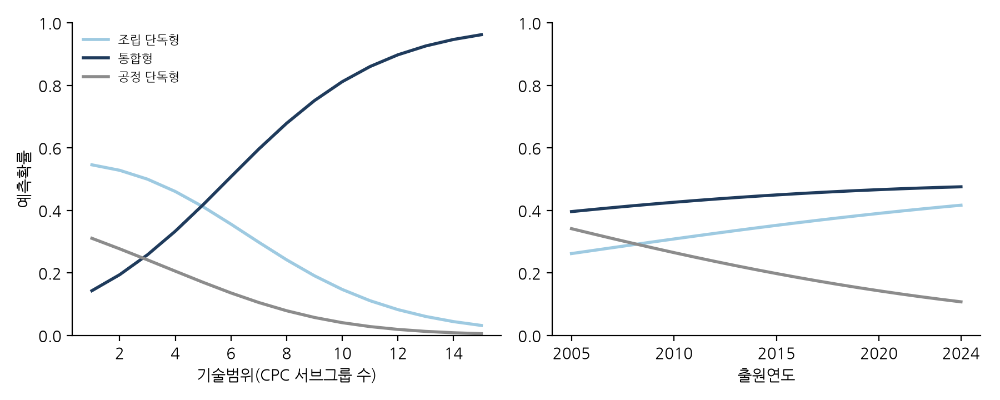

# 반도체 하이브리드 본딩 특허에 나타난 공정단계 간 기술융합: 경계를 넘는 특허의 특성과 출원청별 차이

**이형규** (한양대학교 기술경영학과)

**Cross-stage technological convergence in semiconductor hybrid bonding patents: Characteristics of boundary-spanning patents and differences across filing offices**

**HyungKyu Lee** (Department of Management of Technology, Hanyang University)

**요 약** 반도체 제조는 웨이퍼 위에 소자를 만드는 전공정과 그 웨이퍼를 잘라 조립하는 후공정으로 오랫동안 나뉘어 왔다. 하이브리드 본딩은 후공정의 접합 기술이지만 표면 평탄화와 표면 처리 같은 전공정의 제조공정 기술 없이는 성능이 나오지 않는다. 본 연구는 두 영역의 기술이 하나의 특허출원 안에 함께 담기는지, 어떤 출원이 그러한지를 유럽특허청 PATSTAT의 하이브리드 본딩 관련 특허출원 928건으로 분석하였다. 출원마다 부여된 CPC 기호를 기준으로 접합 기술 분류(H01L24)만 있으면 조립 단독형, 제조공정 기술 분류(H01L21)만 있으면 공정 단독형, 둘이 함께 있으면 통합형으로 구분하고, 두 클래스의 공동분류를 제조공정 영역과 접합 영역 사이의 경계 넘기를 재는 대리측정치로 사용하였다. 기준 정의에서는 통합형이 45.8%로 가장 많았고, 조립 단계 공정을 제외한 보수적 정의에서도 37.2%였다. 음이항 회귀와 다항 로짓 분석 결과, 두 클래스 안에서 세부 기술을 더 다양하게 포함한 출원일수록 통합형일 가능성이 높았으며(조립 단독형 대비 상대위험비 1.40), 최근 출원일수록 공정 단독형의 상대적 가능성은 낮았고(2014년 이전 43.6%에서 2020–2024년 10.4%), 중국 출원청 출원은 미국 출원청 출원보다 클래스 내 CPC 범위가 좁았다. 중국 출원청의 공정 단독형 편중은 최근 출원에 민감한 제한적 결과였다. 이 결과는 기술융합이 산업 사이만이 아니라 한 산업의 공정 단계 사이에서도 일어난다는 견해와 정합적인 특허 수준의 증거를 제공한다.

**Abstract** Semiconductor manufacturing has long been divided into front-end wafer fabrication and back-end assembly. Hybrid bonding belongs to the back end, yet it depends on front-end fabrication capabilities such as surface planarisation and surface treatment. Using 928 hybrid-bonding-related patent applications from EPO PATSTAT, this study asks whether the two bodies of technology are combined within single applications and which applications do so. Each application is classified by its CPC symbols as assembly-only (H01L24 only), process-only (H01L21 only) or integrated (both), and co-classification in the two classes is used as a patent-based proxy for boundary spanning between the fabrication-process and bonding domains. Integrated applications form the largest group at 45.8% (37.2% under a narrower definition that excludes assembly-stage processes). Negative binomial and multinomial logit estimates show that applications spanning more diverse technical elements within the two classes are more likely to be integrated (relative-risk ratio 1.40 against assembly-only), that process-only classification is relatively less likely for recent filings (43.6% before 2015 to 10.4% in 2020–2024), and that applications filed at the Chinese office are narrower in within-class CPC breadth than those filed at the US office, whereas their tilt towards process-only classification is sensitive to the most recent filings. The findings provide patent-level evidence consistent with technological convergence across the process stages of a single industry.

**Keywords :** Technological Convergence, Industry Architecture, Hybrid Bonding, Advanced Packaging, Within-class CPC Breadth, Multinomial Logit

## 1. 서론

반도체 산업의 분업 구조는 반세기 넘게 이어져 왔다. 트랜지스터를 웨이퍼 위에 만드는 전공정은 종합반도체기업(IDM)과 파운드리의 대규모 팹에 집중되었고[1], 완성된 웨이퍼를 잘라 조립하고 포장하는 후공정은 조립·테스트 전문업체(OSAT)로 외주화되었다[2,3]. 두 단계 사이의 인터페이스가 안정적으로 관리되었기에 기업 간 전문화가 가능했다. 그러나 미세화가 한계에 부딪히면서 산업은 다이를 나누고 쌓고 연결하는 방식에서 성능 향상의 여지를 찾기 시작했고[4,5], 그 중심에 있는 하이브리드 본딩은 이 전제를 흔든다. 솔더 범프 없이 구리 패드와 산화막을 직접 맞붙이는 이 기술은 10 µm 이하의 연결 간격을 열어 주지만[6,7], 그 성패는 표면 평탄화, 표면 활성화, 정밀 정렬처럼 전통적으로 전공정에 속해 온 제조공정 역량에 달려 있다. 상호의존이 커지자 선도 파운드리가 첨단 패키징 역량을 내부에 두려는 움직임도 나타났다[7,8].

기술융합 문헌은 서로 구분되던 기술 영역이 겹치고 결합하는 과정을 다루어 왔지만[9-12], 그 실증 연구는 정보통신과 가전[13], 식품과 제약[14], 나노기술과 바이오기술[15]처럼 서로 다른 산업이 겹치는 경우에 집중되어 왔다. 한 산업 안에서 공정 단계를 가로지르는 융합은 좀처럼 다루어지지 않았으며, 가치사슬 상·하류 기업 간 특허 인용을 분석한 Karvonen과 Kässi[41]도 하나의 기술이 공정 단계의 경계를 넘는지를 특허 단위에서 검정하지는 않았다. 본 연구는 유럽특허청(EPO) PATSTAT의 하이브리드 본딩 관련 특허출원 928건을 협력적 특허분류(CPC) 기호에 따라 접합·인터커넥트 기술(H01L24)만 있는 조립 단독형, 제조공정 기술(H01L21)만 있는 공정 단독형, 둘이 함께 있는 통합형으로 나누고, 공동분류[11,16]를 두 산업 사이가 아니라 한 산업을 가로지르는 경계에 적용한다. 연구 질문은 셋이다. 제조공정과 접합 기술의 공동분류는 얼마나 일반적이며 시간에 따라 어떻게 변했는가, 어떤 특허 특성이 공동분류 유형과 관련되는가, 이러한 유형과 기술범위는 출원청별로 어떻게 다른가이다.

## 2. 이론적 배경

### 2.1 기술융합과 특허 기반 측정

Rosenberg[9]는 한 제품을 위해 개발된 가공 기술이 다른 제품에도 쓰이게 되는 과정을 기술적 수렴이라 불렀고, Kodama[10]는 분리되어 있던 기술 분야를 결합해 어느 한쪽도 홀로 갖지 못한 역량을 만드는 과정을 기술융합이라 개념화했다. Hacklin et al.[32]은 융합이 지식, 기술, 응용, 산업의 융합으로 단계적으로 진행된다는 단계 모형을 제시했고, 이 단계들이 되먹임하며 공진화적 순환을 이룬다고 보았다[13]. Curran과 Leker[11]는 이를 특허 지표로 관찰하는 방법을 제시했다[12,17-19]. 이 문헌에서 융합은 보통 두 분야 사이의 공동분류나 인용을 집계한 분야 수준의 지표로 측정된다[20-26]. 이런 지표는 두 분야가 융합하는지, 언제 융합하는지를 알려 주지만 어떤 발명이 융합을 담고 있는지는 알려 주지 못한다. 본 연구는 공동분류를 분야 수준으로 집계하는 대신 개별 출원을 세 공동분류 유형으로 나눈다. CPC 기호는 심사관이 발명의 기술 내용에 부여하는 것이므로 공동분류는 두 영역의 기술이 한 발명에 함께 담겼다는 사실의 대리측정치이지 법적 청구범위의 측정치는 아니다.

### 2.2 반도체 공정단계 사이의 융합과 산업 아키텍처

반도체 산업의 공정 단계 경계는 수직 전문화 연구의 오랜 대상이었다[2,3,27]. Kapoor[1]는 전문화 속에서도 여러 단계에 걸친 역량을 유지한 기업이 기술 전환에 다르게 대응했고 그 선택이 산업 아키텍처를 만들어 왔음을, Kapoor와 Adner[42]는 부품과 시스템이 얽혀 있을 때 직접 만드는 범위보다 넓은 지식이 유리함을 보였다. 산업 아키텍처[28]는 공정 단계 사이의 인터페이스가 안정적일 때 전문화를 허용한다. 새 기술이 한 단계의 성능을 다른 단계의 지식에 의존하게 만들면 인터페이스가 불안정해지고, 기업은 경계 반대편의 지식을 획득해야 하며, 이 결합은 먼저 발명 수준에서 나타난다. 특허의 공동분류는 그 흔적이다. 하이브리드 본딩은 유전체 안에 구리 패드가 새겨진 두 평탄한 표면을 맞대어 상온에서 유전체끼리, 저온 어닐링 뒤 구리끼리 붙게 하는 기술로[6,7], 수율을 좌우하는 화학적 기계연마(CMP), 표면 활성화, 파티클 제어, 정밀 정렬은 CPC 분류상 접합 클래스(H01L24)가 아니라 제조공정 클래스(H01L21)에 속한다(Fig. 1). 독립적 산업 분석이 TSMC, Adeia, YMTC, Intel, Samsung을 특허 활동을 주도하는 출원인으로 꼽는 것[8]도 접합 기술이 후공정 전문기업만의 영역이 아님을 보여준다. 여기서 말하는 융합은 조직의 경계를 묻는 수직통합과 다르며, 지식의 경계를 묻는다. 산업 아키텍처는 직접 검정하는 결과변수가 아니라 결과를 해석하는 상위의 이론적 맥락이다.

**Fig. 1.** Enabling processes, bonding configurations, device structures and applications of hybrid bonding (drawn by the author based on Lau[6,7])

## 3. 연구가설 및 연구방법

### 3.1 연구가설

경계 넘기가 융합의 한 형태라면 두 클래스 안에서 더 다양한 세부 기술 요소를 포함하는 출원일수록 두 영역의 기호가 함께 부여될 가능성이 높아야 한다[29-31]. 다만 기술범위와 공동분류 유형은 같은 CPC 집합에서 만들어지고 통합형은 정의상 두 클래스의 기호를 하나씩은 가지므로, H1은 인과적 결정요인이 아니라 통합형 특허의 구성적 특징에 관한 가설이다.

> **H1.** 제조공정 및 접합 영역에서 더 다양한 세부 기술 요소를 포함하는 출원일수록 두 영역의 CPC 기호가 함께 부여될(통합형일) 가능성이 높다.

융합의 단계 모형[23,32]에 따르면 기술이 발전하면서 융합의 형태도 바뀐다. 하이브리드 본딩의 초기 발명은 표면 준비, 저온 어닐링, 평탄화처럼 직접 접합을 가능하게 한 공정 단계에 관한 것이었고, 적용 범위가 웨이퍼 단위에서 다이 단위 접합으로 넓어지면서 발명의 중심은 접합된 구조와 적층으로 옮겨 갔다[6]. 출원연도에는 분류 체계, 출원인 구성, 공개 시차도 반영되므로 연도 효과는 시간에 따른 변화로 해석한다.

> **H2.** 출원연도가 최근일수록 특허가 조립 단독형보다 공정 단독형으로 분류될 상대적 가능성은 낮다.

중국의 특허 급증은 제도 변화와 외국인직접투자[33], 건수를 보상하는 보조금 정책[34]에 힘입었고, 반도체 가치사슬에서 중국의 위치는 빠르게 바뀌어 왔다[35]. 후발국의 특허 활동이 공정별 병목의 해소와 특정 제조 단계의 권리 확보에 집중된다면[36] 하나의 출원이 포괄하는 기술 요소는 시스템 전체의 통합보다 개별 공정 문제의 해결에 가까워지고, 두 클래스 안의 CPC 범위는 좁아지며 공정 단독형의 비중은 높아질 것이다. 범위와 유형은 다른 모형으로 검정되므로 가설을 둘로 나눈다. 일본 출원청은 표본이 26건에 그쳐 가설로 세우지 않는다.

> **H3a.** 중국 출원청에 출원된 특허는 미국 출원청에 출원된 특허보다 기술범위가 좁다.

> **H3b.** 중국 출원청에 출원된 특허는 미국 출원청에 출원된 특허보다 조립 단독형 대비 공정 단독형으로 분류될 가능성이 높다.

### 3.2 데이터 및 변수

자료는 PATSTAT Global 2025년판에서 가져왔다[37]. Table 1의 검색 전략에 따라 CPC H01L21 또는 H01L24 계열 기호를 하나 이상 가진 출원을 후보로 한정한 뒤, 영문 제목을 소문자로 바꾸어 지정 키워드(*hybrid bonding*, *direct bonding*, *Cu–Cu*, *copper to copper*, *metal-oxide bond*) 중 하나 이상이 들어 있는 출원만 남겼다. 두 조건을 모두 만족해야 하며, 검색에는 두 클래스의 인덱싱 코드도 썼으나 추출된 레코드에는 본 클래스의 기호만 보존되었다. 출원–CPC 쌍 5,277건을 출원 식별자별로 집계하면 1968–2024년의 928건이 되며, 분석단위는 개별 특허출원이다. 추출 단계에서 두 클래스 밖의 기호는 보존되지 않았으므로 모든 기호는 H01L21 계열(202개)과 H01L24 계열(60개)의 서브그룹 기호 262개다. 이 광의의 표본은 현대의 하이브리드 본딩뿐 아니라 초기 직접 접합 전구 기술을 함께 포착한다.

**Table 1.** Search strategy for hybrid-bonding-related applications

| Step | Condition | Description |
|---|---|---|
| CPC | H01L21 | Processes and apparatus for manufacturing semiconductor devices, including wafer bonding (21/18, 21/20), isolation, interconnect and TSV (21/76), substrate and insulating-layer treatment (21/02), CMP (21/30–21/32); also assembly-stage processes (21/48, 21/50–21/58, 21/60, 21/78) and equipment (21/67–21/68) |
| CPC | H01L24 | Connector structures, bump, layer and wire connections, and related methods and apparatus for connecting or disconnecting semiconductor or solid-state bodies |
| Keyword | Title | At least one of *hybrid bonding*, *direct bonding*, *Cu–Cu*, *copper to copper*, *metal-oxide bond* (both the CPC and the keyword condition must hold) |

Table 1이 보여주듯 H01L21에는 웨이퍼 제조공정 외에 조립 단계의 제조공정과 공정 장치도 포함되므로, 본 연구는 H01L21을 전공정 그 자체로 보지 않는다. 표본의 H01L21 계열 기호 1,636건 가운데 조립 단계 공정(패키지 부품 제조, 실장·봉지, 리드 부착, 다이싱)이 403건(24.6%)이며, 그럼에도 하이브리드 본딩의 성능을 좌우하는 웨이퍼 준비, 표면 처리, 평탄화가 H01L21에 다수 포함되고 접합·인터커넥트 기술은 H01L24에 모여 있으므로 두 클래스의 공동분류를 제조공정 영역과 접합 영역 사이의 경계 넘기를 재는 대리측정치로 쓴다.

Table 2은 변수를 정의한다. 기술범위(breadth)는 출원별 H01L21·H01L24 계열의 서로 다른 CPC 서브그룹 수로 분류 기호의 수로 범위를 재는 Lerner[29]의 방식을 두 클래스 안에 적용한 것이다. 통합형은 최소 breadth가 2이고 단독형은 1이므로, 보유 클래스마다 최소 1개 기호를 차감한 유형 최소치 조정 CPC 범위(breadth_adj)를 탐색적 지표로 따로 둔다. 자료에 출원인 정보가 없으므로 출원청 계수는 관할권의 인과효과가 아니라 해당 출원청에 제출된 발명 포트폴리오의 조건부 구성 차이로 해석한다.

**Table 2.** Variable definitions

| Variable | Definition | Type | Caution |
|---|---|---|---|
| breadth | Number of distinct H01L21/H01L24 CPC subgroups assigned to the application (within-class CPC breadth) | Count, 1–21 | Not total CPC scope or legal claim scope |
| breadth_adj | breadth minus one symbol per class held (stand-alone types: breadth − 1; integrated: breadth − 2) | Count, 0–19 | Exploratory; built with type information |
| tech_cat | Co-classification type: assembly-only (H01L24 only) / integrated (both) / process-only (H01L21 only) | 3 categories | Combination of classifications, not firm strategy |
| ccode | Filing office or route: US (reference), CN, KR, TW, JP, EP, WO (PCT), other | 8 categories | Not applicant nationality |
| yc | Filing year minus 1968; sample mean 49.7 (2017.7) | Integer, 0–56 | Not a direct measure of maturity |

### 3.3 분석방법

기술범위는 1–21의 정수로 측정되는 카운트 변수이고 분산이 평균보다 훨씬 커서(과산포 모수 α = 0.268, 표준오차 0.020) Poisson 대신 음이항 회귀를 쓰며, 계수의 지수값인 발생률비(IRR)를 출원당 기대 CPC 서브그룹 수의 비율로 해석한다[38]. 이 모형이 H3a의 주모형이다. 공동분류 유형은 순서 없는 세 범주이므로 조립 단독형을 기준으로 하는 다항 로짓[39]으로 추정하고 상대위험비(RRR)로 보고하며, 이 모형이 H1, H2, H3b의 주모형이다. 설명변수는 출원연도와 출원청 더미이고 다항 로짓에는 기술범위를 더한다. RRR은 비율 척도이므로 관심 변수만 바꾸고 나머지는 각 출원의 관측값에 둔 채 표본 전체에서 평균한 평균 예측확률을 함께 제시한다. 가설 판정에는 5% 유의수준을 쓰되, 기준모형과 대안 표본·정의, 동일 제목 군집 표준오차에서 계수의 방향, 효과 크기, 유의성이 일관되는지를 함께 본다. 모든 계수는 인과효과가 아니라 조건부 연관이다.

## 4. 연구결과

### 4.1 기술통계와 기술범위

유형별로는 통합형 425건(45.8%), 조립 단독형 338건(36.4%), 공정 단독형 165건(17.8%)이고, 제조공정 기호를 가진 출원은 590건(63.6%)이다. 기술범위는 평균 5.69개(표준편차 4.07)이며 통합형 7.89개, 조립 단독형 4.16개, 공정 단독형 3.15개다. 출원은 2010년대 후반에 급증하여 2022년경 정점에 이르며, 2023–2024년의 감소에는 공개 시차가 영향을 미쳤을 가능성이 크다. 출원청별로는 미국 382건, 중국 175건, PCT 경로 113건, EPO 83건, 대만 75건, 한국 58건, 일본 26건, 기타 16건이며, 공정 단독형의 비중은 중국(24.6%)과 한국(27.6%)에서 높고 기술범위 평균은 중국(4.83)이 가장 좁다.

Table 3는 기술범위의 음이항 추정 결과다. 미국 출원청 기준으로 중국 출원청 출원은 기대 CPC 서브그룹 수가 약 21% 적고(IRR 0.785, p < 0.01, 95% CI 0.695–0.887), PCT 경로 출원은 약 17% 적다(IRR 0.826, p < 0.01). 한국, 대만, EPO는 미국과 다르지 않으며 일본은 10% 수준에서만 유의하다. 이 결과는 H3a를 지지한다. 출원연도의 IRR은 1.015이지만 2010년 이후 표본만 보면 부호가 반대로 바뀌므로(IRR 0.970, p < 0.01) 범위의 시간 추세에 대해서는 결론을 내리지 않는다.

**Table 3.** Negative binomial regression of within-class CPC breadth (N = 928; reference office = US; α = 0.268 (SE 0.020); log-likelihood −2,431.5; standard errors of log coefficients in parentheses; \* p < 0.10, \*\* p < 0.05, \*\*\* p < 0.01)

| | IRR | SE (log) | p |
|---|:---:|:---:|:---:|
| Filing year (yc) | 1.015\*\*\* | (0.003) | <0.001 |
| CN | 0.785\*\*\* | (0.062) | <0.001 |
| KR | 1.018 | (0.094) | 0.853 |
| TW | 1.021 | (0.083) | 0.801 |
| JP | 1.270\* | (0.133) | 0.073 |
| EP | 0.993 | (0.080) | 0.933 |
| WO | 0.826\*\*\* | (0.073) | 0.009 |
| Other | 1.057 | (0.171) | 0.745 |

### 4.2 공동분류 유형

Table 4은 조립 단독형을 기준으로 한 다항 로짓이며, Fig. 2는 기술범위와 출원연도를 바꾸었을 때 세 유형의 평균 예측확률이다. 세부 분류가 하나 늘 때마다 통합형일 상대위험은 40% 높아지고(RRR 1.403, p < 0.01, 95% CI 1.321–1.489) 공정 단독형일 상대위험은 10% 낮아지며(RRR 0.905, p < 0.05), 기술범위가 3인 출원의 통합형 예측확률은 0.26이지만 8인 출원은 0.68이다. 유형과 기술범위가 같은 CPC 정보에서 만들어지므로 H1은 통합형의 구성적 특징으로서 지지된다. 공정 단독형의 상대위험은 해마다 약 8.7%씩 낮아지고(RRR 0.913, p < 0.01, 95% CI 0.887–0.940) 통합형은 전 기간의 선형 추세로는 변하지 않는다(RRR 0.993). 2010년 출원의 공정 단독형 예측확률은 0.27, 2022년 출원은 0.12다. H2는 지지된다. 중국 출원청 출원은 공정 단독형일 상대위험이 2.7배 높고(RRR 2.687, p < 0.01, 95% CI 1.566–4.611) PCT 경로도 높지만(RRR 1.997, p < 0.05), 통합형 방정식에서는 어느 출원청 계수도 유의하지 않아 범위와 시점을 통제하면 경계를 넘는 특허의 비중 자체는 출원청 사이에 다르지 않다. 공정 단독형 평균 예측확률은 중국 출원청 0.255, 미국 출원청 0.143이다. 시기별로 보면 공정 단독형의 비중은 2014년 이전 43.6%에서 2015–2019년 14.8%, 2020–2024년 10.4%로 계속 줄었고, 통합형은 31.3%에서 62.2%로 늘었다가 44.3%로 낮아졌으며, 조립 단독형은 25.1%와 23.0%에서 45.4%로 늘었다. 기간 더미를 넣은 다항 로짓에서도 공정 단독형의 상대위험은 2014년 이전 대비 0.273과 0.101(모두 p < 0.01)로 낮아지고 통합형은 1.707(p = 0.09)에서 0.762(비유의)로 내려온다.

**Table 4.** Multinomial logit of co-classification type (base = assembly-only; N = 928; reference office = US; log-likelihood −774.5; LR χ²(18) = 367.4, p < 0.001; McFadden pseudo-R² = 0.192; standard errors of log coefficients in parentheses; \* p < 0.10, \*\* p < 0.05, \*\*\* p < 0.01)

| | Integrated RRR | SE (log) | p | Process-only RRR | SE (log) | p |
|---|:---:|:---:|:---:|:---:|:---:|:---:|
| Filing year (yc) | 0.993 | (0.015) | 0.654 | 0.913\*\*\* | (0.015) | <0.001 |
| Breadth | 1.403\*\*\* | (0.031) | <0.001 | 0.905\*\* | (0.048) | 0.039 |
| CN | 1.205 | (0.233) | 0.423 | 2.687\*\*\* | (0.276) | <0.001 |
| KR | 1.166 | (0.381) | 0.687 | 1.906 | (0.419) | 0.124 |
| TW | 1.312 | (0.322) | 0.399 | 2.102\* | (0.407) | 0.068 |
| JP | 1.046 | (0.557) | 0.935 | 0.086\*\*\* | (0.816) | 0.003 |
| EP | 1.307 | (0.291) | 0.358 | 0.858 | (0.438) | 0.726 |
| WO | 1.126 | (0.268) | 0.659 | 1.997\*\* | (0.323) | 0.032 |
| Other | 2.326 | (0.681) | 0.215 | 1.901 | (0.779) | 0.409 |

**Fig. 2.** Average predicted probabilities of the three types by breadth (left) and filing year (right) (multinomial logit; other covariates at observed values)

### 4.3 강건성 분석과 가설 판정

Table 5는 표본과 변수 정의를 바꾸어 다시 추정한 핵심 계수와 가설 판정이다. 같은 제목의 출원을 한 군집으로 묶은 표준오차에서도 네 계수는 1% 수준에서 유지된다. 제목당 가장 이른 출원 1건만 남긴 표본(N = 473), 조립 단계 공정을 제조공정으로 세지 않는 좁은 정의(N = 908), 직접 접합의 무관한 용법 68건을 뺀 표본(N = 860)에서도 핵심 계수는 유지되며, 좁은 정의에서는 조립 단독형 46.8%, 통합형 37.2%, 공정 단독형 16.0%로 통합형이 최다 유형이라는 기술통계는 정의에 따라 달라지지만 회귀 결과는 그대로다. 제목에 *hybrid bonding*이 들어 있는 핵심 표본(N = 467)에서는 범위와 중국 계수가 더 강해지지만 2015년 이전 출원이 30건뿐이어서 연도 계수는 유의하지 않다(1.029). 2023–2024년을 뺀 표본(N = 753)에서는 중국 출원청의 좁은 범위(IRR 0.808, p < 0.01)는 유지되지만 공정 단독형 RRR은 1.651(p = 0.12)로 유의성을 잃는다. 2023–2024년 중국 출원청 출원 39건 중 18건이 공정 단독형인 반면 미국 출원청은 65건 중 3건이기 때문이다. breadth_adj로 다시 추정하면 통합형의 RRR은 1.403에서 1.262로 줄지만 방향은 유지되며, 공정 단독형을 제외한 표본(N = 763)의 이항 로짓에서도 기술범위 OR 1.463, 출원연도 0.987, 중국 출원청 1.177로 다항 로짓 통합형 방정식(1.403, 0.993, 1.205)과 유사하다. 따라서 H1은 구성적 연관으로서, H2와 H3a는 모든 재추정에서 지지되며, H3b는 최근 2년을 제외하면 비유의하여 제한적 지지로 판정한다.

**Table 5.** Key coefficients across specifications and hypothesis verdicts (multinomial logit RRR, base = assembly-only; reference office = US; last column negative binomial IRR; \* p < 0.10, \*\* p < 0.05, \*\*\* p < 0.01)

| Specification | N | Breadth → Integrated (H1) | Year → Process-only (H2) | CN → Process-only (H3b) | CN → Breadth, IRR (H3a) |
|---|---:|---|---|---|---|
| Baseline (Tables 3–4) | 928 | 1.403\*\*\* | 0.913\*\*\* | 2.687\*\*\* | 0.785\*\*\* |
| Baseline, title-clustered SE | 928 | 1.403\*\*\* | 0.913\*\*\* | 2.687\*\*\* | 0.785\*\*\* |
| One filing per title | 473 | 1.295\*\*\* | 0.935\*\*\* | 2.721\*\*\* | 0.792\*\*\* |
| Narrow process definition | 908 | 1.352\*\*\* | 0.898\*\*\* | 3.299\*\*\* | — |
| Irrelevant uses excluded | 860 | 1.384\*\*\* | 0.820\*\*\* | 3.235\*\*\* | 0.785\*\*\* |
| Core sample (*hybrid bonding* in title) | 467 | 1.485\*\*\* | 1.029 | 7.211\*\*\* | 0.786\*\*\* |
| 2023–2024 excluded | 753 | 1.418\*\*\* | 0.909\*\*\* | 1.651 | 0.808\*\*\* |
| Verdict | | Supported (compositional) | Supported | Limited support | Supported |

## 5. 결론

### 5.1 연구결과 요약 및 시사점

본 연구는 하이브리드 본딩 관련 출원 928건을 CPC 기호에 따라 조립 단독형, 공정 단독형, 통합형으로 나누고 어떤 특성의 출원이 두 영역의 분류를 함께 가지는지를 추정하였다. 가장 견고한 결과는 제조공정과 접합 기술의 공동분류가 45.8%, 보수적 정의로도 37.2%로 예외적인 현상이 아니라는 점, 공정 단독형의 상대위험이 표본과 정의를 어떻게 바꾸어도 최근 출원일수록 낮았다는 점, 중국 출원청 출원이 미국 출원청 출원보다 두 클래스 안의 CPC 범위가 좁았다는 점이다. 통합형과 높은 기술적 다양성의 연관은 통합형의 구성적 특징으로, 통합형 비중이 늘었다가 줄어든 시기별 움직임은 탐색적 해석으로 제시하며, 중국 출원청의 공정 단독형 편중은 최근 출원 구성에 민감한 제한적 결과다.

이론적으로 이 결과는 산업 사이의 일로 다루어져 온 기술융합[11,32]이 한 산업을 가로지르는 경계에도 적용되며 개별 출원에서 관찰됨을 보여준다. 산업 아키텍처의 변화를 직접 검정하지는 않지만, 단계 사이의 인터페이스가 흔들릴 때 발명이 그 양쪽을 함께 담기 시작하는 것은 그 틀이 다시 짜이는 데 선행할 수 있는 기술적 상호의존의 확대다[1,28]. 융합은 축적이 아니라 재구성으로 진행되었다. 2014년 이전에서 2015–2019년으로 가면서 공정 단독형은 줄고 통합형은 늘었으며, 2020–2024년에는 통합형이 낮아지고 조립 단독형이 늘었다. 초기의 공정 발명이 성숙기에는 접합 구조와 함께 분류되고 이후 발명의 중심이 접합 구조와 적층 자체로 이동한 것으로 읽을 수 있으나[13], 심사 관행의 변화와 최근 출원의 분류 미완결 가능성을 배제할 수 없다. 중국 출원청에 진입한 발명 포트폴리오는 범위가 좁고 특정 제조공정에 집중된 출원이 많아 단계별 추격의 출원 양상[36]과 정합적이지만, 출원인과 패밀리 정보를 통제하지 못하므로 추격 전략의 직접 증거로 볼 수는 없다.

실무적으로, 상당수 출원이 제조공정과 접합 기술을 함께 포함한다는 결과는 하이브리드 본딩에서 접합 장비의 운용만으로는 충분하지 않고 표면 평탄화, 오염 제어, 표면 화학, 정렬을 아우르는 인접 공정 지식이 중요해질 수 있음을 시사하며, 이는 Kapoor와 Adner[42]의 지식 경계 논리와 정합적이다. 차세대 HBM을 하이브리드 본딩에 기대고 있는 한국 메모리 산업에 시사하는 바는, 패키징 경쟁력이 패키징 노하우 하나에 달려 있지 않고 제조공정 역량과 이를 하나의 특허출원에서 통합적으로 보호하는 능력이 함께 필요할 수 있다는 점이다. 정책 면에서 중국 출원청 표본의 좁은 CPC 범위는 견고하지만 그 원인이 보조금 정책[34]인지 출원인 구성이나 출원 선택인지는 본 자료로 가릴 수 없다. 본 연구의 기여는 공동분류를 개별 출원의 유형으로 재구성하여 특허 수준의 이질성과 관련 요인을 추정할 수 있게 하고 이를 산업 내 공정 단계 간 융합이라는 새로운 사례에 적용한 데 있으며, 이 설계는 하류 단계가 상류 역량에 의존하기 시작한 다른 공정기술에도 적용할 수 있다.

### 5.2 한계점과 향후 연구 방향

본 연구의 한계는 다음과 같다. H01L21–H01L24 공동분류는 공정 단계 간 기술융합의 대리측정치이며 H01L21에는 조립 단계의 제조공정도 들어 있고 기술범위는 유형과 같은 CPC 정보에서 만들어진다. 제목 키워드 검색은 제목에 관련어가 없는 출원을 놓친다. 공식 패밀리 식별자가 없어 동일 제목으로 근사 조정했으므로 관측치의 독립성은 완전히 보장되지 않는다. 출원인과 기업 유형, 국적, 응용처, 두 클래스 밖의 CPC 기호가 자료에 없으며, 이를 결합하는 것이 다음 단계다. 2023–2024년 출원은 불완전하게 관측되고 CPC는 소급 재분류될 수 있어 시간 패턴의 일부는 분류 관행의 변화를 반영할 수 있다. 다양성과 유형은 함께 결정될 가능성이 높아 인과관계는 주장하지 않으며, 산업 아키텍처와 기업 전략은 직접 검정하지 않는다. 향후 연구는 여러 공정기술을 같은 설계로 비교하고, 텍스트 기반 방법[25,26]이나 일반성 지수[40]로 하이브리드 본딩의 범용기술적 성격을 검정할 수 있을 것이다.

## References

[1] R. Kapoor, "Persistence of integration in the face of specialization: How firms navigated the winds of disintegration and shaped the architecture of the semiconductor industry", Organization Science, Vol.24, No.4, pp.1195-1213, 2013.
DOI: https://doi.org/10.1287/orsc.1120.0802

[2] J. T. Macher and D. C. Mowery, "Vertical specialization and industry structure in high technology industries", in J. A. C. Baum and A. M. McGahan (Eds.), Business Strategy over the Industry Lifecycle (Advances in Strategic Management, Vol.21), Emerald, Bingley, pp.317-355, 2004.
DOI: https://doi.org/10.1016/S0742-3322(04)21011-7

[3] C. Brown and G. Linden, Chips and Change: How Crisis Reshapes the Semiconductor Industry, MIT Press, Cambridge, MA, 2009.

[4] W. Arden and M. Brillouët and P. Cogez and M. Graef and B. Huizing and R. Mahnkopf, "More-than-Moore" White Paper, White paper, International Technology Roadmap for Semiconductors (ITRS), 2010.

[5] H. N. Khan and D. A. Hounshell and E. R. H. Fuchs, "Science and research policy at the end of Moore's law", Nature Electronics, Vol.1, No.1, pp.14-21, 2018.
DOI: https://doi.org/10.1038/s41928-017-0005-9

[6] J. H. Lau, "State-of-the-art and outlooks of chiplets heterogeneous integration and hybrid bonding", Journal of Microelectronics and Electronic Packaging, Vol.18, No.4, pp.145-160, 2021.
DOI: https://doi.org/10.4071/imaps.1542066

[7] J. H. Lau, "Recent advances and trends in advanced packaging", IEEE Transactions on Components, Packaging and Manufacturing Technology, Vol.12, No.2, pp.228-252, 2022.
DOI: https://doi.org/10.1109/TCPMT.2022.3144461

[8] KnowMade, Hybrid Bonding Patent Landscape Analysis 2024, Industry report, KnowMade (Yole Group), Sophia Antipolis, 2024, https://www.knowmade.com/patent-analytics-services/patent-report/semiconductor-patent-landscape/semiconductor-advanced-packaging-patent-landscape/hybrid-bonding-patent-landscape-analysis-2024/

[9] N. Rosenberg, "Technological change in the machine tool industry, 1840–1910", Journal of Economic History, Vol.23, No.4, pp.414-443, 1963.
DOI: https://doi.org/10.1017/S0022050700109155

[10] F. Kodama, "Technology fusion and the new R&D", Harvard Business Review, Vol.70, No.4, pp.70-78, 1992.

[11] C. S. Curran and J. Leker, "Patent indicators for monitoring convergence – Examples from NFF and ICT", Technological Forecasting and Social Change, Vol.78, No.2, pp.256-273, 2011.
DOI: https://doi.org/10.1016/j.techfore.2010.06.021

[12] N. Sick and S. Bröring, "Exploring the research landscape of convergence from a TIM perspective: A review and research agenda", Technological Forecasting and Social Change, Vol.175, Article 121321, 2022.
DOI: https://doi.org/10.1016/j.techfore.2021.121321

[13] F. Hacklin and C. Marxt and F. Fahrni, "Coevolutionary cycles of convergence: An extrapolation from the ICT industry", Technological Forecasting and Social Change, Vol.76, No.6, pp.723-736, 2009.
DOI: https://doi.org/10.1016/j.techfore.2009.03.003

[14] S. Bröring and L. M. Cloutier and J. Leker, "The front end of innovation in an era of industry convergence: Evidence from nutraceuticals and functional foods", R&D Management, Vol.36, No.5, pp.487-498, 2006.
DOI: https://doi.org/10.1111/j.1467-9310.2006.00449.x

[15] H. J. No and Y. Park, "Trajectory patterns of technology fusion: Trend analysis and taxonomical grouping in nanobiotechnology", Technological Forecasting and Social Change, Vol.77, No.1, pp.63-75, 2010.
DOI: https://doi.org/10.1016/j.techfore.2009.06.006

[16] O. Kwon and Y. An and M. Kim and C. Lee, "Anticipating technology-driven industry convergence: Evidence from large-scale patent analysis", Technology Analysis & Strategic Management, Vol.32, No.4, pp.363-378, 2020.
DOI: https://doi.org/10.1080/09537325.2019.1661374

[17] Y. Geum and M. S. Kim and S. Lee, "How industrial convergence happens: A taxonomical approach based on empirical evidences", Technological Forecasting and Social Change, Vol.107, pp.112-120, 2016.
DOI: https://doi.org/10.1016/j.techfore.2016.03.020

[18] F. Caviggioli, "Technology fusion: Identification and analysis of the drivers of technology convergence using patent data", Technovation, Vol.55–56, pp.22-32, 2016.
DOI: https://doi.org/10.1016/j.technovation.2016.04.003

[19] I. Hwang, "The effect of collaborative innovation on ICT-based technological convergence: A patent-based analysis", PLOS ONE, Vol.15, No.2, Article e0228616, 2020.
DOI: https://doi.org/10.1371/journal.pone.0228616

[20] C. S. Curran and S. Bröring and J. Leker, "Anticipating converging industries using publicly available data", Technological Forecasting and Social Change, Vol.77, No.3, pp.385-395, 2010.
DOI: https://doi.org/10.1016/j.techfore.2009.10.002

[21] Y. Cho and M. Kim, "Entropy and gravity concepts as new methodological indexes to investigate technological convergence: Patent network-based approach", PLOS ONE, Vol.9, No.6, Article e98009, 2014.
DOI: https://doi.org/10.1371/journal.pone.0098009

[22] W. S. Lee and E. J. Han and S. Y. Sohn, "Predicting the pattern of technology convergence using big-data technology on large-scale triadic patents", Technological Forecasting and Social Change, Vol.100, pp.317-329, 2015.
DOI: https://doi.org/10.1016/j.techfore.2015.07.022

[23] S. Jeong and J. C. Kim and J. Y. Choi, "Technology convergence: What developmental stage are we in?", Scientometrics, Vol.104, No.3, pp.841-871, 2015.
DOI: https://doi.org/10.1007/s11192-015-1606-6

[24] C. H. Song and D. Elvers and J. Leker, "Anticipation of converging technology areas — A refined approach for the identification of attractive fields of innovation", Technological Forecasting and Social Change, Vol.116, pp.98-115, 2017.
DOI: https://doi.org/10.1016/j.techfore.2016.11.001

[25] N. Preschitschek and H. Niemann and J. Leker and M. G. Moehrle, "Anticipating industry convergence: Semantic analyses vs IPC co-classification analyses of patents", Foresight, Vol.15, No.6, pp.446-464, 2013.
DOI: https://doi.org/10.1108/FS-10-2012-0075

[26] C. Zhu and K. Motohashi, "Identifying the technology convergence using patent text information: A graph convolutional networks (GCN)-based approach", Technological Forecasting and Social Change, Vol.176, Article 121477, 2022.
DOI: https://doi.org/10.1016/j.techfore.2022.121477

[27] R. N. Langlois and W. E. Steinmueller, "The evolution of competitive advantage in the worldwide semiconductor industry, 1947–1996", in D. C. Mowery and R. R. Nelson (Eds.), Sources of Industrial Leadership: Studies of Seven Industries, Cambridge University Press, Cambridge, pp.19-78, 1999.

[28] M. G. Jacobides and T. Knudsen and M. Augier, "Benefiting from innovation: Value creation, value appropriation and the role of industry architectures", Research Policy, Vol.35, No.8, pp.1200-1221, 2006.
DOI: https://doi.org/10.1016/j.respol.2006.09.005

[29] J. Lerner, "The importance of patent scope: An empirical analysis", RAND Journal of Economics, Vol.25, No.2, pp.319-333, 1994.
DOI: https://doi.org/10.2307/2555833

[30] B. H. Hall and R. H. Ziedonis, "The patent paradox revisited: An empirical study of patenting in the U.S. semiconductor industry, 1979–1995", RAND Journal of Economics, Vol.32, No.1, pp.101-128, 2001.
DOI: https://doi.org/10.2307/2696400

[31] R. H. Ziedonis, "Don't fence me in: Fragmented markets for technology and the patent acquisition strategies of firms", Management Science, Vol.50, No.6, pp.804-820, 2004.
DOI: https://doi.org/10.1287/mnsc.1040.0208

[32] F. Hacklin and C. Marxt and F. Fahrni, "An evolutionary perspective on convergence: Inducing a stage model of inter-industry innovation", International Journal of Technology Management, Vol.49, No.1–3, pp.220-249, 2010.
DOI: https://doi.org/10.1504/IJTM.2010.029419

[33] A. G. Hu and G. H. Jefferson, "A great wall of patents: What is behind China's recent patent explosion?", Journal of Development Economics, Vol.90, No.1, pp.57-68, 2009.
DOI: https://doi.org/10.1016/j.jdeveco.2008.11.004

[34] J. Dang and K. Motohashi, "Patent statistics: A good indicator for innovation in China? Patent subsidy program impacts on patent quality", China Economic Review, Vol.35, pp.137-155, 2015.
DOI: https://doi.org/10.1016/j.chieco.2015.03.012

[35] S. Grimes and D. Du, "China's emerging role in the global semiconductor value chain", Telecommunications Policy, Vol.46, No.2, Article 101959, 2022.
DOI: https://doi.org/10.1016/j.telpol.2020.101959

[36] K. Lee and C. Lim, "Technological regimes, catching-up and leapfrogging: Findings from the Korean industries", Research Policy, Vol.30, No.3, pp.459-483, 2001.
DOI: https://doi.org/10.1016/S0048-7333(00)00088-3

[37] European Patent Office, PATSTAT Global (2025 edition), Database, EPO, Vienna, 2025.

[38] A. C. Cameron and P. K. Trivedi, Regression Analysis of Count Data, 2nd ed., Cambridge University Press, Cambridge, 2013.

[39] D. McFadden, "Conditional logit analysis of qualitative choice behavior", in P. Zarembka (Ed.), Frontiers in Econometrics, Academic Press, New York, pp.105-142, 1974.

[40] S. Petralia, "Mapping general purpose technologies with patent data", Research Policy, Vol.49, No.7, Article 104013, 2020.
DOI: https://doi.org/10.1016/j.respol.2020.104013

[41] M. Karvonen and T. Kässi, "Industry convergence analysis with patent citations in changing value systems", International Journal of Business and Systems Research, Vol.6, No.2, pp.150-175, 2012.
DOI: https://doi.org/10.1504/IJBSR.2012.046353

[42] R. Kapoor and R. Adner, "What firms make vs. what they know: How firms' production and knowledge boundaries affect competitive advantage in the face of technological change", Organization Science, Vol.23, No.5, pp.1227-1248, 2012.
DOI: https://doi.org/10.1287/orsc.1110.0686
