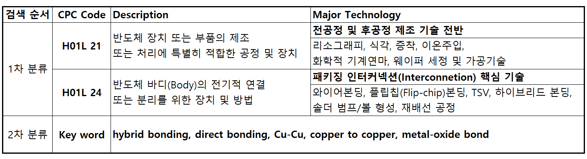
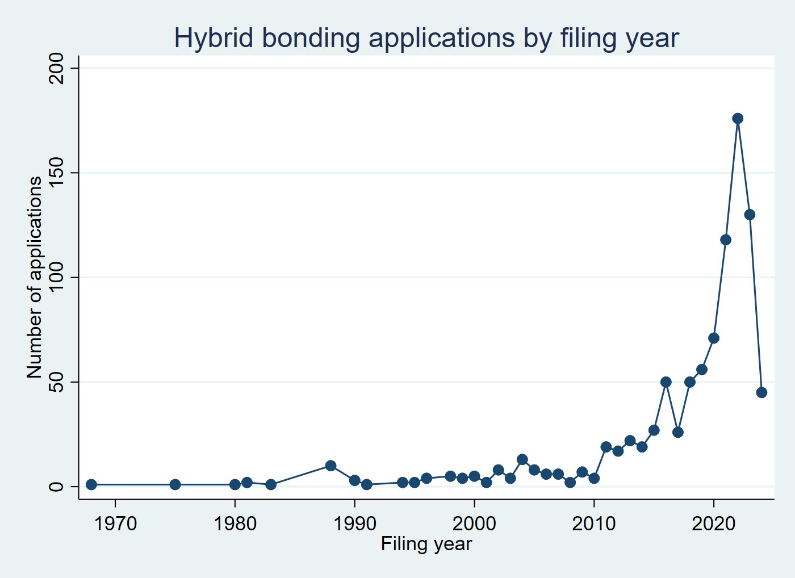
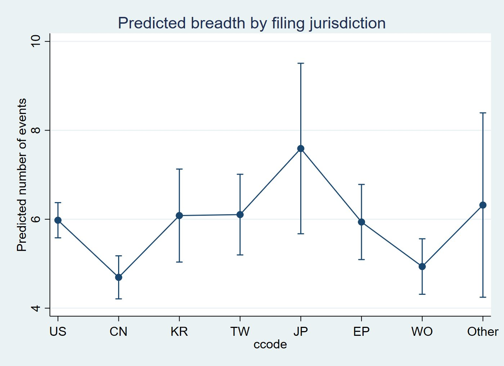
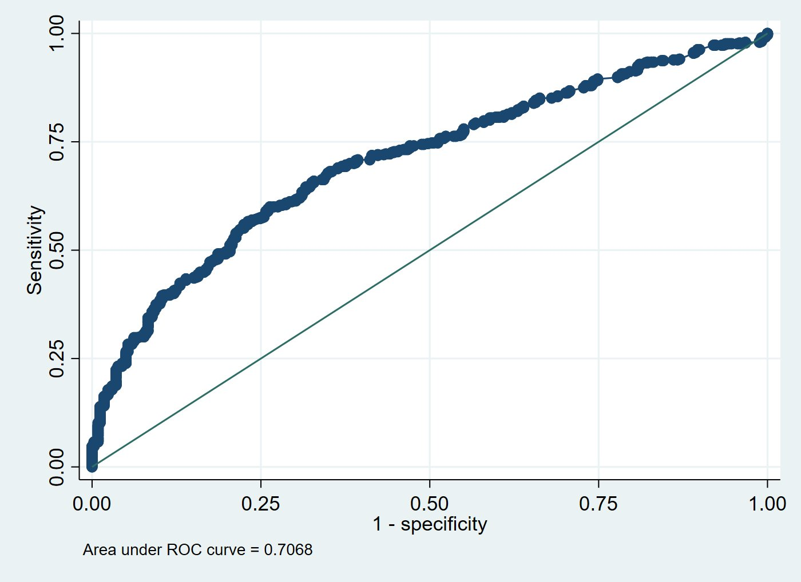
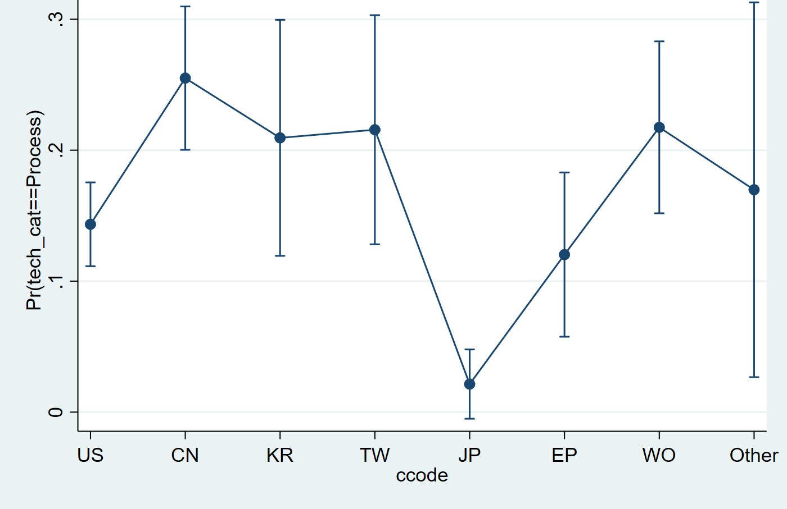

# 후공정이 전공정으로 들어갈 때: 반도체 하이브리드 본딩에서의 기술융합과 경계를 넘는 특허

**When the back end reaches into the front end: Technological convergence and boundary-spanning patents in semiconductor hybrid bonding**

**이형규** ([대학명] 기술경영학과)

---

## 국문 초록

기술융합 연구는 산업 *간* 경계의 흐려짐에 집중해 왔다. 본 연구는 산업 *내부*의 융합, 즉 반도체 제조에서 오랫동안 분리되어 온 전공정(fabrication)과 후공정(assembly) 사이의 융합을 다룬다. 하이브리드 본딩—구리 패드와 주변 유전체를 범프 없이 직접 접합하여 고대역폭 메모리와 3D 로직을 가능케 하는 기술—은 후공정 공정이지만, 그 성능은 화학적 기계연마(CMP)와 표면 활성화 같은 전공정 역량에 달려 있다. 유럽특허청 PATSTAT에서 추출한 하이브리드 본딩 특허출원 928건(출원–CPC 레코드 5,277건)을 이용하여, 본 연구는 융합을 개별 특허 수준의 *경계 넘기(boundary spanning)* 로 조작화한다. 즉 접합·인터커넥트(H01L24)로 분류된 출원이 제조공정 기술(H01L21)도 함께 청구하는가를 본다. 출원의 거의 3분의 2가 그러하다. 이항·다항 로짓 추정 결과, 기술범위가 경계 넘기의 가장 강한 상관요인이며(CPC 서브클래스 1개당 승산비 1.27), 순수 전공정 청구는 시간이 갈수록 줄었으나 통합형 청구는 비중을 유지했고, 출원청이 중요하였다. 중국 출원청 출원은 뚜렷하게 공정 지향적인 반면, 일본 출원청 출원은 거의 공정 단독형을 취하지 않는다. 이 결과는 융합 이론을 산업 내·공정단계 간 사례로 확장하고, 특허 수준의 메커니즘을 반도체 가치사슬의 아키텍처와 연결하며, 다른 공정기술에서 경계 넘기를 탐지할 수 있는 재현 가능한 공동분류 설계를 제공한다.

**주제어:** 기술융합; 산업 아키텍처; 하이브리드 본딩; 첨단 패키징; 특허 범위; 다항 로짓

## Abstract

Research on technological convergence has concentrated on the blurring of boundaries *between* industries. This paper examines convergence *within* an industry, across the long-standing division between front-end fabrication and back-end assembly in semiconductor manufacturing. Hybrid bonding—the direct, bumpless joining of copper pads and surrounding dielectric that now enables high-bandwidth memory and 3D logic—is a back-end process whose performance depends on front-end capabilities such as chemical–mechanical planarisation and surface activation. Using 928 hybrid-bonding patent applications (5,277 application–CPC records) from EPO PATSTAT, we operationalise convergence at the level of the individual patent as *boundary spanning*: whether an application classified under bonding and interconnect (H01L24) also claims fabrication-process technology (H01L21). Nearly two-thirds of applications do so. Binary and multinomial logit estimates show that technological scope is the strongest correlate of boundary spanning (odds ratio 1.27 per additional CPC subclass), that pure front-end claiming has declined over time while integrated claiming has held its share, and that filing office matters: applications at the Chinese office are markedly more process-oriented, whereas those at the Japanese office almost never take a process-only form. The results extend convergence theory to the intra-industry, cross-stage case, connect the patent-level mechanism to the architecture of the semiconductor value chain, and offer a reproducible co-classification design for detecting boundary spanning in other process technologies.

**Keywords:** technological convergence; industry architecture; hybrid bonding; advanced packaging; patent scope; multinomial logit

---

## 1. 서론

반세기 동안 반도체 산업은 명확한 분업 구조를 중심으로 조직되어 왔다. 트랜지스터는 *전공정(front end)* 에서 웨이퍼 위에 제조되고, 완성된 웨이퍼는 *후공정(back end)* 에서 절단·조립·패키징되었다. 두 단계는 기술적으로도, 조직적으로도, 지리적으로도 분리되어 있었다. 전공정 제조는 종합반도체기업(IDM)과 이후 파운드리가 운영하는 자본집약적 팹에 집중된 반면, 패키징과 테스트는 점차 전문 조립·테스트 하청업체(OSAT)로 외주화되었다(Macher and Mowery, 2004; Brown and Linden, 2009; Kapoor, 2013). 두 단계 사이의 인터페이스가 표준화되어 있었기 때문에, 한 단계의 혁신이 다른 단계의 역량을 요구하는 일은 드물었다.

이 분리가 지금 무너지고 있다. 미세화(dimensional scaling)가 둔화되고 그 비용이 상승하면서, 산업은 트랜지스터 너머—다이를 어떻게 분할하고 적층하고 연결하는가—에서 성능을 찾기 시작하였다(Arden et al., 2010; Iyer, 2016; Khan et al., 2018). 첨단 패키징은 경쟁우위의 원천이 되었고, 그 가운데 가장 까다로운 공정인 *하이브리드 본딩* 은 솔더 범프 없이 구리 패드와 주변 산화막을 직접 접합하여 1µm 이하의 인터커넥트 피치를 구현한다(Lau, 2021, 2022). 하이브리드 본딩이 전략적으로 흥미로운 사례인 이유는, 그 성패가 역사적으로 전공정에 속했던 역량—나노미터급 화학적 기계연마, 표면 활성화, 서브미크론 정렬—에 달려 있기 때문이다. 후공정 공정이 사실상 전공정 노하우에 의존하게 된 것이다. 선도 파운드리들은 첨단 패키징 플랫폼을 하청업체에 넘기지 않고 내재화하는 방식으로 대응하였고(Lau, 2022), 산업 관측자들은 제조와 패키징 사이의 경계가 흐려졌다고 점점 더 자주 서술한다(KnowMade/Yole Group, 2024).

본 연구는 이러한 흐려짐이 개별 발명 수준에서 관찰·측정·설명될 수 있는지를 묻는다. 우리는 기술융합—이전에는 구분되던 기술적·산업적 영역이 겹치고 재결합하는 과정(Rosenberg, 1963; Kodama, 1992; Curran and Leker, 2011; Sick and Bröring, 2022)—에 관한 문헌을 바탕으로 하되, 그동안 거의 주목받지 못한 방향으로 이를 확장한다. 융합에 관한 거의 모든 실증 연구는 *서로 다른 산업* 의 만남을 다룬다. 정보통신기술과 가전(Gambardella and Torrisi, 1998; Hacklin et al., 2009), 식품과 제약(Bröring et al., 2006; Curran et al., 2010), 나노기술과 바이오기술(No and Park, 2010)이 그것이다. 한 산업 *내부* 에서, 그 산업 자체의 가치사슬 단계를 가로지르는 융합은 같은 도구로 검토된 적이 없다. 그러나 산업 아키텍처—누가 무엇을 하고 누가 가치를 획득하는가—를 재편하는 것은 바로 이런 종류의 융합이다(Jacobides et al., 2006).

우리는 하이브리드 본딩을 이러한 검토에 적합한 자연적 실험장으로 삼는다. EPO PATSTAT에서 추출한 하이브리드 본딩 특허출원 928건을 이용하여, *경계를 넘는 특허(boundary-spanning patent)* 를 접합·인터커넥트(CPC H01L24)로 분류되면서 동시에 제조공정 기술(CPC H01L21)을 청구하는 특허로 정의한다. 이러한 공동분류(co-classification)는 융합의 표준적 특허 기반 신호이며(Curran and Leker, 2011; Preschitschek et al., 2013; Kwon et al., 2020), 새로운 점은 이를 두 산업 사이가 아니라 한 산업을 관통하는 경계에 적용한다는 것이다. 이어서 세 가지를 묻는다. 경계 넘기는 얼마나 흔하며, 기술이 성숙하면서 그 형태는 변했는가? 특허의 어떤 속성—기술범위, 출원 시점, 출원청—이 경계 넘기와 연관되는가? 그리고 이러한 패턴은 각 출원청(관할권)에서 드러나는 출원·보호 전략과 어떻게 관련되는가?

세 가지 발견이 두드러진다. 첫째, 경계 넘기는 주변적 현상이 아니다. 출원의 63.6%가 적어도 하나의 전공정 기호를 보유하며, 최빈 전략은 두 단계를 결합한 *통합형(integrated)* 청구다. 둘째, 기술범위가 지배적 상관요인이다. 특허가 걸치는 CPC 서브클래스가 하나 늘 때마다 제조공정 기술을 청구할 승산이 약 27% 높아지고, 다항 명세는 넓은 특허가 통합형으로, 좁은 특허가 특화형으로 이동함을 보인다. 시간이 갈수록 *순수* 전공정 청구의 비중은 줄었으나 통합형 청구는 조립 수준 청구 대비 비중을 유지하였다. 융합은 경계를 넘는 청구의 단순 증가가 아니라 재구성(recomposition)을 통해 진행된 것이다. 셋째, 출원청이 산업 아키텍처와 추격의 양상에 부합하는 방식으로 중요하다. 중국 출원청 출원은 범위가 좁고 공정 단독형일 가능성이 훨씬 높으며, 일본 출원청 출원은 가장 넓고 사실상 공정 단독형이 없다.

본 연구는 기술혁신경영 문헌에 세 가지로 기여한다. 개념적으로는 융합 이론을 산업 간 사례에서 산업 내·공정단계 간 사례로 확장하고, 이를 반도체의 수직 전문화와 산업 아키텍처 문헌(Langlois and Steinmueller, 1999; Kapoor and Adner, 2012; Kapoor, 2013)과 연결한다. 실증적으로는 분석 단위를 집계된 공동분류 지수에서 개별 특허로 옮김으로써 경계 넘기의 결정요인을 이산선택 모형으로 추정하고, 집계 지수가 평균 뒤에 감추는 전략적 이질성을 회복한다(cf. Cho and Kim, 2014). 방법론적으로는 두 개의 CPC 클래스, 하나의 공동분류 규칙, 표준 카운트·이산선택 추정량이라는 투명하고 재현 가능한 설계를 제시하며, 이는 하류 단계가 상류 역량을 흡수하기 시작한 다른 공정기술에도 이전 가능하다.

논문의 구성은 다음과 같다. 제2절은 이론적 배경을 검토하고 가설을 도출한다. 제3절은 실증 맥락인 하이브리드 본딩 기술과 산업 지형을 기술한다. 제4절은 데이터와 방법을, 제5절은 결과를 제시한다. 제6절은 이론적·실무적 함의와 한계를 논의하고, 제7절은 결론을 맺는다.

## 2. 이론적 배경과 가설

### 2.1 기술융합: 개념, 단계, 동인

한 영역에서 개발된 기술이 다른 영역으로 이동한다는 생각은 오랜 계보를 갖는다. Rosenberg(1963)는 19세기 공작기계 산업이 어떻게 출현했는지를 보이며, 기업들이 한 제품—총기, 재봉틀, 자전거—을 위해 개발한 공정이 다른 제품에도 적용될 수 있음을 깨닫는 과정을 기술적 수렴(technological convergence)이라 불렀다. Kodama(1992)는 이후 *기술융합(technology fusion)* 을 기술하였다. 기업이 이전에는 분리되어 있던 기술 분야들을 결합하여 어느 쪽도 단독으로는 갖지 못한 역량을 창출하는 과정이며, 이는 돌파형 연구와는 다른 R&D 조직을 요구한다고 주장하였다. 후속 연구는 *기술* 의 융합을 *시장* 과 *산업* 의 융합과 구분하였다. Gambardella와 Torrisi(1998)는 전자산업에서 기반 기술의 융합이 기업 제품시장의 융합을 반드시 함의하지는 않음을 발견하였고, Athreye와 Keeble(2000)은 컴퓨팅에서의 융합이 소유구조와 기업 경계를 어떻게 재편했는지를 추적하였으며, Fai와 von Tunzelmann(2001)은 특허 데이터로 서로 다른 산업 대기업들의 기술 역량이 수렴하고 있는지를 검토하였다.

Hacklin et al.(2009)은 정보통신기술 산업을 바탕으로 융합이 단계적으로—지식 융합에서 기술 융합과 응용 융합을 거쳐 산업 융합으로—전개되며, 이 단계들이 순차적이라기보다 공진화적임을 제안하였다. Curran과 Leker(2011)는 과학·기술·시장·산업 융합의 구분을 정식화하고 각각을 특허·논문 지표로 모니터링하는 방법을 보였다. 이 문헌은 이후 기술혁신경영의 인정된 연구 흐름으로 성숙하였고, Sick과 Bröring(2022)의 리뷰, 융합 패턴의 유형론(Geum et al., 2016), 첨단기술 환경에서 융합 정도를 평가하는 프레임워크(Sick et al., 2019), 산업이 융합할 때 기업이 직면하는 전략적 선택의 분석(Hacklin et al., 2013)으로 이어졌다. 동인에 관한 기업 수준 증거는 비교적 최근의 것이다. Hwang(2020)은 한국 ICT 기업 패널 자료로 ICT 기업 간 협력이 융합과 가장 강하게 연관된 협력 유형임을 발견하였고, Caviggioli(2016)는 융합이 일어나기 쉬운 기술 분야의 특성을 식별하였다.

이 문헌의 두 특징이 본 연구에 중요하다. 첫째는 *서로 다른* 영역의 만남에 대한 초점이다. 전형적 사례—통신과 컴퓨팅, 식품과 제약, 나노기술과 바이오기술—는 서로 다른 산업의 기업들이 자신들의 지식 기반이 겹친다는 것을 발견하는 상황이다. 둘째는 융합이 통상 측정되는 수준이다. 두 기술 분야 사이의 공동분류, 공동인용 또는 의미적 유사성의 집계 지표가 그것이다(Curran et al., 2010; Karvonen and Kässi, 2013; Preschitschek et al., 2013; Cho and Kim, 2014; Song et al., 2017). 이러한 지표는 분야가 융합하는지 *여부* 와 *시점* 을 탐지하는 데 적합하다. 그러나 *어떤* 발명이 융합을 담지하며 *왜* 그러한지를 설명하는 데는 덜 적합한데, 개별 특허의 전략적 이질성을 평균해 버리기 때문이다.

### 2.2 가치사슬 단계 간 융합: 반도체의 경우

다른 종류의 경계는 한 산업의 가치사슬 단계들을 가르는 경계다. 반도체 산업은 그 단계들이 수직 전문화와 산업 아키텍처에 관한 지속적 연구의 대상이 되어 왔기 때문에 유독 명확한 사례를 제공한다. Langlois와 Steinmueller(1999)는 산업 구조가 진화하면서 경쟁우위가 기업과 국가 사이에서 어떻게 이동했는지를 추적하였다. Macher와 Mowery(2004)는 설계와 제조, 제조와 조립을 분리하여 팹리스, 파운드리, 조립·테스트 하청업체를 낳은 수직 전문화를 기록하였다. Brown과 Linden(2009)은 이 아키텍처가 재협상된 연속적 위기들을 기술하였다. Kapoor(2013)는 통합이 전문화와 나란히 지속되었음을 보였다. 단계를 가로지르는 역량을 유지한 기업은 전문기업과 다른 방식으로 기술 전환을 헤쳐 나갔고, 그들의 선택이 산업의 아키텍처를 형성하였다. Kapoor와 Adner(2012)는 기술 세대를 거치는 반도체(DRAM) 생산자들을 연구하면서 기업이 *만드는 것* 과 *아는 것* 을 구분하였고, 부품과 시스템이 상호의존적일 때 생산 경계보다 넓은 지식 경계가 우위를 준다는 것을 발견하였다. 이는 기술적 상호의존이 단계 간에 높을 때 기업이 "만드는 것보다 더 많이 안다"는 Brusoni et al.(2001)의 관찰과 공명한다. Adner와 Kapoor(2010)는 생태계 내에서 혁신 난제의 위치—상류 부품인가 하류 보완재인가—가 새로운 기술 세대의 수혜자를 조건 짓는다고 덧붙였다.

이 문헌이 융합과 갖는 관련성은, 수직 전문화가 단계 간의 *안정적 인터페이스* 에 의존한다는 점을 인식하면 분명해진다. D. Ernst(2005)는 칩 설계의 수직 전문화가 의존하는 모듈성이 복잡성이 커지면서 한계를 갖는다는 것을 보였다. Jacobides et al.(2006)은 산업 아키텍처—누가 무엇을 하고 가치가 어떻게 나뉘는지를 정의하는 템플릿—가 그 자체로 경쟁의 대상이며, 단계 간 상호의존을 바꾸는 혁신은 그 재협상을 불러온다고 주장하였다. 하이브리드 본딩이 그런 혁신이다. 그 수율이 웨이퍼 수준 평탄화, 표면 화학, 정렬이라는 전공정에 자리한 역량에 달려 있기 때문에, 제조와 패키징 사이의 인터페이스는 더 이상 안정적이지 않다. 그 결과는 두 산업 사이가 아니라 한 산업의 두 단계 사이의 융합이다. 후공정 기업은 전공정 역량을 획득해야 하고, 전공정 기업은 자신의 역량이 패키징으로 자연스럽게 확장됨을 발견한다. 이것이 무어의 법칙 종언 문헌이 일반적 용어로 예견하고(Arden et al., 2010; Iyer, 2016; Khan et al., 2018) 패키징 공학 문헌이 기술적으로 기술해 온 현상이다(Lau, 2021, 2022). 빠져 있던 것은 이를 발명의 기록 속에서 관찰하는 방법이었다.

### 2.3 특허로 융합 측정하기: 분야 수준 지수에서 경계를 넘는 특허로

특허는 융합 측정에 가장 널리 쓰이는 데이터다. 분류 코드가 각 발명을 하나 이상의 기술 분야에 위치시키고, 인용이 분야 간 지식 흐름을 기록하기 때문이다(Curran and Leker, 2011). 세 가지 측정 전통을 구분할 수 있다. 첫째는 공동분류로부터 *분야 수준 지수* 를 구축하는 전통이다. Cho와 Kim(2014)은 인쇄전자 분야 IPC 공출현·인용 네트워크에 엔트로피와 중력 개념을 적용하였고, Lee et al.(2015)은 대규모 삼극특허로 융합 패턴을 예측하였으며, Jeong et al.(2015)은 융합을 발전단계 프레임워크 안에 위치시켰고, Kwon et al.(2020)은 대규모 특허 분석으로 기술 주도 산업융합을 예측하였다. 둘째는 분류가 따라잡기 전에 융합을 탐지하기 위해 *텍스트와 표상 학습* 을 이용하는 전통이다. Preschitschek et al.(2013)은 의미 분석과 IPC 공동분류를 비교하였고, Zhu와 Motohashi(2022)는 특허 텍스트 키워드 벡터에 그래프 합성곱 신경망을 학습시켰다. 셋째는 분야 또는 기업 수준에서 융합의 *동인* 을 검토하는 전통이다(Caviggioli, 2016; Hwang, 2020).

본 연구는 신호의 선택—공동분류—에서는 첫째 전통에 속하지만, 분석 단위에서 그로부터 벗어난다. 공동분류를 분야 수준 지수로 집계하는 대신, 각 특허의 이항 속성을 정의한다. 후공정 접합 클래스(H01L24)로 분류된 발명이 전공정 제조 기호(H01L21)도 보유하는가. 우리는 이런 특허를 *경계를 넘는 특허* 라 부른다. 이 속성은 발명 수준의 융합으로 직접 해석되고, 표준 이산선택 추정량으로 모형화할 수 있으며, 분야 수준 지수가 평균해 버리는 특허 간 이질성을 보존한다.

두 갈래의 특허 연구가 설명변수에 정보를 준다. 첫째는 *특허 범위(patent scope)* 다. Lerner(1994)는 특허가 걸치는 분류 클래스 수로 범위를 측정하고 범위가 경제적 가치를 가짐을 보였으며, Marco et al.(2019)은 청구항 특성을 통해 범위 측정을 정교화하였다. 반도체에 국한하면, Hall과 Ziedonis(2001)는 1980년대 중반 이후 특허 급증을 기록하였고, Ziedonis(2004)는 기술 시장이 파편화된 곳에서 기업이 더 큰 포트폴리오를 구축함을 보였다. 넓은 청구가 합리적 전략이 되는 조건이다. 둘째는 특허 행태의 *관할권 차이* 다. 서로 다른 특허청에의 출원은 서로 다른 출원인 집단, 심사 관행, 전략적 목적을 반영한다. 중국 특허 통계는 출원의 질과 범위에 영향을 미치는 보조금 정책과 추격 동학에 의해 형성되며(Hu and Jefferson, 2009; Dang and Motohashi, 2015), 반도체 가치사슬에서 중국의 위치는 지정학적 압력 아래 빠르게 변해 왔다(Grimes and Du, 2022). 일본의 청구 관행은 다항 청구를 허용한 1988년 개혁 이후 바뀌었고(Sakakibara and Branstetter, 2001), 일본 기업은 오랫동안 반도체 장비·소재에 강했다(Langlois and Steinmueller, 1999). 추격 이론은 더 일반적으로 후발자가 시스템 전체를 청구하기 전에 특정 생산 단계의 내재화에 집중한다고 예측한다(Lee and Lim, 2001).

### 2.4 가설

위 논의는 어떤 하이브리드 본딩 특허가 전/후공정 경계를 넘는지에 관한 네 가지 기대를 낳는다.

*기술범위.* Kodama(1992)의 융합과 Rosenberg(1963)의 수렴은 모두 하나 이상의 영역에서 온 지식을 결합하는 발명을 기술한다. 경계 넘기가 융합의 한 형태라면, 더 많은 기술 클래스에 걸치는 특허가 그중에 전공정 클래스를 포함할 가능성이 더 높아야 한다. 메커니즘은 부분적으로 기계적이다—클래스가 많을수록 그중 하나가 H01L21일 기회가 많다—그러나 전략적이기도 하다. 웨이퍼 준비에서 접합된 적층까지 전체 공정 흐름을 청구하는 특허는 필연적으로 제조에 닿는 반면, 조립 단계나 접합 구조만 청구하는 특허는 그렇지 않다(Lerner, 1994; Ziedonis, 2004).

> **H1.** 하이브리드 본딩 특허의 기술범위가 넓을수록 전/후공정 경계를 넘을, 즉 접합(H01L24) 기술에 더하여 제조공정(H01L21) 기술을 청구할 가능성이 높다.

*성숙.* 융합의 단계 모형(Hacklin et al., 2009; Jeong et al., 2015)은 기술이 성숙하면서 융합의 *형태* 가 변한다고 함의한다. 하이브리드 본딩의 초기 발명은 직접 접합을 가능케 한 제조 단계—표면 준비, 저온 어닐링, 평탄화—에 관한 것이었고 자연스럽게 공정 발명으로 분류되었다. 기술이 이미지센서와 3D NAND의 웨이퍼-투-웨이퍼 용도에서 고대역폭 메모리와 로직을 위한 다이-투-웨이퍼 집적으로 이동하면서, 발명은 접합된 구조와 통합된 적층으로 옮겨갔다(Lau, 2021). 따라서 우리는 *순수* 전공정(공정 단독형) 청구의 비중이 조립 수준 청구 대비 시간에 따라 감소하는 반면, 경계를 넘는(통합형) 청구는 지속될 것으로 기대한다.

> **H2.** 하이브리드 본딩이 성숙함에 따라, 특허가 공정 단독형을 취할 확률은 조립 수준 청구 대비 감소하는 반면, 통합형(경계를 넘는) 형태를 취할 확률은 감소하지 않는다.

*관할권과 산업 아키텍처.* 특허가 어디에 출원되는가는 누가 무엇을 위해 발명하는가를 반영한다. 추격 이론(Lee and Lim, 2001)과 중국 특허에 관한 증거(Hu and Jefferson, 2009; Dang and Motohashi, 2015; Grimes and Du, 2022)는 중국 출원청 출원이 특정 제조 단계의 내재화에 집중—범위가 더 좁고 공정 단독형이 더 많음—할 것임을 시사한다. 반대로 일본 기업의 장비·소재 강점(Langlois and Steinmueller, 1999)과 1988년 개혁 이후의 다항 청구 관행(Sakakibara and Branstetter, 2001)은 일본 출원청 출원이 넓고 통합 지향적이며 공정 단독형이 드물 것임을 시사한다.

> **H3a.** 중국 출원청에 출원된 출원은 미국 출원청 출원보다 공정 지향적(H01L21 청구)일 가능성, 특히 공정 단독형을 취할 가능성이 높다.

> **H3b.** 일본 출원청에 출원된 출원은 미국 출원청 출원보다 기술범위가 넓고 공정 단독형을 취할 가능성이 낮다.

이 가설들은 특허 속성과 경계 넘기 사이의 연관에 관한 것이지 인과효과에 관한 것이 아니다. 이 구분은 제6.3절에서 다시 다룬다.

## 3. 연구 맥락: 하이브리드 본딩 기술과 산업 지형

하이브리드 본딩은 유전체 안에 구리 패드가 패터닝된 두 평탄화 표면을 직접 접촉시켜, 상온에서 유전체가 유전체에 접합되고 저온 어닐링 후 구리가 구리에 접합되게 함으로써 영구적 인터커넥트를 만든다. 솔더 범프가 없기 때문에 인터커넥트 피치는 마이크로범프 플립칩보다 한 자릿수 작은 1µm 이하로 내려갈 수 있고, 접합 계면은 후공정 배선(BEOL)의 연장에 가까울 만큼 얇다(Lau, 2021, 2022). 공정은 두 형태로 존재한다. 웨이퍼-투-웨이퍼(W2W) 접합은 웨이퍼 전체를 접합하며 CMOS 이미지센서와 3D NAND에서 먼저 상용화되었다. 다이-투-웨이퍼(D2W) 접합은 개별 다이를 웨이퍼에 부착하며, 칩렛의 이종 집적, 고대역폭 메모리 적층, 3D 로직에 요구되는 형태다. 두 형태 모두에서 수율을 결정하는 단계—서브나노미터 거칠기로의 화학적 기계연마, 플라즈마 또는 화학적 표면 활성화, 파티클 제어, 서브미크론 정렬—는 CPC의 의미에서 전공정 역량이다. 이들은 접합·인터커넥트 클래스인 H01L24가 아니라 반도체 장치 제조를 위한 공정·장치 클래스인 H01L21에 속한다(제4.1절, 표 1).

산업 지형도 같은 방향을 가리킨다. 하이브리드 본딩 특허 랜드스케이프에 대한 독립적 산업 분석은 TSMC, Adeia, YMTC, Intel, Samsung을 선도 출원인으로 지목한다(KnowMade/Yole Group, 2024). 원천기술을 보유한 라이선싱 기업(Adeia), 첨단 패키징 플랫폼을 내재화한 파운드리(TSMC), 그리고 메모리 제조사가 나란히 선두에 있다는 사실 자체가, 접합 기술이 더 이상 후공정 전문기업의 영역에 머물지 않음을 보여준다. 선도 파운드리와 종합반도체기업이 첨단 패키징을 조립·테스트 하청업체에 맡기지 않고 자체 플랫폼으로 구축해 온 과정(Lau, 2022)은, 단계를 가로지르는 통합 역량을 유지한 기업이 산업 아키텍처를 형성한다는 Kapoor(2013)의 관찰과 부합한다. 이러한 지형이 *어떤 특허* 가 전/후공정 경계를 넘는지에 체계적 흔적을 남기는가가 이후 절이 다루는 질문이다.

## 4. 데이터와 방법

### 4.1 데이터

데이터는 유럽특허청의 PATSTAT Global 2025년판에서 가져왔다(European Patent Office, 2025). 후보 레코드는 CPC 분류—H01L21(반도체 장치 제조를 위한 공정·장치)과 H01L24(반도체 바디의 연결·분리 배치) 및 그 인덱싱 코드—로 검색한 뒤, 위양성을 제거하기 위해 공정 키워드(*hybrid bonding*, *direct bonding*, *Cu–Cu*, *copper to copper*, *metal-oxide bond*)의 AND 결합으로 필터링하였다(표 1, 그림 1). 추출 결과는 출원–CPC 레코드 5,277건이며 각 레코드는 하나의 출원과 하나의 CPC 기호를 짝짓는다. 출원 수준으로 응집하면 1968–2024년에 출원된 고유 출원 928건이 된다. 모든 기호는 H01L(반도체 장치) 아래에 있으며, 그 안에서 레코드는 본 연구에서 전/후공정 경계를 정의하는 두 클래스 H01L21과 H01L24로 나뉜다.

**표 1.** 전/후공정 경계를 정의하는 CPC 클래스.

| CPC | 명칭(요약) | 대표 기술 |
|---|---|---|
| H01L21 | 반도체 장치의 제조 또는 처리에 특별히 적합한 공정 또는 장치 | 리소그래피, 식각, 증착, 이온주입, 화학적 기계연마, 웨이퍼 세정·가공(전공정 및 후공정 제조공정) |
| H01L24 | 반도체 바디의 연결 또는 분리를 위한 배치; 관련 방법 또는 장치 | 와이어 본딩, 플립칩 본딩, 실리콘 관통 전극, 하이브리드 본딩, 솔더 범프/볼 형성, 재배선(패키징 인터커넥션) |
| H01L2224 | 반도체 바디의 연결·분리 배치에 대한 인덱싱 스킴 | 접합 금속, 접합 형태, 장비(예: H01L2224/08145: 금속–금속 및 유전체–유전체 접합을 결합한 직접 접합) |

검색은 두 단계로 이루어졌다. (1) H01L21과 H01L24 및 그 인덱싱 코드에 대한 CPC 1차 필터; (2) *hybrid bonding*, *direct bonding*, *Cu–Cu*, *copper to copper*, *metal-oxide bond* 를 결합한 키워드 2차 필터(그림 1).

**그림 1.** 하이브리드 본딩 모집단의 검색 전략(CPC 1차 필터와 키워드 2차 필터).

### 4.2 변수

표 2는 변수를 정의한다. *기술범위(breadth)* 는 출원에 부여된 고유 CPC 서브클래스 기호의 수로, Lerner(1994)의 전통에 따른 기술범위의 측정치다. *Has_process* 는 출원이 H01L21 기호를 하나라도 보유하면 1인 이항 지표로, 경계 넘기의 측정치다. *Tech_cat* 은 각 출원을 상호배타적인 세 전략 유형—*조립 단독형(assembly-only)* (H01L24 기호만), *통합형(integrated)* (H01L24와 H01L21 모두), *공정 단독형(process-only)* (H01L21 기호만)—에 배정한다. *Ccode* 는 출원이 제출된 출원청으로, 8개 수준(US, CN, KR, TW, JP, EP, WO, 기타)이며 미국 출원청이 기준이다. *Yc* 는 표본 최초 출원 이후 경과 연수로 측정한 출원연도다.

**표 2.** 변수 정의.

| 변수 | 정의 | 유형 |
|---|---|---|
| breadth | 출원의 고유 CPC 서브클래스 기호 수(기술범위) | 카운트, 1–21 |
| has_process | H01L21(제조공정) 기호를 하나라도 보유하면 1, 아니면 0 | 이항 |
| tech_cat | 조립 단독형(H01L24만) / 통합형(둘 다) / 공정 단독형(H01L21만) | 범주, 3 |
| ccode | 출원청: US(기준), CN, KR, TW, JP, EP, WO, 기타 | 범주, 8 |
| yc | 출원연도, 표본 최초 출원 이후 경과 연수 | 연속 |

기술범위는 평균 5.69개 서브클래스(표준편차 4.07, 범위 1–21)다. 미국 출원청이 382건으로 가장 많고, 중국(175), PCT 경로(113), EPO(83), 대만(75), 한국(58), 일본(26), 기타(16)가 뒤를 잇는다. 그림 2는 출원연도 프로필을 보여준다. 2010년 이전에는 활동이 미미하다가 2010년대 후반에 가파르게 상승하여 2022년경 정점에 이르고, 2023–2024년의 하락은 실제 감소가 아니라 최근 출원이 공개되기까지의 시차를 반영한다. 전략 유형별로는 425건(45.8%)이 통합형, 338건(36.4%)이 조립 단독형, 165건(17.8%)이 공정 단독형이며, 합계 590건, 즉 63.6%가 적어도 하나의 제조공정 기호를 보유한다.

**그림 2.** 출원연도별 하이브리드 본딩 출원, 1968–2024(N = 928). 2023–2024년의 하락은 공개 시차 인공물이다.

모든 관할권 결과의 해석에는 한 가지 단서가 붙는다. *Ccode* 는 출원이 제출된 출원청이지 출원인의 국적이 아니며, WO와 EP는 국가가 아니라 국제·지역 출원 경로다. 따라서 출원청 간 차이는 발명의 기원만큼이나 출원·보호 전략을 반영하며, 본 연구는 이를 일관되게 그러한 관점에서 읽는다.

### 4.3 실증 전략

종속변수는 통계적 성격이 다르며, 모형은 변수를 따른다. *기술범위* 가 카운트이므로 벤치마크로 최소제곱법(OLS)에서 출발하여 잔차의 이분산성(Breusch–Pagan)을 검정하고 잔차-적합값 도표를 살핀 뒤, Poisson과 음이항 모형을 추정하고 음이항의 과산포 모수를 통해 과산포를 검정한다(Hausman et al., 1984; Cameron and Trivedi, 2013). 선호 카운트 모형의 계수는 발생률비(IRR)로 보고한다. 기술범위 모형은 두 가지 목적에 봉사한다. 경계 넘기 모형에 설명변수로 들어가는 범위를 특성화하고, H3b의 범위 성분을 검정한다.

경계 넘기는 이산선택으로 모형화한다. 이항 로짓은 기술범위, 연도 추세, 출원청으로 *has_process* 를 예측하며, 승산비(OR)로 보고하고 ROC 곡선 하면적(AUC)으로 평가한다(Hosmer et al., 2013). 이어서 다항 로짓(McFadden, 1974)은 조립 단독형을 기준 범주로 *tech_cat* 을 모형화하고 상대위험비(RRR)로 보고하여, 통합형과 공정 단독형 갈래를 같은 기준 대비로 읽을 수 있게 한다. 다항 로짓은 무관 대안의 독립성(IIA)에 의존하므로, 그 추정치를 기준 범주 대비 상대적 경향으로 해석하고 절대 확률에 관한 인과적 진술은 삼간다. 카운트 모형에서는 로버스트 표준오차를 병행 산출하였으며, 추정치 변화가 미미하여 선형 벤치마크의 문제가 오차 구조가 아니라 함수 형태에 있음을 확인하였다.

## 5. 결과

### 5.1 기술범위

표 3은 OLS, 로버스트 OLS, Poisson, 음이항의 기술범위 추정치를 함께 보고한다. 선형 벤치마크에서 연도 추세는 양이고 유의하지만(0.070, p < 0.01) 모형의 설명력은 낮다(R² = 0.033). 잔차는 등분산을 기각하고(Breusch–Pagan p < 0.001) 카운트 결과변수 특유의 띠 무늬와 깔때기 형태를 보인다. 음이항의 과산포 모수는 크고 정밀하게 추정되며(ln α = −1.316, α ≈ 0.27, p < 0.001), Poisson 대비 우도비 검정은 결정적이고, AIC는 Poisson의 5,477에서 음이항의 4,883으로 낮아진다. 따라서 음이항을 작업 모형으로 삼는다.

**표 3.** 명세별 기술범위 결정요인(N = 928; 미국 출원청이 기준; 괄호 안은 표준오차; \* p < 0.10, \*\* p < 0.05, \*\*\* p < 0.01).

| | OLS | OLS(로버스트) | Poisson | 음이항 |
|

세 가지 패턴이 나타난다. 분야가 성숙하면서 범위가 넓어졌다. 연도 추세의 발생률비는 1.014, 즉 연간 약 1.4%씩 서브클래스가 늘어난다. 미국 기준 대비 중국 출원청 출원은 약 21% 좁고(IRR 0.785, p < 0.01) PCT 출원은 약 17% 좁은(IRR 0.826, p < 0.01) 반면, 일본 출원청 출원은 표본에서 가장 넓다(IRR ≈ 1.27, p < 0.10). 한국, 대만, EPO는 미국 기준과 구분되지 않는다. 음이항 계수의 발생률비는 연도 1.014, 중국 0.785, 한국 1.017, 대만 1.021, 일본 1.270, EPO 0.993, PCT 0.826, 기타 1.058이다. 그림 3은 모형이 함의하는 출원청별 예측 기술범위를 도시한다. H3b의 범위 성분—일본 출원청 출원이 더 넓다—은 10% 수준에서 지지되며, 중국 출원청 출원의 좁음은 H3a에 대해 제시한 추격 해석과 부합한다.

**그림 3.** 출원청별 예측 기술범위(음이항, 다른 공변량은 평균; 95% 신뢰구간).

### 5.2 경계 넘기: 이항 로짓

표 4는 *has_process* 에 대한 이항 로짓을 보고한다. 기술범위가 지배적 예측변수다. CPC 서브클래스가 하나 늘 때마다 특허가 제조공정 기술을 청구할 승산이 약 27% 높아지며(OR 1.267, p < 0.01), 이는 H1을 지지한다. 연도 추세는 반대 방향이다(연간 OR 0.946, p < 0.01). 접합·조립 수준 발명이 분야를 지배하게 되면서 공정 지향 출원의 *비중* 이 줄어든 것이다. 출원청 중에서는 중국 출원청만 미국 기준과 유의하게 다르며, 공정 청구의 승산이 65% 높다(OR 1.650, p < 0.05). 이는 H3a를 지지한다. 일본 출원청의 승산비는 1 미만(0.483)이지만 26건에 기반하여 부정확하게 추정된다. 모형의 판별력은 수용 가능한 수준으로, ROC 곡선 하면적은 0.707이다(그림 4).

**표 4.** 경계 넘기의 이항 로짓(has_process = H01L21 기호 보유 시 1). 승산비; 괄호 안은 표준오차; \* p < 0.10, \*\* p < 0.05, \*\*\* p < 0.01.

| | 승산비 | (SE) |
|---|:---:|:---:|
| 출원연도(yc) | 0.946\*\*\* | (0.011) |
| 기술범위 | 1.267\*\*\* | (0.034) |
| 중국(CN) | 1.650\*\* | (0.338) |
| 한국(KR) | 1.430 | (0.467) |
| 대만(TW) | 1.555 | (0.451) |
| 일본(JP) | 0.483 | (0.233) |
| EPO(EP) | 1.170 | (0.312) |
| PCT(WO) | 1.398 | (0.329) |
| 기타 | 2.132 | (1.307) |
| N = 928; 로그우도 = −547.6; AIC = 1,115.1; AUC = 0.707 | | |

**그림 4.** 경계 넘기 로짓의 ROC 곡선(AUC = 0.707).

### 5.3 전략 유형: 다항 로짓

이항 모형은 특허가 경계 넘기를 피하는 두 가지 방식—조립에만 머무는 것과 제조에만 머무는 것—을 구분하지 못한다. 표 5의 다항 로짓은 이를 분리한다. 조립 단독형 대비로 읽으면, 기술범위는 특허를 통합형으로 밀고(RRR 1.403, p < 0.01) 공정 단독형에서 멀어지게 한다(RRR 0.905, p < 0.05). 넓은 특허는 두 단계에 걸치고, 좁은 특허는 한 단계에 특화한다. 이것이 H1의 더 날카로운 형태다. 범위는 단순히 전공정 기호의 존재가 아니라 하나의 발명 안에서 전공정과 후공정 청구의 *결합* 과 연관된다.

연도 추세는 시간에 따라 무엇이 변했는지를 드러낸다. 공정 단독형 특허의 상대위험은 연간 약 8.7%씩 떨어지는 반면(RRR 0.913, p < 0.01), 통합형 특허의 상대위험은 평탄하다(RRR 0.993, 비유의). 따라서 줄어든 것은 순수 전공정 청구이지 경계 넘기가 아니다. 통합형 청구는 기간 내내 조립 수준 청구 대비 비중을 유지하였다. 이는 H2가 예상한 패턴이며 이항 결과를 정교화한다. 표 4의 음의 연도 계수는 공정 단독형 발명의 소멸을 반영하는 것이지 경계로부터의 후퇴가 아니다.

**표 5.** 전략 유형의 다항 로짓(기준 = 조립 단독형). 상대위험비; 괄호 안은 표준오차; \* p < 0.10, \*\* p < 0.05, \*\*\* p < 0.01.

| | 통합형 | (SE) | 공정 단독형 | (SE) |
|---|:---:|:---:|:---:|:---:|
| 출원연도(yc) | 0.993 | (0.015) | 0.913\*\*\* | (0.013) |
| 기술범위 | 1.403\*\*\* | (0.043) | 0.905\*\* | (0.044) |
| 중국(CN) | 1.205 | (0.280) | 2.687\*\*\* | (0.740) |
| 한국(KR) | 1.166 | (0.444) | 1.906 | (0.799) |
| 대만(TW) | 1.312 | (0.422) | 2.102\* | (0.857) |
| 일본(JP) | 1.046 | (0.583) | 0.086\*\*\* | (0.070) |
| EPO(EP) | 1.307 | (0.380) | 0.858 | (0.376) |
| PCT(WO) | 1.126 | (0.302) | 1.997\*\* | (0.645) |
| 기타 | 2.326 | (1.585) | 1.901 | (1.480) |
| N = 928; 로그우도 = −774.5; AIC = 1,589.0 | | | | |

관할권 대비는 공정 단독형 갈래에 집중되어 있다. 중국 출원청은 미국 출원청보다 공정 단독형 특허를 품을 가능성이 훨씬 높고(RRR 2.687, p < 0.01), 대만(RRR 2.102, p < 0.10)과 PCT 경로(RRR 1.997, p < 0.05)도 높은 반면, 일본 출원청은 거의 그렇지 않다(RRR 0.086, p < 0.01). 통합형 갈래의 출원청 계수는 어느 것도 유의하지 않다. 범위와 시점을 통제하면 경계를 넘는 특허를 출원하는 성향은 출원청 간에 체계적으로 다르지 않다. 그림 5는 다른 공변량을 평균에 둔 채 출원청별 공정 단독형 전략의 예측 확률을 도시한다. 중국 출원청 출원은 대략 넷 중 하나가 공정 단독형으로 예측되는 반면, 미국 출원청은 약 일곱 중 하나, 일본 출원청은 약 쉰 중 하나다. H3a와 H3b의 전략 성분이 지지된다.

**그림 5.** 출원청별 공정 단독형 전략의 예측 확률(다항 로짓, 다른 공변량은 평균; 95% 신뢰구간).

### 5.4 가설 검정 요약과 강건성

표 6은 증거를 요약한다. H1은 이항·다항 명세 모두에서 지지된다. H2는 지지된다. 공정 단독형 청구는 감소하는 반면 통합형 청구는 비중을 유지한다. H3a는 두 명세 모두에서 지지되고, H3b는 공정 단독형 형태에 대해(강하게) 그리고 기술범위에 대해(10% 수준에서) 지지되며, 이항 로짓의 일본 계수는 기대 방향이지만 부정확하다.

**표 6.** 가설과 결과 요약.

| 가설 | 예측 | 증거 | 판정 |
|---|---|---|---|
| H1 | 범위가 넓을수록 경계 넘기 | OR 1.267\*\*\*(표 4); RRR 통합형 1.403\*\*\*, 공정 단독형 0.905\*\*(표 5) | 지지 |
| H2 | 공정 단독형은 시간에 따라 감소, 통합형은 유지 | RRR 공정 단독형 연간 0.913\*\*\*; RRR 통합형 0.993(비유의) | 지지 |
| H3a | 중국 출원청 출원이 더 공정 지향적 | OR 1.650\*\*(표 4); RRR 공정 단독형 2.687\*\*\*(표 5); 범위 IRR 0.785\*\*\*(표 3) | 지지 |
| H3b | 일본 출원청 출원이 더 넓고 공정 단독형이 드묾 | 범위 IRR 1.270\*(표 3); RRR 공정 단독형 0.086\*\*\*(표 5); OR 0.483(비유의)(표 4) | 대체로 지지 |

몇 가지 점검이 결과의 강건성에 관련된다. 첫째, 카운트 모형의 선택이 범위 결과를 좌우하지 않는다. 연도와 중국 출원청 효과의 부호와 유의성은 OLS, 로버스트 OLS, Poisson, 음이항 명세에서 동일하며(표 3), 표준오차가 보정되면서 정밀도를 잃는 것은 일본 출원청 계수뿐이고, 이 때문에 이를 10% 수준에서 보고한다. 둘째, 2023–2024년의 출원 감소는 공개 시차의 인공물이다. 연도 추세가 1968–2024년 전 기간에 걸쳐 추정되고 모형이 연도를 선형으로 통제하므로, 절단은 추정 추세의 방향보다 최근 카운트의 수준에 영향을 미친다. 다만 공정 단독형의 감소를 절단된 연도로 외삽하는 것은 경계한다. 셋째, 다항 결과는 무관 대안의 독립성 가정에 따라 조립 단독형 기준 대비 상대적 경향으로 읽으며, 그 가정을 요구하지 않는 이항 로짓이 범위·시간·중국 출원청에 대해 같은 질적 결론을 준다.

## 6. 논의

### 6.1 이론적 함의

*산업 내 융합.* 첫 번째 함의는 융합 이론의 범위에 관한 것이다. 제2.1절에서 검토한 문헌은 융합을 산업 *사이* 에서 일어나는 것으로 다루며, 그 단계 모형은 한 산업의 지식이 다른 산업으로 이주하여 결국 산업 자체가 합쳐지는 과정을 기술한다(Hacklin et al., 2009; Curran and Leker, 2011). 본 연구의 결과는 같은 개념 장치가 한 산업을 *관통하는* 경계—반도체 제조의 제조 단계와 조립 단계 사이—에도 적용되며, 그 경계가 개별 발명 수준에서 관찰될 수 있음을 보인다. 하이브리드 본딩 특허의 거의 3분의 2가 전공정 기술을 청구하고, 최빈 특허는 통합형이다. Jacobides et al.(2006)의 견해대로 산업 아키텍처가 분업의 템플릿이라면, 이러한 산업 내 융합은 템플릿이 재협상되는 메커니즘이다. 단계 간 인터페이스가 안정을 잃고, 발명이 그 양쪽을 모두 청구하기 시작한다.

*융합의 미시 메커니즘으로서의 범위.* 두 번째 함의는 메커니즘에 관한 것이다. Kodama(1992)의 기술융합은 기업 R&D 조직 수준에서 정식화되었고, 융합 지수는 분야 수준에서 정식화된다. 본 연구의 특허 수준 증거는 메커니즘을 *개별 발명의 범위* 에 위치시킨다. 더 많은 기술 클래스에 걸치는 특허가 전공정과 후공정 청구를 결합하는 특허이며, 좁은 특허는 한 단계에 특화한다. 이는 범위가 가치를 지닌다는 Lerner(1994)의 발견 및 파편화된 기술 시장에서의 넓은 포트폴리오에 관한 Ziedonis(2004)의 설명과 부합하지만, 융합적 해석을 더한다. 수율이 인접 단계의 역량에 달린 기술에서 범위의 넓음은 보호 전략일 뿐 아니라 청구항 속에서 융합이 취하는 형태다.

*축적이 아닌 재구성.* 세 번째 함의는 동학에 관한 것이다. 융합에 대한 소박한 독해는 경계를 넘는 특허의 비중이 시간에 따라 상승할 것이라 예측한다. 그렇지 않았다. 통합형 청구는 비중을 유지했고, 순수 전공정 청구가 줄었다. 이 패턴은 *재구성(recomposition)* 으로 더 잘 기술된다. 기술 생애의 초기에 중요했던 발명은 제조 단계—평탄화, 표면 활성화, 어닐링—였고 공정 발명으로 청구되었다. 기술이 성숙하여 W2W에서 D2W 응용으로 이동하면서 발명은 접합 구조와 통합 적층으로 옮겨갔고, 공정 지식은 특허 *그 자체* 에서 특허가 *포함하는 것* 이 되었다. 이는 Hacklin et al.(2009)의 공진화 논리를 단일 기술 안에서 관찰한 것이다. 융합은 더 많은 특허가 경계를 넘음으로써가 아니라 특허의 경계 넘는 내용이 형태를 바꿈으로써 진행된다. 이는 또한 이항 모형의 음의 연도 계수를 전공정으로부터의 후퇴로 읽어서는 안 되는 이유를 설명한다.

*산업 아키텍처와 추격이 청구에 남기는 흔적.* 네 번째 함의는 특허 수준 결과를 전략 문헌과 연결한다. 관할권 대비는 공정 단독형 갈래에 집중되어 있으며 제2.4절에서 제시한 해석과 부합한다. 중국 출원청 출원은 좁고 불균형하게 공정 단독형이다. 이는 통합된 적층 전체를 청구하기 전에 특정 제조 단계를 내재화하는 추격 자세의 프로필이며(Lee and Lim, 2001), 중국 특허의 양적 팽창이 보조금과 추격 동학에 의해 형성되어 왔다는 증거(Hu and Jefferson, 2009; Dang and Motohashi, 2015)와도 부합한다. 일본 출원청 출원은 넓고 사실상 공정 단독형이 없다. 이는 단일 단계 주변이 아니라 전체 공정 흐름에 걸쳐 특허를 내는 장비·소재 공급사의 강점(Langlois and Steinmueller, 1999) 및 1988년 개혁 이후의 다항 청구 관행(Sakakibara and Branstetter, 2001)과 부합한다. 한국과 대만은 범위와 통합형 갈래에서 미국 기준 근처에 있으며, 이는 미국 출원인과 정면 경쟁하는 메모리 제조사와 파운드리에 대해 개연적이다. 이들의 높은 공정 단독형 경향(대만은 10% 수준에서 유의)은 선도 파운드리가 첨단 패키징 플랫폼을 내재화하며 전공정 역량을 접합 공정에 투입해 온 산업계의 움직임(Lau, 2022; KnowMade/Yole Group, 2024)과 부합한다. 종합하면 이 패턴들은 산업의 *아키텍처*—누가 어느 단계를 어디에서 점유하는가—가 *어떤* 발명이 경계를 넘는지를 형성함을 보이며, 이는 기업의 통합 선택이 산업 아키텍처를 형성한다는 Kapoor(2013)의 주장을 기업이 작성하는 청구항 수준으로 확장한 것이다.

### 6.2 실무적·정책적 함의

후공정 기업에게 결과는 분명한 경고를 담는다. 전통적 조립·테스트 모형은 제조와의 안정적 인터페이스에 의존했으나, 하이브리드 본딩에서 그 인터페이스는 해체되었고, 기술을 정의하는 특허는 전공정 공정에 닿는다. 평탄화와 표면 화학 역량이 없는 조립 전문기업은 가장 가치 있는 청구가 이미 파운드리와 장비 공급사에 의해 점유되어 있음을 발견할 것이다. 경계 넘기가 범위와 연관된다는 발견은, 관련 역량이 단일 공정 단계가 아니라 웨이퍼 준비에서 접합된 적층까지의 흐름을 청구할 수 있는 능력임을 시사한다.

파운드리와 종합반도체기업에게 결과는 첨단 패키징의 내재화가 단순한 생산능력 결정이 아니라 Kapoor와 Adner(2012)의 의미에서 지식 경계 결정임을 확인해 준다. 지식이 경계를 넘어 확장되는 기업이 기술이 이제 보상하는 통합형 청구를 쓸 수 있다. 장비·소재 공급사에게 일본 출원청 프로필—넓고, 통합 지향적이며, 공정 단독형이 없음—은 인터페이스에서의 독특하고 방어 가능한 위치를 가리킨다.

정책에 대해서는 관할권 대비가 시사적이다. 중국 출원청 프로필은 단계별로 진행되는 추격 전략을 보여준다. 이는 제조 역량의 내재화에는 효과적이지만 통합형 청구는 남에게 맡긴다. 특허 건수를 보상하는 산업정책(Dang and Motohashi, 2015)은 이 패턴을 강화할 것이다. 메모리 제조사가 차세대 HBM을 위해 하이브리드 본딩에 의존하는 한국에 대해 결과는, 패키징 경쟁력이 패키징 노하우만이 아니라 전공정 역량—평탄화, 표면 화학, 정렬 계측—과 이를 통합형 청구로 결합하는 능력에 의해 결정될 것임을 함의한다.

### 6.3 한계와 향후 연구

네 가지 한계가 이 주장의 범위를 제한한다. 첫째, 관할권 변수는 출원청이지 출원인의 국적이 아니다. 출원청 간 차이는 발명의 기원과 보호 전략을 섞는다. 출원을 출원인 식별자와 본사 위치에 연결하면 둘을 분리하고 기업 고정효과를 넣을 수 있으며, 이는 여기서 행한 모든 비교를 날카롭게 할 것이다. 둘째, 추정치는 연관적이다. 범위와 전략은 공동 결정될 개연성이 있고, 데이터에 신뢰할 만한 도구변수가 없어 인과 식별을 시도하지 않는다. 셋째, 융합 신호는 CPC 공동분류로, 결정론적이고 재현 가능하지만 발명에 뒤처진다. 텍스트 기반 방법(Preschitschek et al., 2013; Zhu and Motohashi, 2022)은 심사관이 전공정 코드를 부여하기 전에 경계 넘기를 탐지할 수 있으나 학습된 모형에 의존하는 대가를 치른다. H01L21과 H01L24의 경계가 제도적으로 명확한 본 연구의 설정에서는 재현가능성이 더 큰 미덕이라고 판단하였다. 덜 코드화된 경계에서는 트레이드오프가 반대로 작동할 수 있다. 넷째, 특허의 공동분류 구조는 다대다—각 출원은 CPC 기호의 집합—이며, 본 연구의 이항·삼분 부호화는 그 구조를 단일 경계로 투영한다. 고차 공출현을 보존하는 하이퍼그래프 표현과 Trajtenberg et al.(1997) 및 Petralia(2020) 전통의 일반성(generality) 지수는 하이브리드 본딩이 로직·메모리·이미지센서·전력소자로 확산되는 데서 시사되는 범용기술적 성격을 직접 검정할 수 있게 할 것이다(cf. Bresnahan and Trajtenberg, 1995; Hall and Trajtenberg, 2004).

이를 넘어 본 설계는 재현을 초대한다. 하류 단계가 상류 역량에 의존하기 시작하는 어떤 공정기술—디스플레이 제조의 첨단 리소그래피, 배터리의 셀-투-팩 통합, 항공우주 조립의 적층제조—도 같은 두 클래스 공동분류 규칙과 같은 이산선택 추정량으로 검토할 수 있다. 그러한 설정 간 비교 연구는 여기서 관찰된 재구성 동학이 일반적인지를 보여줄 것이다.

## 7. 결론

기술융합은 거의 전적으로 산업의 만남으로 연구되어 왔다. 본 연구는 융합이 한 산업의 가치사슬 단계들을 가로질러서도 일어나며, 개별 특허의 청구항에서 관찰될 수 있고, 그 결정요인이 추정될 수 있음을 보였다. 성능이 전공정 역량에 달린 후공정 공정인 하이브리드 본딩에서, 특허출원의 거의 3분의 2가 제조공정 기술을 청구하며 최빈 발명은 두 단계를 통합한다. 경계 넘기는 기술범위와 강하게 연관되고, 시간이 갈수록 경계를 넘는 청구의 단조 증가가 아니라 재구성—순수 전공정 청구가 통합형 청구에 자리를 내줌—을 통해 진행되었으며, 산업 아키텍처와 추격의 흔적을 지닌다. 중국 출원청 출원은 좁고 공정 지향적이며, 일본 출원청 출원은 넓고 통합 지향적이다. 오랫동안 분리되어 있던 전공정과 후공정은 발명의 기록 속에서 수렴하고 있으며, 그 수렴은 산업 내 사례로 확장되고 산업 아키텍처 문헌과 결합된 융합 이론이 설명할 수 있는 방식으로 패턴화되어 있다.

---

## 참고문헌 (References)

Adner, R., Kapoor, R., 2010. Value creation in innovation ecosystems: How the structure of technological interdependence affects firm performance in new technology generations. Strategic Management Journal 31 (3), 306–333.

Arden, W., Brillouët, M., Cogez, P., Graef, M., Huizing, B., Mahnkopf, R., 2010. "More-than-Moore" White Paper. International Technology Roadmap for Semiconductors (ITRS).

Athreye, S., Keeble, D., 2000. Technological convergence, globalisation and ownership in the UK computer industry. Technovation 20 (5), 227–245.

Bresnahan, T.F., Trajtenberg, M., 1995. General purpose technologies "Engines of growth"? Journal of Econometrics 65 (1), 83–108.

Bröring, S., Cloutier, L.M., Leker, J., 2006. The front end of innovation in an era of industry convergence: Evidence from nutraceuticals and functional foods. R&D Management 36 (5), 487–498.

Brown, C., Linden, G., 2009. Chips and Change: How Crisis Reshapes the Semiconductor Industry. MIT Press, Cambridge, MA.

Brusoni, S., Prencipe, A., Pavitt, K., 2001. Knowledge specialization, organizational coupling, and the boundaries of the firm: Why do firms know more than they make? Administrative Science Quarterly 46 (4), 597–621.

Cameron, A.C., Trivedi, P.K., 2013. Regression Analysis of Count Data, 2nd ed. Cambridge University Press, Cambridge.

Caviggioli, F., 2016. Technology fusion: Identification and analysis of the drivers of technology convergence using patent data. Technovation 55–56, 22–32.

Cho, Y., Kim, M., 2014. Entropy and gravity concepts as new methodological indexes to investigate technological convergence: Patent network-based approach. PLOS ONE 9 (6), e98009. https://doi.org/10.1371/journal.pone.0098009

Curran, C.-S., Bröring, S., Leker, J., 2010. Anticipating converging industries using publicly available data. Technological Forecasting and Social Change 77 (3), 385–395.

Curran, C.-S., Leker, J., 2011. Patent indicators for monitoring convergence – Examples from NFF and ICT. Technological Forecasting and Social Change 78 (2), 256–273.

Dang, J., Motohashi, K., 2015. Patent statistics: A good indicator for innovation in China? Patent subsidy program impacts on patent quality. China Economic Review 35, 137–155.

Ernst, D., 2005. Complexity and internationalisation of innovation—why is chip design moving to Asia? International Journal of Innovation Management 9 (1), 47–73.

European Patent Office, 2025. PATSTAT Global (2025 edition) [Database]. EPO, Vienna.

Fai, F., von Tunzelmann, N., 2001. Industry-specific competencies and converging technological systems: Evidence from patents. Structural Change and Economic Dynamics 12 (2), 141–170.

Gambardella, A., Torrisi, S., 1998. Does technological convergence imply convergence in markets? Evidence from the electronics industry. Research Policy 27 (5), 445–463.

Geum, Y., Kim, M.-S., Lee, S., 2016. How industrial convergence happens: A taxonomical approach based on empirical evidences. Technological Forecasting and Social Change 107, 112–120.

Grimes, S., Du, D., 2022. China's emerging role in the global semiconductor value chain. Telecommunications Policy 46 (2), 101959. https://doi.org/10.1016/j.telpol.2020.101959

Hacklin, F., Battistini, B., von Krogh, G., 2013. Strategic choices in converging industries. MIT Sloan Management Review 55 (1), 65–73.

Hacklin, F., Marxt, C., Fahrni, F., 2009. Coevolutionary cycles of convergence: An extrapolation from the ICT industry. Technological Forecasting and Social Change 76 (6), 723–736.

Hall, B.H., Trajtenberg, M., 2004. Uncovering GPTs with Patent Data. NBER Working Paper No. 10901. National Bureau of Economic Research, Cambridge, MA.

Hall, B.H., Ziedonis, R.H., 2001. The patent paradox revisited: An empirical study of patenting in the U.S. semiconductor industry, 1979–1995. RAND Journal of Economics 32 (1), 101–128.

Hausman, J., Hall, B.H., Griliches, Z., 1984. Econometric models for count data with an application to the patents–R&D relationship. Econometrica 52 (4), 909–938.

Hosmer, D.W., Lemeshow, S., Sturdivant, R.X., 2013. Applied Logistic Regression, 3rd ed. Wiley, Hoboken, NJ.

Hu, A.G., Jefferson, G.H., 2009. A great wall of patents: What is behind China's recent patent explosion? Journal of Development Economics 90 (1), 57–68.

Hwang, I., 2020. The effect of collaborative innovation on ICT-based technological convergence: A patent-based analysis. PLOS ONE 15 (2), e0228616. https://doi.org/10.1371/journal.pone.0228616

Iyer, S.S., 2016. Heterogeneous integration for performance and scaling. IEEE Transactions on Components, Packaging and Manufacturing Technology 6 (7), 973–982.

Jacobides, M.G., Knudsen, T., Augier, M., 2006. Benefiting from innovation: Value creation, value appropriation and the role of industry architectures. Research Policy 35 (8), 1200–1221.

Jeong, S., Kim, J.-C., Choi, J.Y., 2015. Technology convergence: What developmental stage are we in? Scientometrics 104 (3), 841–871.

Kapoor, R., 2013. Persistence of integration in the face of specialization: How firms navigated the winds of disintegration and shaped the architecture of the semiconductor industry. Organization Science 24 (4), 1195–1213.

Kapoor, R., Adner, R., 2012. What firms make vs. what they know: How firms' production and knowledge boundaries affect competitive advantage in the face of technological change. Organization Science 23 (5), 1227–1248.

Karvonen, M., Kässi, T., 2013. Patent citations as a tool for analysing the early stages of convergence. Technological Forecasting and Social Change 80 (6), 1094–1107.

Khan, H.N., Hounshell, D.A., Fuchs, E.R.H., 2018. Science and research policy at the end of Moore's law. Nature Electronics 1, 14–21.

KnowMade/Yole Group, 2024. Hybrid Bonding Patent Landscape Analysis 2024 [Industry report]. KnowMade, Nantes.

Kodama, F., 1992. Technology fusion and the new R&D. Harvard Business Review 70 (4), 70–78.

Kwon, O., An, Y., Kim, M., Lee, C., 2020. Anticipating technology-driven industry convergence: Evidence from large-scale patent analysis. Technology Analysis & Strategic Management 32 (4), 363–378.

Langlois, R.N., Steinmueller, W.E., 1999. The evolution of competitive advantage in the worldwide semiconductor industry, 1947–1996. In: Mowery, D.C., Nelson, R.R. (Eds.), Sources of Industrial Leadership: Studies of Seven Industries. Cambridge University Press, Cambridge, pp. 19–78.

Lau, J.H., 2021. State-of-the-art and outlooks of chiplets heterogeneous integration and hybrid bonding. Journal of Microelectronics and Electronic Packaging 18 (4), 145–160.

Lau, J.H., 2022. Recent advances and trends in advanced packaging. IEEE Transactions on Components, Packaging and Manufacturing Technology 12 (2), 228–252.

Lee, K., Lim, C., 2001. Technological regimes, catching-up and leapfrogging: Findings from the Korean industries. Research Policy 30 (3), 459–483.

Lee, W.S., Han, E.J., Sohn, S.Y., 2015. Predicting the pattern of technology convergence using big-data technology on large-scale triadic patents. Technological Forecasting and Social Change 100, 317–329.

Lerner, J., 1994. The importance of patent scope: An empirical analysis. RAND Journal of Economics 25 (2), 319–333.

Macher, J.T., Mowery, D.C., 2004. Vertical specialization and industry structure in high technology industries. In: Baum, J.A.C., McGahan, A.M. (Eds.), Business Strategy over the Industry Lifecycle. Advances in Strategic Management, vol. 21. Emerald, Bingley, pp. 317–356.

Marco, A.C., Sarnoff, J.D., deGrazia, C.A.W., 2019. Patent claims and patent scope. Research Policy 48 (9), 103790.

McFadden, D., 1974. Conditional logit analysis of qualitative choice behavior. In: Zarembka, P. (Ed.), Frontiers in Econometrics. Academic Press, New York, pp. 105–142.

No, H.J., Park, Y., 2010. Trajectory patterns of technology fusion: Trend analysis and taxonomical grouping in nanobiotechnology. Technological Forecasting and Social Change 77 (1), 63–75.

Petralia, S., 2020. Mapping general purpose technologies with patent data. Research Policy 49 (7), 104013.

Preschitschek, N., Niemann, H., Leker, J., Moehrle, M.G., 2013. Anticipating industry convergence: Semantic analyses vs IPC co-classification analyses of patents. Foresight 15 (6), 446–464.

Rosenberg, N., 1963. Technological change in the machine tool industry, 1840–1910. Journal of Economic History 23 (4), 414–443.

Sakakibara, M., Branstetter, L., 2001. Do stronger patents induce more innovation? Evidence from the 1988 Japanese patent law reforms. RAND Journal of Economics 32 (1), 77–100.

Sick, N., Bröring, S., 2022. Exploring the research landscape of convergence from a TIM perspective: A review and research agenda. Technological Forecasting and Social Change 175, 121321.

Sick, N., Preschitschek, N., Leker, J., Bröring, S., 2019. A new framework to assess industry convergence in high technology environments. Technovation 84–85, 48–58.

Song, C.H., Elvers, D., Leker, J., 2017. Anticipation of converging technology areas — A refined approach for the identification of attractive fields of innovation. Technological Forecasting and Social Change 116, 98–115.

Trajtenberg, M., Henderson, R., Jaffe, A., 1997. University versus corporate patents: A window on the basicness of invention. Economics of Innovation and New Technology 5 (1), 19–50.

Zhu, C., Motohashi, K., 2022. Identifying the technology convergence using patent text information: A graph convolutional networks (GCN)-based approach. Technological Forecasting and Social Change 176, 121477.

Ziedonis, R.H., 2004. Don't fence me in: Fragmented markets for technology and the patent acquisition strategies of firms. Management Science 50 (6), 804–820.
