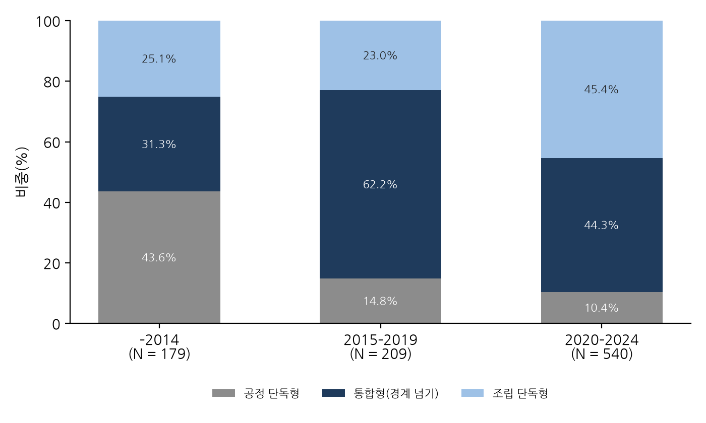
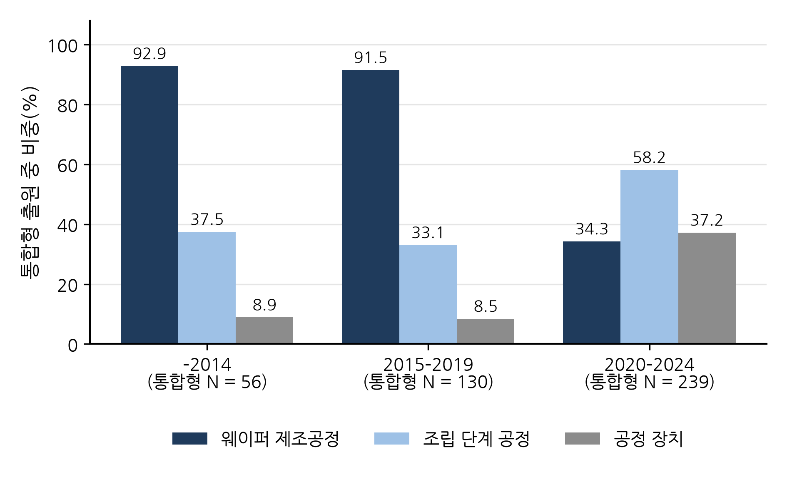
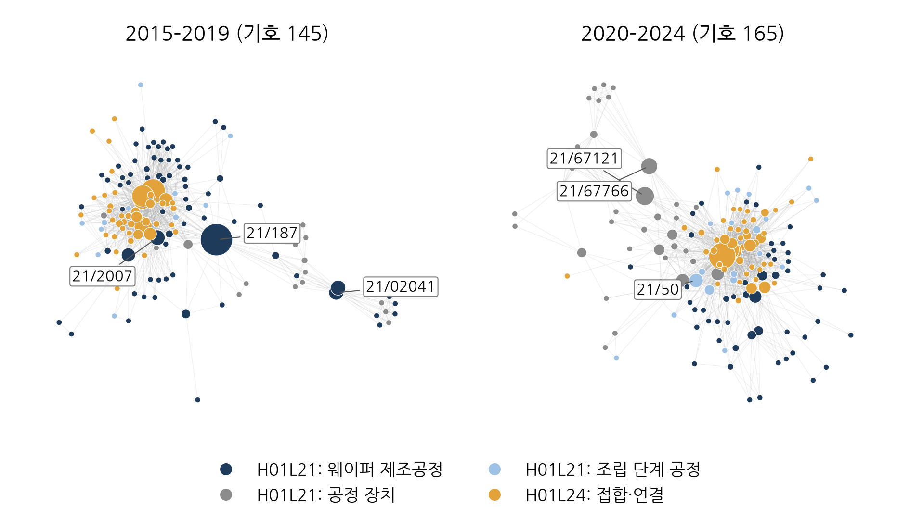
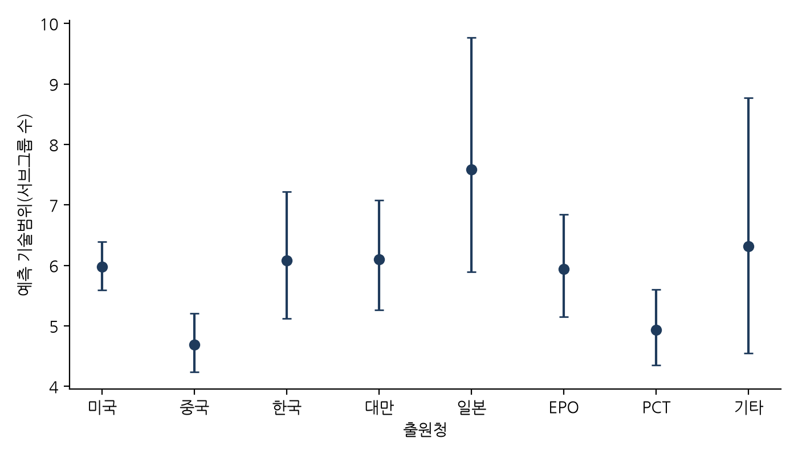
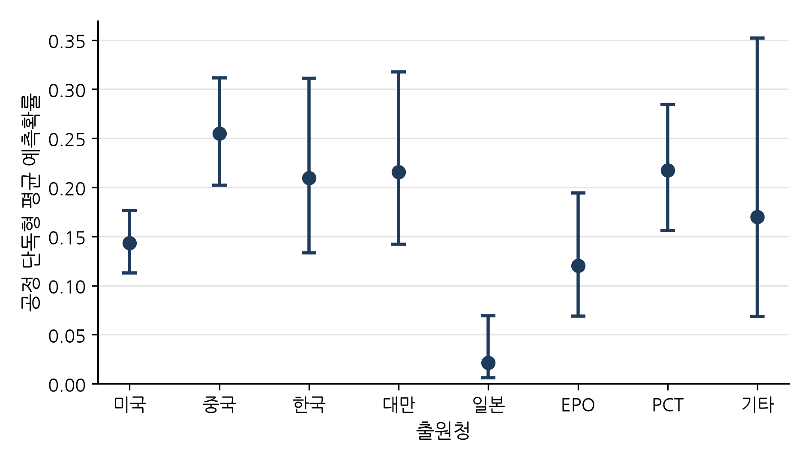

# 반도체 하이브리드 본딩 특허로 본 공정단계 간 기술융합: CPC 공동분류 기반 다차원 측정과 시기별·출원청별 변화

**Cross-stage technological convergence in semiconductor hybrid bonding patents: A multi-dimensional measurement based on CPC co-classification over time and across filing offices**

**이형규** (한양대학교 기술경영학과)

HyungKyu Lee (Department of Management of Technology, Hanyang University)

---

## 국문 초록

웨이퍼 위에 소자를 만드는 제조공정과 칩을 잇고 쌓는 접합 기술은 반도체 제조에서 오랫동안 서로 다른 단계에 속해 왔다. 하이브리드 본딩은 접합 기술이지만 평탄화, 표면 처리, 정렬 같은 제조공정 역량 없이는 구현되지 않는다. 이 논문은 두 영역의 기술이 특허 안에서 얼마나, 어떤 방식으로 결합되어 왔는지를 측정한다. 유럽특허청 PATSTAT의 하이브리드 본딩 관련 특허출원 928건에 부여된 CPC 기호로 각 출원을 조립 단독형(H01L24만), 공정 단독형(H01L21만), 통합형(둘 다)으로 나누었다. 이어 결합 강도(Jaccard 계수), 다양성(Shannon 엔트로피), 기술거리와 통합 다양성(코사인 거리, Rao-Stirling 지수), 경계 초월(E-I 지수), 네트워크 구조(매개 중심성), 신규 조합의 지표로 시기별 변화를 측정하고, 출원연도, 기술범위, 출원청에 따른 차이를 회귀모형으로 조건부 비교하였다. 통합형은 전체의 45.8%로 가장 많은 유형이었고 조립 단계의 제조공정을 뺀 보수적 정의에서도 37.2%였다. 두 클래스의 Jaccard 계수와 같은 통합형 비중은 2014년 이전 31.3%에서 2015–2019년 62.2%로 높아졌다가 2020–2024년 44.3%로 낮아졌다. 기호 공출현 네트워크의 E-I 지수는 2014년 이전에는 무작위 기대값보다 뚜렷이 낮았지만 2015년 이후 그 차이가 크게 줄어, 두 클래스 사이의 경계가 낮아졌음을 보여주었다. 결합의 내용도 바뀌었다. 2019년까지는 통합형 출원의 90% 이상이 웨이퍼 제조공정 기호를 가졌지만 2020–2024년에는 34.3%에 그쳤고, 접합과의 결합 강도와 두 영역을 잇는 매개 역할도 웨이퍼 제조공정에서 임시 기판, 봉지, 다이싱 같은 조립 단계 공정과 공정 장치로 옮겨 갔다. 그러나 결합하는 기술 사이의 거리는 줄지 않았다. 중국 출원청 출원은 미국 출원청 출원보다 기술범위와 기술 영역 엔트로피가 낮았지만 Rao-Stirling 지수는 다르지 않았다. 이 결과는 기술융합이 한 산업의 공정 단계 사이에서도 일어나며, 그 융합이 단순히 늘어나기보다 결합하는 기술의 내용을 바꾸어 가며 진행되었음을 개별 특허 수준에서 보여준다.

**주제어:** 기술융합; 특허 공동분류; 하이브리드 본딩; 첨단 패키징; 기술 네트워크; Rao-Stirling 다양성

## Abstract

Wafer fabrication and the bonding technologies that connect and stack chips have long belonged to separate stages of semiconductor manufacturing. Hybrid bonding is a bonding technology, yet it cannot be realised without fabrication capabilities such as planarisation, surface treatment and alignment. This paper measures how far, and in what way, the two bodies of technology have been combined within patents. Using the CPC symbols assigned to 928 hybrid-bonding-related applications drawn from EPO PATSTAT, we classify each application as assembly-only (H01L24 only), process-only (H01L21 only) or integrated (both). We then measure change over time along several dimensions: combination strength (Jaccard coefficient), diversity (Shannon entropy), technological distance and integrated diversity (cosine distance, Rao-Stirling index), boundary spanning (E-I index), network structure (betweenness centrality) and new combinations. Differences by filing year, within-class breadth and filing office are compared conditionally with regression models. Integrated applications are the largest group at 45.8%, and 37.2% even under a conservative definition that excludes assembly-stage processes. Their share, which equals the Jaccard coefficient of the two classes, rises from 31.3% before 2015 to 62.2% in 2015–2019 and falls back to 44.3% in 2020–2024. The E-I index of the symbol co-occurrence network lies well below its random expectation before 2015, but the gap narrows sharply afterwards, showing that the boundary between the two classes has become lower. The content of the combination also changes. Among applications filed up to 2019, more than 90% of integrated applications carry wafer-fabrication symbols, against only 34.3% in 2020–2024. Both the strength of the combination with bonding and the brokerage between the two domains shift from wafer fabrication to assembly-stage processes such as temporary carriers, encapsulation and dicing, and to process equipment. The distance between the combined technologies, however, does not shrink. Applications filed at the Chinese office have lower breadth and lower entropy across technical areas than those filed at the US office, but no lower Rao-Stirling diversity. The findings show at the level of individual patents that technological convergence also occurs between the process stages of a single industry, and that it proceeds less by growing steadily than by changing the technologies it combines.

**Keywords:** technological convergence; patent co-classification; hybrid bonding; advanced packaging; technology network; Rao-Stirling diversity

---

## 1. 서론

반도체 산업의 분업 구조는 반세기 넘게 이어져 왔다. 트랜지스터를 웨이퍼 위에 만드는 일은 전공정(front end)의 몫이고, 다 만들어진 웨이퍼를 잘라 조립하고 포장하는 일은 후공정(back end)의 몫이었다. Kapoor(2013)가 기술하듯 전공정은 종합반도체기업(IDM)과 파운드리가 운영하는 대규모 팹에 집중되었고, 패키징과 테스트는 조립·테스트 전문업체(OSAT)로 외주화되는 길을 걸었다(Macher and Mowery, 2004; Brown and Linden, 2009). 이런 분업이 가능했던 것은 두 단계 사이의 인터페이스가 비교적 안정적으로 관리되었기 때문이다. 첨단 패키징은 이 전제를 흔든다. 한 단계의 성능이 다른 단계의 공정 역량에 훨씬 직접적으로 기대게 된 것이다.

왜 지금인가. 회로를 더 작게 만드는 미세화가 한계에 부딪히자, 산업은 다이를 나누고 쌓고 연결하는 방식에서 새 성능 향상의 여지를 찾기 시작했다(Arden et al., 2010; Khan et al., 2018). 그 중심에 하이브리드 본딩이 있다. 솔더 범프 없이 구리 패드와 주변 산화막을 직접 맞붙이는 이 기술은 종래 방식으로는 닿기 어려운 10 µm 이하의 연결 간격을 열어 준다고 Lau(2021, 2022)는 정리한다. 이 기술의 성패를 가르는 요소를 하나씩 짚어 보면 나노미터 수준의 표면 평탄화, 표면 활성화, 정밀 정렬인데, 어느 것도 후공정의 전통적 역량이 아니다. 모두 전공정의 제조공정 역량이다. 상호의존이 이렇게 커지자 선도 파운드리가 첨단 패키징 역량을 내부에 두려는 움직임이 나타난 것도 자연스럽다(Lau, 2022; KnowMade, 2024).

이러한 경계의 흐려짐을 개별 특허 수준에서 볼 수 있는가. 이것이 이 논문의 출발점이다. 기술융합 문헌은 서로 구분되던 기술 영역이 겹치고 결합하는 과정을 오랫동안 다루어 왔고(Rosenberg, 1963; Kodama, 1992; Curran and Leker, 2011; Sick and Bröring, 2022), 그런 점에서 자연스러운 출발점이다. 그런데 이 문헌의 실증 연구는 정보통신과 가전을 다룬 Hacklin et al.(2009), 식품과 제약을 다룬 Bröring et al.(2006), 나노기술과 바이오기술을 다룬 No와 Park(2010)에서 보듯 서로 다른 산업이나 기술 분야가 겹치는 경우에 관심을 두어 왔다. 한 산업 안에서 가치사슬의 단계를 가로지르는 융합은 좀처럼 다루어지지 않았다. 가치사슬 상·하류 기업 간의 특허 인용을 분석한 Karvonen과 Kässi(2012)가 그나마 가까운 선례이지만, 하나의 기술이 공정 단계의 경계를 넘는지를 특허 단위에서 검정한 것은 아니다. 산업 아키텍처, 곧 누가 무엇을 만들고 누가 가치를 가져가는가를 정하는 틀(Jacobides et al., 2006)에 압력을 가하는 융합이 있다면 그것은 바로 이런 종류의 융합이다.

자료는 유럽특허청(EPO) PATSTAT에서 추출한 하이브리드 본딩 관련 특허출원 928건이고, 여기에 부여된 협력적 특허분류(CPC) 기호가 분석의 재료다. 접합·인터커넥트 기술(H01L24)의 기호와 반도체 제조공정 기술(H01L21)의 기호가 한 출원에 함께 붙어 있으면 그 출원을 통합형, 곧 경계를 넘는 특허로 본다. 접합 기호만 있으면 조립 단독형, 제조공정 기호만 있으면 공정 단독형이다. 공동분류로 융합을 포착하는 것 자체는 Curran과 Leker(2011), Geum et al.(2012), Kwon et al.(2020) 등이 써 온 표준적인 방법이다. 이 논문이 새로 하는 일은 그 방법을 두 산업 사이가 아니라 한 산업을 가로지르는 경계에 적용하고, 분야 수준의 지수로 집계하는 대신 개별 특허의 유형과 그 안에 담긴 세부 기술 영역까지 추적하는 것이다. 다만 공동분류의 비중 하나로는 결합이 얼마나 강한지는 알 수 있어도, 결합하는 기술이 서로 얼마나 다른지, 어떤 기술이 두 영역을 잇는지, 새로운 결합이 언제 나타나는지는 알 수 없다. 그래서 공동분류 유형에 더해 결합 강도, 다양성, 기술거리, 경계 초월, 네트워크 구조, 신규 조합의 지표를 함께 쓴다(Stirling, 2007; Rafols and Meyer, 2010).

이 논문은 가설을 세워 검정하기보다 현상을 측정하는 데 목적을 둔다. 산업 안의 공정 단계 사이에서 일어나는 융합은 선행연구가 거의 다루지 않아 효과의 방향을 미리 정할 근거가 약하다. 이런 경우 융합 문헌은 먼저 관찰 가능한 특허 지표로 융합의 규모와 형태를 기술해 왔다(Curran and Leker, 2011; Geum et al., 2012). 답하려는 질문은 셋이다. 첫째, 하이브리드 본딩 특허에서 제조공정과 접합 기술의 공동분류는 얼마나 일반적이며 시간에 따라 어떻게 변했는가. 둘째, 두 영역을 잇는 결합은 어떤 세부 기술 사이에서 일어나며 그 구성은 어떻게 바뀌었는가. 셋째, 공동분류 유형, 기술범위, 융합의 폭과 이질성은 출원청별로 어떻게 다른가.

결론부터 적으면 통합형은 출원의 45.8%로 가장 많은 유형이고 좁은 정의로도 37.2%다. 통합형의 비중은 2015–2019년에 가장 높았다가 최근 낮아졌고, 공정 단독형은 꾸준히 줄었다. 기호 공출현 네트워크에서 두 클래스의 경계는 2015년 이후 크게 낮아졌다. 더 눈에 띄는 것은 통합형의 내용이다. 2019년까지의 통합형은 90% 이상이 웨이퍼 제조공정과 접합을 함께 담았지만, 2020년 이후의 통합형은 3분의 2가 웨이퍼 제조공정 없이 임시 기판, 봉지, 다이싱 같은 조립 단계의 공정이나 공정 장치를 접합과 함께 담는다. 두 영역을 잇는 다리 역할도 같은 방향으로 옮겨 갔지만, 결합하는 기술 사이의 거리는 줄지 않았다. 출원청별로는 중국 출원청 출원의 기술범위와 기술 영역 엔트로피가 낮았다. 이 논문의 기여는 세 갈래로 나뉜다. 개념적으로는 산업 간 사례에 머물던 융합 이론을 산업 내 공정 단계 간 사례로 넓히고, 이를 Langlois와 Steinmueller(1999), Kapoor와 Adner(2012), Kapoor(2013)의 반도체 산업 아키텍처 문헌과 잇는다. 방법론적으로는 공동분류를 개별 특허의 유형으로 재구성하고, 결합 강도, 다양성, 기술거리, 경계 초월, 네트워크 위치, 신규 조합의 지표를 함께 적용함으로써, 하나의 비율이나 분야 수준 지수가 평균 속에 묻어 버리는 융합의 내용 변화를 드러낸다. 그리고 이 설계는 CPC 클래스 둘, 분류 규칙 하나, 표준적인 지표와 추정량만으로 이루어져 있으므로, 하류 단계가 상류 역량에 기대기 시작한 다른 공정기술에도 그대로 옮겨 쓸 수 있다.

논문의 구성은 다음과 같다. 제2절은 이론적 배경을 검토하고 연구질문을 정리한다. 제3절은 하이브리드 본딩 기술과 산업 지형을 소개한다. 제4절은 자료와 측정, 방법을, 제5절은 연구질문별 결과를 제시한다. 제6절은 함의와 한계를 논의하고, 제7절은 결론을 맺는다.

## 2. 이론적 배경과 연구질문

### 2.1 기술융합

한 영역에서 개발된 기술이 다른 영역으로 옮겨 간다는 생각은 오래되었다. Rosenberg(1963)는 19세기 공작기계 산업의 출현을 분석하면서, 총기나 재봉틀을 위해 개발된 가공 기술이 다른 제품에도 쓰일 수 있음을 기업들이 깨달아 가는 과정을 기술적 수렴이라 불렀다. Kodama(1992)는 분리되어 있던 기술 분야들을 결합해 어느 한쪽도 홀로 갖지 못한 역량을 만드는 과정을 기술융합이라 개념화했다. Hacklin et al.(2010)은 융합이 지식의 융합에서 기술과 응용의 융합을 거쳐 산업의 융합으로 단계적으로 진행된다는 단계 모형을 제시했고, 이 단계들이 서로 되먹임하며 공진화적 순환을 이룬다고 보았다(Hacklin et al., 2009). Curran과 Leker(2011)는 이 단계들을 특허 지표로 관찰하는 방법을 제시했다. 이후 이 문헌은 기술혁신경영의 독립된 연구 흐름으로 자리 잡았다(Geum et al., 2016; Sick and Bröring, 2022). 융합의 동인에 관한 실증도 쌓이기 시작했다. Caviggioli(2016)는 융합이 일어나기 쉬운 기술 분야의 특성을, Hwang(2020)은 한국 정보통신기업의 자료로 협력 유형과 융합의 관계를 살폈다.

이 문헌의 두 가지 특징이 본 연구의 출발점이다. 첫째, 초점이 서로 다른 산업이나 기술 분야의 중첩에 있다. 통신과 컴퓨팅, 식품과 제약, 나노기술과 바이오기술 등 대표적 사례는 모두 다른 산업의 기업들이 지식 기반의 중첩을 발견하는 상황이다(Gambardella and Torrisi, 1998; Bröring et al., 2006; No and Park, 2010). 둘째, 융합은 보통 두 분야 사이의 공동분류나 인용을 집계한 분야 수준의 지표로 측정된다(Curran et al., 2010; Cho and Kim, 2014; Song et al., 2017). 이런 지표는 두 분야가 융합하는지, 언제 융합하는지를 알려 준다. 그러나 어떤 발명이 융합을 담고 있고 어떤 특성의 발명이 그러한지는 알려 주지 못한다. 개별 특허의 차이가 평균 속에 묻히기 때문이다.

### 2.2 가치사슬 단계 사이의 융합: 반도체의 경우

산업과 산업 사이의 경계 말고도 또 다른 경계가 있다. 한 산업 안에서 가치사슬의 단계를 가르는 경계다. 반도체 산업이 좋은 사례인 것은 이 경계가 수직 전문화 연구의 오랜 대상이었기 때문이다. Langlois와 Steinmueller(1999)는 산업 구조가 바뀌는 동안 경쟁우위가 기업과 국가 사이에서 어떻게 옮겨 다녔는지를 추적했고, Macher와 Mowery(2004)는 설계와 제조, 제조와 조립이 분리되어 팹리스, 파운드리, 조립·테스트 전문업체가 생겨난 과정을 기록했다. 이 구조가 여러 차례의 위기를 거치며 재협상되어 온 과정은 Brown과 Linden(2009)이 기술했다. 한편 Kapoor(2013)에 따르면 전문화가 진행되는 가운데서도 여러 단계에 걸친 역량을 유지한 기업이 있었고, 이들은 기술 전환에 다르게 대응했으며 그 선택이 산업 아키텍처를 만들어 왔다. Kapoor와 Adner(2012)는 DRAM 산업을 대상으로, 부품과 시스템이 서로 얽혀 있을 때 기업이 직접 만드는 범위보다 넓은 지식을 가질수록 유리하다는 점을 보였다.

두 문헌을 잇는 논리는 다음과 같다. 산업 아키텍처는 누가 무엇을 하고 가치가 어떻게 나뉘는지를 정하는 틀이며(Jacobides et al., 2006), 공정 단계 사이의 인터페이스가 안정적일 때 전문화를 허용한다. 새로운 기술이 한 단계의 성능을 다른 단계의 지식에 의존하게 만들면 인터페이스가 불안정해지고, 기업은 경계 반대편의 지식을 획득하거나 통합해야 한다. 이때 지식의 결합은 먼저 발명 수준에서 나타난다. 한 발명이 두 단계의 기술을 함께 담기 시작하는 것이다. 특허의 공동분류는 이러한 지식 경계 확장의 흔적이다. 하이브리드 본딩은 이런 기술에 해당한다. 수율이 평탄화, 표면 화학, 정렬처럼 전공정에 자리한 제조공정 역량에 달려 있으므로 제조와 패키징 사이의 인터페이스는 더 이상 안정적이지 않다. 그 결과는 두 산업 사이가 아니라 한 산업의 두 단계 사이에서 일어나는 융합이다. 이 현상은 미세화의 한계에 관한 문헌이 예견하고(Arden et al., 2010; Iyer, 2016; Khan et al., 2018) 패키징 공학 문헌이 기술적으로 기록해 왔지만(Lau, 2021, 2022), 이를 발명의 기록에서 관찰하는 방법은 거의 제시되지 않았다.

융합과 수직통합은 묻는 것이 다르다. Macher와 Mowery(2004), Kapoor(2013)의 수직통합 문헌이 묻는 것은 어느 기업이 어느 단계를 직접 수행하는가, 곧 조직의 경계다. 융합 문헌은 서로 다른 영역의 기술이 하나의 발명 안에서 결합되는가, 곧 지식의 경계를 묻는다(Kodama, 1992; Curran and Leker, 2011). Hacklin et al.(2010)의 단계 모형에서 기술의 융합은 산업의 융합보다 먼저 온다. 이 논문이 특허에서 보려는 것도 그 앞선 단계다. 기업이 조직적 결정을 내리기 전에, 또는 그 이면에서 진행되는 기술의 결합이다. 산업 아키텍처는 그래서 여기서 직접 검정하는 결과변수가 아니라 결과를 해석하는 상위의 이론적 맥락으로 두고, 수직통합은 직접 측정하지 않는 후속 현상으로 남긴다.

### 2.3 특허로 융합을 측정하기

융합 측정에 특허가 가장 널리 쓰이는 이유는 분류 기호가 각 발명을 하나 이상의 기술 분야에 배치해 주기 때문이다(Curran and Leker, 2011). 기존 연구는 대체로 두 분야의 기호가 함께 부여된 특허의 수를 세어 분야 수준의 지수로 집계해 왔다(Cho and Kim, 2014; Lee et al., 2015; Jeong et al., 2015; Kwon et al., 2020). Curran과 Leker(2011)는 공동분류와 인용 같은 특허 지표로 융합이 진행되는지를 관찰하는 방법을 제시했고, Geum et al.(2012)은 정보기술과 바이오기술 사이의 융합을 인용 분석과 공동분류 분석으로 측정하여 융합의 강도와 범위를 구분하였다. 특허에 함께 부여된 분류 기호를 연결로 잇는 네트워크 방식도 널리 쓰인다(Cho and Kim, 2014). 이 연구들은 가설을 검정하기보다 지표로 융합의 규모와 형태를 기술하는 데 초점을 둔다. 분류가 발명을 뒤늦게 따라간다는 문제를 피하려고 특허 텍스트를 이용하는 연구도 있다(Preschitschek et al., 2013; Zhu and Motohashi, 2022).

융합을 재는 지표는 무엇을 보느냐에 따라 여러 차원으로 나뉜다. 첫째는 결합의 강도다. 두 분류가 한 특허에 함께 나타난 빈도는 각 분류의 규모에 좌우되므로 Jaccard 계수(Jaccard, 1912)나 코사인 계수로 규모를 보정한다. 둘째는 다양성이다. Shannon 엔트로피나 Simpson 지수는 한 특허나 포트폴리오가 여러 분야에 얼마나 고르게 걸치는지를 보여주지만, 분야 사이의 거리는 반영하지 못한다. 셋째는 기술거리다. 특허 분류 벡터의 코사인으로 기술 사이의 근접성을 재는 방식은 Jaffe(1986)에서 비롯되었고, Breschi et al.(2003)은 공동분류 프로필의 코사인으로 기술 사이의 관련성을 측정하였다. Rao(1982)와 Stirling(2007)의 Rao-Stirling 지수는 다양성, 균형, 기술거리를 하나로 묶어, 비슷한 세부 분야가 여럿 모인 경우와 서로 먼 분야가 결합한 경우를 구분한다(Rafols and Meyer, 2010). 넷째는 경계 초월이다. Krackhardt와 Stern(1988)의 E-I 지수는 집단 내부의 연결에 견주어 외부와의 연결이 얼마나 많은지로 경계를 넘는 정도를 잰다. 다섯째는 네트워크 구조다. 분류를 노드로, 공동출현을 연결로 둔 기술 네트워크에서 연결 중심성은 허브 기술을, 매개 중심성(Freeman, 1977)은 서로 다른 기술군을 잇는 다리 기술을 가려낸다. 여섯째는 동태성이다. 이전에 없던 분류 조합의 출현은 기술적 신규성의 지표로 쓰인다(Verhoeven et al., 2016). 하나의 지표는 융합의 한 면만 보여주므로, 연구질문에 맞추어 여러 지표를 함께 쓰는 것이 바람직하다.

공동분류를 신호로 쓴다는 점에서 본 연구는 첫째 흐름에 속한다. 다른 점은 분석 단위와 깊이다. 공동분류를 분야 수준으로 집계하는 대신 개별 특허를 세 가지 공동분류 유형으로 나누는데, 접합·인터커넥트 기호(H01L24)만 부여된 조립 단독형, 제조공정 기호(H01L21)만 부여된 공정 단독형, 그리고 두 기호가 함께 부여된 통합형이 그것이다. 이 가운데 통합형이 경계를 넘는 특허다. 특허 하나하나에 대해 정의되는 구분이므로 표준 이산선택 모형으로 분석할 수 있고, 집계 지수가 평균해 버리는 특허 간 차이도 살아남는다. 나아가 통합형 출원이 두 클래스 안의 어떤 세부 영역을 함께 담고 있는지를 보면, 융합의 규모뿐 아니라 무엇과 무엇이 결합하는지의 변화도 추적할 수 있다. 한 가지 단서는 필요하다. CPC 기호는 심사관이 발명의 기술 내용에 부여하는 것이므로, 공동분류는 두 영역의 기술이 한 발명에 함께 담겼다는 사실의 대리측정치이지 법적 청구범위의 측정치는 아니다. 이 점은 제4.2절에서 다시 정리한다.

출원 사이의 차이를 비교할 축은 두 갈래의 특허 연구에 기대어 고른다. 하나는 특허 범위 연구다. Lerner(1994)는 특허가 걸치는 분류의 수로 범위를 재고 범위가 경제적 가치를 가짐을 보였으며, 반도체에서는 특허 시장이 잘게 나뉘어 있을수록 기업이 넓은 포트폴리오를 쌓는다는 점이 알려져 있다(Hall and Ziedonis, 2001; Ziedonis, 2004). 본 연구의 기술범위는 이 전통을 따르되 두 클래스 안의 세부 분류 수로 한정한 측정치다. 다른 하나는 관할권에 따라 특허 행태가 달라진다는 연구다. 어느 특허청에 출원하는가에는 출원인 집단, 심사 관행, 출원 목적이 함께 반영된다. 중국의 특허 급증은 제도 변화와 외국인직접투자(Hu and Jefferson, 2009), 그리고 건수를 보상하는 보조금 정책(Dang and Motohashi, 2015)에 힘입은 것이고, 반도체 가치사슬에서 중국의 위치는 지정학적 압력 속에서 빠르게 바뀌어 왔다(Grimes and Du, 2022). 추격 문헌은 후발자가 선발자의 경로를 단계별로 따라가거나 일부 단계를 건너뛴다고 본다(Lee and Lim, 2001). 이를 특허에 적용하면 추격 단계의 출원은 시스템 전체보다 특정 공정 단계에 집중될 것이라는 예상이 나온다.

### 2.4 연구질문

이 논문은 가설을 세워 검정하는 대신 세 연구질문에 답하는 측정 연구로 설계한다. 산업 안의 공정 단계 사이에서 일어나는 융합은 선행연구가 거의 없어 효과의 방향을 미리 정할 근거가 약하고, 이런 경우 융합 문헌은 먼저 관찰 가능한 지표로 규모와 형태를 기술해 왔다(Curran and Leker, 2011; Geum et al., 2012). 각 질문에 대해 선행연구가 시사하는 바는 결과를 해석할 때의 참고점으로만 쓴다.

**연구질문 1: 공동분류의 규모와 시간 변화.** 하이브리드 본딩 관련 특허에서 제조공정과 접합 기술의 공동분류는 얼마나 일반적이며, 시간에 따라 어떻게 변했는가. 융합의 단계 모형(Hacklin et al., 2010; Jeong et al., 2015)은 기술이 발전하면서 융합의 형태도 바뀐다고 본다. 하이브리드 본딩의 초기 발명은 표면 준비, 저온 어닐링, 평탄화처럼 직접 접합을 가능하게 한 공정 단계에 관한 것이었고, 적용 범위가 이미지센서와 3D NAND의 웨이퍼 단위 접합에서 고대역폭 메모리와 로직을 위한 다이 단위 접합으로 넓어지면서 발명의 중심은 접합된 구조와 적층 쪽으로 옮겨 갔다(Lau, 2021). 따라서 공동분류의 비중이 한 방향으로만 움직이기보다 시기에 따라 다른 모습을 보일 수 있다. 다만 출원연도에는 기술의 발전만이 아니라 분류 체계와 심사 관행, 출원인 구성, 최근 출원의 공개 시차도 함께 반영되므로, 연도에 따른 차이는 기술 성숙의 효과라기보다 시간에 따른 변화로 읽는다. 이 질문에는 결합의 강도(공동분류 비중과 Jaccard 계수), 두 클래스 사이의 경계 초월(E-I 지수), 새로운 결합의 출현(새 교차 조합)으로 답한다.

**연구질문 2: 결합의 구성.** 두 영역을 잇는 결합은 어떤 세부 기술 사이에서 일어나며, 그 구성은 시간에 따라 어떻게 바뀌었는가. Kodama(1992)의 융합도 Rosenberg(1963)의 수렴도 둘 이상의 기술 영역에 걸치는 발명을 뜻하므로, 두 클래스 안에서 더 다양한 세부 기술을 담은 출원일수록 두 영역의 기호를 함께 가질 것이다. 다만 이 관계에는 기계적인 부분이 있다. 기술범위와 공동분류 유형이 같은 CPC 집합에서 만들어지고, 통합형은 정의상 두 클래스의 기호를 하나씩은 가지기 때문이다. 그래서 이 연관은 통합형 특허의 구성적 특징으로 기술한다. 결합되는 기술의 내용도 달라질 수 있다. 웨이퍼 단위 접합은 웨이퍼 전체의 평탄화와 표면 처리 같은 웨이퍼 제조공정에 기대지만, 다이 단위 접합은 다이의 취급, 임시 지지 기판, 다이싱처럼 조립 단계에 가까운 공정을 함께 요구한다(Lau, 2021, 2022). 적용의 중심이 옮겨 가면 통합형 특허가 접합과 함께 담는 제조공정의 종류도 바뀔 것이다. 이 질문에는 통합형이 담은 기술 영역의 구성, 영역별로 접합과 결합하는 강도(Jaccard 계수), 두 영역을 잇는 다리 기술(매개 중심성), 그리고 결합하는 기술 사이의 이질성(기술거리, Rao-Stirling 지수)으로 답한다.

**연구질문 3: 출원청별 차이.** 공동분류 유형, 기술범위, 융합의 폭과 이질성은 출원청별로 어떻게 다른가. 어디에 출원하는가에는 누가 무엇을 위해 발명하는가가 묻어난다. Lee와 Lim(2001)의 단계별 추격 논리, Hu와 Jefferson(2009) 및 Dang과 Motohashi(2015)가 보인 중국 특허의 증거, Grimes와 Du(2022)가 기술한 반도체 가치사슬 속 중국의 위치를 함께 놓으면, 중국 출원청 출원은 특정 제조 단계의 확보에 집중되어 범위가 좁고 공정 단독형이 많을 수 있다. 이는 중국 특허 선행연구가 직접 내린 결론이 아니라 단계별 추격의 논리를 특허 구성에 적용해 본 참고점이며, 출원청의 차이는 관할권의 효과가 아니라 각 출원청에 제출된 발명 포트폴리오의 구성 차이로 기술한다. 일본 출원청은 표본이 26건에 그치므로 해석하지 않는다(부록 B). 출원청 비교에는 기술범위와 함께 기술 영역 엔트로피와 Rao-Stirling 지수를 써서, 범위가 좁다는 것이 다루는 기술 영역이 적다는 뜻인지, 결합하는 기술이 서로 가깝다는 뜻인지를 구분한다.

세 질문 모두 특허 특성과 공동분류 사이의 관찰된 연관을 기술하는 것이며 인과관계를 주장하지 않는다.

## 3. 연구 맥락: 하이브리드 본딩 기술과 산업 지형

하이브리드 본딩은 유전체 안에 구리 패드가 새겨진 두 평탄한 표면을 맞대어, 상온에서 유전체끼리 먼저 붙고 저온 어닐링 뒤 구리끼리 붙게 하여 영구적인 전기 연결을 만드는 기술이다. 솔더 범프가 없으므로 연결 간격은 마이크로범프 플립칩으로는 어려운 10 µm 이하로 내려가며, 연구 단계에서는 1 µm 이하에 이른다(Lau, 2021, 2022). 공정은 두 가지 형태로 쓰인다. 웨이퍼-투-웨이퍼(W2W) 접합은 웨이퍼 전체를 붙이는 방식으로 CMOS 이미지센서와 3D NAND에서 먼저 상용화되었다. 다이-투-웨이퍼(D2W) 접합은 개별 다이를 웨이퍼에 붙이는 방식으로 칩렛, 고대역폭 메모리(HBM), 3D 로직에 필요하다. 두 형태 모두에서 수율을 좌우하는 단계, 곧 나노미터 이하의 거칠기로 표면을 다듬는 화학적 기계연마(CMP), 플라즈마 표면 활성화, 파티클 제어, 정밀 정렬은 CPC 분류상 접합 클래스(H01L24)가 아니라 반도체 제조공정 클래스(H01L21)에 속한다(제4.1절, 표 1). 그림 1은 하이브리드 본딩을 기반 공정, 접합 형태, 소자 구조, 적용 제품의 네 층으로 정리한 것이다. 기반 공정은 주로 제조공정 클래스(H01L21)와, 접합 형태 및 인터커넥트 구성은 주로 접합·인터커넥트 클래스(H01L24)와 대응한다.

**그림 1.** 하이브리드 본딩의 기반 공정, 접합 형태, 소자 구조, 적용 제품(저자 작성; Lau(2021, 2022)의 기술 설명을 바탕으로 재구성).

산업 지형도 같은 방향을 가리킨다. 하이브리드 본딩 특허에 대한 독립적 산업 분석은 TSMC, Adeia, YMTC, Intel, Samsung을 특허 활동을 주도하는 출원인으로 꼽는다(KnowMade, 2024). 원천기술을 가진 라이선싱 기업, 첨단 패키징을 직접 운영하는 파운드리, 메모리 제조사가 나란히 앞서 있다는 사실은 접합 기술이 더 이상 후공정 전문기업만의 영역이 아님을 보여준다. 이러한 지형이 어떤 특허가 제조공정과 접합 영역의 경계를 넘는지에 체계적인 흔적을 남기는가가 이하의 질문이다.

## 4. 자료와 방법

### 4.1 자료

자료는 유럽특허청의 PATSTAT Global 2025년판에서 가져왔다(European Patent Office, 2025). 먼저 CPC 분류 H01L21(반도체 제조공정)과 H01L24(반도체 연결 기술)로 후보를 검색한 뒤, 제목에 하이브리드 본딩 관련 키워드(*hybrid bonding*, *direct bonding*, *Cu–Cu*, *copper to copper*, *metal-oxide bond*) 가운데 하나 이상이 들어 있는 출원만 남겼다(표 1). 절차는 다음과 같다. 후보 출원은 H01L21 또는 H01L24 계열 CPC 기호를 하나 이상 가진 출원으로 한정하였다. 이후 영문 제목을 소문자로 바꾸어 지정 키워드 가운데 하나 이상이 들어 있는 출원만 남겼다. 추출된 파일은 출원 1건과 CPC 기호 1개의 쌍을 한 행으로 하는 긴 형식이며(출원 식별자, 출원청, 출원연도, 제목, CPC 기호), 기호의 공백을 정리한 뒤 중복 쌍이 없음을 확인하고 출원 식별자별로 집계하였다. 그 결과 출원–CPC 쌍 5,277건, 출원 단위로 1968–2024년에 출원된 928건이 된다. 따라서 표본은 하이브리드 본딩 특허 전체가 아니라 이 검색식으로 식별된 관련 출원이며, 제목에 관련어가 없는 출원은 포함되지 않는다. 또한 이 광의의 표본은 현대의 하이브리드 본딩뿐 아니라 그 기술적 기반이 된 초기 직접 접합(direct bonding) 전구 기술을 함께 포착하도록 설계되었으며, 장기 추세는 이 전구 기술에서 현대 기술로의 이행을 포함한다. 추출 단계에서 두 클래스 밖의 기호는 보존되지 않았으므로, 모든 기호는 H01L21 계열(202개)과 H01L24 계열(60개)의 서브그룹 기호(사선 뒤의 세부 번호까지 포함한 전체 기호, 예: H01L 21/603) 262개로 이루어진다. 본 연구의 분석단위는 PATSTAT의 개별 특허출원이다. 같은 발명이 여러 출원청에 제출된 경우 각 출원은 별도의 관측치로 포함되며, 본문의 '특허'는 일반적 표현이고 계량분석의 관측단위는 특허출원이다.

**표 1.** 하이브리드 본딩 관련 특허의 검색 전략.

| 단계 | 조건 | 내용 |
|---|---|---|
| 1차: CPC | H01L21 | 반도체 제조공정 기술. 웨이퍼 직접 접합(21/18, 21/20), 소자 분리·배선·TSV(21/76), 기판·절연층 처리(21/02), 화학적 기계연마(21/30–21/32) 등. 조립 단계의 제조공정(21/48, 21/50–21/58, 21/60, 21/78)과 공정 장치(21/67–21/68)도 포함 |
| 1차: CPC | H01L24 | 반도체 또는 고체소자의 연결·분리를 위한 커넥터 구조, 범프·레이어·와이어 연결, 관련 연결 방법 및 장치 등 |
| 2차: 키워드 | 제목 | *hybrid bonding*, *direct bonding*, *Cu–Cu*, *copper to copper*, *metal-oxide bond* 가운데 하나 이상 |

*주:* 1차 조건은 두 클래스 가운데 하나 이상, 2차 조건은 키워드 가운데 하나 이상이며, 두 조건을 모두 만족해야 한다. 검색에는 두 클래스의 인덱싱 코드(예: H01L2224)도 썼으나, 추출된 레코드에는 본 클래스의 기호만 보존되었으므로 인덱싱 코드는 기술범위 계산에 들어가지 않는다.

자료의 세 가지 특성을 미리 밝혀 둔다. 첫째, *hybrid bonding*은 비교적 정밀한 검색어이지만 *direct bonding*은 뜻이 넓다. 제목에 *hybrid bonding*이 들어 있는 출원은 467건이며, 이 핵심 표본으로 다시 추정한 결과를 제5.4절에 보고한다. 둘째, 키워드 필터는 직접 접합(direct bonding)이라는 말의 무관한 용법도 걸러내지 못한다. 세라믹 기판에 구리를 붙이는 DBC 기판, 구리 합금, 전력 모듈 등이 그 예다. 제목으로 식별한 이러한 출원은 68건이며, 이를 뺀 재추정 결과도 제5.4절에 보고한다(판정 기준과 분포는 부록 C). 셋째, 원자료에는 공식 특허 패밀리 식별자가 없어 패밀리 단위의 중복을 직접 제거할 수 없다. 같은 발명이 여러 나라에 출원되면 여러 건으로 잡힌다. 이에 민감도 분석으로 같은 제목을 가진 출원을 하나의 근사 중복군으로 보고 각 제목군에서 가장 이른 출원 1건만 남긴 결과를 제5.4절에 보고한다. 928건은 473개의 고유 제목으로 이루어지며, 이 중 149개 제목은 둘 이상의 출원청에 출원되었다. 제목은 공식 패밀리 식별자가 아니므로 이 분석은 정확한 패밀리 제거가 아니라 다국가 중복 가능성에 대한 근사 조정이다.

### 4.2 측정: 개념과 지표의 대응

이론적 개념, 관찰 현상, 조작적 지표를 구분해 두는 것이 이 절의 목적이다(표 2). 이론적 개념은 공정 단계 사이의 기술융합이고, 관찰하는 현상은 제조공정 기술과 접합·인터커넥트 기술이 한 출원에 함께 담기는 것이며, 조작적 지표는 H01L21과 H01L24의 공동분류다. 이때 H01L21을 전공정 그 자체로, H01L24를 후공정 그 자체로 보지는 않는다. H01L21 안에는 웨이퍼 제조공정 외에도 패키지 부품 제조, 실장·봉지, 리드 부착, 다이싱 같은 조립 단계의 제조공정과 공정 장치가 함께 들어 있고, H01L24가 조직적 의미의 후공정 산업 경계와 일치하는 것도 아니기 때문이다. 그런데도 두 클래스의 공동분류를 대리측정치로 쓸 수 있는 것은, 하이브리드 본딩의 성능을 좌우하는 웨이퍼 준비, 표면 처리, 평탄화 및 관련 제조공정이 H01L21에 다수 포함되고 접합·인터커넥트 기술은 H01L24에 모여 있기 때문이다. 표본에 있는 H01L21 계열 기호 1,636건의 내역은 웨이퍼 제조공정 905건(55.3%), 공정 장치 328건(20.0%), 조립 단계 공정 403건(24.6%)이다. 조립 단계 공정을 제조공정으로 세지 않는 좁은 정의로 다시 추정한 결과는 제5.4절에 있으며, 회귀분석의 결론은 그대로다.

**표 2.** 개념 수준별 정의와 본 연구에서의 위치.

| 수준 | 개념 | 본 연구에서의 위치 |
|---|---|---|
| 산업 | 산업 아키텍처 | 결과를 해석하는 상위 맥락(직접 검정하지 않음) |
| 기술 시스템 | 공정 단계 간 기술융합 | 핵심 이론적 현상 |
| 발명 | 경계를 넘는 발명 | 분석 대상 |
| 측정 | H01L21–H01L24 공동분류 | 조작적 지표(대리측정치) |
| 특허 특성 | 두 클래스 안의 CPC 서브그룹 수 | 기술적 다양성(클래스 내 기술범위) |
| 조직 | 수직통합 | 직접 측정하지 않는 후속 현상 |

CPC 기호는 심사관이 발명의 기술 내용에 부여하는 것으로, 청구항의 문구와 항상 일치하지는 않는다. 따라서 이하에서 어떤 출원이 어떤 기술을 '포함한다' 또는 어떤 기술로 '분류된다'는 말은 해당 클래스의 기호가 그 출원에 부여되어 있다는 뜻이며, 법적 청구범위에 관한 진술이 아니다.

### 4.3 변수

표 3은 변수를 정의한다. 기술범위(breadth)는 출원에 부여된 H01L21·H01L24 계열의 서로 다른 서브그룹 기호의 수다. 이는 분류 기호의 수로 범위를 재는 Lerner(1994)의 방식을 두 클래스 안에 적용한 것으로, 두 클래스 안에서 출원에 부여된 세부 기술의 다양성을 뜻하며 반도체 밖의 분야로 뻗는 정도나 법적 청구범위는 재지 않는다. 다만 공동분류 유형과 기술범위는 같은 CPC 정보로 만들어지므로, 통합형은 정의상 H01L21과 H01L24 기호를 하나씩은 가져 최소 breadth가 2인 반면 단독형의 최소값은 1이다. 이 기계적 최소치 차이를 완화하기 위해 출원이 보유한 클래스마다 최소 1개 기호를 차감한 유형 최소치 조정 CPC 범위(breadth_adj = breadth − I[H01L21 보유] − I[H01L24 보유])를 따로 두었다. 예컨대 H01L21 기호 2개와 H01L24 기호 1개를 가진 통합형 출원은 breadth 3, breadth_adj 1이고, H01L24 기호 4개만 가진 조립 단독형 출원은 breadth 4, breadth_adj 3이다. breadth_adj는 유형을 성립시키는 최소 분류 정보를 뺀 뒤 남는 추가 CPC 다양성이며, 종속변수의 유형 정보를 반영하는 탐색적 강건성 지표로만 쓴다. 공동분류 유형(tech_cat)은 각 출원을 조립 단독형(H01L24 기호만), 통합형(둘 다), 공정 단독형(H01L21 기호만)으로 나누며, 두 클래스의 기호가 함께 부여된 출원을 이하 통합형 또는 공동분류형이라 부르고 이것이 경계 넘기의 측정치다. 제조공정 분류 여부(has_process)는 H01L21 기호를 하나라도 가지면 1인 지표로, 통합형과 공정 단독형을 합한 것이다. 출원청(ccode)은 출원이 제출된 특허청 또는 출원 경로로 8개 수준이며 미국이 기준이다. 출원연도(yc)는 표본의 첫 출원(1968년)부터 지난 햇수다.

**표 3.** 변수 정의.

| 변수 | 정의 | 유형 | 해석상 주의 |
|---|---|---|---|
| breadth | 출원별로 부여된 H01L21·H01L24 계열의 서로 다른 CPC 서브그룹 수(클래스 내 CPC 범위) | 카운트, 1–21 | 전체 CPC 범위나 법적 청구범위가 아니라 두 클래스 내부의 기술적 다양성 |
| breadth_adj | 유형 최소치 조정 CPC 범위: 출원이 보유한 클래스마다 최소 1개 기호를 차감하고 남은 추가 CPC 서브그룹 수(단독형은 breadth − 1, 통합형은 breadth − 2; 제5.4절) | 카운트, 0–19 | 유형별 최소 CPC 수의 기계적 차이를 완화하는 탐색적 지표. 유형 정보를 이용하므로 독립적인 범위 측정치는 아님 |
| tech_cat | 공동분류 유형: 조립 단독형(H01L24만) / 통합형(둘 다) / 공정 단독형(H01L21만) | 범주, 3 | 기업의 전략이 아닌 분류의 조합 |
| has_process | H01L21 기호를 하나라도 가지면 1(제조공정 분류), 아니면 0 | 이항 | 전공정 자체가 아닌 제조공정 관련 분류 |
| ccode | 출원청 또는 출원 경로: US(기준), CN, KR, TW, JP, EP, WO(PCT), 기타 | 범주, 8 | 출원인의 국적과 다름 |
| yc | 출원연도(1968년 = 0부터 지난 햇수); 표본 평균 49.7(2017.7년) | 정수, 0–56 | 기술 성숙의 직접 측정치가 아님 |

기술범위는 평균 5.69개(표준편차 4.07, 범위 1–21)이며, 통합형 7.89개, 조립 단독형 4.16개, 공정 단독형 3.15개로 유형에 따라 다르다. 출원청별로는 미국 382건, 중국 175건, PCT 경로 113건, EPO 83건, 대만 75건, 한국 58건, 일본 26건, 기타 16건이다. 그림 2는 연도별 출원 건수다. 2010년 이전에는 드물다가 2010년대 후반에 급증하여 2022년경 정점에 이른다. 2023–2024년의 감소에는 출원 뒤 공개까지 걸리는 시차가 영향을 미쳤을 가능성이 크다. 유형별로는 통합형 425건(45.8%), 조립 단독형 338건(36.4%), 공정 단독형 165건(17.8%)이며, 제조공정 기호를 가진 출원은 590건(63.6%)이다.

**그림 2.** 출원연도별 하이브리드 본딩 관련 출원 건수, 1968–2024(N = 928). 2023–2024년의 감소에는 출원 뒤 공개까지의 시차가 영향을 미쳤을 가능성이 크다.

출원청별 유형 분포와 기술범위는 표 4에 정리했다. 통합형은 EPO, 대만, 일본, 미국에서 절반 안팎으로 가장 많은 유형이지만 중국과 PCT 경로에서는 40% 수준에 그친다. 공정 단독형의 비중은 중국(24.6%)과 한국(27.6%)에서 높은 편이고 일본(11.5%), EPO(12.0%), 미국(13.9%)에서는 낮다. 기술범위 평균을 보면 중국(4.83)과 PCT(5.04)가 가장 좁고 일본(6.88)이 가장 넓다. 다만 출원청마다 출원 시기가 크게 다르다는 점을 함께 보아야 한다. 일본 출원은 절반이 2011년 이전 출원인 반면(중앙값 2011.5년) PCT 출원의 중앙값은 2022년이다. 이런 차이가 출원 시기와 범위를 통제한 뒤에도 남는지는 제5.3절의 회귀분석에서 확인한다.

**표 4.** 출원청별 공동분류 유형 분포와 기술범위(N = 928; 유형 열의 괄호는 행 비중, 기술범위 열의 괄호는 표준편차).

| 출원청 | N | 조립 단독형 | 통합형 | 공정 단독형 | 제조공정 분류(%) | 기술범위 평균(표준편차) | 출원연도 중앙값 |
|---|---:|---|---|---|---:|---|---:|
| 미국(US) | 382 | 148 (38.7%) | 181 (47.4%) | 53 (13.9%) | 61.3 | 5.99 (4.02) | 2020 |
| 중국(CN) | 175 | 63 (36.0%) | 69 (39.4%) | 43 (24.6%) | 64.0 | 4.83 (3.39) | 2021 |
| PCT(WO) | 113 | 43 (38.1%) | 46 (40.7%) | 24 (21.2%) | 61.9 | 5.04 (3.57) | 2022 |
| EPO(EP) | 83 | 29 (34.9%) | 44 (53.0%) | 10 (12.0%) | 65.1 | 5.94 (3.75) | 2021 |
| 대만(TW) | 75 | 24 (32.0%) | 39 (52.0%) | 12 (16.0%) | 68.0 | 6.27 (4.23) | 2021 |
| 한국(KR) | 58 | 17 (29.3%) | 25 (43.1%) | 16 (27.6%) | 70.7 | 5.84 (4.64) | 2018 |
| 일본(JP) | 26 | 10 (38.5%) | 13 (50.0%) | 3 (11.5%) | 61.5 | 6.88 (7.00) | 2011.5 |
| 기타 | 16 | 4 (25.0%) | 8 (50.0%) | 4 (25.0%) | 75.0 | 5.81 (6.23) | 2015.5 |
| 전체 | 928 | 338 (36.4%) | 425 (45.8%) | 165 (17.8%) | 63.6 | 5.69 (4.07) | 2021 |

미국, 중국 등은 국가 특허청이고 WO와 EP는 국제·지역 출원 경로이므로, 출원청 변수 전체는 출원청과 출원 경로의 구분이며 관할권 비교는 국가 특허청 사이, 특히 미국과 중국의 비교에 한정한다. 출원청 계수는 출원청 자체의 인과효과를 식별하지 않는다. 출원인, 기업 유형, 공식 패밀리 정보를 통제하지 못하므로, 이 계수는 해당 출원청에 제출된 발명 포트폴리오의 조건부 구성 차이로 해석한다.

### 4.4 융합 측정지표

공동분류 유형의 비중은 두 영역이 한 출원에서 결합하는지를 보여주지만, 결합이 얼마나 강한지, 무엇과 무엇이 결합하는지, 결합하는 기술이 서로 얼마나 다른지, 어떤 기술이 두 영역을 잇는지는 보여주지 않는다. 그래서 제2.3절에서 정리한 측정 차원에 따라 지표를 구성하였다(표 5). 모든 지표는 서브그룹 기호 수준에서 계산하고, 분류 수준에 따른 민감도는 사선 뒤 두 자리로 묶은 상위 그룹 수준에서 다시 확인한다(제5.4절).

**표 5.** 융합 측정 차원별 지표와 본 연구의 적용.

| 측정 차원 | 대표 지표 | 본 연구의 지표 | 연구질문 | 결과 |
|---|---|---|---|---|
| 결합 강도 | 공동출현 빈도, Jaccard 계수, 코사인 계수 | 두 클래스의 Jaccard·코사인 계수; 제조공정 세 영역과 접합 클래스의 Jaccard 계수 | 1, 2 | 제5.1절, 제5.2절 |
| 다양성·균형 | Shannon 엔트로피, Simpson 지수, HHI | 다섯 기술 영역에 대한 출원별 Shannon 엔트로피; 통합형 안에서 두 클래스의 균형 | 2, 3 | 제5.2절, 제5.3절 |
| 기술적 거리 | 코사인 거리 | 공동분류 프로필의 코사인 거리; 통합형의 교차 기술거리 | 2, 3 | 제5.2절, 제5.3절 |
| 통합 다양성 | Rao-Stirling 지수 | 출원별 Rao-Stirling 지수 | 2, 3 | 제5.2절, 제5.3절 |
| 경계 초월 | E-I 지수 | 기호 네트워크와 출원의 E-I 지수(집단 = 두 클래스)와 무작위 기대값 | 1 | 제5.1절 |
| 네트워크 구조 | 연결 중심성, 매개 중심성, 밀도, 군집계수 | 노드·연결 수, 밀도, 평균 군집계수; 허브 기호; 기술 영역별 매개 중심성 비중 | 1, 2 | 제5.1절, 제5.2절 |
| 동태성·신규성 | 새 조합 수, 급증 지표, 증가율 | 새 교차 조합 수, 새 조합을 포함한 통합형 비중, 지속률 | 1, 2 | 제5.1절, 제5.2절 |

*주:* 급증(burst) 지표는 연도별 출원 수가 적고 최근 2년 출원의 공개가 끝나지 않아 적용하지 않았다.

**기술 영역.** 여러 지표는 기호를 다섯 기술 영역으로 묶어 계산한다. 표 1의 구분에 따라 H01L21 기호를 웨이퍼 제조공정, 공정 장치(21/67–21/68), 조립 단계 공정(21/48, 21/50–21/58, 21/60, 21/78)으로 나누고, H01L24 기호를 연결부의 구조와 형성(24/00–24/73)과 연결 장치·방법(24/74–24/98)으로 나눈다. 결합의 구성은 통합형 출원 가운데 각 영역의 기호를 하나 이상 가진 출원의 비중으로 잰다. 한 출원이 여러 영역의 기호를 가질 수 있으므로 비중의 합은 100%를 넘는다.

**결합 강도.** 두 기술 i와 j의 결합 빈도는 둘이 함께 나타난 출원 수 N_ij로 재지만, 이 값은 각 기술의 규모에 좌우된다. 그래서 Jaccard 계수 J_ij = N_ij / (N_i + N_j − N_ij)와 코사인 계수 N_ij / √(N_i·N_j)로 규모를 보정한다. 두 클래스에 이를 적용하면 N_ij는 통합형 출원의 수다. 본 표본의 모든 출원은 두 클래스 가운데 하나 이상을 가지므로 분모 N_i + N_j − N_ij는 전체 출원 수와 같고, 따라서 통합형 비중은 두 클래스의 Jaccard 계수 그 자체다. 이 계수를 제조공정 세 영역 각각과 접합 클래스(H01L24) 사이에도 적용하면, 제조공정의 어느 부분이 접합과 강하게 결합하는지를 규모를 보정해 비교할 수 있다. 기호 쌍 수준의 Jaccard 계수는 해석에 쓰지 않는다. 같은 발명이 여러 출원청에 반복 출원되면 드문 기호 쌍의 값이 1에 가까워지기 때문이다. 예컨대 21/44와 24/28이 함께 나타난 출원 19건은 서로 다른 제목 4개에서 나왔다.

**다양성과 균형.** 출원이 가진 기호 가운데 기술 영역 k에 속하는 비중을 p_k라 하면, Shannon 엔트로피는 H = −Σ p_k ln p_k다. 한 영역에만 걸치면 0이고 다섯 영역에 고르게 걸치면 ln 5 ≈ 1.61이다. 이 지표는 서브그룹 수를 세는 기술범위와 달리 같은 영역 안의 세부 분류가 많다고 커지지 않으므로, 분류 기호가 많다는 사실과 여러 영역에 걸친다는 사실을 구분해 준다. 통합형 출원 안에서 두 클래스가 얼마나 고르게 섞였는지는 H01L21 기호의 비중 s로 계산한 균형도 −[s ln s + (1 − s) ln(1 − s)] / ln 2로 잰다. 두 클래스의 기호 수가 같으면 1이다.

**기술적 거리.** 기술 사이의 거리는 특허 분류 벡터의 코사인으로 재는 것이 일반적이다(Jaffe, 1986). 본 연구의 자료에는 인용이나 텍스트가 없으므로 Breschi et al.(2003)을 따라 공동분류 프로필로 거리를 정의한다. 기호 i의 프로필 c_i는 전체 928건에서 i가 다른 261개 기호와 각각 함께 나타난 횟수의 벡터이고, 두 기호의 거리는 d_ij = 1 − cos(c_i, c_j)다. 두 기호가 직접 함께 나타났는지가 아니라 어떤 기호들과 함께 쓰이는지가 비슷할수록 가깝다. 통합형 출원의 교차 기술거리는 그 출원의 H01L21 기호와 H01L24 기호를 잇는 모든 쌍의 평균 거리다.

**통합 다양성.** Rao-Stirling 지수 RS = Σ_i Σ_j p_i p_j d_ij는 다양성(기호의 수), 균형(비중의 고르기), 이질성(기호 사이의 거리)을 하나로 묶는다(Rao, 1982; Stirling, 2007). 출원 안의 기호에는 가중치가 없으므로 n개 기호 각각에 p_i = 1/n을 주며, 이때 RS는 기호가 많을수록, 기호 사이의 거리가 멀수록 커진다. 거리는 위의 공동분류 거리를 쓴다(Rafols and Meyer, 2010).

**경계 초월.** 시기별로 기호를 노드로, 한 출원에 함께 부여된 두 기호를 연결로 하는 공출현 네트워크를 만들고, 두 클래스를 집단으로 하여 E-I 지수 (E − I) / (E + I)를 구한다(Krackhardt and Stern, 1988). E는 H01L21 기호와 H01L24 기호를 잇는 연결의 수이고 I는 같은 클래스 안의 연결의 수다. 모든 연결이 클래스 안에 있으면 −1, 모두 클래스 사이에 있으면 +1이다. E-I 지수는 집단의 크기에 영향을 받으므로, 네트워크는 그대로 두고 기호의 클래스 표시만 무작위로 섞어 2,000번 다시 계산한 값의 평균을 무작위 기대값으로 삼는다. 관측값이 기대값보다 낮을 확률은 한쪽 순열검정 p값으로 보고한다. 관측값이 기대값보다 뚜렷이 낮으면 클래스 경계가 연결을 가르고 있다는 뜻이다. 출원 수준에서는 기호가 둘 이상인 출원마다 그 출원의 기호 쌍에 같은 식을 적용하고 이를 평균한 출원 평균 E-I를 함께 본다.

**네트워크 구조.** 같은 네트워크에서 밀도(가능한 연결 가운데 실제 연결의 비율), 평균 군집계수(Watts and Strogatz, 1998), 연결 중심성(직접 연결된 기호의 수), 매개 중심성(다른 기호 사이의 최단 경로를 매개하는 정도; Freeman, 1977)을 구한다. 연결 중심성이 높은 기호는 융합의 허브로, 매개 중심성이 높은 기호는 두 영역을 잇는 다리로 읽는다. 시기별로 전체 매개 중심성 가운데 각 기술 영역의 기호가 차지하는 비중을 구해, 다리 역할이 어느 영역에 있는지 본다.

**동태성과 신규성.** 이전 시기의 어떤 출원에도 없던 H01L21–H01L24 기호 쌍을 새 교차 조합으로 정의하고(Verhoeven et al., 2016), 시기별로 그 수와 새 조합을 하나 이상 가진 통합형 출원의 비중을 구한다. 첫 시기는 비교할 이전 자료가 없으므로 제외한다. 2015–2019년에 나타난 교차 조합 가운데 2020–2024년에 다시 나타난 조합의 비중을 지속률로 본다.

### 4.5 분석 방법

분석은 두 단계로 이루어진다. 먼저 제4.4절의 지표로 융합의 강도와 경계 초월, 결합의 구성과 이질성, 네트워크에서의 위치와 신규 조합을 시기별로 기술한다(연구질문 1, 2). 이어 회귀모형으로 출원연도, 기술범위, 출원청에 따른 차이를 다른 변수를 통제한 조건부 비교로 확인한다(연구질문 1–3). 회귀모형은 가설 검정의 도구가 아니라, 기술통계에서 본 차이가 출원 시기나 출원청 구성 같은 다른 특성의 차이로 설명되는지를 확인하는 도구다. 종속변수의 척도에 따라 세 모형을 쓴다(표 6). 분석단위는 출원 식별자별로 집계된 특허출원 928건이며, 모든 모형의 설명변수는 출원연도(yc)와 출원청 더미이고 다항 로짓에는 기술범위(breadth)를 더한다.

**표 6.** 회귀모형의 역할과 연구질문의 대응.

| 분석 질문 | 종속변수 | 척도 | 주모형 | 보고 지표 | 연구질문 |
|---|---|---|---|---|---|
| 출원이 세 공동분류 유형 가운데 어디에 속하는가 | tech_cat | 순서 없는 3범주 | 다항 로짓(기준 = 조립 단독형) | 상대위험비(RRR), 평균 예측확률 | 1(출원연도), 2(기술범위), 3(출원청) |
| 출원이 두 클래스 안에서 얼마나 많은 CPC 서브그룹을 포함하는가 | breadth | 카운트, 1–21 | 음이항 회귀 | 발생률비(IRR) | 3(출원청) |
| 출원이 얼마나 여러 기술 영역에 걸치고 얼마나 이질적인 기술을 결합하는가 | 기술 영역 엔트로피, Rao-Stirling 지수, 기술거리 | 연속 | 선형회귀(OLS) | 계수 | 3(출원청) |

**공동분류 유형 모형: 다항 로짓.** tech_cat의 세 범주는 크고 작음의 순서가 아니라 서로 다른 CPC 구성 방식이므로 순서형 로짓이 아닌 다항 로짓(McFadden, 1974)을 쓴다. 조립 단독형을 기준범주로 두면, 접합 기호만 있는 출원에 견주어 제조공정 분류가 함께 나타나는 통합형과 접합 분류 없이 제조공정만 나타나는 공정 단독형을 각각 비교할 수 있다. 기준범주를 바꾸어도 예측확률과 적합도는 같고 계수의 비교 방향만 달라진다. 결과는 통합형 대 조립 단독형, 공정 단독형 대 조립 단독형의 상대위험비(RRR)로 보고한다. RRR이 1.4이면 설명변수가 1단위 늘 때 해당 유형 대 조립 단독형의 상대확률비가 1.4배가 된다는 뜻이며, 해당 유형의 절대확률이 같은 비율로 변한다는 뜻은 아니다.

**기술범위 모형: 음이항 회귀.** 기술범위는 1에서 21 사이의 정수로 측정되는 카운트 변수다. 음수나 소수의 CPC 개수는 관측될 수 없고 분포는 오른쪽으로 치우쳐 있어, 선형회귀는 이런 자료의 비음수성과 평균–분산 관계를 직접 반영하지 못한다. 카운트 자료의 기본 모형인 Poisson 회귀는 설명변수를 통제한 조건부 평균과 분산이 같다고 가정하지만, 본 표본에서는 분산이 평균보다 훨씬 커서 과산포 모수 α가 0.268(표준오차 0.020)로 유의하다. 따라서 별도의 과산포를 허용하는 음이항 회귀(분산 = μ + αμ²)를 주모형으로 쓴다(Cameron and Trivedi, 2013). 모형은 log E(breadth | X) = β₀ + β₁·yc + Σγ_k·ccode_k이며, 계수의 지수값인 발생률비(IRR)로 보고한다. 여기서 IRR은 사건의 시간당 발생률이 아니라 출원당 기대 CPC 서브그룹 수의 비율로 읽는다. 예컨대 중국 출원청의 IRR이 0.785라면 출원연도를 통제했을 때 기대 CPC 서브그룹 수가 미국 출원청보다 약 21% 적다는 조건부 연관이지, 기업의 기술 역량이 그만큼 낮다는 뜻이 아니다. 선형회귀와 Poisson 회귀는 모형 선택에 따라 계수의 방향과 유의성이 달라지는지 확인하기 위해 부록 A에 둔다.

**다양성 지표 모형: 선형회귀.** 기술 영역 엔트로피, Rao-Stirling 지수, 기술거리는 연속 지표이므로 출원연도와 출원청 더미를 설명변수로 하는 선형회귀로 출원청 차이를 비교하고, 이분산에 강건한 표준오차를 쓴다. 기술거리는 기호가 둘 이상인 출원에서만 정의된다. 통합형 출원의 시기별 차이도 같은 방식으로 기간 더미를 넣어 검정한다.

**기술범위를 다항 로짓에 넣을 때의 해석 제한.** 기술범위와 공동분류 유형은 같은 H01L21·H01L24 CPC 정보에서 만들어진다. 통합형은 두 클래스를 하나씩은 보유해야 하므로 최소 breadth가 2이고 단독형은 1이다. 따라서 기술범위와 통합형 사이의 관계에는 구성적·기계적 연관이 들어 있으며, breadth의 계수는 독립적인 인과효과가 아니라 유형별 기술 구성의 조건부·구성적 연관으로 해석한다. 이 최소치 차이에 대한 민감도는 제4.3절의 유형 최소치 조정 CPC 범위(breadth_adj)로 확인하되, 이 지표도 유형 정보를 이용하므로 탐색적 강건성 분석에 한정한다.

**예측확률.** RRR은 비율 척도여서 실제 확률 변화의 크기를 보여주기 어렵다. 그래서 다항 로짓에 대해서는 관심 설명변수(기술범위, 출원연도, 출원청)만 바꾸고 나머지 변수는 각 출원의 관측값에 둔 채 표본 전체에서 평균한 평균 예측확률을 함께 제시한다. 음이항의 출원청별 예측 기술범위는 출원연도를 표본 평균에 고정해 계산한다. 어느 방식을 썼는지는 각 그림의 주석에 적었다.

**강건성과 결과의 견고성 판단.** 기준 분석은 2024년 출원까지 포함하되, 2023–2024년 출원은 공개와 CPC 분류가 끝나지 않았을 수 있으므로 두 해를 뺀 표본으로 다시 추정한다. 전구 기술을 포함한 광의 표본에 결과가 의존하는지는 제목에 *hybrid bonding*이 있는 핵심 표본으로, 검색어의 다른 뜻이 결과를 흐리는지는 무관 용법 제외 표본으로, H01L21의 경계 설정에 민감한지는 좁은 제조공정 정의로, 반복·유사 발명의 영향은 동일 제목 중복 제거 표본으로 확인한다. 회귀계수뿐 아니라 제4.4절의 지표도 같은 표본들과 두 자리 상위 그룹 수준에서 다시 계산한다. 같은 제목의 출원이 여러 출원청에 반복되어 관측치가 독립이 아닐 가능성에 대해서는 동일 제목을 군집으로 하는 군집강건 표준오차로 유의성을 다시 계산한다. 계수는 그대로이고 표준오차만 달라지는 방식이며, 동일 제목은 공식 특허 패밀리를 완전히 대체하지는 못한다. 다항 로짓은 두 유형 사이의 상대확률비가 세 번째 유형의 존재에 영향받지 않는다는 무관 대안의 독립성(IIA)을 가정하는데, 통합형이 두 단독형과 기술적으로 이어져 있어 강한 가정일 수 있다. 정식 IIA 검정 대신 공정 단독형을 제외하고 통합형 대 조립 단독형의 이항 로짓을 추정해 실질적 해석이 유지되는지를 보는 대안 제외 민감도 분석을 부록 B에 두었다. 결과의 견고성은 5% 유의수준을 기준으로 하되 단일 p값만으로 정하지 않고, 기준모형과 대안 표본·정의, 군집 표준오차에서 계수의 방향, 효과 크기, 유의성이 일관되는지를 함께 본다. p ≥ 0.05는 효과가 없다는 증명이 아니라 5% 수준에서 명확한 증거가 부족하다는 뜻이며, 핵심 효과비에는 95% 신뢰구간을 함께 제시한다. 모든 계수는 인과효과가 아니라 관찰된 변수를 통제한 조건부 연관으로 해석한다.

## 5. 결과

### 5.1 공동분류의 규모와 시간 변화(연구질문 1)

전체 928건 가운데 통합형은 425건(45.8%)으로 가장 많은 유형이고, 조립 단독형 338건(36.4%), 공정 단독형 165건(17.8%)이 뒤를 잇는다. 조립 단계 공정을 제조공정으로 세지 않는 좁은 정의에서도 통합형은 37.2%다(제5.4절). 하이브리드 본딩 관련 출원에서 제조공정과 접합 기술의 공동분류는 예외가 아니라 흔한 현상이다.

표 7과 그림 3은 출원 집중도를 고려해 세 시기로 나눈 결합 강도와 유형 구성이다. 출원이 드문 1968–2014년을 한 시기로 묶고, 이후는 2015–2019년과 2020–2024년으로 나누었다. 제4.4절에서 보았듯 본 표본에서 통합형 비중은 두 클래스의 Jaccard 계수와 같다. 이 값은 2014년 이전 31.3%에서 2015–2019년 62.2%로 크게 높아졌다가 2020–2024년 44.3%로 낮아졌고, 큰 클래스의 영향을 덜 받는 코사인 계수도 0.48, 0.77, 0.63으로 같은 모양이다. 공정 단독형은 43.6%에서 14.8%, 10.4%로 계속 줄었고, 조립 단독형은 25.1%와 23.0%에서 45.4%로 늘었다. 출원당 기호 수도 같은 방향이다. 접합 계열(H01L24) 기호는 3.03개에서 4.73개로 늘었다가 3.91개로 줄었고, 제조공정 계열(H01L21) 기호는 2.12개와 2.23개에서 1.46개로 줄었다.

**표 7.** 세 출원 시기별 결합 강도와 유형 구성(N = 928; 첫 시기는 1968–2014년으로 이후 두 시기보다 길다; 본 표본의 모든 출원은 두 클래스 가운데 하나 이상을 가지므로 통합형 비중은 두 클래스의 Jaccard 계수와 같다).

| 지표 | –2014 | 2015–2019 | 2020–2024 | 전체 |
|---|---:|---:|---:|---:|
| 출원 수 | 179 | 209 | 540 | 928 |
| 통합형 비중 = 두 클래스의 Jaccard 계수(%) | 31.3 | 62.2 | 44.3 | 45.8 |
| 두 클래스의 코사인 계수 | 0.48 | 0.77 | 0.63 | 0.63 |
| 공정 단독형 비중(%) | 43.6 | 14.8 | 10.4 | 17.8 |
| 조립 단독형 비중(%) | 25.1 | 23.0 | 45.4 | 36.4 |
| 제조공정 분류 보유(%) | 74.9 | 77.0 | 54.6 | 63.6 |
| 출원당 H01L21 기호 수 | 2.12 | 2.23 | 1.46 | 1.76 |
| 출원당 H01L24 기호 수 | 3.03 | 4.73 | 3.91 | 3.92 |

**그림 3.** 세 출원 시기별 공동분류 유형의 구성비(N = 928; 첫 시기는 1968–2014년으로 이후 두 시기보다 길다).

표 8은 같은 시기의 기호 공출현 네트워크와 신규 조합 지표다. 네트워크는 기호 126개, 연결 797개에서 기호 172개, 연결 1,426개로 커졌지만 밀도(0.101, 0.111, 0.097)와 평균 군집계수(0.784, 0.782, 0.767)는 거의 같아, 기술 공간이 넓어지는 동안 연결의 촘촘함은 유지되었다. 경계 초월의 변화는 E-I 지수에서 뚜렷하다. 2014년 이전 네트워크의 E-I 지수는 −0.360으로, 기호의 클래스 표시를 무작위로 섞었을 때의 기대값 −0.116보다 크게 낮았다(순열검정 p < 0.001). 두 클래스의 기호가 주로 각자의 클래스 안에서 연결되었다는 뜻이다. 2015–2019년에는 −0.169로 기대값 −0.158과 구별되지 않았고(p = 0.44), 2020–2024년에도 −0.217로 기대값 −0.167과 유의하게 다르지 않았다(p = 0.21). 기호 조합으로 보면 2015년 이후 클래스 경계는 연결을 크게 가르지 않는다. 출원 하나 안에서 두 클래스가 섞이는 정도를 보여주는 출원 평균 E-I는 −0.546에서 −0.363으로 높아졌다가 −0.557로 돌아와, 통합형 비중과 같은 모양을 보였다. 두 클래스를 잇는 기호 조합의 종류는 늘어난 채로 유지되었지만, 출원 하나가 두 영역을 섞는 정도는 2015–2019년에 정점을 찍은 것이다. 새 교차 조합도 꾸준히 나타났다. 2015–2019년에 나타난 서로 다른 교차 조합 522개 가운데 304개, 2020–2024년의 558개 가운데 334개가 이전에 없던 조합이었고, 두 시기 통합형 출원의 81.5%와 83.7%가 새 교차 조합을 하나 이상 담았다.

**표 8.** 세 출원 시기별 기호 네트워크, 경계 초월, 신규 조합 지표(네트워크는 한 출원에 함께 부여된 서브그룹 기호를 연결로 이은 공출현 네트워크; E-I 지수의 집단은 H01L21과 H01L24; 무작위 기대값은 네트워크를 고정하고 기호의 클래스 표시를 2,000번 무작위로 섞어 얻은 평균이며 p는 관측값이 기대값보다 낮을 한쪽 확률; 출원 평균 E-I는 기호가 둘 이상인 출원 844건 기준; 첫 시기는 비교할 이전 자료가 없어 새 교차 조합을 계산하지 않음).

| 지표 | –2014 | 2015–2019 | 2020–2024 |
|---|---:|---:|---:|
| 기호(노드) 수 | 126 | 151 | 172 |
| 연결 수 | 797 | 1,257 | 1,426 |
| 밀도 | 0.101 | 0.111 | 0.097 |
| 평균 군집계수 | 0.784 | 0.782 | 0.767 |
| E-I 지수(네트워크) | −0.360 | −0.169 | −0.217 |
| E-I 무작위 기대값 | −0.116 | −0.158 | −0.167 |
| 순열검정 p | <0.001 | 0.439 | 0.214 |
| 출원 평균 E-I | −0.546 | −0.363 | −0.557 |
| 서로 다른 교차 조합 수 | 255 | 522 | 558 |
| 새 교차 조합 수 | — | 304 | 334 |
| 새 교차 조합을 담은 통합형(%) | — | 81.5 | 83.7 |

이 변화가 출원청 구성이나 기술범위의 차이로 설명되는지는 표 9의 다항 로짓으로 확인한다. 조립 단독형을 기준으로 할 때 공정 단독형의 상대위험은 해마다 약 8.7%씩 떨어지는 반면(RRR 0.913, p < 0.01, 95% CI 0.887–0.940), 통합형의 상대위험은 전 기간의 선형 추세로는 변하지 않는다(RRR 0.993, 비유의). 평균 예측확률로 보면 2010년 출원의 공정 단독형 확률은 0.27이지만 2022년 출원은 0.12이며, 같은 기간 조립 단독형은 0.31에서 0.40으로 늘고 통합형은 0.43에서 0.47로 거의 변하지 않는다(그림 4 오른쪽). 선형 연도 대신 기간 더미를 넣으면 2014년 이전 대비 공정 단독형의 상대위험은 2015–2019년 0.273, 2020–2024년 0.101(모두 p < 0.01)로 낮아지고, 통합형은 1.707(p = 0.09)로 올랐다가 0.762(비유의)로 내려온다. 2010년 이후 표본(N = 830)에서는 통합형의 연도 계수도 유의하게 음이다(RRR 0.934, p < 0.05). 다른 변수를 통제해도 공정 단독형의 감소는 뚜렷하고, 통합형은 한 방향으로 늘기보다 2015–2019년에 정점을 찍은 뒤 조립 단독형에 자리를 내준 모습이다.

**표 9.** 공동분류 유형의 다항 로짓(기준 범주 = 조립 단독형; N = 928; 출원청 기준 = 미국; 로그우도 −774.5; 우도비 χ²(18) = 367.4, p < 0.001; McFadden 의사 R² = 0.192; AIC 1,589.0; 괄호 안은 로그 계수의 표준오차; \* p < 0.10, \*\* p < 0.05, \*\*\* p < 0.01).

| | 통합형 RRR | 로그 계수 표준오차 | p | 공정 단독형 RRR | 로그 계수 표준오차 | p |
|---|:---:|:---:|:---:|:---:|:---:|:---:|
| 출원연도(yc) | 0.993 | (0.015) | 0.654 | 0.913\*\*\* | (0.015) | <0.001 |
| 기술범위 | 1.403\*\*\* | (0.031) | <0.001 | 0.905\*\* | (0.048) | 0.039 |
| 중국(CN) | 1.205 | (0.233) | 0.423 | 2.687\*\*\* | (0.276) | <0.001 |
| 한국(KR) | 1.166 | (0.381) | 0.687 | 1.906 | (0.419) | 0.124 |
| 대만(TW) | 1.312 | (0.322) | 0.399 | 2.102\* | (0.407) | 0.068 |
| 일본(JP) | 1.046 | (0.557) | 0.935 | 0.086\*\*\* | (0.816) | 0.003 |
| EPO(EP) | 1.307 | (0.291) | 0.358 | 0.858 | (0.438) | 0.726 |
| PCT(WO) | 1.126 | (0.268) | 0.659 | 1.997\*\* | (0.323) | 0.032 |
| 기타 | 2.326 | (0.681) | 0.215 | 1.901 | (0.779) | 0.409 |

**그림 4.** 기술범위(왼쪽)와 출원연도(오른쪽)에 따른 공동분류 유형별 예측확률(다항 로짓; 다른 변수는 각 출원의 관측값에 둔 채 평균).

### 5.2 결합의 구성(연구질문 2)

통합형이 무엇과 무엇을 결합하는지는 시기에 따라 크게 달랐다(표 10, 그림 5). 2014년 이전과 2015–2019년의 통합형은 각각 92.9%와 91.5%가 웨이퍼 제조공정 기호를 가졌다. 2020–2024년에는 이 비중이 34.3%로 떨어졌고, 대신 조립 단계 공정 기호를 가진 통합형이 33.1%에서 58.2%로, 공정 장치 기호를 가진 통합형이 8.5%에서 37.2%로 늘었다. 웨이퍼 제조공정 기호 없이 조립 단계 공정이나 공정 장치만으로 접합과 결합한 통합형은 2015–2019년 8.5%에서 2020–2024년 65.7%가 되었다. 접합 쪽에서는 이런 변화가 없다. 세 시기 모두 통합형의 대부분이 연결 장치·방법 기호(85.8–95.4%)와 연결부 구조 기호(73.2–90.8%)를 함께 가졌다.

**표 10.** 통합형 출원이 담은 기술 영역의 시기별 구성과 평균 다양성·이질성(위의 여섯 행은 통합형 출원 가운데 해당 영역의 기호를 하나 이상 가진 출원의 비중, %이며 한 출원이 여러 영역을 가질 수 있어 합은 100%를 넘는다; 아래 네 행은 통합형 출원의 평균; 지표의 정의는 제4.4절).

| 지표 | –2014 | 2015–2019 | 2020–2024 | 전체 |
|---|---:|---:|---:|---:|
| 통합형 출원 수 | 56 | 130 | 239 | 425 |
| H01L21: 웨이퍼 제조공정 | 92.9 | 91.5 | 34.3 | 59.5 |
| H01L21: 공정 장치 | 8.9 | 8.5 | 37.2 | 24.7 |
| H01L21: 조립 단계 공정 | 37.5 | 33.1 | 58.2 | 47.8 |
| 웨이퍼 제조공정 없이 결합 | 7.1 | 8.5 | 65.7 | 40.5 |
| H01L24: 연결부 구조와 형성 | 73.2 | 90.8 | 89.1 | 87.5 |
| H01L24: 연결 장치·방법 | 94.6 | 95.4 | 85.8 | 89.9 |
| 기술 영역 엔트로피(평균) | 0.982 | 0.979 | 0.976 | 0.978 |
| 두 클래스의 균형(평균) | 0.879 | 0.815 | 0.820 | 0.826 |
| 교차 기술거리(평균) | 0.373 | 0.381 | 0.422 | 0.403 |
| Rao-Stirling 지수(평균) | 0.268 | 0.283 | 0.309 | 0.295 |

**그림 5.** 통합형 출원이 담은 제조공정(H01L21) 영역의 시기별 비중(통합형 출원 가운데 해당 영역의 기호를 하나 이상 가진 출원의 비중; 합은 100%를 넘을 수 있다).

기호 단위로 보면 변화가 더 구체적이다. 2015–2019년의 통합형에서 가장 흔한 제조공정 기호는 절연층을 사이에 둔 웨이퍼 접합(21/2007, 27건), 반도체 몸체의 직접 접합(21/187, 26건), 기판 관통 배선(21/76898, 21건)이었고, 가장 흔한 교차 조합은 21/2007과 층 형태 커넥터를 이용한 연결(24/83)의 조합(25건)이었다. 2020–2024년에는 임시 지지 기판을 이용한 취급(21/6835, 53건), 봉지 공정용 임시 기판(21/568, 43건), 다이싱(21/78, 24건)이 앞자리에 섰고, 가장 흔한 교차 조합은 21/6835와 개별 접합 영역의 구조(24/08)의 조합(42건), 21/568과 24/08의 조합(39건)이었다. 웨이퍼 전체를 맞붙이는 접합에서 다이를 임시 기판에 올려 다루고 잘라 붙이는 접합으로 적용의 중심이 옮겨 가면서(Lau, 2021, 2022), 접합과 결합하는 제조공정도 웨이퍼 준비에서 다이 취급과 조립 공정으로 바뀐 것으로 읽힌다.

이 변화는 규모를 보정한 결합 강도와 네트워크에서의 위치로 보아도 같다(표 11). 접합 클래스와의 Jaccard 계수는 2015–2019년에 웨이퍼 제조공정이 0.598로 가장 높았고 조립 단계 공정(0.234)과 공정 장치(0.059)는 낮았다. 2020–2024년에는 웨이퍼 제조공정이 0.159로 떨어진 반면 조립 단계 공정(0.268)과 공정 장치(0.176)가 올라, 접합과 가장 강하게 결합하는 제조공정이 바뀌었다. 매개 중심성으로 본 다리 역할도 옮겨 갔다. 전체 매개 중심성 가운데 웨이퍼 제조공정 기호의 비중은 2014년 이전 53.6%, 2015–2019년 42.5%에서 2020–2024년 9.0%로 줄었고, 공정 장치 기호는 0.0%와 1.8%에서 26.1%로, 조립 단계 공정 기호는 0.3%와 0.6%에서 7.3%로 늘었다. 2015–2019년에 매개 중심성이 가장 높은 제조공정 기호는 반도체 몸체의 직접 접합(21/187)이었고, 2020–2024년에는 패키지 구성 등 조립용 장치(21/67121)와 또 다른 공정 장치 기호(21/67766)였다(그림 6). 반면 연결 중심성이 가장 높은 허브는 세 시기 모두 접합 기호(24/80, 24/08, 24/05)였다. 융합의 허브는 접합 기술에 머물러 있고, 그 허브와 제조공정을 잇는 다리가 바뀐 것이다.

**표 11.** 제조공정 영역별 결합 강도, 매개 역할, 신규 조합, 기술거리(Jaccard 계수는 해당 영역의 기호를 가진 출원과 H01L24 기호를 가진 출원 사이의 값; 매개 중심성 비중은 시기별 기호 네트워크의 전체 매개 중심성 가운데 해당 영역 기호의 몫이며 나머지는 접합 기호의 몫; 새 교차 조합 중 비중은 해당 시기에 처음 나타난 H01L21–H01L24 기호 쌍 가운데 해당 영역의 기호를 포함한 쌍의 비중; 기술거리는 통합형 출원에 나타난 교차 쌍의 평균).

| 지표 | 제조공정 영역 | –2014 | 2015–2019 | 2020–2024 |
|---|---|---:|---:|---:|
| 접합 클래스와의 Jaccard 계수 | 웨이퍼 제조공정 | 0.306 | 0.598 | 0.159 |
| | 공정 장치 | 0.046 | 0.059 | 0.176 |
| | 조립 단계 공정 | 0.194 | 0.234 | 0.268 |
| 매개 중심성 비중(%) | 웨이퍼 제조공정 | 53.6 | 42.5 | 9.0 |
| | 공정 장치 | 0.0 | 1.8 | 26.1 |
| | 조립 단계 공정 | 0.3 | 0.6 | 7.3 |
| 새 교차 조합 중 비중(%) | 웨이퍼 제조공정 | — | 66.8 | 35.3 |
| | 공정 장치 | — | 9.5 | 24.9 |
| | 조립 단계 공정 | — | 23.7 | 39.8 |
| 교차 쌍의 기술거리(평균) | 웨이퍼 제조공정 | 0.305 | 0.362 | 0.405 |
| | 공정 장치 | 0.388 | 0.386 | 0.444 |
| | 조립 단계 공정 | 0.191 | 0.238 | 0.360 |

**그림 6.** 2015–2019년과 2020–2024년의 CPC 기호 공출현 네트워크(가장 큰 연결 덩어리; 노드 색은 기술 영역, 노드 크기는 매개 중심성; 매개 중심성이 가장 높은 제조공정 기호 세 개를 표시).

새 교차 조합의 출처도 같은 방향이다. 2015–2019년의 새 교차 조합은 66.8%가 웨이퍼 제조공정 기호를 포함했지만 2020–2024년에는 35.3%였고, 조립 단계 공정(23.7%에서 39.8%)과 공정 장치(9.5%에서 24.9%)의 몫이 커졌다. 2015–2019년의 교차 조합이 2020–2024년에 다시 나타난 비율은 전체 42.7%였는데, 웨이퍼 제조공정 조합은 31.1%에 그친 반면 조립 단계 공정 조합은 61.8%, 공정 장치 조합은 89.7%였다. 웨이퍼 제조공정과 접합의 결합은 다음 시기로 덜 이어졌고, 조립 공정·장치와 접합의 결합은 이어지며 늘었다.

결합의 폭과 이질성은 줄지 않았다(표 10 아래쪽). 통합형 출원이 걸치는 기술 영역의 엔트로피(0.982, 0.979, 0.976)와 두 클래스의 균형(0.879, 0.815, 0.820)은 2015–2019년과 2020–2024년 사이에 통계적으로 다르지 않았다. 반면 교차 기술거리는 0.381에서 0.422로, Rao-Stirling 지수는 0.283에서 0.309로 다소 높아졌다. 2015–2019년 대비 차이는 0.041과 0.025이며, 이분산 강건 표준오차로는 p = 0.019와 0.011, 동일 제목 군집 표준오차로는 p = 0.092와 0.088이다. 표 11 아래쪽에서 보듯 이것은 접합 기호와 거리가 먼 공정 장치의 비중이 커졌기 때문만이 아니라, 세 영역 모두에서 교차 쌍의 거리가 늘었기 때문이다. 최근의 통합형은 결합의 상대를 바꾸었을 뿐, 더 가까운 기술끼리 결합한 것이 아니다.

기술범위와 유형의 관계도 이 그림과 맞는다(표 9, 그림 4 왼쪽). 세부 분류가 하나 늘 때마다 조립 단독형 대비 통합형일 상대위험은 40% 높아지고(RRR 1.403, p < 0.01, 95% CI 1.321–1.489), 공정 단독형일 상대위험은 10% 낮아진다(RRR 0.905, p < 0.05). 기술범위가 3인 출원은 통합형으로 예측될 확률이 0.26, 조립 단독형 0.50, 공정 단독형 0.24이지만, 기술범위가 8인 출원은 통합형 0.68, 조립 단독형 0.24, 공정 단독형 0.08이다. 넓은 출원은 두 영역에 걸치고, 좁은 출원은 한 영역에 머문다. 세부 기호의 수가 아니라 걸치는 기술 영역으로 보아도 같다. 기술 영역 엔트로피의 평균은 통합형 0.978, 조립 단독형 0.480, 공정 단독형 0.160이다. 다만 유형과 기술범위가 같은 CPC 정보에서 만들어지므로 이를 독립적인 결정요인으로 해석하지 않으며, 통합형 특허가 선택된 CPC 영역 안에서 더 다양한 세부 기술을 포함한다는 구성적 특징으로 기술한다.

### 5.3 출원청별 차이(연구질문 3)

표 4에서 보았듯 통합형은 EPO, 대만, 일본, 미국에서 절반 안팎이지만 중국과 PCT 경로에서는 40% 수준이고, 공정 단독형의 비중은 중국(24.6%)과 한국(27.6%)에서 높으며, 기술범위 평균은 중국(4.83)이 가장 좁다. 출원 시기가 출원청마다 다르므로 이 차이를 회귀모형으로 다시 비교하였다.

표 12는 기술범위의 음이항 추정 결과다. 미국 출원청 기준으로 중국 출원청 출원은 기대 CPC 서브그룹 수가 약 21% 적고(IRR 0.785, p < 0.01, 95% CI 0.695–0.887), PCT 경로 출원은 약 17% 적다(IRR 0.826, p < 0.01). 한국, 대만, EPO는 미국과 다르지 않다. 일본 출원청 출원은 표본에서 가장 넓지만 10% 수준에서만 유의하다(IRR 1.270, p = 0.07). 그림 7은 모형이 예측하는 출원청별 기술범위다. 출원연도의 IRR은 1.015로 범위가 해마다 약 1.5%씩 넓어지는 것으로 나오지만, 이 추세는 2010년 이전의 드문 초기 출원에 좌우된다. 2010년 이후 표본만 보면 부호가 반대로 바뀌어(IRR 0.970, p < 0.01) 최근 출원일수록 범위가 오히려 좁다(부록 B). 따라서 범위의 시간 추세에 대해서는 결론을 내리지 않는다.

**표 12.** 기술범위의 관련 요인: 음이항 회귀(N = 928; 출원청 기준 = 미국; 과산포 모수 α = 0.268(표준오차 0.020); 로그우도 −2,431.5; AIC 4,883.0; 괄호 안은 로그 계수의 표준오차; \* p < 0.10, \*\* p < 0.05, \*\*\* p < 0.01).

| | IRR | 로그 계수 표준오차 | p |
|---|:---:|:---:|:---:|
| 출원연도(yc) | 1.015\*\*\* | (0.003) | <0.001 |
| 중국(CN) | 0.785\*\*\* | (0.062) | <0.001 |
| 한국(KR) | 1.018 | (0.094) | 0.853 |
| 대만(TW) | 1.021 | (0.083) | 0.801 |
| 일본(JP) | 1.270\* | (0.133) | 0.073 |
| EPO(EP) | 0.993 | (0.080) | 0.933 |
| PCT(WO) | 0.826\*\*\* | (0.073) | 0.009 |
| 기타 | 1.057 | (0.171) | 0.745 |

**그림 7.** 출원청별 예측 기술범위(음이항; 출원연도는 표본 평균에 고정; 델타법 95% 신뢰구간; 출원청별 N은 표 4. 일본과 기타는 표본이 작아 구간이 넓다).

유형에서는 표 9의 출원청 계수를 본다. 중국 출원청 출원은 미국 출원청 출원보다 공정 단독형일 상대위험이 2.7배 높다(RRR 2.687, p < 0.01, 95% CI 1.566–4.611). PCT 경로(RRR 1.997, p < 0.05)도 높고, 대만은 10% 수준의 약한 증거만 있다(RRR 2.102, p = 0.07). 일본 출원청의 계수(RRR 0.086)는 26건에 기반하고 표본 기간에 따라 크게 달라지므로 해석하지 않는다(부록 B). 반면 통합형 방정식에서는 어느 출원청 계수도 유의하지 않다. 범위와 출원 시점을 통제하면 경계를 넘는 특허의 비중 자체는 출원청 사이에 다르지 않고, 출원청의 차이는 한 영역에 머무는 특허, 특히 공정 단독형에서 나타난다. 그림 8은 각 출원청에 출원되었을 때 공정 단독형으로 예측되는 평균 확률이다. 중국 출원청은 4건 중 1건(0.255), 미국 출원청은 7건 중 1건(0.143) 꼴이다. 다만 이 공정 단독형 편중은 2023–2024년 출원을 제외하면 유의성을 잃으므로(제5.4절) 최근 출원 구성에 민감한 제한적 결과다.

**그림 8.** 출원청별 공정 단독형의 평균 예측확률(다항 로짓; 다른 변수는 각 출원의 관측값에 둔 채 출원청만 바꾸어 표본 전체에서 평균한 값; 모수 추정치의 표본추출 분포에서 얻은 95% 신뢰구간; N = 928, 출원청별 N은 표 4. 일본(26건)과 기타(16건)는 구간이 넓어 해석하지 않는다).

다차원 지표로 보면 중국 출원청 출원의 특징이 더 분명해진다(표 13). 출원연도를 통제한 선형회귀에서 중국 출원청 출원의 기술 영역 엔트로피는 미국 출원청 출원보다 0.123 낮았다(p = 0.001; 동일 제목 군집 표준오차에서도 p = 0.001). 세부 기호의 수뿐 아니라 걸치는 기술 영역도 적다는 뜻이다. 그러나 Rao-Stirling 지수는 미국과 다르지 않았다(−0.005, p = 0.68). 중국 출원청 출원은 기호 수가 적은 대신 기호 사이의 평균 거리가 0.064 더 멀어(p < 0.001), 두 효과가 서로 상쇄되었기 때문이다. 통합형 출원만 보면 교차 기술거리에도 차이가 없었다(0.027, p = 0.28). 중국 출원청 출원의 좁음은 결합하는 기술이 서로 가깝다는 뜻이 아니라, 출원 하나가 다루는 기술의 범위가 좁다는 뜻이다.

**표 13.** 출원청별 융합의 폭과 이질성(평균; 통합형 비중은 해당 출원청 출원의 두 클래스 Jaccard 계수와 같다; 교차 기술거리는 통합형 출원의 평균; 마지막 행은 출원연도를 통제한 중국 − 미국의 차이로, 통합형 비중 열은 표 9의 통합형 RRR, 기술범위 열은 표 12의 IRR, 나머지 세 열은 선형회귀 계수(이분산 강건 표준오차); \* p < 0.10, \*\* p < 0.05, \*\*\* p < 0.01).

| 출원청 | N | 통합형 비중(%) | 기술범위 | 기술 영역 엔트로피 | Rao-Stirling 지수 | 교차 기술거리 |
|---|---:|---:|---:|---:|---:|---:|
| 미국(US) | 382 | 47.4 | 5.99 | 0.678 | 0.251 | 0.396 |
| 중국(CN) | 175 | 39.4 | 4.83 | 0.601 | 0.252 | 0.424 |
| 한국(KR) | 58 | 43.1 | 5.84 | 0.589 | 0.265 | 0.392 |
| 대만(TW) | 75 | 52.0 | 6.27 | 0.729 | 0.272 | 0.404 |
| 일본(JP) | 26 | 50.0 | 6.88 | 0.507 | 0.197 | 0.389 |
| EPO(EP) | 83 | 53.0 | 5.94 | 0.693 | 0.273 | 0.402 |
| PCT(WO) | 113 | 40.7 | 5.04 | 0.627 | 0.258 | 0.408 |
| 기타 | 16 | 50.0 | 5.81 | 0.590 | 0.232 | 0.398 |
| 중국 − 미국(출원연도 통제) | | RRR 1.205 | IRR 0.785\*\*\* | −0.123\*\*\* | −0.005 | 0.027 |

### 5.4 강건성과 민감도 분석

결과가 표본과 변수 정의에 따라 달라지는지 확인하기 위해 원자료에서 표본과 변수를 바꾸어 다시 계산하였다. 표 14는 회귀모형의 핵심 계수를, 표 15는 시기별 통합형 비중과 제4.4절의 다차원 지표를 비교한다. 전체 계수는 부록 B에 실었다.

**표 14.** 핵심 계수의 재추정 결과 비교(다항 로짓 RRR, 기준 범주 = 조립 단독형; 출원청 기준 = 미국; 마지막 열은 음이항 IRR; \* p < 0.10, \*\* p < 0.05, \*\*\* p < 0.01).

| 표본·변수 | N | 범위 → 통합형 | 연도 → 공정 단독형 | 중국 → 공정 단독형 | 중국 → 범위(IRR) |
|---|---:|---|---|---|---|
| 기준(표 9·12) | 928 | 1.403\*\*\* | 0.913\*\*\* | 2.687\*\*\* | 0.785\*\*\* |
| 기준 + 동일 제목 군집 표준오차 | 928 | 1.403\*\*\* | 0.913\*\*\* | 2.687\*\*\* | 0.785\*\*\* |
| 동일 제목 중복 제거(제목당 1건) | 473 | 1.295\*\*\* | 0.935\*\*\* | 2.721\*\*\* | 0.792\*\*\* |
| 좁은 전공정 정의(조립 단계 공정 제외) | 908 | 1.352\*\*\* | 0.898\*\*\* | 3.299\*\*\* | — |
| 무관 용법 68건 제외 | 860 | 1.384\*\*\* | 0.820\*\*\* | 3.235\*\*\* | 0.785\*\*\* |
| 핵심 표본(제목에 hybrid bonding) | 467 | 1.485\*\*\* | 1.029 | 7.211\*\*\* | 0.786\*\*\* |
| 2023–2024년 제외 | 753 | 1.418\*\*\* | 0.909\*\*\* | 1.651 | 0.808\*\*\* |

*주:* 군집 표준오차 행은 점추정치가 기준과 같고 유의성만 동일 제목 군집 기준이다. 좁은 전공정 정의는 기술범위 변수를 바꾸지 않으므로 마지막 열은 기준과 같다. 표준오차와 나머지 계수, 그리고 유형 최소치 조정 CPC 범위(breadth_adj)의 탐색적 결과는 부록 B에 있다.

**표 15.** 기술 지표와 다차원 지표의 재계산 결과 비교(웨이퍼 포함은 해당 시기 통합형 출원 가운데 웨이퍼 제조공정 기호를 가진 비중; E-I 차이는 네트워크 E-I 지수에서 무작위 기대값을 뺀 값으로, 음수일수록 클래스 경계가 연결을 가르며 별표는 한쪽 순열검정 p값 기준; Jaccard는 접합 클래스와의 계수; 매개 비중은 전체 매개 중심성 가운데 해당 영역 기호의 몫; 기술거리는 통합형의 교차 기술거리 평균; 두 자리 그룹은 사선 뒤 두 자리로 묶은 상위 그룹 82개로 계산한 값이며, 유형과 기술 영역은 분류 수준과 무관하므로 비워 둠).

| 지표 | 기준 | 무관 용법 제외 | 핵심 표본 | 2023–2024년 제외 | 두 자리 그룹 |
|---|---:|---:|---:|---:|---:|
| N | 928 | 860 | 467 | 753 | 928 |
| 통합형 비중(%): –2014 | 31.3 | 37.1 | 63.3 | 31.3 | — |
| 통합형 비중(%): 2015–2019 | 62.2 | 65.1 | 65.3 | 62.2 | — |
| 통합형 비중(%): 2020–2024 | 44.3 | 43.7 | 41.9 | 47.9 | — |
| 웨이퍼 포함(%): –2014 | 92.9 | 96.2 | 100.0 | 92.9 | — |
| 웨이퍼 포함(%): 2015–2019 | 91.5 | 93.7 | 90.1 | 91.5 | — |
| 웨이퍼 포함(%): 2020–2024 | 34.3 | 36.0 | 34.4 | 32.0 | — |
| E-I 차이: –2014 | −0.244\*\*\* | −0.212\*\*\* | −0.390\*\*\* | −0.245\*\*\* | −0.207\*\*\* |
| E-I 차이: 2015–2019 | −0.011 | −0.018 | −0.160\*\*\* | −0.011 | −0.117\*\* |
| E-I 차이: 2020–2024 | −0.051 | −0.071 | −0.115\*\* | −0.102\*\* | −0.195\*\*\* |
| Jaccard 계수 2020–2024: 웨이퍼 제조공정 | 0.159 | 0.164 | 0.152 | 0.158 | — |
| Jaccard 계수 2020–2024: 공정 장치 | 0.176 | 0.181 | 0.182 | 0.204 | — |
| Jaccard 계수 2020–2024: 조립 단계 공정 | 0.268 | 0.255 | 0.273 | 0.311 | — |
| 매개 비중(%) 2020–2024: 웨이퍼 제조공정 | 9.0 | 9.7 | 16.6 | 8.8 | 11.5 |
| 매개 비중(%) 2020–2024: 공정 장치 | 26.1 | 24.6 | 26.1 | 27.3 | 7.1 |
| 매개 비중(%) 2020–2024: 조립 단계 공정 | 7.3 | 8.0 | 4.2 | 5.8 | 10.3 |
| 기술거리: 2015–2019 | 0.381 | 0.383 | 0.355 | 0.381 | 0.238 |
| 기술거리: 2020–2024 | 0.422 | 0.419 | 0.419 | 0.408 | 0.272 |

*주:* 2023–2024년 제외 표본의 마지막 시기는 2020–2022년이다. 핵심 표본의 첫 시기는 출원이 30건뿐이다.

**관측치의 독립성.** 같은 제목의 출원을 한 군집으로 묶어 표준오차를 다시 계산해도 표 14의 네 계수는 모두 1% 수준에서 유의하다. 유의성을 잃는 것은 범위 → 공정 단독형(RRR 0.905, p = 0.29)과 일본 → 공정 단독형(p = 0.06) 두 계수뿐이다.

**범위의 기계적 부분.** 통합형은 정의상 두 클래스의 기호를 하나씩은 가지므로 범위가 2 이상일 수밖에 없다. 그래서 보유 클래스마다 최소 1개 기호를 차감한 유형 최소치 조정 CPC 범위(breadth_adj, 제4.3절)로 다시 추정해 보면, 통합형의 RRR은 1.403에서 1.262로 줄지만 방향은 유지된다(부록 B). 유형의 최소 구성을 제외한 추가 CPC 다양성도 통합형과 관련된다는 뜻이다. 다만 조정 지표 역시 유형 정보를 이용해 만들어지므로 기계적 연관을 완전히 걷어낸 독립적 확인은 아니며, 이 관계는 통합형 특허의 구성적 특성으로만 기술한다.

**동일 제목 중복.** 제목이 같은 출원 가운데 가장 이른 출원 1건만 남기면 표본은 473건이 된다. 네 핵심 계수는 모두 1% 수준에서 유지된다. 같은 제목의 미국–중국 출원 쌍 37개를 보면 기술범위는 34쌍, 유형은 36쌍에서 같다. 따라서 출원청 간 차이는 같은 발명의 분류가 관할권마다 달라서가 아니라, 어떤 발명이 어느 출원청에 진입했는가의 선택 차이를 반영할 가능성이 크다.

**전공정의 정의.** 제4.2절에서 밝혔듯이 H01L21에는 조립 단계의 제조공정도 들어 있다. 이를 제조공정으로 세지 않는 좁은 정의를 쓰면(어느 기호도 남지 않는 20건 제외, N = 908) 제조공정 기호를 가진 출원은 52.0%로 낮아지고, 유형 분포는 조립 단독형 46.8%, 통합형 37.2%, 공정 단독형 16.0%로 바뀌어 조립 단독형이 가장 많아진다. 즉 통합형이 최다 유형이라는 기술통계는 정의에 따라 달라지지만, 보수적 정의에서도 출원의 3분의 1 이상이 두 영역의 기호를 함께 가지며, 네 핵심 계수는 부호와 유의성이 그대로다. 제5.2절에서 본 결합의 구성 변화는 이 정의 문제와 직접 맞닿아 있다. 좁은 정의에서 통합형 비중은 2014년 이전 31.2%, 2015–2019년 61.8%로 기준 정의와 거의 같지만 2020–2024년에는 29.8%로 낮아진다. 정의에 따른 차이가 최근 시기에 몰려 있다는 것은 최근 융합의 내용이 웨이퍼 제조공정에서 조립 단계 공정 쪽으로 옮겨 갔다는 사실의 다른 표현이다.

**검색어의 정밀도.** 무관한 용법 68건을 뺀 표본(N = 860)에서 유형 분포는 통합형 47.4%, 조립 단독형 35.4%, 공정 단독형 17.2%이며 핵심 계수는 모두 유지된다. 제목에 *hybrid bonding*이 들어 있는 핵심 표본(N = 467)에서는 통합형 49.5%, 조립 단독형 38.3%, 공정 단독형 12.2%이며, 범위 → 통합형(1.485), 중국 → 공정 단독형(7.211), 중국 → 범위(IRR 0.786)는 모두 1% 수준에서 유지된다. 다만 이 표본은 2015년 이전 출원이 30건뿐이어서 연도 계수는 유의하지 않다(1.029). 공정 단독형의 감소는 상당 부분 *direct bonding* 시기의 웨이퍼 접합 공정 출원에서 *hybrid bonding* 시기의 구조 출원으로 넘어온 변화이며, 핵심 표본만으로는 그 이전 시기를 관찰할 수 없기 때문이다. 표 15에서 보듯 통합형 비중이 2020–2024년에 낮아지는 것과 통합형의 웨이퍼 제조공정 포함 비중이 30%대로 떨어지는 것은 두 표본 모두에서 같다.

**최근 출원의 공개 시차.** 2023–2024년 출원은 아직 공개되지 않은 건이 많으므로 이 두 해를 뺀 표본(N = 753)으로 다시 계산하였다. 범위와 연도의 계수는 유지되고 중국 출원청의 범위가 좁다는 결과도 유지되지만(IRR 0.808, p < 0.01), 중국 출원청의 공정 단독형 RRR은 1.651(p = 0.12)로 유의성을 잃는다. 2023–2024년 중국 출원청 출원 39건 중 18건이 공정 단독형인 반면 미국 출원청은 65건 중 3건에 그치기 때문이다. 기술 지표에서는 2020–2022년 통합형 비중이 47.9%, 그 가운데 웨이퍼 제조공정 포함 비중이 32.0%로, 결합 구성의 변화가 공개 시차 때문에 생긴 것은 아니다.

**다차원 지표.** 표 15의 아래쪽은 제4.4절의 지표를 같은 표본들과 두 자리 그룹 수준에서 다시 계산한 것이다. 2014년 이전 네트워크의 E-I 지수가 무작위 기대값보다 뚜렷이 낮고 2015–2019년에 그 차이가 줄어드는 모습은 네 표본과 두 자리 그룹 수준에서 모두 같다. 다만 2015년 이후 경계가 무작위 수준과 구별되지 않는 정도는 표본과 분류 수준에 따라 다르다. 핵심 표본과 두 자리 그룹 수준에서는 2015년 이후에도 E-I 지수가 기대값보다 유의하게 낮았고, 2023–2024년을 뺀 표본에서는 2020–2022년의 차이가 다시 유의했다. 두 자리 그룹 수준에서는 2020–2024년의 차이(−0.195)가 2014년 이전(−0.207)과 비슷한 수준으로 돌아가기도 했다. 따라서 경계가 사라졌다기보다, 2015–2019년에 가장 크게 낮아졌다고 보는 것이 정확하다. 2020–2024년에 접합과의 Jaccard 계수가 조립 단계 공정, 공정 장치, 웨이퍼 제조공정 순이 되는 것, 매개 중심성 비중에서 웨이퍼 제조공정이 줄고 공정 장치가 늘어나는 것, 통합형의 교차 기술거리가 2015–2019년보다 2020–2024년에 큰 것은 네 표본에서 모두 같았다. 두 자리 그룹 수준에서는 H01L21 기호가 23개 그룹으로 묶여 공정 장치의 매개 비중이 7.1%로 작아지지만, 웨이퍼 제조공정의 비중이 줄고(16.9%에서 11.5%) 공정 장치와 조립 단계 공정이 늘어나는(1.1%에서 7.1%, 2.7%에서 10.3%) 방향은 같다. 평가 시기의 출원을 빼고 만든 거리 지도로 계산해도 교차 기술거리는 0.461에서 0.490으로 높아졌다.

### 5.5 연구질문별 결과 요약

표 16은 세 연구질문에 대한 결과와 그 견고성을 정리한 것이다.

**표 16.** 연구질문별 주요 결과와 견고성(\* p < 0.10, \*\* p < 0.05, \*\*\* p < 0.01; 95% CI는 로그 계수 ± 1.96 × 표준오차를 지수 변환한 값).

| 연구질문 | 주요 결과 | 근거 | 견고성 |
|---|---|---|---|
| 1. 공동분류의 규모와 시간 변화 | 통합형(= 두 클래스의 Jaccard 계수)이 45.8%로 최다 유형(좁은 정의 37.2%). 통합형 비중은 31.3% → 62.2% → 44.3%로 2015–2019년에 정점. 2014년 이전에 뚜렷하던 클래스 경계가 2015년 이후 크게 낮아짐. 공정 단독형은 43.6% → 10.4%로 감소 | 표 7; 표 8(E-I 차이 −0.244\*\*\* → −0.011, −0.051); 공정 단독형 연도 RRR 0.913\*\*\*(95% CI 0.887–0.940; 표 9); 기간 더미 0.273\*\*\*/0.101\*\*\* | 공정 단독형 감소는 재추정에서 0.820–0.935\*\*\*(핵심 표본 제외, 표 14). 통합형 비중의 하락과 2015–2019년의 E-I 차이 축소는 모든 표본과 분류 수준에서 관찰(표 15) |
| 2. 결합의 구성 | 접합과 결합하는 제조공정이 웨이퍼 제조공정에서 조립 단계 공정과 공정 장치로 바뀜. 두 영역을 잇는 다리도 공정 장치·조립 공정 기호로 이동. 결합의 폭과 이질성은 줄지 않음 | 표 10–11, 그림 5–6; 웨이퍼 포함 91.5% → 34.3%; 웨이퍼–접합 Jaccard 0.598 → 0.159; 매개 중심성 비중 웨이퍼 42.5% → 9.0%, 장치 1.8% → 26.1%; 교차 기술거리 0.381 → 0.422 | 구성, 결합 강도, 매개 역할, 기술거리의 변화는 모든 표본에서 같은 방향(표 15). 범위와의 연관(RRR 1.295–1.485\*\*\*, 표 14)은 구성적 연관 |
| 3. 출원청별 차이 | 중국 출원청 출원은 기술범위와 기술 영역 엔트로피가 낮고 공정 단독형이 상대적으로 많음. 통합형 비중과 Rao-Stirling 지수는 출원청 간 차이 없음 | IRR 0.785\*\*\*(95% CI 0.695–0.887; 표 12); 엔트로피 −0.123\*\*\*, Rao-Stirling −0.005(표 13); 공정 단독형 RRR 2.687\*\*\*(95% CI 1.566–4.611; 표 9) | 범위는 0.785–0.808\*\*\*로 모든 재추정에서 유지. 엔트로피 차이는 동일 제목 군집 표준오차에서도 유지. 공정 단독형 편중은 2023–2024년 제외 시 1.651(비유의)로 제한적 |

## 6. 논의

### 6.1 이론적 함의

**산업 안에서 일어나는 융합.** 기존 문헌은 융합을 주로 산업과 산업, 기술 분야와 기술 분야 사이의 일로 다루어 왔다(Hacklin et al., 2010; Curran and Leker, 2011; Geum et al., 2012). 본 연구의 결과는 같은 개념이 한 산업을 가로지르는 경계, 곧 반도체 제조의 제조공정 영역과 접합 영역 사이에도 적용되며, 그 경계 넘기를 개별 특허에서 관찰할 수 있음을 보여준다. 하이브리드 본딩 관련 특허의 45.8%는 두 영역의 기호를 함께 가지며, 보수적 정의에서도 37.2%가 그렇다. 기호 공출현 네트워크로 보면 2014년 이전에는 두 클래스의 기호가 주로 각자의 클래스 안에서 연결되었지만, 2015년 이후에는 클래스 사이의 연결이 무작위로 섞였을 때에 가까워질 만큼 늘었다(표 8). 융합이 제조공정과 접합 기술 사이의 경계를 실제로 낮추었다는 뜻이다. 본 연구는 산업 아키텍처의 변화를 직접 검정하지 않는다. 다만 Jacobides et al.(2006)의 말대로 산업 아키텍처가 분업의 틀이라면, 단계 사이의 인터페이스가 흔들릴 때 발명이 그 양쪽을 함께 담기 시작하는 것은 그 틀이 다시 짜이는 데 선행할 수 있는 기술적 상호의존의 확대이며, 본 연구는 이를 특허 공동분류로 포착한다. Kapoor(2013)가 보인 것이 분업 속에서도 조직적 통합이 이어졌다는 사실이라면, 본 연구에서 관찰된 것은 그 통합의 기술적 바탕, 곧 두 영역의 지식이 개별 발명 안에서 결합되고 있다는 사실이다. 융합의 단계 논리(Hacklin et al., 2010)에 따르면 기술의 결합이 조직의 결합에 앞서므로, 경계를 넘는 특허의 분포가 조직 경계의 변화에 앞서 나타나는 지표가 될 수 있는지는 후속 연구에서 검정할 과제로 남긴다.

**축적이 아닌 재구성.** 융합을 단순하게 생각하면 경계를 넘는 특허의 비중이 시간이 갈수록 계속 늘 것으로 기대하게 된다. 결과는 그렇지 않았다. 통합형의 비중은 2015–2019년에 정점을 찍은 뒤 낮아졌고, 무엇보다 결합의 상대가 바뀌었다. 2019년까지 경계를 넘는 특허는 거의 모두 웨이퍼 접합, 기판 관통 배선 같은 웨이퍼 제조공정을 접합과 함께 담았고, 두 영역을 잇는 다리도 웨이퍼 제조공정 기호였다. 2020년 이후에는 웨이퍼 제조공정과 접합의 결합 강도가 크게 낮아지고, 임시 기판, 봉지, 다이싱 같은 조립 단계 공정과 공정 장치가 접합과 더 강하게 결합하며 다리 역할을 넘겨받았다(표 11, 그림 6). 새로 나타난 교차 조합도 이들 영역에서 많이 나왔고, 2015–2019년의 웨이퍼 제조공정 조합은 다음 시기로 잘 이어지지 않았다. 웨이퍼 단위 접합이 중심이던 시기의 융합이 웨이퍼 제조공정과 접합의 결합이었다면, 다이 단위 접합과 칩렛, 고대역폭 메모리가 양산에 다가선 시기의 융합은 조립 공정·장치와 접합의 결합이다. 그렇다고 최근의 융합이 더 가까운 기술끼리의 얕은 결합이 된 것은 아니다. 통합형이 걸치는 기술 영역의 폭과 두 클래스의 균형은 그대로였고, 결합하는 기술 사이의 거리는 오히려 다소 커졌다(표 10). 융합은 더 많은 특허가 경계를 넘는 방식이 아니라 경계를 넘는 내용이 단계마다 형태를 바꾸는 방식으로 진행된 셈이며, 이는 Hacklin et al.(2009)의 공진화 논리를 하나의 기술 안에서 관찰한 것에 해당한다. 다만 접합 코드를 부여하는 심사 관행이 넓어졌을 가능성과 최근 출원의 분류가 아직 끝나지 않았을 가능성을 본 연구의 자료로는 배제할 수 없다.

**측정의 함의.** 이 결과는 융합을 재는 방법에도 시사점이 있다. 공동분류의 비중 하나만 보았다면 2015–2019년의 상승과 이후의 하락만 드러났을 것이고, 이를 융합의 후퇴로 읽을 위험이 있다. 여러 차원의 지표를 함께 보면 그림이 달라진다. 결합 강도(Jaccard 계수)는 같은 기간에 낮아졌지만, 서브그룹 수준의 경계 초월(E-I 지수)은 2014년 이전 수준으로 돌아가지 않았다. 매개 중심성과 영역별 Jaccard 계수는 결합의 상대가 바뀌었음을, 기술거리와 Rao-Stirling 지수는 결합의 이질성이 줄지 않았음을 보여준다. 출원청 비교에서도 기술범위와 엔트로피는 중국 출원청 출원이 좁다고 말하지만, 다양성과 기술거리를 함께 반영한 Rao-Stirling 지수는 결합의 이질성에서 차이가 없다고 말한다. 하나의 지표는 융합의 한 면만 보여주므로, 결합의 강도와 함께 구성, 이질성, 구조적 위치를 보아야 한다(Stirling, 2007; Rafols and Meyer, 2010). 또한 H01L21 안에 조립 단계 공정이 들어 있다는 분류 체계의 특성은 측정상의 약점이면서 동시에 이 변화를 포착하게 해 준 단서이기도 했다(제5.4절).

**출원청이 분류에 남기는 흔적.** 출원청 간 차이가 드러난 곳은 통합형이 아니었다. 기술범위와 공정 단독형이었다. 중국 출원청에 진입한 발명 포트폴리오는 범위가 좁고 특정 제조공정에 집중된 출원이 상대적으로 많은데, 이는 적층 전체를 포괄하기 전에 특정 제조 단계부터 확보하는 추격 단계의 출원 양상(Lee and Lim, 2001)과 맞고, 중국 특허의 양적 팽창과 보조금 정책을 다룬 Hu와 Jefferson(2009), Dang과 Motohashi(2015)의 증거와도 어긋나지 않는다. 다차원 지표는 이 좁음의 성격을 구체화한다. 중국 출원청 출원은 걸치는 기술 영역이 적지만, 결합하는 기술 사이의 거리는 짧지 않았다. 범위가 좁다는 것이 동질적인 기술만 다룬다는 뜻은 아닌 셈이다. 그렇다고 추격 전략의 직접 증거로 읽을 수는 없다. 출원청 계수는 관할권의 인과효과가 아니라 각 출원청에 제출된 발명 포트폴리오의 조건부 구성 차이이고, 출원인과 패밀리 정보도 통제되지 않았다. 공정 단독형 편중은 최근 출원 구성에 민감한 제한적 결과이기도 하다. 더 분명하게 말할 수 있는 것은 하나다. 범위와 시점을 통제하면 통합형의 비중 자체는 출원청 간에 다르지 않다. 한국과 대만이 범위와 통합형에서 미국과 비슷한 것도, 미국 출원인과 정면으로 경쟁하는 메모리 제조사와 파운드리의 위치를 생각하면 뜻밖의 결과는 아니다.

### 6.2 실무적·정책적 함의

자료가 출원인의 유형을 구분해 주지 않으므로 실무적 함의는 가능성의 수준에서만 적는다. 조립·테스트 전문업체의 성과나 특허 경쟁력을 직접 비교한 연구가 아니라는 점을 먼저 밝혀 둔다. 그럼에도 두 가지를 읽을 수 있다. 첫째, 상당수 출원이 제조공정과 접합 기술을 함께 포함한다는 결과는 하이브리드 본딩에서 접합 장비를 잘 다루는 것으로 끝나지 않고, 표면 평탄화, 오염 제어, 표면 화학, 정렬까지 아우르는 인접 공정 지식이 중요해질 수 있음을 보여준다. KnowMade(2024)의 독립적 산업 분석이 파운드리, 종합반도체기업, 라이선싱 기업을 특허 활동을 주도하는 출원인으로 꼽는 것도 같은 방향이며, Kapoor와 Adner(2012)가 말한 지식 경계의 논리와도 통한다. 둘째, 최근의 경계를 넘는 특허가 임시 기판, 다이 취급, 봉지, 다이싱 같은 조립 단계 공정을 접합과 함께 담고, 공정 장치 기호가 두 영역을 잇는 다리가 되었다는 결과는 경쟁의 초점이 옮겨 가고 있음을 시사한다. 웨이퍼 단위 접합에서는 웨이퍼 제조 역량이 관건이었다면, 다이 단위 접합에서는 얇은 다이를 다루고 붙이는 조립 공정과 장비의 역량이 접합과 함께 보호되어야 할 대상이 되고 있다.

정책 면에서 눈여겨볼 것은 관할권 비교다. 중국 출원청 표본의 좁은 클래스 내 CPC 범위는 견고하게 관찰되었다. 그 원인이 Dang과 Motohashi(2015)가 다룬 보조금 정책인지, 출원인 구성인지, 기술 단계나 출원 선택인지는 이 자료로는 가릴 수 없다. 한국 출원청의 계수는 기준 모형에서 유의하지 않았으므로, 한국에 관한 함의는 표본 전체의 패턴에서 끌어낸 것이다. 차세대 HBM을 하이브리드 본딩에 기대고 있는 한국 메모리 산업에 이 결과가 던지는 시사점은, 패키징 경쟁력이 패키징 노하우 하나에 달려 있지 않을 수 있다는 점이다. 평탄화와 표면 화학 같은 웨이퍼 제조공정 역량, 다이 단위 접합을 뒷받침하는 조립 공정과 장비의 역량, 그리고 이를 하나의 특허출원에서 통합적으로 보호하는 능력이 함께 필요할 수 있다.

### 6.3 한계와 향후 연구

본 연구의 한계는 여섯 가지로 정리된다. 첫째, 구성타당성이다. H01L21–H01L24 공동분류는 공정 단계 간 기술융합의 대리측정치이며, H01L21에는 조립 단계의 제조공정도 들어 있고, 기술범위는 유형과 같은 CPC 정보에서 만들어진다. 좁은 정의로도 회귀 결과는 유지되지만 통합형의 비중 같은 기술통계는 정의에 따라 달라진다. 기술 영역의 구분도 CPC 그룹 번호의 범위에 따른 것이어서 개별 기호의 기술 내용을 완전히 반영하지는 못한다. 기술거리는 본 표본 안의 공동분류 프로필로 정의되었으므로 공학적 거리나 인용·텍스트로 잰 거리와 다를 수 있고, 두 클래스 밖의 기호가 없어 거리 지도도 두 클래스 안에 한정된다. E-I 지수와 매개 중심성은 집단의 정의와 분류 수준에 영향을 받으며, 실제로 2015년 이후 경계가 무작위 수준에 가까운지는 분류 수준과 표본에 따라 달랐다(제5.4절). 둘째, 표본 선택이다. 제목 키워드 검색은 정밀하지만 제목에 관련어가 없는 출원을 놓치고, *direct bonding*은 뜻이 넓어 무관한 용법 68건을 따로 걸러야 했다. 셋째, 관측단위와 중복이다. 분석단위는 출원이며 공식 패밀리 식별자가 없어 동일 제목으로 근사 조정했으므로, 관측치의 독립성은 완전히 보장되지 않는다. 같은 이유로 기호 쌍 수준의 Jaccard 계수는 반복 출원에 좌우되어 해석에 쓰지 않았다. 넷째, 누락변수다. 출원인과 기업 유형, 국적, 응용처, 웨이퍼 단위와 다이 단위 접합의 구분, 두 클래스 밖의 CPC 기호가 자료에 없다. 이 때문에 중국 출원청의 특징이 어떤 출원인 집단에서 비롯되는지, 결합 구성의 변화가 어떤 기업에서 일어났는지는 가리지 못한다. 다섯째, 시간과 공개 시차다. 초기 출원은 드물고, 2023–2024년 출원은 불완전하게 관측된다. 연도별 출원 수가 적어 기술조합의 급증 지표는 적용하지 않았다. 또한 CPC는 주기적으로 개정되며 과거 출원도 소급 재분류될 수 있다. 본 연구는 사용된 PATSTAT 판본의 분류 스냅샷을 이용했으므로, 관찰된 시간 패턴의 일부는 기술 변화뿐 아니라 분류 관행의 변화도 반영할 수 있다. 여섯째, 인과성이다. 본 연구는 측정 연구로 설계되었으므로 인과관계를 주장하지 않으며, 출원청 계수는 관할권의 효과가 아니고, 산업 아키텍처와 기업 전략은 직접 검정하지 않는다. 끝으로 융합의 신호로 쓴 CPC 공동분류는 재현 가능하지만 발명보다 늦게 부여된다. 텍스트 기반 방법(Preschitschek et al., 2013; Zhu and Motohashi, 2022)은 더 이른 탐지가 가능하지만 학습된 모형에 의존한다. H01L21과 H01L24의 경계가 제도적으로 명확한 본 연구에서는 재현가능성을 택했다.

향후 연구는 세 방향으로 나아갈 수 있다. 첫째, PATSTAT의 출원인 정보와 정식 패밀리 식별자를 결합하면 기업 수준의 질문을 다룰 수 있다. 예컨대 기업이 이전에 축적한 제조공정 지식과 조립 지식의 폭, 두 지식의 균형, 축적의 깊이, 하이브리드 본딩 관련 경험이 그 기업의 새로운 특허가 통합형이 될 가능성과 어떤 관계인지를 가설로 세워 검정할 수 있고, 이는 본 연구가 기술한 융합의 규모와 구성 변화가 어떤 기업에서 비롯되었는지를 밝혀 줄 것이다. 본 연구의 엔트로피, Rao-Stirling 지수, 기술거리는 이때 기업의 지식기반을 재는 지표로 그대로 쓸 수 있다. 둘째, 본 연구의 설계는 다른 맥락에도 그대로 적용할 수 있다. 디스플레이의 첨단 리소그래피, 배터리의 셀-투-팩 통합, 항공우주 조립의 적층제조처럼 하류 단계가 상류 역량에 의존하기 시작한 공정기술은 모두 같은 두 클래스 규칙과 지표로 살필 수 있으며, 여러 사례를 비교하면 여기서 본 재구성의 움직임이 일반적인지 알 수 있을 것이다. 셋째, 인용 관계나 특허 텍스트로 기술거리를 다시 정의하고 두 클래스 밖의 기호까지 포함하면, 하이브리드 본딩이 로직, 메모리, 이미지센서로 퍼져 가는 범용기술적 성격을 더 넓은 기술 지도 위에서 살필 수 있다(Petralia, 2020).

## 7. 결론

기술융합은 그동안 주로 산업과 산업의 만남으로 연구되어 왔다. 본 연구는 융합이 한 산업의 공정 단계 사이에서도 일어나는지를 개별 출원 수준에서 측정하였다. 하이브리드 본딩 관련 출원 928건에 부여된 CPC 기호를 기준으로 각 출원을 조립 단독형, 공정 단독형, 통합형으로 나누고, 결합 강도, 다양성, 기술거리, 경계 초월, 네트워크 구조, 신규 조합의 지표로 공동분류의 규모와 시간 변화, 결합의 구성, 출원청별 차이라는 세 질문에 답하였다.

첫째 질문에 대해, 이 논문의 검색식으로 식별된 하이브리드 본딩 관련 출원에서 제조공정과 접합 기술의 공동분류는 45.8%였고 보수적 정의로도 37.2%여서 예외적인 현상이라고 보기 어렵다. 두 클래스의 Jaccard 계수와 같은 통합형 비중은 2015–2019년에 가장 높았다가 최근 낮아졌고, 공정 단독형은 표본과 정의를 어떻게 바꾸어도 꾸준히 줄었다. 기호 네트워크에서 두 클래스의 경계는 2014년 이전에 뚜렷했지만 2015년 이후 크게 낮아졌다. 둘째 질문에 대해, 경계를 넘는 특허가 접합과 함께 담는 제조공정은 2019년까지의 웨이퍼 제조공정에서 2020년 이후의 조립 단계 공정과 공정 장치로 바뀌었다. 접합과의 결합 강도와 두 영역을 잇는 매개 역할도 같은 방향으로 옮겨 갔지만, 결합하는 기술 사이의 거리는 줄지 않았으며, 이 변화는 모든 표본에서 관찰되었다. 셋째 질문에 대해, 중국 출원청 출원은 미국 출원청 출원보다 두 클래스 안의 CPC 범위와 기술 영역 엔트로피가 낮았고 범위의 차이는 모든 표본에서 살아남았다. 그러나 Rao-Stirling 지수와 통합형의 비중은 출원청 사이에 다르지 않았고, 중국 출원청의 공정 단독형 편중은 최근 출원 구성에 민감한 제한적 결과였다. 출원인과 공식 패밀리 정보가 없는 본 자료에서 출원청별 차이는 관할권의 인과효과가 아니라 각 출원청에 진입한 발명 포트폴리오의 구성 차이로 해석해야 한다.

본 연구의 핵심 기여는 새로운 융합지수를 제안한 데 있지 않다. 공동분류를 개별 특허의 유형으로 재구성하고, 여러 차원의 융합 지표로 경계를 넘는 특허의 강도, 구성, 이질성, 구조적 위치를 함께 추적하여, 산업 내 공정 단계 간 융합의 규모뿐 아니라 그 내용의 변화까지 특허 수준에서 보여준 데 있다.

---

## 참고문헌 (References)

Arden, W., Brillouët, M., Cogez, P., Graef, M., Huizing, B., Mahnkopf, R., 2010. "More-than-Moore" white paper. International Technology Roadmap for Semiconductors (ITRS).

Breschi, S., Lissoni, F., Malerba, F., 2003. Knowledge-relatedness in firm technological diversification. Research Policy 32 (1), 69–87. https://doi.org/10.1016/S0048-7333(02)00004-5

Brown, C., Linden, G., 2009. Chips and Change: How Crisis Reshapes the Semiconductor Industry. MIT Press, Cambridge, MA.

Bröring, S., Cloutier, L.M., Leker, J., 2006. The front end of innovation in an era of industry convergence: Evidence from nutraceuticals and functional foods. R&D Management 36 (5), 487–498. https://doi.org/10.1111/j.1467-9310.2006.00449.x

Cameron, A.C., Trivedi, P.K., 2013. Regression Analysis of Count Data, 2nd ed. Cambridge University Press, Cambridge.

Caviggioli, F., 2016. Technology fusion: Identification and analysis of the drivers of technology convergence using patent data. Technovation 55–56, 22–32. https://doi.org/10.1016/j.technovation.2016.04.003

Cho, Y., Kim, M., 2014. Entropy and gravity concepts as new methodological indexes to investigate technological convergence: Patent network-based approach. PLOS ONE 9 (6), e98009. https://doi.org/10.1371/journal.pone.0098009

Curran, C.-S., Bröring, S., Leker, J., 2010. Anticipating converging industries using publicly available data. Technological Forecasting and Social Change 77 (3), 385–395. https://doi.org/10.1016/j.techfore.2009.10.002

Curran, C.-S., Leker, J., 2011. Patent indicators for monitoring convergence – Examples from NFF and ICT. Technological Forecasting and Social Change 78 (2), 256–273. https://doi.org/10.1016/j.techfore.2010.06.021

Dang, J., Motohashi, K., 2015. Patent statistics: A good indicator for innovation in China? Patent subsidy program impacts on patent quality. China Economic Review 35, 137–155. https://doi.org/10.1016/j.chieco.2015.03.012

European Patent Office, 2025. PATSTAT Global (2025 edition) [Database]. EPO, Vienna.

Freeman, L.C., 1977. A set of measures of centrality based on betweenness. Sociometry 40 (1), 35–41. https://doi.org/10.2307/3033543

Gambardella, A., Torrisi, S., 1998. Does technological convergence imply convergence in markets? Evidence from the electronics industry. Research Policy 27 (5), 445–463. https://doi.org/10.1016/S0048-7333(98)00062-6

Geum, Y., Kim, C., Lee, S., Kim, M.-S., 2012. Technological convergence of IT and BT: Evidence from patent analysis. ETRI Journal 34 (3), 439–449. https://doi.org/10.4218/etrij.12.1711.0010

Geum, Y., Kim, M.-S., Lee, S., 2016. How industrial convergence happens: A taxonomical approach based on empirical evidences. Technological Forecasting and Social Change 107, 112–120. https://doi.org/10.1016/j.techfore.2016.03.020

Grimes, S., Du, D., 2022. China's emerging role in the global semiconductor value chain. Telecommunications Policy 46 (2), 101959. https://doi.org/10.1016/j.telpol.2020.101959

Hacklin, F., Marxt, C., Fahrni, F., 2009. Coevolutionary cycles of convergence: An extrapolation from the ICT industry. Technological Forecasting and Social Change 76 (6), 723–736. https://doi.org/10.1016/j.techfore.2009.03.003

Hacklin, F., Marxt, C., Fahrni, F., 2010. An evolutionary perspective on convergence: Inducing a stage model of inter-industry innovation. International Journal of Technology Management 49 (1–3), 220–249. https://doi.org/10.1504/IJTM.2010.029419

Hall, B.H., Ziedonis, R.H., 2001. The patent paradox revisited: An empirical study of patenting in the U.S. semiconductor industry, 1979–1995. RAND Journal of Economics 32 (1), 101–128. https://doi.org/10.2307/2696400

Hu, A.G., Jefferson, G.H., 2009. A great wall of patents: What is behind China's recent patent explosion? Journal of Development Economics 90 (1), 57–68. https://doi.org/10.1016/j.jdeveco.2008.11.004

Hwang, I., 2020. The effect of collaborative innovation on ICT-based technological convergence: A patent-based analysis. PLOS ONE 15 (2), e0228616. https://doi.org/10.1371/journal.pone.0228616

Iyer, S.S., 2016. Heterogeneous integration for performance and scaling. IEEE Transactions on Components, Packaging and Manufacturing Technology 6 (7), 973–982. https://doi.org/10.1109/TCPMT.2015.2511626

Jaccard, P., 1912. The distribution of the flora in the alpine zone. New Phytologist 11 (2), 37–50. https://doi.org/10.1111/j.1469-8137.1912.tb05611.x

Jacobides, M.G., Knudsen, T., Augier, M., 2006. Benefiting from innovation: Value creation, value appropriation and the role of industry architectures. Research Policy 35 (8), 1200–1221. https://doi.org/10.1016/j.respol.2006.09.005

Jaffe, A.B., 1986. Technological opportunity and spillovers of R&D: Evidence from firms' patents, profits, and market value. American Economic Review 76 (5), 984–1001.

Jeong, S., Kim, J.-C., Choi, J.Y., 2015. Technology convergence: What developmental stage are we in? Scientometrics 104 (3), 841–871. https://doi.org/10.1007/s11192-015-1606-6

Kapoor, R., 2013. Persistence of integration in the face of specialization: How firms navigated the winds of disintegration and shaped the architecture of the semiconductor industry. Organization Science 24 (4), 1195–1213. https://doi.org/10.1287/orsc.1120.0802

Kapoor, R., Adner, R., 2012. What firms make vs. what they know: How firms' production and knowledge boundaries affect competitive advantage in the face of technological change. Organization Science 23 (5), 1227–1248. https://doi.org/10.1287/orsc.1110.0686

Karvonen, M., Kässi, T., 2012. Industry convergence analysis with patent citations in changing value systems. International Journal of Business and Systems Research 6 (2), 150–175. https://doi.org/10.1504/IJBSR.2012.046353

Khan, H.N., Hounshell, D.A., Fuchs, E.R.H., 2018. Science and research policy at the end of Moore's law. Nature Electronics 1 (1), 14–21. https://doi.org/10.1038/s41928-017-0005-9

KnowMade, 2024. Hybrid Bonding Patent Landscape Analysis 2024 [Industry report]. KnowMade (Yole Group), Sophia Antipolis. https://www.knowmade.com/patent-analytics-services/patent-report/semiconductor-patent-landscape/semiconductor-advanced-packaging-patent-landscape/hybrid-bonding-patent-landscape-analysis-2024/

Kodama, F., 1992. Technology fusion and the new R&D. Harvard Business Review 70 (4), 70–78.

Krackhardt, D., Stern, R.N., 1988. Informal networks and organizational crises: An experimental simulation. Social Psychology Quarterly 51 (2), 123–140. https://doi.org/10.2307/2786835

Kwon, O., An, Y., Kim, M., Lee, C., 2020. Anticipating technology-driven industry convergence: Evidence from large-scale patent analysis. Technology Analysis & Strategic Management 32 (4), 363–378. https://doi.org/10.1080/09537325.2019.1661374

Langlois, R.N., Steinmueller, W.E., 1999. The evolution of competitive advantage in the worldwide semiconductor industry, 1947–1996. In: Mowery, D.C., Nelson, R.R. (Eds.), Sources of Industrial Leadership: Studies of Seven Industries. Cambridge University Press, Cambridge, pp. 19–78.

Lau, J.H., 2021. State-of-the-art and outlooks of chiplets heterogeneous integration and hybrid bonding. Journal of Microelectronics and Electronic Packaging 18 (4), 145–160. https://doi.org/10.4071/imaps.1542066

Lau, J.H., 2022. Recent advances and trends in advanced packaging. IEEE Transactions on Components, Packaging and Manufacturing Technology 12 (2), 228–252. https://doi.org/10.1109/TCPMT.2022.3144461

Lee, K., Lim, C., 2001. Technological regimes, catching-up and leapfrogging: Findings from the Korean industries. Research Policy 30 (3), 459–483. https://doi.org/10.1016/S0048-7333(00)00088-3

Lee, W.S., Han, E.J., Sohn, S.Y., 2015. Predicting the pattern of technology convergence using big-data technology on large-scale triadic patents. Technological Forecasting and Social Change 100, 317–329. https://doi.org/10.1016/j.techfore.2015.07.022

Lerner, J., 1994. The importance of patent scope: An empirical analysis. RAND Journal of Economics 25 (2), 319–333. https://doi.org/10.2307/2555833

Macher, J.T., Mowery, D.C., 2004. Vertical specialization and industry structure in high technology industries. In: Baum, J.A.C., McGahan, A.M. (Eds.), Business Strategy over the Industry Lifecycle. Advances in Strategic Management, vol. 21. Emerald, Bingley, pp. 317–355. https://doi.org/10.1016/S0742-3322(04)21011-7

McFadden, D., 1974. Conditional logit analysis of qualitative choice behavior. In: Zarembka, P. (Ed.), Frontiers in Econometrics. Academic Press, New York, pp. 105–142.

No, H.J., Park, Y., 2010. Trajectory patterns of technology fusion: Trend analysis and taxonomical grouping in nanobiotechnology. Technological Forecasting and Social Change 77 (1), 63–75. https://doi.org/10.1016/j.techfore.2009.06.006

Petralia, S., 2020. Mapping general purpose technologies with patent data. Research Policy 49 (7), 104013. https://doi.org/10.1016/j.respol.2020.104013

Preschitschek, N., Niemann, H., Leker, J., Moehrle, M.G., 2013. Anticipating industry convergence: Semantic analyses vs IPC co-classification analyses of patents. Foresight 15 (6), 446–464. https://doi.org/10.1108/FS-10-2012-0075

Rafols, I., Meyer, M., 2010. Diversity and network coherence as indicators of interdisciplinarity: Case studies in bionanoscience. Scientometrics 82 (2), 263–287. https://doi.org/10.1007/s11192-009-0041-y

Rao, C.R., 1982. Diversity and dissimilarity coefficients: A unified approach. Theoretical Population Biology 21 (1), 24–43. https://doi.org/10.1016/0040-5809(82)90004-1

Rosenberg, N., 1963. Technological change in the machine tool industry, 1840–1910. Journal of Economic History 23 (4), 414–443. https://doi.org/10.1017/S0022050700109155

Sick, N., Bröring, S., 2022. Exploring the research landscape of convergence from a TIM perspective: A review and research agenda. Technological Forecasting and Social Change 175, 121321. https://doi.org/10.1016/j.techfore.2021.121321

Song, C.H., Elvers, D., Leker, J., 2017. Anticipation of converging technology areas — A refined approach for the identification of attractive fields of innovation. Technological Forecasting and Social Change 116, 98–115. https://doi.org/10.1016/j.techfore.2016.11.001

Stirling, A., 2007. A general framework for analysing diversity in science, technology and society. Journal of the Royal Society Interface 4 (15), 707–719. https://doi.org/10.1098/rsif.2007.0213

Verhoeven, D., Bakker, J., Veugelers, R., 2016. Measuring technological novelty with patent-based indicators. Research Policy 45 (3), 707–723. https://doi.org/10.1016/j.respol.2015.11.010

Watts, D.J., Strogatz, S.H., 1998. Collective dynamics of 'small-world' networks. Nature 393 (6684), 440–442. https://doi.org/10.1038/30918

Zhu, C., Motohashi, K., 2022. Identifying the technology convergence using patent text information: A graph convolutional networks (GCN)-based approach. Technological Forecasting and Social Change 176, 121477. https://doi.org/10.1016/j.techfore.2022.121477

Ziedonis, R.H., 2004. Don't fence me in: Fragmented markets for technology and the patent acquisition strategies of firms. Management Science 50 (6), 804–820. https://doi.org/10.1287/mnsc.1040.0208

---

## 부록

### 부록 A. 기술범위 모형의 비교

표 A1은 본문의 음이항 모형을 선형 회귀(OLS) 및 Poisson 모형과 나란히 보인 것이다. 부호와 유의성은 세 모형에서 같다. 다만 기술범위는 분산이 평균보다 훨씬 큰 카운트 변수여서(음이항의 과산포 모수 α = 0.268, 표준오차 0.020; Poisson 대비 우도비 검정 χ² = 596.3, p < 0.001), Poisson의 표준오차는 실제보다 작게 추정된다. 예컨대 일본 계수의 표준오차는 Poisson에서 0.080, 음이항에서 0.133이다. 이 때문에 본문에서는 음이항을 쓴다.

**표 A1.** 기술범위의 관련 요인: 모형 비교(N = 928; 출원청 기준 = 미국; 괄호 안은 표준오차; Poisson·음이항 계수의 지수가 IRR; \* p < 0.10, \*\* p < 0.05, \*\*\* p < 0.01).

| | OLS | Poisson | 음이항 |
|---|:---:|:---:|:---:|
| 출원연도(yc) | 0.070\*\*\* (0.019) | 0.013\*\*\* (0.002) | 0.014\*\*\* (0.003) |
| 중국(CN) | −1.321\*\*\* (0.370) | −0.241\*\*\* (0.040) | −0.242\*\*\* (0.062) |
| 한국(KR) | 0.089 (0.570) | 0.017 (0.059) | 0.017 (0.094) |
| 대만(TW) | 0.102 (0.510) | 0.016 (0.051) | 0.021 (0.083) |
| 일본(JP) | 1.737\*\* (0.845) | 0.280\*\*\* (0.080) | 0.239\* (0.133) |
| EPO(EP) | −0.032 (0.487) | −0.005 (0.050) | −0.007 (0.080) |
| PCT(WO) | −1.071\*\* (0.432) | −0.193\*\*\* (0.047) | −0.191\*\*\* (0.073) |
| 기타 | 0.124 (1.029) | 0.024 (0.106) | 0.056 (0.171) |
| 상수 | 2.506\*\*\* (0.944) | 1.143\*\*\* (0.107) | 1.069\*\*\* (0.175) |
| R² | 0.033 | — | — |
| AIC | 5,224.9 | 5,477.2 | 4,883.0 |

### 부록 B. 재추정 결과 전체

표 B1과 B2는 본문의 강건성 요약표에 실은 재추정의 전체 계수다. 각 열은 표본 또는 변수 정의를 하나씩 바꾼 다항 로짓이며, 기준 열은 본문의 다항 로짓 표와 같다. 조정 범위는 출원이 보유한 클래스마다 최소 1개 기호를 차감한 유형 최소치 조정 CPC 범위(breadth_adj)를, 동일 제목 중복 제거는 같은 제목의 출원 가운데 가장 이른 1건만 남긴 표본을, 좁은 전공정 정의는 H01L21의 조립 단계 공정 기호를 제조공정으로 세지 않은 변수를, 무관 용법 제외는 부록 C의 68건을 뺀 표본을, 핵심 표본은 제목에 hybrid bonding이 들어 있는 출원만 남긴 표본을, 2023–2024년 제외는 공개 시차의 영향을 받는 두 해를 뺀 표본을 뜻한다. 2010년 이후 표본은 본문 제5.3절과 제5.4절(일본)에서 언급한 것이다.

**표 B1.** 다항 로짓의 통합형 방정식: 표본·변수별 상대위험비(기준 범주 = 조립 단독형; 출원청 기준 = 미국; 괄호 안은 로그 계수의 표준오차; \* p < 0.10, \*\* p < 0.05, \*\*\* p < 0.01).

| | 기준 | 조정 범위 | 동일 제목 중복 제거 | 좁은 전공정 정의 | 무관 용법 제외 | 핵심 표본 | 2023–2024년 제외 | 2010년 이후 |
|---|:---:|:---:|:---:|:---:|:---:|:---:|:---:|:---:|
| 출원연도(yc) | 0.993 (0.015) | 1.002 (0.014) | 0.997 (0.018) | 0.967\*\* (0.015) | 0.949\*\* (0.022) | 0.965 (0.033) | 0.989 (0.018) | 0.934\*\* (0.027) |
| 기술범위 | 1.403\*\*\* (0.031) | 1.262\*\*\* (0.027) | 1.295\*\*\* (0.039) | 1.352\*\*\* (0.028) | 1.384\*\*\* (0.031) | 1.485\*\*\* (0.044) | 1.418\*\*\* (0.034) | 1.385\*\*\* (0.032) |
| 중국(CN) | 1.205 (0.233) | 1.096 (0.220) | 1.366 (0.288) | 1.401 (0.235) | 1.350 (0.241) | 1.690 (0.329) | 1.231 (0.258) | 1.240 (0.234) |
| 한국(KR) | 1.166 (0.381) | 1.161 (0.360) | 1.429 (0.485) | 1.684 (0.371) | 1.128 (0.385) | 1.334 (0.541) | 1.095 (0.396) | 0.958 (0.394) |
| 대만(TW) | 1.312 (0.322) | 1.297 (0.302) | 1.267 (0.633) | 1.763\* (0.315) | 1.402 (0.323) | 1.950 (0.447) | 1.480 (0.381) | 1.400 (0.323) |
| 일본(JP) | 1.046 (0.557) | 1.053 (0.526) | 1.572 (0.673) | 1.401 (0.536) | 1.643 (0.654) | 1.833 (1.325) | 0.400 (0.748) | 6.795\* (1.085) |
| EPO(EP) | 1.307 (0.291) | 1.302 (0.278) | 2.412\* (0.480) | 1.215 (0.288) | 1.522 (0.306) | 1.267 (0.506) | 1.078 (0.313) | 1.447 (0.302) |
| PCT(WO) | 1.126 (0.268) | 1.031 (0.254) | 1.042 (0.489) | 1.193 (0.274) | 1.145 (0.274) | 1.194 (0.369) | 1.387 (0.335) | 1.184 (0.271) |
| 기타 | 2.326 (0.681) | 2.021 (0.664) | 0.167 (2.128) | 2.631 (0.663) | 2.051 (0.680) | — | 2.979 (0.747) | 1.940 (0.684) |
| N | 928 | 928 | 473 | 908 | 860 | 467 | 753 | 830 |
| 로그우도 | −774.5 | −829.4 | −425.3 | −755.9 | −682.7 | −364.0 | −607.4 | −683.0 |

**표 B2.** 다항 로짓의 공정 단독형 방정식: 표본·변수별 상대위험비(기준 범주 = 조립 단독형; 출원청 기준 = 미국; 괄호 안은 로그 계수의 표준오차; \* p < 0.10, \*\* p < 0.05, \*\*\* p < 0.01).

| | 기준 | 조정 범위 | 동일 제목 중복 제거 | 좁은 전공정 정의 | 무관 용법 제외 | 핵심 표본 | 2023–2024년 제외 | 2010년 이후 |
|---|:---:|:---:|:---:|:---:|:---:|:---:|:---:|:---:|
| 출원연도(yc) | 0.913\*\*\* (0.015) | 0.911\*\*\* (0.015) | 0.935\*\*\* (0.016) | 0.898\*\*\* (0.015) | 0.820\*\*\* (0.023) | 1.029 (0.057) | 0.909\*\*\* (0.016) | 0.862\*\*\* (0.033) |
| 기술범위 | 0.905\*\* (0.048) | 0.915\*\* (0.044) | 0.826\*\*\* (0.061) | 0.923\* (0.045) | 0.916\* (0.050) | 1.129\* (0.062) | 0.908\* (0.054) | 0.910\* (0.051) |
| 중국(CN) | 2.687\*\*\* (0.276) | 2.720\*\*\* (0.274) | 2.721\*\*\* (0.320) | 3.299\*\*\* (0.285) | 3.235\*\*\* (0.303) | 7.211\*\*\* (0.407) | 1.651 (0.319) | 2.701\*\*\* (0.290) |
| 한국(KR) | 1.906 (0.419) | 1.913 (0.419) | 1.807 (0.499) | 2.636\*\* (0.422) | 1.175 (0.510) | 1.901 (0.863) | 1.808 (0.430) | 1.131 (0.560) |
| 대만(TW) | 2.102\* (0.407) | 2.131\* (0.406) | 3.485\*\* (0.636) | 2.683\*\* (0.416) | 2.294\* (0.445) | 4.229\*\* (0.567) | 1.876 (0.492) | 2.088\* (0.434) |
| 일본(JP) | 0.086\*\*\* (0.816) | 0.087\*\*\* (0.817) | 0.061\*\* (1.222) | 0.103\*\*\* (0.833) | 0.015\*\*\* (1.466) | — | 0.061\*\*\* (0.836) | 3.240 (1.456) |
| EPO(EP) | 0.858 (0.438) | 0.868 (0.435) | 0.699 (0.764) | 0.956 (0.443) | 1.089 (0.494) | — | 0.804 (0.449) | 0.709 (0.578) |
| PCT(WO) | 1.997\*\* (0.323) | 2.016\*\* (0.322) | 1.636 (0.496) | 2.170\*\* (0.339) | 2.046\* (0.366) | 1.957 (0.530) | 2.167\*\* (0.385) | 1.694 (0.364) |
| 기타 | 1.901 (0.779) | 1.923 (0.775) | 1.847 (1.010) | 2.385 (0.758) | 0.996 (0.914) | — | 2.172 (0.837) | — |
| N | 928 | 928 | 473 | 908 | 860 | 467 | 753 | 830 |
| 로그우도 | −774.5 | −829.4 | −425.3 | −755.9 | −682.7 | −364.0 | −607.4 | −683.0 |

*주:* 2010년 이후 표본의 일본 출원은 15건(조립 단독형 1, 통합형 13, 공정 단독형 1)뿐이어서 해당 계수는 신뢰할 수 없고, 기타 출원청은 공정 단독형이 0건이어서 공정 단독형 방정식의 계수가 식별되지 않는다. 식별되지 않는 계수(해당 범주에 관측치가 없는 경우)는 —로 표시하였다.

**표 B3.** 기술범위의 음이항 모형: 표본별 발생률비(출원청 기준 = 미국; 괄호 안은 로그 계수의 표준오차; \* p < 0.10, \*\* p < 0.05, \*\*\* p < 0.01).

| | 기준 | 동일 제목 중복 제거 | 무관 용법 제외 | 핵심 표본 | 2023–2024년 제외 | 2010년 이후 |
|---|:---:|:---:|:---:|:---:|:---:|:---:|
| 출원연도(yc) | 1.015\*\*\* (0.003) | 1.022\*\*\* (0.004) | 1.001 (0.004) | 0.964\*\*\* (0.008) | 1.022\*\*\* (0.004) | 0.970\*\*\* (0.006) |
| 중국(CN) | 0.785\*\*\* (0.062) | 0.792\*\*\* (0.077) | 0.785\*\*\* (0.063) | 0.786\*\*\* (0.073) | 0.808\*\*\* (0.071) | 0.794\*\*\* (0.057) |
| 한국(KR) | 1.018 (0.094) | 0.919 (0.127) | 0.961 (0.094) | 1.135 (0.120) | 1.017 (0.099) | 0.999 (0.096) |
| 대만(TW) | 1.021 (0.083) | 1.111 (0.149) | 1.012 (0.082) | 1.079 (0.093) | 1.108 (0.095) | 1.021 (0.076) |
| 일본(JP) | 1.270\* (0.133) | 1.302 (0.183) | 1.397\*\* (0.145) | 1.041 (0.287) | 1.388\*\* (0.153) | 1.577\*\*\* (0.141) |
| EPO(EP) | 0.993 (0.080) | 1.435\*\*\* (0.119) | 0.989 (0.082) | 1.084 (0.121) | 0.988 (0.087) | 1.014 (0.076) |
| PCT(WO) | 0.826\*\*\* (0.073) | 0.751\*\* (0.131) | 0.820\*\*\* (0.073) | 0.868 (0.090) | 0.912 (0.087) | 0.842\*\* (0.068) |
| 기타 | 1.057 (0.171) | 1.342 (0.272) | 0.938 (0.169) | 0.701 (0.652) | 1.106 (0.181) | 0.716 (0.204) |
| N | 928 | 473 | 860 | 467 | 753 | 830 |

**대안 제외 민감도 분석.** IIA 가정과 관련된 민감성을 간접적으로 살피기 위해 공정 단독형을 제외한 표본(N = 763)에서 통합형 대 조립 단독형의 이항 로짓을 추정하였다. 기술범위 OR 1.463, 출원연도 0.987, 중국 출원청 1.177로, 주요 계수의 방향과 상대적 크기는 다항 로짓 통합형 방정식의 값(1.403, 0.993, 1.205)과 유사했다. 이는 공정 단독형을 제외해도 통합형 관련 결과의 실질적 해석이 크게 달라지지 않음을 보여주는 민감도 분석이며, 정식 IIA 검정(Hausman–McFadden, Small–Hsiao)을 대체하지는 않는다.

2010년 이후 표본에서 출원연도의 IRR이 1보다 작아지는 것은 본문 제5.3절에서 언급한 대로다. 2010년 이후 표본의 일본 계수(IRR 1.577)는 기술범위가 21인 같은 제목의 출원 4건에 좌우되며, 이 4건을 빼면 1.057(p = 0.75)이 된다.

### 부록 C. 검색어의 무관한 용법

키워드 필터의 *direct bonding*은 하이브리드 본딩과 무관한 뜻으로도 쓰인다. 제목에 다음 용어가 들어 있는 출원을 무관한 용법으로 판정하였다: 세라믹·DBC(direct bonded copper)·알루미나·지르코니아·질화알루미늄 기판, 구리 합금, 다이아몬드–몰리브덴 접합, 레이저 전구체, 정전 척, 전력 모듈·전력소자 기판, 히트 스프레더, 직접 접합 금속 기판, 직접 접합 회로 조립체, sp3–sp2 하이브리드 결합(화학 결합의 뜻). 해당 출원은 68건이며 표 C1에 분포를 보인다. 2010년 이전 출원 가운데 무관 용법을 뺀 뒤 남는 출원의 상당수는 실리콘 웨이퍼 직접 접합(SOI 웨이퍼 제조 등) 출원으로, 하이브리드 본딩의 유전체 접합을 이루는 전구 기술이므로 표본에 남겼다. 68건의 제목 목록은 저자에게 요청하면 제공한다.

**표 C1.** 무관 용법으로 판정한 출원 68건의 분포.

| 구분 | 건수 |
|---|---:|
| 출원청: 미국 | 35 |
| 출원청: 중국 | 11 |
| 출원청: 일본 | 7 |
| 출원청: EPO | 7 |
| 출원청: PCT | 5 |
| 출원청: 한국 | 2 |
| 출원청: 대만 | 1 |
| 출원청: 기타 | 0 |
| 유형: 조립 단독형 | 34 |
| 유형: 통합형 | 17 |
| 유형: 공정 단독형 | 17 |
| 출원 시기: 2014년 이전 | 36 |
| 출원 시기: 2015년 이후 | 32 |
