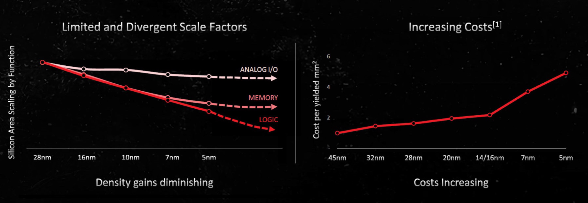
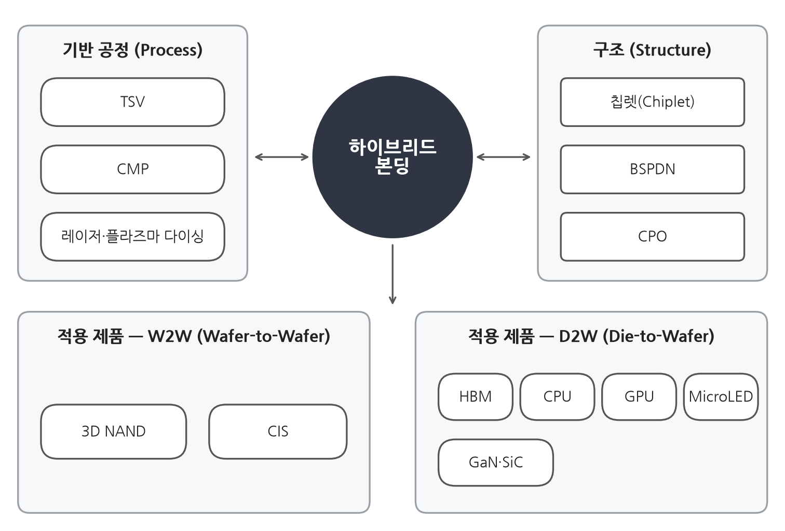
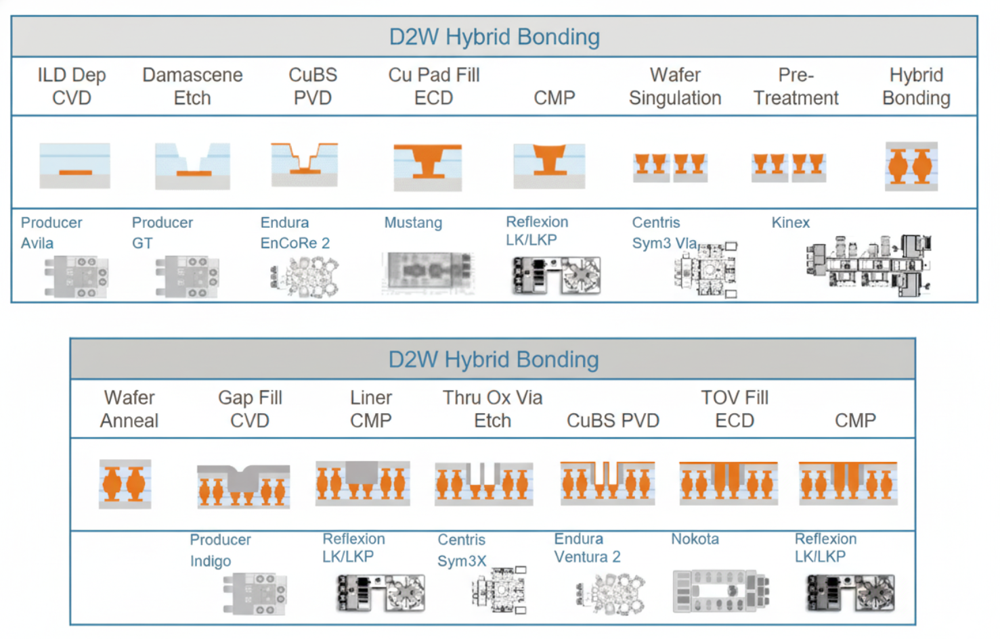
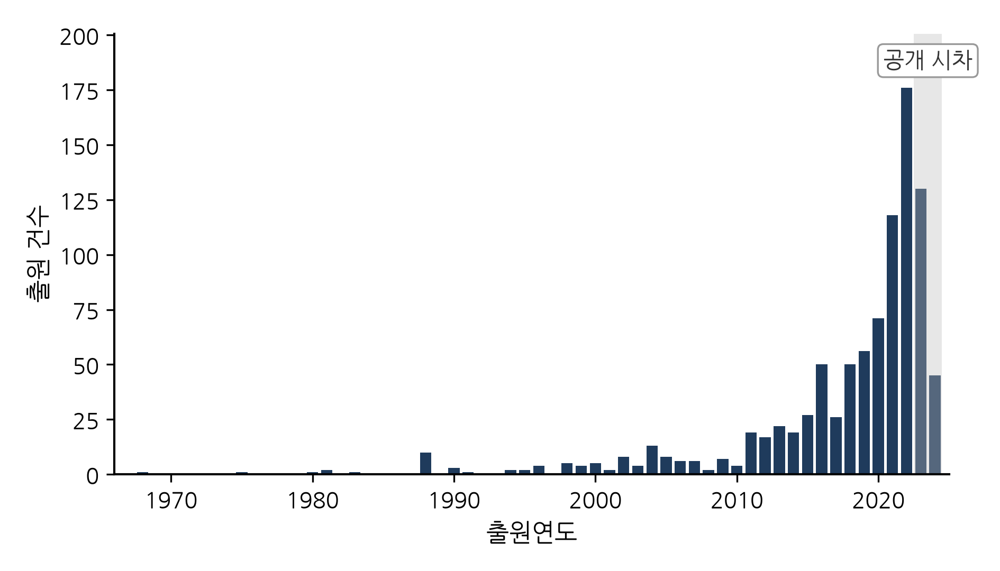
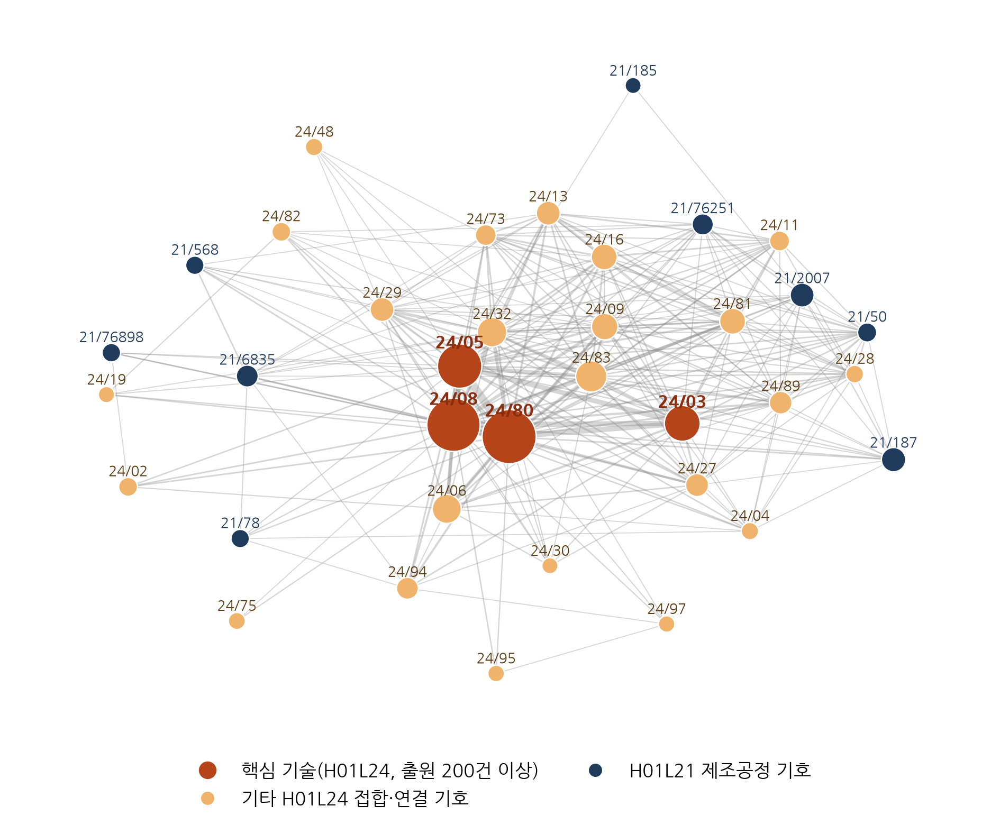
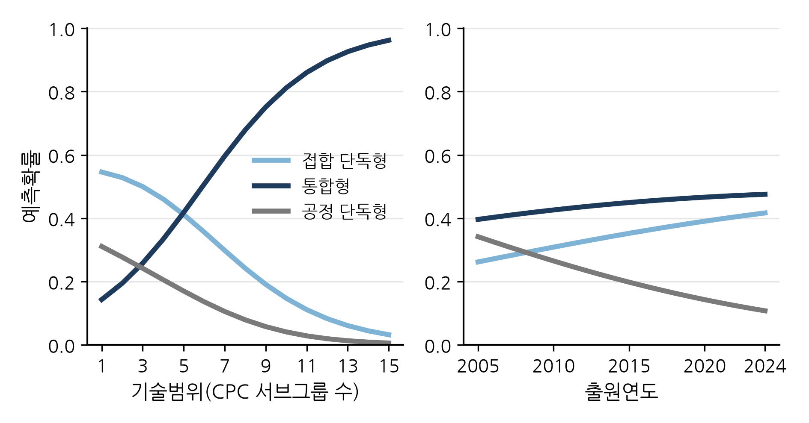
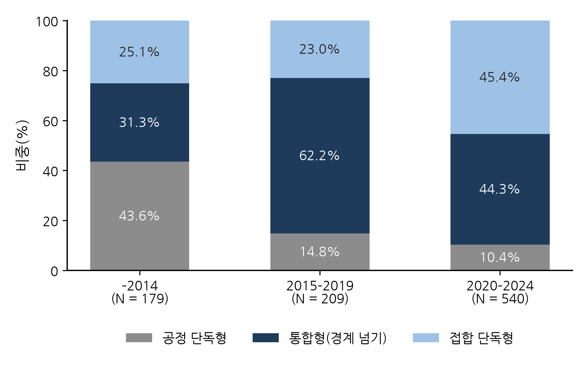

# 반도체 하이브리드 본딩 특허를 통한 공정 단계 간 기술융합의 동태적 분석

**A dynamic analysis of cross-stage technological convergence through semiconductor hybrid bonding patents**

**이형규** (한양대학교 기술경영학과)

HyungKyu Lee (Department of Management of Technology, Hanyang University)

---

## 국문 초록

반도체 제조에서 웨이퍼 위에 소자를 형성하는 전공정과 이를 절단하여 조립하는 후공정은 오랫동안 분리된 영역으로 다루어져 왔다. 그러나 후공정의 접합 기술인 하이브리드 본딩은 표면 평탄화와 표면 처리 등 전공정의 제조공정 역량이 뒷받침되어야 요구 성능을 확보할 수 있다는 점에서, 공정 단계 간 기술융합을 대표하는 사례로 볼 수 있다. 본 연구는 하이브리드 본딩 특허를 대상으로 공정 단계 간 기술융합의 수준과 유형(RQ1), 그 시간적 변화(RQ2), 그리고 융합의 구조적 중심 변화(RQ3)를 분석하였다.

이를 위해 유럽특허청 PATSTAT에서 하이브리드 본딩 관련 특허출원을 추출하고, 각 출원에 부여된 CPC 기호를 바탕으로 접합·인터커넥트 분류만 부여된 접합 단독형, 제조공정 분류만 부여된 공정 단독형, 두 분류가 함께 부여된 통합형으로 유형화하였다. 두 분류의 공동분류를 공정 단계 간 기술융합의 대리지표로 사용하였으며, 다항 로짓과 이항 로짓 분석에 기술 클러스터 및 기술 네트워크 분석을 결합하였다.

분석 결과는 다음과 같다. 첫째, 통합형은 전체 출원 가운데 가장 큰 비중을 차지하였고 패키징 단계 공정을 제외한 좁은 정의에서도 상당한 비중을 유지하여, 공정 단계 간 융합이 예외적 현상이 아님을 확인하였다. 또한 세부 기술을 더 다양하게 포함한 출원일수록 통합형으로 분류될 가능성이 높았다(RQ1). 둘째, 융합의 수준과 형태는 공정 단독형이 우세한 형성기, 통합형이 정점에 이른 확산기, 통합형이 감소하고 접합 단독형이 증가한 재편기의 세 국면을 거쳐 변화하였으며, 이 과정에서 출원의 무게중심은 제조공정에서 접합 쪽으로 이동하였다(RQ2). 셋째, 기술 클러스터와 기술 네트워크 분석으로 식별한 핵심 접합 기술을 포함한 출원은 형성기에는 제조공정 분류를 함께 가질 가능성이 매우 높았으나 그 차이는 점차 줄어들어 재편기에는 유의하지 않았으며, 접합과 결합하는 제조공정의 중심도 웨이퍼 제조공정에서 공정 장치와 패키징 단계 공정으로 이동하였다(RQ3).

이러한 결과는 공정 단계 간 기술융합이 단선적으로 확대되는 과정이 아니라 융합의 내용과 중심이 국면에 따라 재편되는 동태적 과정이며, 그 배경에 핵심 기술 설계의 고착화가 있음을 시사한다.

**주제어:** 기술융합; 공정 단계 간 융합; 하이브리드 본딩; 첨단 패키징; 기술 네트워크; 지배적 설계; 다항 로짓

## Abstract

Front-end wafer fabrication and back-end assembly have long been treated as separate domains of semiconductor manufacturing. Hybrid bonding, although a back-end bonding technology, cannot achieve its required performance without front-end fabrication capabilities such as surface planarisation and surface treatment, which makes it a representative case of convergence between process stages. This study analyses hybrid bonding patents to examine the level and types of cross-stage technological convergence (RQ1), its change over time (RQ2) and the shift in its structural centre (RQ3).

Hybrid-bonding-related patent applications were extracted from EPO PATSTAT and, on the basis of their CPC symbols, classified as bonding-only (bonding and interconnect classification only), process-only (fabrication-process classification only) or integrated (both). Co-classification in the two classifications served as a proxy for cross-stage convergence, and multinomial and binary logit models were combined with technology cluster and network analyses.

The results are as follows. First, integrated applications formed the largest group and retained a substantial share under a narrower definition that excludes packaging-stage processes, showing that cross-stage convergence is not exceptional; applications covering more diverse technical elements were also more likely to be integrated (RQ1). Second, the level and form of convergence changed over three phases—a formation phase dominated by process-only applications, a diffusion phase in which integrated applications peaked, and a reconfiguration phase in which integrated applications declined and bonding-only applications increased—while the centre of gravity of filings moved from fabrication processes towards bonding (RQ2). Third, applications containing the core bonding technologies identified through cluster and network analysis were far more likely to carry fabrication-process symbols in the formation phase, but this difference narrowed over time and was no longer statistically significant in the reconfiguration phase; the centre of the fabrication processes combined with bonding also moved from wafer fabrication to processing apparatus and packaging-stage processes (RQ3).

These findings suggest that cross-stage technological convergence is not a linear expansion but a dynamic process in which its content and centre are reorganised across phases, consistent with the entrenchment of the core design.

**Keywords:** technological convergence; cross-stage convergence; hybrid bonding; advanced packaging; technology network; dominant design; multinomial logit

---

## 1. 서론

반도체 산업의 분업 구조는 반세기 이상 유지되어 왔다. 웨이퍼 위에 트랜지스터를 형성하는 작업은 전공정(front end)이, 완성된 웨이퍼를 절단하여 조립하고 패키징하는 작업은 후공정(back end)이 담당하였다. Kapoor(2013)에 따르면 전공정은 종합반도체기업(IDM)과 파운드리가 운영하는 대규모 팹에 집중된 반면, 패키징과 테스트는 조립·테스트 전문업체(OSAT)로 외주화되었다(Macher and Mowery, 2004; Brown and Linden, 2009). 이러한 분업은 두 단계 사이의 인터페이스가 비교적 안정적으로 관리되었기 때문에 가능하였다. 그러나 첨단 패키징의 등장과 함께 이 인터페이스에도 변화가 나타나고 있다. 한 단계의 성능이 다른 단계의 공정 역량에 보다 직접적으로 의존하게 된 것이다.

이러한 변화의 배경에는 미세화의 한계가 있다. 회로 선폭을 줄이는 미세화는 집적도 향상의 둔화와 비용의 급격한 증가라는 한계에 직면하였다(그림 1). 이에 따라 반도체 산업은 다이를 분할하고 적층하여 연결하는 방식에서 새로운 성능 향상의 기회를 모색하기 시작하였으며(Arden et al., 2010; Khan et al., 2018), 하이브리드 본딩은 그 중심에 있는 기술이다. Lau(2021, 2022)에 따르면 솔더 범프 없이 구리 패드와 주변 산화막을 직접 접합하는 이 기술은 기존 방식으로는 구현하기 어려운 10 µm 이하의 연결 간격을 가능하게 한다. 이 기술의 성패를 좌우하는 나노미터 수준의 표면 평탄화, 표면 활성화, 정밀 정렬은 후공정의 전통적 역량이 아니라 모두 전공정의 제조공정 역량에 해당한다. 선도 파운드리가 첨단 패키징 역량을 내재화하려는 움직임 역시 이와 같은 상호의존의 심화라는 맥락에서 이해할 수 있다(Lau, 2022; KnowMade, 2024).

**그림 1.** 공정 미세화에 따른 기능별 실리콘 면적 축소의 둔화(왼쪽)와 수율을 반영한 면적당 비용의 증가(오른쪽)(출처: Deca Technologies, 2023).

본 연구는 이러한 기술 경계의 융합을 개별 특허 수준에서 확인할 수 있는지, 그리고 그 융합이 시간에 따라 어떠한 양태로 전개되는지에 주목한다. 기술융합 연구는 서로 구분되던 기술 영역이 중첩되고 결합하는 과정을 오랫동안 다루어 왔다(Rosenberg, 1963; Kodama, 1992; Curran and Leker, 2011; Sick and Bröring, 2022). 그러나 정보통신과 가전을 다룬 Hacklin et al.(2009), 식품과 제약을 다룬 Bröring et al.(2006), 나노기술과 바이오기술을 다룬 No와 Park(2010)의 연구에서 볼 수 있듯이, 기존 연구는 주로 서로 다른 산업이나 기술 분야 간의 중첩에 초점을 맞추어 왔다. 반면 한 산업 내에서 가치사슬의 단계를 가로지르는 융합은 충분히 다루어지지 않았으며, 융합을 단계적 과정으로 보는 이론(Hacklin et al., 2010)에 비해 융합의 내용이 시간에 따라 어떻게 변화하는지를 분석한 실증 연구도 부족하다. 가치사슬 상·하류 기업 간의 특허 인용을 분석한 Karvonen과 Kässi(2012)의 연구가 가장 가까운 선례이나, 이 연구 역시 하나의 기술이 공정 단계의 경계를 넘는지를 특허 단위에서 검정하지는 않았다. 공정 단계의 경계를 넘는 발명은 누가 무엇을 생산하고 가치를 어떻게 배분하는지를 규정하는 산업의 틀(Jacobides et al., 2006)을 변화시키는 기술적 출발점이 될 수 있다는 점에서, 이러한 연구 공백을 보완할 필요가 있다.

이를 위해 본 연구는 유럽특허청(EPO) PATSTAT에서 추출한 하이브리드 본딩 관련 특허출원 928건과 각 출원에 부여된 협력적 특허분류(CPC) 기호를 분석한다. 하나의 출원에 접합·인터커넥트 분류(H01L24)의 기호와 제조공정 기술 분류(H01L21)의 기호가 함께 부여되어 있으면 해당 출원을 통합형, 즉 공정 단계의 경계를 넘는 특허로 정의한다. 접합·인터커넥트 기호만 부여된 출원은 접합 단독형, 제조공정 기호만 부여된 출원은 공정 단독형으로 분류한다. 공동분류를 통해 융합을 포착하는 방법 자체는 Curran과 Leker(2011), Kwon et al.(2020) 등이 활용해 온 표준적인 방법이다. 본 연구의 차별점은 이 방법을 두 산업 사이가 아닌 한 산업 내부의 공정 단계 경계에 적용하고, 분야 수준의 지수로 집계하는 대신 개별 특허의 유형으로 재구성한다는 데 있다.

본 논문에서는 다음 세 가지 연구 질문(RQ1–RQ3)에 답함으로써 학술적 기여를 제공하고자 한다. 첫째(RQ1), 하이브리드 본딩 기술에서 제조공정과 접합 기술 간의 융합이 어느 정도로, 어떠한 형태로 나타나는지를 분석하여, 기존 기술융합 연구의 분석 범위를 산업 간 또는 기술 분야 간 융합에서 동일 산업 내 서로 다른 제조공정 단계 간 기술융합으로 확장한다. 이를 통해 기술융합이 산업 경계뿐 아니라 생산공정의 기술적 경계에서도 나타나는 현상임을 실증적으로 보여 준다.

둘째(RQ2), 공정 간 기술융합의 수준과 형태가 시간에 따라 어떻게 변화하는지를 살펴, 기술융합을 정태적인 결합 현상이 아닌 시간에 따라 변화하는 동태적 과정으로 분석한다. 하이브리드 본딩 특허에서 관찰되는 형성, 확산, 재편의 양상을 통해 기술융합이 반드시 지속적으로 확대되는 것은 아니며, 기술발전 과정에서 융합의 유형별 구성이 변화할 수 있음을 보여 준다.

셋째(RQ3), 공정 간 기술융합의 중심이 핵심 기술과 주변 기술 사이에서 어떻게 변화하는지를 살펴, 기술융합의 양적 변화뿐 아니라 융합의 구조적 중심 변화에 주목한다. 핵심 접합 기술과 제조공정 기술 간의 결합 관계가 시기에 따라 달라지는 양상을 분석함으로써, 기술융합의 동태적 전개를 기술 아키텍처의 핵심–주변 관계 및 기술 순환 관점에서 이해할 수 있는 실증적 근거를 제공한다.

논문의 구성은 다음과 같다. 제2절에서는 이론적 배경을 검토하고, 제3절에서는 하이브리드 본딩 기술과 산업을 개관한다. 제4절에서는 자료와 측정 및 분석 방법을 설명하고, 제5절에서는 세 연구 질문에 따른 분석 결과를 제시한다. 제6절에서는 이론적·실무적 함의와 연구의 한계를 논의하며, 제7절에서 결론을 맺는다.

## 2. 이론적 배경

### 2.1 기술융합

특정 영역에서 개발된 기술이 그 경계를 넘어 다른 영역으로 확산된다는 논의는 오랜 연원을 가진다. Rosenberg(1963)는 19세기 공작기계 산업의 출현을 분석하면서, 총기나 재봉틀을 위해 개발된 가공 기술이 다른 제품에도 활용될 수 있음을 기업들이 인식해 가는 과정을 기술적 수렴이라 명명하였다. Kodama(1992)는 분리되어 있던 기술 분야들을 결합하여 어느 한 분야도 단독으로는 갖지 못한 역량을 창출하는 과정을 기술융합으로 개념화하였다. Hacklin et al.(2010)은 융합이 지식의 융합에서 기술과 응용의 융합을 거쳐 산업의 융합으로 단계적으로 진행된다는 단계 모형을 제시하였으며, 이 단계들이 상호 피드백을 통해 공진화적 순환을 이룬다고 보았다(Hacklin et al., 2009). Curran과 Leker(2011)는 이러한 단계를 특허 지표로 관찰하는 방법을 제안하였다. 이후 기술융합 연구는 기술혁신경영 분야의 독립된 연구 흐름으로 자리 잡았으며(Geum et al., 2016; Sick and Bröring, 2022), 융합의 동인에 관한 실증 연구도 축적되기 시작하였다. 예컨대 Caviggioli(2016)는 융합이 발생하기 쉬운 기술 분야의 특성을, Hwang(2020)은 한국 정보통신기업의 자료를 활용하여 협력 유형과 융합의 관계를 분석하였다.

이러한 선행연구는 세 가지 특징을 공유하며, 이는 본 연구의 출발점이 된다. 첫째, 연구의 초점이 서로 다른 산업이나 기술 분야 간의 중첩에 있다. 통신과 컴퓨팅, 식품과 제약, 나노기술과 바이오기술 등 대표적인 사례는 모두 서로 다른 산업의 기업들이 지식 기반의 중첩을 발견하는 경우에 해당한다(Gambardella and Torrisi, 1998; Bröring et al., 2006; No and Park, 2010). 둘째, 융합은 일반적으로 두 분야 사이의 공동분류나 인용을 집계한 분야 수준의 지표로 측정된다(Curran et al., 2010; Cho and Kim, 2014; Song et al., 2017). 이러한 지표는 두 분야가 융합하는지, 그리고 언제 융합하는지를 보여 주지만, 어떠한 발명이 융합을 포함하며 어떠한 특성을 지닌 발명이 그러한지는 설명하지 못한다. 개별 특허 간의 차이가 평균 속에 가려지기 때문이다. 셋째, 융합을 지식에서 기술과 응용을 거쳐 산업으로 나아가는 단계적 과정으로 보는 이론에 비해(Hacklin et al., 2010), 실증 연구는 대체로 융합의 정도가 증가하였는지를 추세로 확인하는 데 그쳤다. 즉, 융합이 진행되면서 어떠한 기술이 결합하는지, 다시 말해 융합의 내용과 중심이 어떻게 변화하는지는 상대적으로 충분히 다루어지지 않았다.

### 2.2 가치사슬 내 공정 단계 간 기술융합

산업과 산업 사이의 경계 외에도, 한 산업 내에는 가치사슬의 단계를 구분하는 또 다른 경계가 존재한다. 반도체 산업은 이 경계가 수직 전문화 연구의 오랜 분석 대상이었다는 점에서 적절한 연구 사례이다. Langlois와 Steinmueller(1999)는 산업 구조가 변화하는 동안 경쟁우위가 기업과 국가 사이에서 어떻게 이동하였는지를 추적하였고, Macher와 Mowery(2004)는 설계와 제조, 제조와 조립이 분리되면서 팹리스, 파운드리, 조립·테스트 전문업체가 등장한 과정을 분석하였다. Brown과 Linden(2009)은 이러한 구조가 여러 차례의 위기를 거치며 재편되어 온 과정을 기술하였다. 한편 Kapoor(2013)에 따르면 전문화가 진행되는 가운데서도 여러 단계에 걸친 역량을 유지한 기업들이 존재하였으며, 이들은 기술 전환에 차별적으로 대응하였고 그 선택이 산업 아키텍처를 형성해 왔다. Kapoor와 Adner(2012)는 DRAM 산업을 대상으로, 부품과 시스템이 상호의존적일 때 기업이 직접 생산하는 범위보다 넓은 지식을 보유할수록 유리하다는 점을 실증하였다.

기술융합 연구와 수직 전문화 연구는 다음과 같은 논리로 연결된다. 산업 아키텍처는 누가 무엇을 수행하고 가치가 어떻게 배분되는지를 규정하는 틀이며(Jacobides et al., 2006), 공정 단계 사이의 인터페이스가 안정적일 때 전문화를 가능하게 한다. 그러나 새로운 기술이 한 단계의 성능을 다른 단계의 지식에 의존하게 만들면 인터페이스는 불안정해지고, 기업은 경계 반대편의 지식을 획득하거나 통합해야 한다. 이때 지식의 결합은 우선 발명 수준에서 나타난다. 즉, 하나의 발명이 두 단계의 기술을 함께 포함하기 시작하는 것이며, 특허의 공동분류는 이러한 지식 경계 확장의 흔적으로 볼 수 있다. 하이브리드 본딩은 바로 한 단계의 성능을 다른 단계의 지식에 의존하게 만드는 기술에 해당한다. 수율이 평탄화, 표면 화학, 정렬과 같이 전공정에 속한 제조공정 역량에 좌우되므로, 제조와 패키징 사이의 인터페이스는 더 이상 안정적이지 않다. 그 결과 두 산업 사이가 아닌 한 산업의 두 단계 사이에서 융합이 발생한다. 이러한 현상은 미세화의 한계에 관한 연구에서 예견되었고(Arden et al., 2010; Iyer, 2016; Khan et al., 2018) 패키징 공학 연구에서 기술적으로 기록되어 왔으나(Lau, 2021, 2022), 이를 발명의 기록에서 관찰하는 방법은 거의 제시되지 않았다.

### 2.3 기술융합의 동태적 전개

앞서 살펴본 공정 단계 간 융합은 고정된 상태가 아니라 시간에 따라 전개되는 과정으로 이해할 필요가 있다. 융합은 한 번에 일어나는 사건이 아니라 여러 단계를 거쳐 진행되는 과정이기 때문이다(Hacklin et al., 2010). 한편 기술 순환 모형(Anderson and Tushman, 1990)에 따르면 새로운 기술은 여러 설계가 경쟁하는 격동기를 거쳐 하나의 지배적 설계로 수렴한다. 두 관점을 결합하면, 공정 단계 간 융합 역시 기술의 발전 단계에 따라 서로 다른 양상을 보일 것으로 예상할 수 있다. 기술이 형성되는 시기에는 직접 접합을 가능하게 하는 공정 발명이 주를 이루고, 기술이 확산되는 시기에는 공정 지식이 접합 발명과 결합하는 사례가 증가할 것이다. 이후 하나의 설계 방식이 지배적 설계로 자리 잡으면 두 기술의 결합은 응용에 필요한 주변 공정으로 이동할 것이다.

이러한 전개는 하이브리드 본딩의 기술 발전 과정에서도 확인된다. 융합의 단계 모형(Hacklin et al., 2010; Jeong et al., 2015)에 따르면 기술이 발전함에 따라 융합의 형태도 변화한다. 하이브리드 본딩의 초기 발명은 표면 준비, 저온 어닐링, 평탄화와 같이 직접 접합을 가능하게 하는 공정 단계에 관한 것이었으며, 따라서 공정 발명으로 분류되는 경우가 많았다. 이후 적용 범위가 이미지센서와 3D NAND의 웨이퍼 단위 접합에서 고대역폭 메모리(HBM)와 로직을 위한 다이 단위 접합으로 확대되면서 발명의 중심은 접합 구조와 적층으로 이동하였다(Lau, 2021). 따라서 최근 출원일수록 제조공정 발명보다 접합 발명의 비중이 커질 것으로 예상할 수 있다.

융합의 변화는 기술을 구성하는 요소 간의 관계에서도 나타날 수 있다. 복합적인 기술은 다른 요소와 밀접하게 연관된 핵심 요소와 그렇지 않은 주변 요소로 구성되며, 핵심 요소의 설계가 변경되면 그와 연관된 다른 요소도 함께 변경되어야 한다(Murmann and Frenken, 2006). 하이브리드 본딩의 핵심은 범프나 솔더 없이 접합 패드끼리 직접 접합하는 연결 방식이다(Lau, 2021). 이러한 핵심 요소를 다루는 발명이 경계 반대편의 지식을 어느 정도 함께 포함하는지는 기술의 발전 단계에 따라 달라질 것이다. 기술 순환 모형에 따르면 새로운 기술이 등장한 직후의 격동기에는 여러 설계가 경쟁하며, 핵심 요소와 다른 요소 사이의 인터페이스가 확정되지 않는다. 그러나 지배적 설계가 자리 잡으면 인터페이스가 고착화되고, 이후의 발명은 정해진 설계를 개선하는 점진적 혁신으로 전환된다(Anderson and Tushman, 1990). 인터페이스가 확정되지 않은 단계에서는 접합 패드의 직접 연결을 발명하기 위해 표면 평탄화와 웨이퍼 접합 같은 제조공정 지식을 함께 다루어야 한다. 반면 인터페이스가 고착화되면 이러한 지식은 주어진 조건으로 전제되며, 핵심 기술의 발명은 접합 영역 안에서 이루어질 수 있다. Brusoni et al.(2001)은 기업이 직접 생산하는 범위보다 넓은 지식을 보유해야 하는 이유를 구성요소 사이의 예측하기 어려운 상호의존에서 찾았다. 같은 논리에서, 상호의존이 예측 가능해질수록 하나의 발명이 경계 반대편의 지식을 함께 포함할 필요성은 감소한다. 하이브리드 본딩은 이미지센서와 3D NAND의 웨이퍼 단위 접합에서 먼저 상용화된 이후 다이 단위 접합으로 적용 범위가 확대되었으므로(Lau, 2021, 2022), 출원 시기가 늦을수록 핵심 기술의 설계가 고착화된 단계에 해당할 가능성이 높다. 따라서 핵심 기술을 포함한 출원은 기술 형성기에는 제조공정 지식을 함께 포함하는 경우가 많지만, 시간이 지날수록 그 차이는 줄어들 것으로 예상할 수 있다. 핵심 기술은 제4.4절의 기술 클러스터와 기술 네트워크 분석을 통해 식별한다.

이상의 논의를 바탕으로 본 연구는 공정 단계 간 융합의 수준과 형태가 시간에 따라 어떻게 변화하는지(RQ2), 그리고 융합의 중심이 핵심 기술과 주변 기술 사이에서 어떻게 이동하는지(RQ3)를 분석한다.

### 2.4 특허 기반 기술융합 측정

이러한 융합의 수준과 형태를 실증적으로 분석하기 위해서는 적절한 측정 방법이 필요하다. 융합 측정에 특허가 가장 널리 활용되는 이유는 분류 기호가 각 발명을 하나 이상의 기술 분야에 배치하기 때문이다(Curran and Leker, 2011). 기존 연구는 대체로 두 분야의 기호가 함께 부여된 특허의 수를 집계하여 분야 수준의 지수로 측정해 왔다(Cho and Kim, 2014; Jeong et al., 2015; Lee et al., 2015; Kwon et al., 2020). 분류 체계가 발명을 사후적으로 반영한다는 한계를 보완하기 위해 특허 텍스트를 활용하는 연구도 있다(Preschitschek et al., 2013; Zhu and Motohashi, 2022).

본 연구는 공동분류를 융합의 신호로 활용한다는 점에서 앞의 첫째 흐름에 속하지만, 분석 단위에서 차이가 있다. 본 연구는 공동분류를 분야 수준으로 집계하는 대신 개별 특허를 세 가지 공동분류 유형, 즉 접합·인터커넥트 기호(H01L24)만 부여된 접합 단독형, 제조공정 기호(H01L21)만 부여된 공정 단독형, 두 기호가 함께 부여된 통합형으로 구분한다. 이 가운데 통합형이 공정 단계의 경계를 넘는 특허에 해당한다. 이러한 구분은 개별 특허 단위로 정의되므로 표준적인 이산선택 모형으로 분석할 수 있으며, 집계 지수에서는 평균화되어 사라지는 특허 간 차이도 보존된다. 다만 다음 점에 유의할 필요가 있다. CPC 기호는 심사관이 발명의 기술 내용에 따라 부여하는 것이므로, 공동분류는 두 영역의 기술이 한 발명에 함께 포함되었다는 사실의 대리측정치이며 법적 청구범위의 측정치는 아니다. 이 점은 제4.2절에서 다시 정리한다.

본 연구의 설명변수 구성과 핵심 기술 식별은 특허 연구의 두 흐름에 근거한다. 첫째는 특허 범위에 관한 연구이다. Lerner(1994)는 특허가 포괄하는 분류의 수로 특허 범위를 측정하고 범위가 경제적 가치를 가진다는 점을 보였으며, 반도체 산업에서는 기술 시장이 세분화되어 있을수록 기업이 넓은 특허 포트폴리오를 구축한다는 점이 알려져 있다(Hall and Ziedonis, 2001; Ziedonis, 2004). 본 연구의 기술범위는 이러한 전통을 따르되, 두 클래스 내의 세부 분류 수로 한정한 측정치이다. 둘째는 기술 네트워크 연구이다. 분류 기호를 노드로, 한 특허에 함께 부여된 기호의 쌍을 연결로 보면 기술 요소 간의 결합 구조를 네트워크로 나타낼 수 있다(Sternitzke et al., 2008). 두 기호가 함께 부여되는 빈도는 두 기술 사이의 지식 관련성을 반영하며(Breschi et al., 2003), 많은 특허가 공통으로 다루면서 서로 강하게 연결된 기호의 집합, 즉 기술 클러스터는 해당 기술의 핵심 요소를 보여 준다. 본 연구는 이 방법으로 하이브리드 본딩의 핵심 기술을 식별하고(제4.4절), 핵심 기술을 포함한 특허가 공정 단계의 경계를 넘는지를 분석한다.

기술범위와 융합의 관계는 기술융합의 개념 자체에서 도출된다. Kodama(1992)의 기술융합과 Rosenberg(1963)의 기술적 수렴은 모두 둘 이상의 기술 영역에 걸친 발명을 전제한다. 이 관점에 따르면 두 클래스 안에서 더 다양한 세부 기술 요소를 포함하는 출원일수록 두 영역의 기호를 함께 부여받을 가능성이 높을 것이다. 다만 이 관계에는 기계적인 측면이 존재한다. 기술범위와 공동분류 유형이 동일한 CPC 집합에서 도출되고, 통합형은 정의상 두 클래스의 기호를 각각 하나 이상 가지므로 범위가 2 이상이기 때문이다. 정의에서 비롯되는 최소 기호 수의 차이는 제5.4절에서 유형 최소치 조정 CPC 범위를 이용하여 탐색적으로 검토한다. 이에 따라 RQ1에서는 공정 단계 간 융합의 수준과 함께 기술적 다양성과 통합형의 관계를 분석한다.

## 3. 연구 맥락: 하이브리드 본딩 기술과 산업

### 3.1 하이브리드 본딩의 기술적 특성

하이브리드 본딩은 유전체 내부에 구리 패드가 형성된 두 평탄한 표면을 맞대어, 상온에서 유전체를 먼저 접합하고 저온 어닐링을 통해 구리 패드를 접합함으로써 영구적인 전기적 연결을 형성하는 기술이다. 솔더 범프를 사용하지 않으므로 연결 간격은 마이크로범프 플립칩으로는 구현하기 어려운 10 µm 이하로 줄어들며, 연구 단계에서는 1 µm 이하에 이른다(Lau, 2021, 2022). 이 기술은 두 가지 형태로 활용된다. 웨이퍼-투-웨이퍼(W2W) 접합은 웨이퍼 전체를 접합하는 방식으로, CMOS 이미지센서와 3D NAND에서 먼저 상용화되었다. 다이-투-웨이퍼(D2W) 접합은 개별 다이를 웨이퍼에 접합하는 방식으로, 칩렛, HBM, 3D 로직의 구현에 필요하다. 그림 2는 하이브리드 본딩을 기반 공정, 접합 형태, 소자 구조, 적용 제품의 네 층위로 정리한 것이다.

**그림 2.** 하이브리드 본딩의 기반 공정, 접합 형태, 소자 구조, 적용 제품(저자 작성; Lau(2021, 2022)의 기술 설명을 바탕으로 재구성).

### 3.2 제조공정과 접합 기술의 상호의존성

이러한 기술적 특성은 제조공정과 접합 기술 사이의 밀접한 상호의존으로 이어진다. W2W와 D2W 두 형태 모두에서 수율을 좌우하는 단계, 즉 나노미터 이하의 거칠기로 표면을 연마하는 화학적 기계연마(CMP), 플라즈마 표면 활성화, 파티클 제어, 정밀 정렬은 CPC 분류상 반도체 제조공정 클래스(H01L21)에 속한다(제4.1절, 표 1). 그림 2의 기반 공정은 주로 제조공정 클래스(H01L21)와, 접합 형태 및 인터커넥트 구성은 주로 접합·인터커넥트 클래스(H01L24)와 대응한다. 그림 3은 D2W 하이브리드 본딩의 공정 흐름을 보여 준다. 다이를 절단하여 접합하기 전까지 층간 절연막 증착, 다마신 식각, 구리 배리어·시드 증착, 구리 도금, 화학적 기계연마가 순차적으로 이루어지며, 이는 모두 전공정에서 사용되던 공정과 장비이다.

**그림 3.** 다이-투-웨이퍼(D2W) 하이브리드 본딩의 공정 흐름과 단계별 장비(출처: Applied Materials, 2025).

산업 지형 또한 이와 같은 방향을 보여 준다. 하이브리드 본딩 특허에 관한 독립적 산업 분석은 TSMC, Adeia, YMTC, Intel, Samsung을 특허 활동을 주도하는 출원인으로 제시한다(KnowMade, 2024). 원천기술을 보유한 라이선싱 기업, 첨단 패키징을 직접 운영하는 파운드리, 메모리 제조사가 함께 특허 활동을 주도하고 있다는 사실은 접합 기술이 더 이상 후공정 전문기업만의 영역이 아님을 보여 준다.

## 4. 자료와 방법

### 4.1 자료 수집

본 연구의 자료는 유럽특허청의 PATSTAT Global 2025년판에서 추출하였다(European Patent Office, 2025). 먼저 CPC 분류 H01L21(반도체 제조공정) 또는 H01L24(반도체 접합·인터커넥트 기술) 계열의 기호를 하나 이상 보유한 출원을 후보로 검색한 후, 제목에 하이브리드 본딩 관련 키워드(*hybrid bonding*, *direct bonding*, *Cu–Cu*, *copper to copper*, *metal-oxide bond*) 가운데 하나 이상이 포함된 출원만을 선별하였다(표 1). 그 결과 출원–CPC 쌍 5,277건, 출원 단위로는 1968–2024년에 출원된 928건이 표본으로 구성되었다. 따라서 본 연구의 표본은 하이브리드 본딩 특허 전체가 아니라 이 검색식으로 식별된 관련 출원이며, 제목에 관련어가 포함되지 않은 출원은 표본에 포함되지 않는다. 또한 이 광의의 표본은 현대의 하이브리드 본딩뿐 아니라 그 기술적 기반이 된 초기 직접 접합(direct bonding) 전구 기술까지 함께 포착하도록 설계되었다. 추출 단계에서 두 클래스 이외의 기호는 보존되지 않았으므로, 회귀분석 자료의 기호는 모두 H01L21 계열(202개)과 H01L24 계열(60개)의 서브그룹 기호(사선 뒤의 세부 번호까지 포함한 전체 기호, 예: H01L 21/603) 262개로 구성된다. 다만 제4.4절의 기술 클러스터와 기술 네트워크 표는 동일한 928건에 부여된 전체 CPC 기호(접합의 인덱싱 코드 H01L2224와 소자 조립체 클래스 H01L25 포함)를 저자가 별도로 집계한 결과이며, 회귀분석에는 사용하지 않는다. 본 연구의 분석 단위는 PATSTAT의 개별 특허출원이며, 동일한 발명이 여러 출원청에 제출된 경우 각 출원을 별도의 관측치로 포함한다.

**표 1.** 하이브리드 본딩 관련 특허의 검색 전략.

| 단계 | 조건 | 내용 |
|------------------|-----------|--------------------------------------------|
| 1차: CPC | H01L21 | 반도체 제조공정 기술. 웨이퍼 직접 접합(21/18, 21/20), 소자 분리·배선·TSV(21/76), 기판·절연층 처리(21/02), 화학적 기계연마(21/30–21/32) 등. 패키징 단계의 제조공정(21/48, 21/50–21/58, 21/60, 21/78)과 공정 장치(21/67–21/68)도 포함 |
| 1차: CPC | H01L24 | 반도체 또는 고체소자의 연결·분리를 위한 커넥터 구조, 범프·레이어·와이어 연결, 관련 연결 방법 및 장치 등 |
| 2차: 키워드 | 제목 | *hybrid bonding*, *direct bonding*, *Cu–Cu*, *copper to copper*, *metal-oxide bond* 가운데 하나 이상 |

*주:* 1차 조건은 두 클래스 가운데 하나 이상, 2차 조건은 키워드 가운데 하나 이상이며, 두 조건을 모두 만족해야 한다. 검색에는 두 클래스의 인덱싱 코드(예: H01L2224)도 사용하였으나, 추출된 레코드에는 본 클래스의 기호만 보존되었으므로 인덱싱 코드는 기술범위 계산에 포함되지 않는다.

이와 같이 구축한 자료에 대해서는 분석에 앞서 세 가지 특성을 밝혀 둘 필요가 있다. 첫째, *hybrid bonding*은 비교적 정밀한 검색어인 반면 *direct bonding*은 의미의 범위가 넓다. 제목에 *hybrid bonding*이 포함된 출원은 467건이며, 이 표본(이하 *hybrid bonding* 표본)으로 재추정한 결과를 제5.4절에 보고한다. 둘째, 키워드 필터만으로는 검색어의 무관한 용법을 걸러낼 수 없다. 이러한 출원의 대부분은 세라믹 기판에 구리를 접합하는 DBC 기판, 구리 합금, 전력 모듈과 같이 *direct bonding*이 다른 의미로 사용된 경우이며, 화학 결합이나 전력 모듈용 접합 시트를 의미하는 *hybrid bonding*도 일부 포함되어 있다. 제목으로 식별한 이러한 출원은 68건(*direct bonding* 63건, *hybrid bonding* 5건)이며, 이를 제외한 재추정 결과 역시 제5.4절에 보고한다(판정 기준과 분포는 부록 B). 셋째, 원자료에는 공식 특허 패밀리 식별자가 없어 패밀리 단위의 중복을 직접 제거할 수 없으며, 따라서 동일한 발명이 여러 국가에 출원되면 여러 건으로 집계된다. 이에 대한 민감도 분석으로, 동일한 제목을 가진 출원을 하나의 중복군으로 간주하고 각 제목군에서 가장 이른 출원 1건만을 남긴 결과를 제5.4절에 보고한다. 928건은 473개의 고유 제목으로 구성되며, 이 중 149개 제목은 둘 이상의 출원청에 출원되었다.

### 4.2 조작적 정의와 측정

앞 절에서 구축한 자료로 공정 단계 간 기술융합을 측정하기 위해서는 먼저 이론적 개념, 관찰 현상, 조작적 지표를 구분할 필요가 있다(표 2). 본 연구에서 이론적 개념은 공정 단계 간 기술융합이고, 관찰 현상은 제조공정 기술과 접합·인터커넥트 기술이 하나의 출원에 함께 포함되는 것이며, 조작적 지표는 H01L21과 H01L24의 공동분류이다. 이때 H01L21을 전공정 그 자체로, H01L24를 후공정 그 자체로 간주하지는 않는다. H01L21에는 웨이퍼 제조공정 외에도 패키지 부품 제조, 실장·봉지, 리드 부착, 다이싱과 같은 패키징 단계의 제조공정과 공정 장치가 함께 포함되어 있으며, H01L24 역시 조직적 의미의 후공정 산업 경계와 일치하지는 않기 때문이다. 그럼에도 두 클래스의 공동분류를 대리측정치로 사용할 수 있는 근거는, 하이브리드 본딩의 성능을 좌우하는 웨이퍼 준비, 표면 처리, 평탄화 및 관련 제조공정이 H01L21에 다수 포함되어 있고 접합·인터커넥트 기술은 H01L24에 집중되어 있다는 데 있다. 표본에 포함된 H01L21 계열 기호 1,636건은 웨이퍼 제조공정 905건(55.3%), 공정 장치 328건(20.0%), 패키징 단계 공정 403건(24.6%)으로 구성된다. 패키징 단계 공정을 제조공정에서 제외한 좁은 정의로 재추정한 결과는 제5.4절에 제시하였으며, 이 경우에도 회귀분석의 결론은 달라지지 않았다.

**표 2.** 개념 수준별 정의와 본 연구에서의 위치.

| 수준 | 개념 | 본 연구에서의 위치 |
|------------|-----------------------|-------------------------------------|
| 기술 시스템 | 공정 단계 간 기술융합 | 핵심 이론적 현상 |
| 발명 | 경계를 넘는 발명 | 분석 대상 |
| 측정 | H01L21–H01L24 공동분류 | 조작적 지표(대리측정치) |
| 특허 특성 | 두 클래스 안의 CPC 서브그룹 수 | 기술적 다양성(클래스 내 기술범위) |
| 기술 구조 | 핵심 기술(출원 200건 이상에 부여된 H01L24 기호) | 기술 클러스터·네트워크로 식별(제4.4절) |

한편 CPC 기호는 심사관이 발명의 기술 내용에 따라 부여하는 것으로, 청구항의 문구와 항상 일치하지는 않는다. 따라서 이하에서 어떤 출원이 특정 기술을 ‘포함한다’ 또는 특정 기술로 ‘분류된다’는 표현은 해당 클래스의 기호가 그 출원에 부여되어 있음을 의미하며, 법적 청구범위에 관한 진술이 아니다.

### 4.3 분석변수의 정의

이상의 조작적 정의에 따라 분석에 사용하는 변수를 표 3과 같이 정의하였다. 기술범위(breadth)는 출원에 부여된 H01L21·H01L24 계열의 서로 다른 서브그룹 기호의 수이다. 이는 분류 기호의 수로 특허의 범위를 측정하는 Lerner(1994)의 방식을 두 클래스 내부에 적용한 것으로, 두 클래스 안에서 출원에 부여된 세부 기술의 다양성을 의미하며, 반도체 이외의 분야로 확장되는 정도나 법적 청구범위를 측정하지는 않는다. 다만 공동분류 유형과 기술범위는 동일한 CPC 정보로부터 산출되므로, 통합형은 정의상 H01L21과 H01L24 기호를 각각 하나 이상 보유하여 최소 breadth가 2인 반면 단독형의 최소 breadth는 1이다. 이러한 기계적 최소치의 차이를 완화하기 위해 출원이 보유한 클래스마다 최소 1개의 기호를 차감한 유형 최소치 조정 CPC 범위(breadth_adj = breadth − I\[H01L21 보유\] − I\[H01L24 보유\])를 별도로 구성하였다. 예컨대 H01L21 기호 2개와 H01L24 기호 1개를 가진 통합형 출원은 breadth 3, breadth_adj 1이며, H01L24 기호 4개만을 가진 접합 단독형 출원은 breadth 4, breadth_adj 3이다. breadth_adj는 유형을 성립시키는 최소한의 분류 정보를 제외하고 남는 추가적인 CPC 다양성으로, 종속변수의 유형 정보를 반영하므로 탐색적 강건성 지표로만 사용한다. 공동분류 유형(tech_cat)은 각 출원을 접합 단독형(H01L24 기호만 보유), 통합형(두 클래스 모두 보유), 공정 단독형(H01L21 기호만 보유)으로 구분하며, 두 클래스의 기호가 함께 부여된 통합형이 경계 넘기의 측정치이다. 제조공정 분류 여부(has_process)는 H01L21 기호를 하나라도 보유하면 1인 지표로, 통합형과 공정 단독형을 합한 것이다. 출원연도(yc)는 표본의 첫 출원 연도인 1968년으로부터 경과한 햇수이며, 출원 시기(period)는 출원이 드문 1968–2014년을 하나의 시기로 묶고 이후를 2015–2019년과 2020–2024년으로 구분한 세 범주이다. 핵심 기술 보유(core)는 제4.4절에서 식별한 핵심 접합 기호 네 개(24/03, 24/05, 24/08, 24/80) 가운데 하나 이상을 보유하면 1이다. 출원청(ccode)은 출원이 제출된 특허청 또는 출원 경로로, 8개 수준으로 구성된다. 출원청마다 출원 시기와 기술 구성이 상이하므로 모든 모형에 통제변수로 포함하되, 출원청 간 차이는 본 연구의 분석 대상이 아니므로 그 계수는 해석하지 않는다.

**표 3.** 변수 정의.

| 변수 | 정의 | 유형 | 해석상 주의 |
|------------|-------------------------|-------------|-----------------------|
| breadth | 출원별로 부여된 H01L21·H01L24 계열의 서로 다른 CPC 서브그룹 수(클래스 내 CPC 범위) | 카운트, 1–21 | 전체 CPC 범위나 법적 청구범위가 아니라 두 클래스 내부의 기술적 다양성 |
| breadth_adj | 유형 최소치 조정 CPC 범위: 출원이 보유한 클래스마다 최소 1개 기호를 차감하고 남은 추가 CPC 서브그룹 수(단독형은 breadth − 1, 통합형은 breadth − 2; 제5.4절) | 카운트, 0–19 | 유형별 최소 CPC 수의 기계적 차이를 완화하는 탐색적 지표. 유형 정보를 이용하므로 독립적인 범위 측정치는 아님 |
| tech_cat | 공동분류 유형: 접합 단독형(H01L24만) / 통합형(둘 다) / 공정 단독형(H01L21만) | 범주, 3 | 분류의 조합 |
| has_process | H01L21 기호를 하나라도 가지면 1(제조공정 분류), 아니면 0 | 이항 | 전공정 자체가 아닌 제조공정 관련 분류 |
| yc | 출원연도(1968년 = 0부터 지난 햇수); 표본 평균 49.7(2017.7년) | 정수, 0–56 | 기술 성숙의 직접 측정치가 아님 |
| period | 출원 시기: 1968–2014년(기준), 2015–2019년, 2020–2024년 | 범주, 3 | 첫 시기가 이후 두 시기보다 김 |
| core | 핵심 접합 기호(24/03, 24/05, 24/08, 24/80) 가운데 하나 이상을 가지면 1, 아니면 0 | 이항 | H01L24 기호를 가진 출원(N = 763)에서만 정의 |
| ccode | 출원청 또는 출원 경로: US(기준), CN, KR, TW, JP, EP, WO(PCT), 기타 | 범주, 8 | 통제변수(해석하지 않음) |

주요 변수의 기술통계는 다음과 같다. 기술범위는 평균 5.69개(표준편차 4.07, 범위 1–21)이며, 유형별로는 통합형 7.89개, 접합 단독형 4.16개, 공정 단독형 3.15개로 차이를 보인다. 출원청별로는 미국 382건, 중국 175건, PCT 경로 113건, EPO 83건, 대만 75건, 한국 58건, 일본 26건, 기타 16건이다. 그림 4는 연도별 출원 건수를 나타낸 것으로, 출원은 2010년 이전에는 드물었으나 2010년대 후반에 급증하여 2022년경 정점에 이르렀다. 유형별로는 통합형 425건(45.8%), 접합 단독형 338건(36.4%), 공정 단독형 165건(17.8%)이며, 제조공정 기호를 보유한 출원은 590건(63.6%)이다.

**그림 4.** 출원연도별 하이브리드 본딩 관련 출원 건수, 1968–2024(N = 928). 2023–2024년의 감소에는 출원 후 공개까지의 시차가 영향을 미쳤을 가능성이 크다.

### 4.4 핵심 기술의 식별: 기술 클러스터와 기술 네트워크

앞서 정의한 변수 가운데 핵심 기술 보유(core)를 측정하고 RQ3을 분석하기 위해서는 하이브리드 본딩의 핵심 기술을 먼저 규정할 필요가 있다. 이에 본 절에서는 두 가지 방법으로 핵심 기술을 식별한다. 기술 클러스터는 다수의 출원이 공통으로 포함하는 기호, 즉 이 기술의 필수 요소를 찾는 방법이며, 기술 네트워크는 한 출원에 함께 부여된 기호의 쌍을 연결로 간주하여 요소들이 결합하는 방식을 파악하는 방법이다(Breschi et al., 2003; Sternitzke et al., 2008).

**기술 클러스터.** 표 4는 928건에 부여된 전체 CPC 기호 가운데 200건 이상의 출원에 공통으로 부여된 11개 기호를 정리한 것으로, 각 기호의 설명은 CPC 공식 정의를 요약하였다. 가장 많은 출원에 부여된 기호는 접합 패드(bonding area)를 이용한 연결 방법(24/80, 529건, 57.0%)과 연결 후 접합 패드의 구조(24/08, 513건, 55.3%)이며, 그다음은 도전성 표면끼리의 직접 접합(2224/80895, 504건)과 절연성 표면끼리의 직접 접합(2224/80896, 488건)이다. 이 기호들을 연결하면 분류 체계 안에서 하이브리드 본딩의 정의가 그대로 드러난다. **하이브리드 본딩은 구리를 주성분으로 한 접합 패드(2224/05647)를 표면과 같은 높이로 형성하고(2224/80357), 금속(2224/80895)과 절연막(2224/80896)을 함께 직접 접합하여(24/08, 24/80), 범프 없이 칩을 수직으로 적층하는(2224/08145, 25/0657) 기술이다.** 이 가운데 하이브리드 본딩을 다른 접합 방식과 구별하는 특징은 금속–금속 직접 접합과 절연막–절연막 직접 접합이 한 출원에 함께 부여되는 조합이다.

**표 4.** 기술 클러스터: 출원 200건 이상에 부여된 CPC 기호(N = 928; 비중은 928건 대비).

| 순위 | CPC 기호 | 공식 정의(요약) | 출원 수 | 비중(%) | 회귀 자료 |
|-----:|------------------|-------------------------------|-----:|------:|:-----:|
| 1 | H01L 24/80 | 접합 패드를 이용한 연결 방법 | 529 | 57.0 | ○ |
| 2 | H01L 24/08 | 연결 후 개별 접합 패드의 구조·형상·재료·배치 | 513 | 55.3 | ○ |
| 3 | H01L 2224/80895 | 도전성 표면끼리의 직접 접합(예: 구리–구리) | 504 | 54.3 | — |
| 4 | H01L 2224/80896 | 절연성 표면끼리의 직접 접합(예: 산화막·질화막) | 488 | 52.6 | — |
| 5 | H01L 2224/08145 | 접합 패드끼리 직접 연결된(범프 없는) 적층 칩 사이의 접합 | 436 | 47.0 | — |
| 6 | H01L 25/50 | 소자 조립체의 다단계 제조 공정 | 363 | 39.1 | — |
| 7 | H01L 24/05 | 연결 전 개별 접합 패드의 구조·형상·재료·배치 | 350 | 37.7 | ○ |
| 8 | H01L 25/0657 | 소자의 적층 배치 | 274 | 29.5 | — |
| 9 | H01L 2224/05647 | 구리를 주성분으로 하는 접합 패드 | 239 | 25.8 | — |
| 10 | H01L 24/03 | 접합 패드의 제조 방법 | 222 | 23.9 | ○ |
| 11 | H01L 2224/80357 | 표면과 같은 높이의 접합 계면 | 205 | 22.1 | — |

*주:* 회귀 자료 열의 ○는 회귀분석에 사용하는 H01L21·H01L24 기호 레코드에 포함된 기호이며, 이 네 기호의 출원 수는 회귀 자료에서 다시 집계한 값과 같다. —는 인덱싱 코드(H01L2224)와 소자 조립체 클래스(H01L25)로, 같은 출원의 전체 CPC 기호를 별도로 집계한 값이다.

**기술 네트워크.** 기술 클러스터가 개별 기호의 빈도를 보여 준다면, 기술 네트워크는 기호 간의 결합 관계를 보여 준다. 기술 네트워크는 CPC 기호를 노드로, 한 출원에 함께 부여된 서로 다른 두 기호를 무방향 연결로 구성하며, 연결의 가중치는 두 기호가 함께 부여된 출원 수이다. 표 5는 가중치가 가장 큰 상위 10개 쌍을 제시한 것이다. 가장 강한 연결은 도전성 표면의 직접 접합과 절연성 표면의 직접 접합의 쌍(460건)으로, 금속과 절연막을 동시에 접합하는 하이브리드 본딩의 원리가 연결 강도에 그대로 반영되어 있다. 나머지 아홉 쌍 역시 모두 24/08, 24/80, 2224/80895, 2224/80896, 2224/08145의 다섯 기호 가운데 두 기호의 조합이다. 즉, 하이브리드 본딩의 핵심 기술은 서로 밀접하게 연결된 소수의 접합 기호에 집중되어 있다.

**표 5.** 기술 네트워크: 함께 부여된 출원이 가장 많은 기호 쌍(N = 928; 상위 10쌍).

| 순위 | 기호 쌍 | 내용 | 출원 수 |
|------:|------------------------------------|----------------------|------:|
| 1 | 2224/80895 – 2224/80896 | 도전성 표면 직접 접합 – 절연성 표면 직접 접합 | 460 |
| 2 | 24/08 – 24/80 | 연결 후 접합 패드 – 접합 패드를 이용한 연결 방법 | 439 |
| 3 | 24/80 – 2224/80895 | 접합 패드를 이용한 연결 방법 – 도전성 표면 직접 접합 | 434 |
| 4 | 24/08 – 2224/80895 | 연결 후 접합 패드 – 도전성 표면 직접 접합 | 420 |
| 5 | 24/80 – 2224/80896 | 접합 패드를 이용한 연결 방법 – 절연성 표면 직접 접합 | 418 |
| 6 | 24/08 – 2224/80896 | 연결 후 접합 패드 – 절연성 표면 직접 접합 | 395 |
| 7 | 24/08 – 2224/08145 | 연결 후 접합 패드 – 범프 없는 적층 칩 접합 | 392 |
| 8 | 24/80 – 2224/08145 | 접합 패드를 이용한 연결 방법 – 범프 없는 적층 칩 접합 | 392 |
| 9 | 2224/08145 – 2224/80895 | 범프 없는 적층 칩 접합 – 도전성 표면 직접 접합 | 379 |
| 10 | 2224/08145 – 2224/80896 | 범프 없는 적층 칩 접합 – 절연성 표면 직접 접합 | 368 |

*주:* 기호 앞의 H01L은 생략하였다. 2위 쌍(24/08 – 24/80)의 출원 수는 회귀 자료에서 다시 집계한 값과 같다.

**회귀 자료에서의 핵심 기술.** 인덱싱 코드는 회귀 자료에 포함되어 있지 않으므로, 분석에 사용하는 핵심 기술은 회귀 자료의 H01L24(접합·인터커넥트 분류) 기호 가운데에서 선정한다. 그림 5는 회귀 자료에서 출원 30건 이상에 부여된 기호의 네트워크를 나타낸 것이다. 표 4에서 출원 200건 이상에 부여된 H01L24 기호 네 개(24/80, 24/08, 24/05, 24/03)는 이 네트워크에서도 연결 강도(함께 부여된 출원 수의 합)가 가장 큰 네 기호이며(3,235, 3,140, 2,518, 1,778), 이 네 기호가 이루는 여섯 쌍(186–439건)이 전체 네트워크에서 가장 강한 여섯 연결이다. 연결 강도와 연결의 순위는 그림의 표시 기준과 관계없이 회귀 자료의 모든 기호와 연결을 대상으로 계산하였다. 출원 수 기준으로 다섯째인 층 형태 커넥터를 이용한 연결(24/83)은 164건으로 200건 기준에 미치지 못한다. CPC 체계에서 이 네 기호는 모두 접합 패드에 관한 그룹에 속한다. 24/03과 24/05는 접합 패드의 제조와 연결 전 구조이며, 24/08과 24/80은 범프·층·와이어와 같은 별도의 커넥터 없이 접합 패드끼리 연결한 후의 구조와 그 연결 방법이다. 연결 방법의 상위 그룹(24/80)에서는 범프(24/81), 층(24/83), 와이어(24/85) 커넥터를 사용하는 방법이 하위 그룹으로 별도 분류된다. 이에 본 연구는 이 네 기호를 하이브리드 본딩의 핵심 기술로 정의한다.

**그림 5.** 회귀 자료의 기술 네트워크(H01L21·H01L24 기호 가운데 출원 30건 이상에 부여된 기호; 원의 크기는 출원 수, 선의 굵기는 함께 부여된 출원 수이며 10건 이상인 연결만 표시; 기호 앞의 H01L은 생략).

H01L24 기호를 보유한 출원(이하 접합 출원) 763건 가운데 620건(81.3%)이 핵심 기술을 포함하고 있어, 이와 같이 식별한 핵심 기술이 접합 출원의 대부분에 걸쳐 있음을 알 수 있다.

### 4.5 분석 방법

이상의 변수와 핵심 기술을 바탕으로, 본 연구는 종속변수의 측정 척도와 각 연구 질문의 분석 내용에 따라 세 가지 모형을 사용한다(표 6). 분석 단위는 출원 식별자별로 집계된 특허출원이며, 모든 모형에 출원청 더미를 통제변수로 포함한다. 제조공정 분류 보유 모형과 공동분류 유형 모형(928건)의 설명변수는 기술범위(breadth)와 출원연도(yc)이며, 핵심 기술 모형(763건)의 설명변수는 핵심 기술 보유(core), 출원 시기(period) 및 두 변수의 상호작용이다.

**표 6.** 세 가지 회귀모형의 역할.

| 분석 질문 | 종속변수 | 척도 | 주모형 | 보고 지표 | 연구 질문 |
|--------------|--------------|------------|-------------|-------------|--------|
| 출원이 제조공정 분류를 하나 이상 포함하는가 | has_process | 이항, 0/1 | 이항 로짓 | 승산비(OR) | RQ1·RQ2 보완분석 |
| 출원이 세 공동분류 유형 가운데 어디에 속하는가 | tech_cat | 순서 없는 3범주 | 다항 로짓(기준 = 접합 단독형) | 상대위험비(RRR) | RQ1, RQ2 |
| 접합 기호를 가진 출원이 제조공정 기호도 함께 가지는가 | 통합형 여부(H01L24 보유 출원) | 이항, 0/1 | 이항 로짓(핵심 기술 × 출원 시기) | 시기별 승산비(OR) | RQ3 |

**제조공정 분류 보유 모형: 이항 로짓.** has_process는 H01L21(제조공정 분류) 계열 기호를 하나 이상 보유하면 1, 그렇지 않으면 0이다. 통합형 425건과 공정 단독형 165건이 1에, 접합 단독형 338건이 0에 해당한다. 종속변수가 두 상태만을 가지므로 확률을 0과 1 사이로 제한하는 이항 로짓(log\[P/(1 − P)\] = β₀ + β₁·breadth + β₂·yc + Σγ_k·ccode_k)으로 추정하고, 결과는 승산비(OR)로 보고한다. OR은 확률이 아니라 승산(오즈)의 배율이다. 예컨대 OR이 1.5라는 것은 제조공정 분류를 가질 승산이 1.5배라는 의미이며, 확률이 50% 높다는 의미로 해석해서는 안 된다. 이 모형은 통합형과 공정 단독형을 제조공정 분류 보유 출원으로 묶어 어떠한 특성의 출원에서 제조공정 분류가 전반적으로 관찰되는지를 확인하는 보완분석이며, 주분석은 아니다.

**공동분류 유형 모형: 다항 로짓.** tech_cat의 세 범주는 크기의 순서가 아니라 서로 다른 CPC 구성 방식을 나타내므로, 순서형 로짓이 아닌 다항 로짓(McFadden, 1974)을 사용한다. 접합 단독형을 기준 범주로 설정하면, 접합 기호만 보유한 출원과 비교하여 제조공정 분류가 함께 나타나는 통합형과 접합 분류 없이 제조공정만 나타나는 공정 단독형을 각각 비교할 수 있다. 결과는 통합형 대 접합 단독형, 공정 단독형 대 접합 단독형의 상대위험비(RRR)로 보고한다. RRR이 1.4라는 것은 설명변수가 1단위 증가할 때 해당 유형 대 접합 단독형의 상대위험이 1.4배가 된다는 의미이며, 해당 유형의 절대확률이 같은 비율로 변화한다는 의미는 아니다. 이 모형은 RQ1(기술범위와 통합형)과 RQ2(출원연도와 공정 단독형)의 주모형이다.

**기술범위를 로짓 모형에 포함할 때의 해석상 제약.** 기술범위와 공동분류 유형은 동일한 H01L21·H01L24 CPC 정보로부터 산출된다. 통합형은 두 클래스의 기호를 각각 하나 이상 보유해야 하므로 최소 breadth가 2인 반면, 단독형은 1이다. 이 최소치 차이에 대한 민감도는 제4.3절의 유형 최소치 조정 CPC 범위(breadth_adj)로 확인하되, 이 지표 역시 유형 정보를 이용하므로 탐색적 강건성 분석에 한정하여 사용한다.

**핵심 기술 모형: 이항 로짓(RQ3).** 핵심 기술은 접합 기호이므로 공정 단독형 출원은 정의상 핵심 기술을 보유할 수 없다. 따라서 RQ3은 H01L24 기호를 보유한 출원 763건(통합형 425건, 접합 단독형 338건)을 대상으로 통합형 여부를 종속변수로 하는 이항 로짓으로 분석한다. 이 모형은 접합 기호를 보유한 출원 가운데 어떠한 출원이 제조공정 기호도 함께 보유하는지를 분석하며, 부록 A의 대안 제외 민감도 분석과 동일한 표본을 사용한다. 모형은 log\[P/(1 − P)\] = β₀ + β₁·core + Σδ_t·period_t + Σθ_t·(core × period_t) + Σγ_k·ccode_k이다. 2014년 이전 출원에서 핵심 기술의 승산비는 exp(β₁)이고, 2015–2019년과 2020–2024년에는 exp(β₁ + θ_t)이며, exp(θ_t)는 각 시기의 승산비가 2014년 이전의 몇 배인지를 나타낸다. 핵심 기술을 포함한 출원의 통합형 우위가 최근으로 올수록 감소하였다면, 2014년 이전의 승산비는 1보다 크고 θ_t는 0보다 작게 나타날 것이다. 시기별 승산비의 95% 신뢰구간은 두 계수 합의 표준오차로 계산하며, 표준오차는 이분산에 강건한 방식으로 추정한다. 출원연도를 선형으로 투입하지 않고 세 시기로 구분한 것은 기술 순환의 단계를 근사하기 위함이다. 핵심 기호를 제외한 접합 기호 수를 통제한 결과는 제5.4절에 제시한다.

**융합의 보조 지표.** RQ3에서 분석하는 융합의 이동을 개별 기호보다 넓은 수준에서 확인하기 위해 두 가지 지표를 시기별로 산출한다. 첫째, 제4.2절의 세 제조공정 영역(웨이퍼 제조공정, 공정 장치, 패키징 단계 공정)이 각각 접합 기호(H01L24)와 한 출원에 함께 부여되는 정도, 즉 결합 강도를 Jaccard 계수로 측정한다(Jaccard, 1912). Jaccard 계수는 두 영역의 기호를 함께 보유한 출원 수를 둘 가운데 하나라도 보유한 출원 수로 나눈 값으로, 단순한 공출현 빈도와 달리 영역별 출원 규모의 차이를 보정한다. 둘째, 제4.4절의 회귀 자료 네트워크와 같은 방식으로 시기별 기술 네트워크를 구성하여, 연결 강도가 큰 기호를 다른 기호와 가장 빈번하게 함께 부여되는 허브로, 매개 중심성(betweenness centrality)이 큰 기호를 서로 다른 기호들을 잇는 연결 기호로 간주한다. 매개 중심성은 다른 기호 쌍을 잇는 최단 경로 위에 해당 기호가 위치하는 정도이며(Freeman, 1977), 연결의 가중치를 고려하지 않고 계산한다.

**예측확률.** OR과 RRR은 비율 척도이므로 실제 확률 변화의 크기를 직관적으로 보여 주기 어렵다. 따라서 다항 로짓에 대해서는 관심 설명변수(기술범위, 출원연도)만 변화시키고 나머지 변수는 각 출원의 관측값으로 고정한 상태에서 표본 전체에 대해 평균한 평균 예측확률을 함께 제시한다(제5.1절, 제5.2절). 핵심 기술 모형에 대해서는 시기별·핵심 기술 보유 여부별 통합형 비중을 함께 제시한다(제5.3절).

**강건성과 해석 원칙.** 결과가 전구 기술을 포함한 광의 표본에 의존하는지는 *hybrid bonding* 표본으로, 검색어의 다른 의미가 결과를 왜곡하는지는 무관 용법 제외 표본으로, H01L21의 경계 설정에 민감한지는 좁은 제조공정 정의로, 반복·유사 발명의 영향은 동일 제목 중복 제거 표본으로 각각 확인한다. 핵심 기술 모형에는 핵심 기호를 제외한 접합 기호 수를 통제한 모형과, 핵심 기술을 가장 강한 쌍(24/08, 24/80)으로 한정한 정의를 추가한다. *hybrid bonding* 표본은 2019년 이전에 핵심 기술이 없는 접합 출원이 12건에 불과하여 핵심 기술 모형에는 사용하지 않는다. 동일한 제목의 출원이 여러 출원청에 반복되어 관측치가 독립적이지 않을 가능성에 대해서는, 동일 제목을 군집으로 하는 군집강건 표준오차로 유의성을 재계산한다. 이 방식에서 계수는 동일하고 표준오차만 달라진다. 다항 로짓이 가정하는 무관 대안의 독립성(IIA)에 대해서는 정식 검정 대신, 공정 단독형을 제외하고 통합형 대 접합 단독형의 이항 로짓을 추정하여 실질적 해석이 유지되는지를 확인하는 대안 제외 민감도 분석을 부록 A에 제시하였다. 결과 해석에는 5% 유의수준을 적용하되 단일 p값만으로 판단하지 않고, 기준모형과 대안 표본·정의, 군집 표준오차에서 계수의 방향, 효과 크기, 유의성이 일관되는지를 종합적으로 검토한다. p ≥ 0.05는 효과가 없다는 증명이 아니라 5% 수준에서 명확한 증거가 부족하다는 의미이며, 핵심 효과비에는 95% 신뢰구간을 함께 제시한다. 모든 계수는 인과효과가 아니라 관찰된 변수를 통제한 조건부 연관으로 해석한다.

## 5. 결과

본 절에서는 RQ1–RQ3의 순서에 따라 분석 결과를 제시하고(제5.1–5.3절), 제5.4절에서 결과의 강건성을 검증한다.

### 5.1 기술융합의 수준과 유형 (RQ1)

먼저 공정 단계 간 융합이 어느 정도로 나타나며 어떠한 형태로 구성되는지를 살펴본다. 전체 928건 가운데 통합형은 425건(45.8%)으로 가장 큰 비중을 차지하였으며, 패키징 단계 공정을 제조공정에서 제외한 좁은 정의에서도 37.2%에 달하였다(제5.4절). 즉, 하이브리드 본딩 관련 특허에서 두 공정의 융합은 예외적인 현상이 아니다.

이러한 융합이 어떠한 특허에서 나타나는지를 확인하기 위해, 먼저 출원이 제조공정 기호(H01L21)를 보유하는지에 대한 이항 로짓 결과를 표 7에 제시하였다. 기술범위는 제조공정 기호의 보유와 강한 양의 관계를 보여, 세부 분류가 하나 증가할 때마다 제조공정 기호를 가질 승산이 약 27% 높아졌다(OR 1.267, p \< 0.01). 모형의 판별력을 나타내는 ROC 곡선 아래 면적(AUC)은 0.707로, Hosmer et al.(2013)의 기준에서 수용 가능한 수준의 하단에 해당한다. 출원연도의 계수는 제5.2절에서 논의한다.

**표 7.** 제조공정 분류 여부의 이항 로짓(종속변수 has_process; N = 928; 출원청 더미 7개 포함(계수 생략); 로그우도 −547.6; 우도비 χ²(9) = 122.0, p \< 0.001; McFadden 의사 R² = 0.100; AIC 1,115.1; AUC 0.707; 괄호 안은 로그 계수의 표준오차; \* p \< 0.10, \*\* p \< 0.05, \*\*\* p \< 0.01).

|              |   승산비    | 로그 계수 표준오차 |    p    |
|--------------|:-----------:|:------------------:|:-------:|
| 기술범위     | 1.267\*\*\* |      (0.027)       | \<0.001 |
| 출원연도(yc) | 0.946\*\*\* |      (0.011)       | \<0.001 |

다음으로 표 8은 접합 단독형을 기준 범주로 하여 통합형과 공정 단독형의 상대위험비를 보고하는 다항 로짓 결과로, 어떠한 특허가 경계를 넘는지를 분석하는 주분석에 해당한다. 그림 6은 이 모형에서 기술범위와 출원연도를 변화시켰을 때 세 유형의 예측확률을 나타낸 것이다(다른 변수는 각 출원의 관측값으로 고정한 후 평균).

**제조공정 및 접합 영역에서 더 다양한 세부 기술 요소를 포함하는 출원일수록 통합형일 가능성이 높았다.** 세부 분류가 하나 증가할 때마다 접합 단독형 대비 통합형일 상대위험은 40% 높아지고(RRR 1.403, p \< 0.01), 공정 단독형일 상대위험은 10% 낮아졌다(RRR 0.905, p \< 0.05). 그 크기를 살펴보면, 기술범위가 3인 출원이 통합형으로 예측될 확률은 0.26, 접합 단독형은 0.50, 공정 단독형은 0.24인 반면, 기술범위가 8인 출원은 통합형 0.68, 접합 단독형 0.24, 공정 단독형 0.08이다(그림 6 왼쪽). 즉, 기술범위가 넓은 출원은 두 영역에 걸쳐 있고, 좁은 출원은 한 영역에 머무는 경향이 있다. 이는 통합형 특허가 선택된 CPC 영역 안에서 더 다양한 세부 기술을 포함한다는 구성적 특징을 보여 준다.

**그림 6.** 기술범위(왼쪽)와 출원연도(오른쪽)에 따른 공동분류 유형별 예측확률(다항 로짓; 다른 변수는 각 출원의 관측값으로 고정한 후 평균).

**표 8.** 공동분류 유형의 다항 로짓(기준 범주 = 접합 단독형; N = 928; 출원청 더미 7개 포함(계수 생략); 로그우도 −774.5; 우도비 χ²(18) = 367.4, p \< 0.001; McFadden 의사 R² = 0.192; AIC 1,589.0; 괄호 안은 로그 계수의 표준오차; \* p \< 0.10, \*\* p \< 0.05, \*\*\* p \< 0.01).

|  | 통합형 RRR | 로그 계수 표준오차 | p | 공정 단독형 RRR | 로그 계수 표준오차 | p |
|--------------|:-------:|:-----------:|:------:|:---------:|:-----------:|:------:|
| 기술범위 | 1.403\*\*\* | (0.031) | \<0.001 | 0.905\*\* | (0.048) | 0.039 |
| 출원연도(yc) | 0.993 | (0.015) | 0.654 | 0.913\*\*\* | (0.015) | \<0.001 |

### 5.2 기술융합의 시간적 변화 (RQ2)

RQ1에서 확인한 융합의 수준은 시기에 따라 크게 달랐다. 표 9와 그림 7은 출원 집중도를 고려하여 세 시기로 구분한 유형 분포를 나타낸 것이다. 1968–2014년은 47년 동안의 출원(179건)이 이후 5년간의 출원(209건)보다 적을 만큼 출원이 드물어 하나의 시기로 묶었으며, 2015년 이후는 5년 단위로 2015–2019년과 2020–2024년으로 구분하였다. 공정 단독형의 비중은 2014년 이전 43.6%에서 2015–2019년 14.8%, 2020–2024년 10.4%로 지속적으로 감소하였다. 통합형은 31.3%에서 62.2%로 크게 증가하였다가 44.3%로 감소하였고, 접합 단독형은 25.1%와 23.0%에서 45.4%로 증가하였다. 이러한 융합의 전개는 세 국면으로 해석할 수 있다. 2014년 이전에는 공정 단독형이 가장 많았고, 2015–2019년에는 통합형이 62.2%로 정점에 이르러 두 공정의 기술이 하나의 발명에 함께 포함되는 경우가 가장 많았다. 2020–2024년에는 통합형의 비중이 낮아지고 접합 단독형(45.4%)이 통합형(44.3%)과 비슷한 수준으로 증가하였다. 이하에서는 세 국면을 각각 형성기, 확산기, 재편기라 지칭한다.

**표 9.** 세 출원 시기별 공동분류 유형 분포(N = 928; 괄호 안은 행 비중; 첫 시기는 1968–2014년으로 이후 두 시기보다 길다).

| 출원 기간 | 접합 단독형 | 통합형      | 공정 단독형 |   N | 제조공정 분류(%) |
|-----------|-------------|-------------|-------------|----:|-----------------:|
| –2014     | 45 (25.1%)  | 56 (31.3%)  | 78 (43.6%)  | 179 |             74.9 |
| 2015–2019 | 48 (23.0%)  | 130 (62.2%) | 31 (14.8%)  | 209 |             77.0 |
| 2020–2024 | 245 (45.4%) | 239 (44.3%) | 56 (10.4%)  | 540 |             54.6 |

**그림 7.** 세 출원 시기별 공동분류 유형의 구성비(N = 928; 첫 시기는 1968–2014년으로 이후 두 시기보다 길다).

**출원연도가 최근일수록 특허는 공정 단독형보다 접합 단독형으로 분류될 가능성이 높아졌다.** 표 8의 다항 로짓에서 공정 단독형의 상대위험은 매년 약 8.7%씩 감소한 반면(RRR 0.913, p \< 0.01), 통합형의 상대위험에는 전 기간에 걸친 유의한 선형 추세가 나타나지 않았다(RRR 0.993). 2010년 출원의 공정 단독형 예측확률은 0.27이었으나 2022년 출원은 0.12였으며, 같은 기간 접합 단독형은 0.31에서 0.40으로 증가하고 통합형은 0.43에서 0.47로 거의 변화하지 않았다(그림 6 오른쪽). 표 7의 이항 로짓에서도 출원연도의 승산비는 1보다 작아(연간 OR 0.946, p \< 0.01) 최근 출원일수록 제조공정 기호를 가질 승산이 낮았으며, 이러한 감소는 주로 공정 단독형의 감소에서 비롯된 것이다. 선형 연도 대신 기간 더미를 투입한 다항 로짓에서도 동일한 양상이 확인된다. 2014년 이전 대비 공정 단독형의 상대위험은 2015–2019년 0.273, 2020–2024년 0.101(모두 p \< 0.01)로 낮아졌고, 통합형은 1.707(p = 0.09)로 높아졌다가 0.762(비유의)로 낮아졌다. 2010년 이후 표본(N = 830)에서는 통합형의 연도 계수도 1보다 유의하게 작았으며(RRR 0.934, p \< 0.05), 좁은 제조공정 정의와 무관 용법 제외 표본에서도 마찬가지였다(부록 A). 이상의 결과는 출원의 무게중심이 제조공정에서 접합 쪽으로 이동하였음을 보여 준다.

한편 기술범위와 통합형의 연관은 세 국면 모두에서 유지되었다. 시기별로 분리하여 추정하면 통합형의 상대위험비는 형성기 1.179, 확산기 1.513, 재편기 1.414로 모두 1% 수준에서 유의하다(첫 시기에는 비어 있는 출원청 칸이 많아 출원청 더미를 제외하고 추정). 즉, 융합의 비중과 출원의 무게중심은 국면마다 변화하였으나, 경계를 넘는 특허가 더 다양한 세부 기술을 포함한다는 특징은 세 국면 모두에서 유지되었다.

### 5.3 기술융합의 구조적 중심 변화 (RQ3)

RQ2에서 확인한 국면별 변화가 융합의 구조와 어떻게 연관되는지를 파악하기 위해, 본 절에서는 핵심 기술을 포함한 접합 출원이 제조공정 기호를 함께 보유하는 정도와 접합 기호와 결합하는 제조공정 영역의 변화를 시기별로 분석한다. 표 10은 핵심 기술 모형의 분석 결과이다.

**핵심 기술을 포함한 출원은 초기에는 통합형일 가능성이 현저히 높았으나, 그 차이는 최근 출원일수록 감소하였다.** 형성기인 2014년 이전에는 핵심 기술을 포함한 접합 출원의 79.6%가 통합형이었던 반면 핵심 기술이 없는 출원은 27.7%에 그쳤으며, 출원청을 통제한 핵심 기술의 승산비는 11.071(p \< 0.01)이었다. 확산기인 2015–2019년에도 핵심 기술을 포함한 출원이 더 자주 통합형으로 분류되었으나(77.1% 대 57.9%, 승산비 2.452, p \< 0.05), 그 승산비는 2014년 이전의 0.221배로 감소하였다(p \< 0.05). 재편기인 2020–2024년에는 핵심 기술을 포함한 출원의 통합형 비중이 48.4%로 낮아져 핵심 기술이 없는 출원(56.9%)과 유의한 차이를 보이지 않았다(승산비 0.658, p = 0.15). 이 시기의 승산비는 2014년 이전의 0.059배이다(p \< 0.01). 즉, 핵심 기술을 포함한 출원이 경계를 더 자주 넘는 경향은 형성기에 뚜렷하였으나 재편기에는 확인되지 않았다.

**표 10.** 핵심 기술 보유와 통합형: 출원 시기별 비중과 이항 로짓(H01L24 기호를 가진 출원 N = 763; 종속변수 = 통합형 여부; 출원청 더미 포함; 이분산 강건 표준오차; \* p \< 0.10, \*\* p \< 0.05, \*\*\* p \< 0.01).

| 출원 시기 | 핵심 기술 보유: 통합형/N(%) | 핵심 기술 없음: 통합형/N(%) | 핵심 기술의 승산비 | 95% CI | p |
|-----------|----------------|----------------|:----------:|:-----------:|:-----:|
| –2014 | 43/54 (79.6) | 13/47 (27.7) | 11.071\*\*\* | 4.211–29.107 | \<0.001 |
| 2015–2019 | 108/140 (77.1) | 22/38 (57.9) | 2.452\*\* | 1.158–5.194 | 0.019 |
| 2020–2024 | 206/426 (48.4) | 33/58 (56.9) | 0.658 | 0.374–1.160 | 0.148 |

*주:* 승산비는 같은 시기에 핵심 기술을 가진 출원이 통합형일 승산을 가지지 않은 출원과 비교한 값이다(핵심 기술의 주효과와 해당 시기 상호작용의 합을 지수 변환). 상호작용(2014년 이전 대비 배수)은 2015–2019년 0.221(p = 0.016), 2020–2024년 0.059(p \< 0.001)이며, 두 상호작용의 결합 Wald χ²(2) = 26.43(p \< 0.001), McFadden 의사 R² = 0.069이다.

이러한 변화는 핵심 기술을 포함한 출원에서 비롯되었다. 핵심 기술이 없는 접합 출원의 통합형 비중은 27.7%에서 57.9%, 56.9%로 오히려 높아진 반면, 핵심 기술을 포함한 출원은 79.6%와 77.1%에서 48.4%로 낮아졌다. 같은 기간 접합 출원 가운데 핵심 기술을 포함한 출원의 비중은 53.5%, 78.7%, 88.0%로 높아져, 발명이 하나의 핵심 설계로 수렴한 것으로 보인다. 핵심 기술과 함께 부여된 제조공정 기호 역시 시기에 따라 달랐다. 핵심 기술을 포함한 통합형 출원에서 가장 빈번한 H01L21 기호는 2015–2019년에는 반도체 몸체끼리의 접합(21/187, 22건)과 기판 관통 배선(21/76898, 21건)이었고, 2020–2024년에는 임시 기판을 이용한 지지(21/6835, 48건)와 봉지 공정용 임시 기판(21/568, 43건)이었다. 뒤의 두 기호는 접합 원리 자체보다는 다이를 지지하고 패키지로 완성하는 공정에 해당한다. 종합하면, 초기에는 핵심 기술을 포함한 발명이 다른 접합 발명에 비해 제조공정 지식을 포함하는 경우가 현저히 많았으나 최근에는 그 차이가 확인되지 않으며, 핵심 기술과 함께 부여되는 제조공정도 다이 지지나 봉지와 같은 주변 공정으로 변화한 것으로 해석된다.

이러한 이동은 개별 기호를 넘어 제조공정 영역 전체와 기술 네트워크의 구조에서도 확인된다(표 11). 접합 기호와의 Jaccard 계수를 보면, 웨이퍼 제조공정은 형성기 0.306, 확산기 0.598, 재편기 0.159로 확산기에 가장 높았다가 크게 낮아진 반면, 공정 장치는 0.046, 0.059, 0.176으로, 패키징 단계 공정은 0.194, 0.234, 0.268로 지속적으로 높아졌다. 각 영역의 기호가 접합 기호와 함께 부여된 출원 수도 확산기에서 재편기로 가면서 웨이퍼 제조공정은 119건에서 82건으로 감소하였으나, 공정 장치는 11건에서 89건으로, 패키징 단계 공정은 43건에서 139건으로 증가하였다. 이에 따라 접합과 가장 강하게 결합한 제조공정 영역은 형성기와 확산기의 웨이퍼 제조공정에서 재편기의 패키징 단계 공정으로 바뀌었다. 기술 네트워크에서는 허브와 연결 기호가 서로 다른 양상을 보였다. 연결 강도가 가장 큰 세 기호는 세 시기 모두 핵심 기호(24/80, 24/08, 24/05)로, 핵심 기술은 허브의 위치를 유지하였다. 반면 형성기와 확산기에 네트워크 전체에서 매개 중심성이 가장 컸던 기호는 반도체 몸체끼리의 접합(21/187)이었으며, 웨이퍼 제조공정 기호가 전체 매개 중심성의 53.6%와 42.5%를 차지하였다. 재편기에는 이 비중이 9.0%로 감소하고 공정 장치 기호가 26.1%를 차지하였으며, 매개 중심성이 가장 큰 제조공정 기호 다섯 개도 패키지 구조 등 조립체의 제조 장치(21/67121), 이송 장치의 기계 부품(21/67766), 기계적 처리 장치(21/67092), 임시 기판을 이용한 지지(21/6835)의 공정 장치 기호 네 개와 패키징 단계 공정 기호 하나(21/50)였다. 연결 가중치의 역수를 거리로 삼아 계산하여도 이러한 방향은 동일하였다. 즉, 핵심 기술은 네트워크의 중심에 그대로 남아 있는 가운데, 접합과 제조공정을 잇는 연결은 웨이퍼 제조공정에서 공정 장치와 패키징 단계 공정으로 이동하였다.

**표 11.** 시기별 제조공정 영역과 접합 기호의 결합 강도, 기술 네트워크의 허브와 연결(N = 928; Jaccard 계수의 괄호 안은 해당 영역과 접합 기호를 함께 가진 출원 수).

| 지표 | 형성기(–2014) | 확산기(2015–2019) | 재편기(2020–2024) |
|------------------------|:---------:|:---------:|:---------:|
| 접합 기호와의 Jaccard: 웨이퍼 제조공정 | 0.306 (52) | 0.598 (119) | 0.159 (82) |
| 접합 기호와의 Jaccard: 공정 장치 | 0.046 (5) | 0.059 (11) | 0.176 (89) |
| 접합 기호와의 Jaccard: 패키징 단계 공정 | 0.194 (21) | 0.234 (43) | 0.268 (139) |
| 매개 중심성 비중(%): 웨이퍼 제조공정 | 53.6 | 42.5 | 9.0 |
| 매개 중심성 비중(%): 공정 장치 | 0.0 | 1.8 | 26.1 |
| 매개 중심성 비중(%): 패키징 단계 공정 | 0.3 | 0.6 | 7.3 |
| 매개 중심성 비중(%): 접합 기호(H01L24) | 46.1 | 55.1 | 57.6 |
| 허브: 연결 강도 상위 세 기호 | 24/80, 24/05, 24/08 | 24/80, 24/05, 24/08 | 24/08, 24/80, 24/05 |
| 연결 기호: 매개 중심성 상위 제조공정 기호 | 21/187, 21/76251 | 21/187, 21/2007 | 21/67121, 21/67766 |

*주:* Jaccard 계수는 해당 영역의 기호와 접합 기호를 함께 가진 출원 수를 둘 가운데 하나라도 가진 출원 수로 나눈 값이다. 매개 중심성 비중은 시기별 기술 네트워크에서 각 영역 기호의 매개 중심성 합이 전체 합에서 차지하는 비중이며, 연결 가중치를 고려하지 않고 계산하였다. 연결 기호 행은 해당 시기에 매개 중심성이 가장 큰 제조공정 기호 두 개로, 형성기와 확산기의 기호는 웨이퍼 제조공정, 재편기의 기호는 공정 장치에 속한다. 기호 앞의 H01L은 생략하였다.

### 5.4 강건성 검증

이상의 결과가 표본과 변수 정의에 따라 달라지는지 확인하기 위해, 원자료에서 표본과 변수를 변경하여 재추정하였다. 표 12는 다항 로짓(RQ1·RQ2)의 핵심 계수를, 표 13은 핵심 기술 모형(RQ3)의 시기별 승산비를 비교한 것이며, 다항 로짓의 전체 계수는 부록 A에 제시하였다.

**표 12.** 다항 로짓(RQ1·RQ2)의 재추정 결과 비교(다항 로짓 RRR, 기준 범주 = 접합 단독형; 출원청 더미 포함; \* p \< 0.10, \*\* p \< 0.05, \*\*\* p \< 0.01).

| 표본·변수 | N | 범위 → 통합형 | 연도 → 공정 단독형 |
|----------------------------------|------:|--------------|-------------------|
| 기준(표 8) | 928 | 1.403\*\*\* | 0.913\*\*\* |
| 기준 + 동일 제목 군집 표준오차 | 928 | 1.403\*\*\* | 0.913\*\*\* |
| 동일 제목 중복 제거(제목당 1건) | 473 | 1.295\*\*\* | 0.935\*\*\* |
| 좁은 제조공정 정의(패키징 단계 공정 제외) | 908 | 1.352\*\*\* | 0.898\*\*\* |
| 무관 용법 68건 제외 | 860 | 1.384\*\*\* | 0.820\*\*\* |
| *hybrid bonding* 표본(제목 기준) | 467 | 1.485\*\*\* | 1.029 |

*주:* 군집 표준오차 행은 점추정치가 기준과 같고 유의성만 동일 제목 군집 기준이다. 표준오차와 나머지 계수, 그리고 유형 최소치 조정 CPC 범위(breadth_adj)의 탐색적 결과는 부록 A에 제시하였다.

**관측치의 독립성.** 동일한 제목의 출원을 하나의 군집으로 묶어 표준오차를 재계산하여도 표 12의 두 계수는 모두 1% 수준에서 유의하였다. 유의성을 잃는 계수는 범위 → 공정 단독형(RRR 0.905, p = 0.29)뿐이다.

**범위의 기계적 부분.** 통합형은 정의상 두 클래스의 기호를 각각 하나 이상 보유하므로 범위가 2 이상일 수밖에 없다. 따라서 기준 breadth에서 관찰된 양의 연관은 이러한 유형별 최소 CPC 수의 차이를 일부 반영할 수 있다. 이에 보유 클래스마다 최소 1개 기호를 차감한 유형 최소치 조정 CPC 범위(breadth_adj, 제4.3절)로 재추정한 결과, 통합형의 RRR은 1.403에서 1.262로 감소하였으나 방향은 유지되었다(부록 A). 이는 유형의 최소 구성을 제외한 추가적인 CPC 다양성 역시 통합형과 관련되어 있음을 의미한다.

**동일 제목 중복.** 제목이 같은 출원 가운데 가장 이른 출원 1건만 남기면 표본은 473건이 된다. 이 표본에서도 기술범위와 출원연도의 핵심 계수는 모두 1% 수준에서 유의성을 유지하였다.

**제조공정의 정의.** 제4.2절에서 밝힌 바와 같이 H01L21(제조공정 분류)에는 패키징 단계의 제조공정도 포함되어 있다. 이를 제조공정에서 제외한 좁은 정의를 적용하면(어느 기호도 남지 않는 20건 제외, N = 908), 제조공정 기호를 보유한 출원은 전체 928건의 52.0%로 낮아지고, 908건의 유형 분포는 접합 단독형 46.8%, 통합형 37.2%, 공정 단독형 16.0%로 바뀌어 접합 단독형이 가장 많아진다. 즉, 통합형이 최다 유형이라는 기술통계는 정의에 따라 달라지지만, 좁은 정의에서도 출원의 3분의 1 이상이 두 영역의 기호를 함께 보유하며, 두 핵심 계수의 부호와 유의성도 그대로 유지되었다.

**검색어의 정밀도.** 무관한 용법 68건을 제외한 표본(N = 860)에서 유형 분포는 통합형 47.4%, 접합 단독형 35.4%, 공정 단독형 17.2%이며, 핵심 계수도 모두 유지되었다. *hybrid bonding* 표본(N = 467)에서는 통합형 49.5%, 접합 단독형 38.3%, 공정 단독형 12.2%이며, 통합형에 대한 기술범위의 상대위험비(1.485)는 1% 수준에서 유의성을 유지하였다. 다만 이 표본은 2014년 이전 출원이 30건에 불과하여 연도 계수는 유의하지 않았다(1.029). 이는 공정 단독형의 감소가 *direct bonding*이라는 용어가 주로 사용되던 시기의 웨이퍼 접합 공정 출원에서 *hybrid bonding* 시기의 구조 출원으로 이행한 변화를 상당 부분 반영하는데, 이 표본으로는 그 이전 시기를 충분히 관찰할 수 없기 때문인 것으로 보인다.

**핵심 기술 분석(RQ3)의 결과가 특정 표본이나 변수 정의에 따른 것이 아닌지 확인하기 위해 기준 모형(표 10)을 여섯 가지 방식으로 재추정하였다.** 핵심 기호 외의 접합 기호 수를 통제한 모형은 핵심 기술의 효과가 단순히 접합 기호를 다수 보유한 출원의 특성을 반영한 것은 아닌지를, 핵심 기술을 24/08·24/80으로 한정한 모형은 핵심 기술의 범위를 좁혀도 같은 결과가 나타나는지를 확인한다. 나머지 네 가지는 표 12의 다항 로짓에 적용한 것과 같은 방식으로 관측치의 독립성, 동일 제목 중복, 제조공정의 정의, 검색어의 무관한 용법을 확인한다. 표 13에서 2014년 이전의 승산비가 1보다 크고, 2020–2024년의 승산비가 1과 유의하게 다르지 않으며, 그 차이(마지막 열)가 유의하게 1보다 작다는 결과는 일곱 가지 추정에서 모두 유지되었다. 핵심 기호 외의 접합 기호 수를 통제하여도(그 자체의 승산비 1.100, p \< 0.01) 시기별 승산비는 거의 변하지 않았다. 결과가 가장 약해지는 경우는 무관 용법을 제외한 표본이다. 이 표본에서는 2014년 이전의 승산비가 3.981로 작아지는데, 이는 접합 기호를 가진 무관한 출원 51건 가운데 28건이 2014년 이전의 핵심 기술 없는 출원이고 그중 25건이 접합 단독형이었기 때문이다. 그럼에도 이 표본에서 2014년 이전의 승산비(p \< 0.05)와 2020–2024년의 상호작용(0.185, p \< 0.05)은 유의하였다. 다만 2015–2019년의 승산비는 군집 표준오차와 무관 용법 제외 표본에서 유의성을 잃으므로, 핵심 기술의 우위가 유의하지 않게 된 시점이 확산기인지 재편기인지는 확정하지 않는다.

**표 13.** 핵심 기술 모형(RQ3)의 재추정 결과 비교(H01L24 기호를 가진 출원; 핵심 기술의 시기별 승산비; 마지막 열은 2020–2024년 상호작용, 즉 2014년 이전 대비 배수; 출원청 더미 포함; \* p \< 0.10, \*\* p \< 0.05, \*\*\* p \< 0.01).

| 표본·변수 | N | –2014 | 2015–2019 | 2020–2024 | 2020–2024년 상호작용 |
|-------------------------|----:|:--------:|:---------:|:---------:|:-----------:|
| 기준(표 10) | 763 | 11.071\*\*\* | 2.452\*\* | 0.658 | 0.059\*\*\* |
| 핵심 기호 외 접합 기호 수 통제 | 763 | 8.768\*\*\* | 2.377\*\* | 0.684 | 0.078\*\*\* |
| 기준 + 동일 제목 군집 표준오차 | 763 | 11.071\*\*\* | 2.452 | 0.658 | 0.059\*\*\* |
| 동일 제목 중복 제거(제목당 1건) | 361 | 6.191\*\*\* | 4.433\*\*\* | 0.814 | 0.131\*\*\* |
| 좁은 제조공정 정의(패키징 단계 공정 제외) | 763 | 15.334\*\*\* | 3.185\*\*\* | 0.771 | 0.050\*\*\* |
| 무관 용법 제외 | 712 | 3.981\*\* | 1.817 | 0.738 | 0.185\*\* |
| 핵심 기술을 24/08·24/80으로 한정 | 763 | 14.474\*\*\* | 3.445\*\*\* | 0.732 | 0.051\*\*\* |

*주:* 좁은 제조공정 정의에서는 제조공정 기호가 패키징 단계 공정 기호뿐인 통합형 출원을 접합 단독형으로 재분류하므로 표본 수는 같고 통합형이 338건이 된다. *hybrid bonding* 표본은 2019년 이전에 핵심 기술이 없는 접합 출원이 12건에 불과하여 추정하지 않았다.

표 14는 세 연구 질문에 대한 기준 결과와 본 절의 재추정 결과를 종합한 것이다. RQ1과 RQ3의 핵심 결과는 모든 재추정에서 유지되었으며, RQ2의 시간 추세는 2014년 이전 출원이 적은 *hybrid bonding* 표본을 제외한 모든 재추정에서 유지되었다.

**표 14.** 연구 질문별 주요 결과 요약(\* p \< 0.10, \*\* p \< 0.05, \*\*\* p \< 0.01; 95% CI는 로그 계수 ± 1.96 × 표준오차를 지수 변환한 값).

| 연구 질문 | 분석 | 주요 결과 | 재추정 |
|------|---------------------|---------------------------|-------------------|
| RQ1 수준과 유형 | 유형 분포, 다항 로짓(기술범위 → 통합형) | 통합형 45.8%(좁은 정의 37.2%); RRR 1.403\*\*\*(95% CI 1.321–1.489; 표 8) | 표 12의 모든 재추정에서 1.295–1.485\*\*\*(구성적 연관) |
| RQ2 시간적 변화 | 시기별 유형 분포, 다항 로짓(출원연도 → 공정 단독형) | 통합형 31.3% → 62.2% → 44.3%(표 9); RRR 0.913\*\*\*(95% CI 0.887–0.940; 표 8); 기간 더미 0.273\*\*\*/0.101\*\*\*; 기술범위의 연관은 세 시기 모두 1.179–1.513\*\*\* | 0.820–0.935\*\*\*(표 12); 다만 2014년 이전 출원이 30건뿐인 *hybrid bonding* 표본에서는 시간 추세가 식별되지 않음 |
| RQ3 구조적 중심 변화 | 이항 로짓(핵심 기술 × 출원 시기), 영역별 결합 강도와 매개 중심성 | 핵심 기술의 승산비 11.071\*\*\*(95% CI 4.211–29.107) → 2.452\*\* → 0.658(비유의; 표 10); 2020–2024년 상호작용 0.059\*\*\*; 접합과 가장 강하게 결합한 제조공정 영역은 웨이퍼 제조공정에서 패키징 단계 공정으로(표 11) | 모든 재추정에서 상호작용 0.050–0.185, 모두 5% 수준에서 유의(표 13) |

## 6. 논의

본 절에서는 제5절의 분석 결과를 바탕으로 이론적 함의와 실무적·정책적 함의를 논의하고, 연구의 한계와 향후 연구 방향을 제시한다.

### 6.1 이론적 함의

본 연구의 결과는 세 연구 질문에 대응하여 다음과 같은 세 가지 이론적 함의를 가진다.

**첫째, 기술융합은 서로 다른 산업 사이뿐 아니라 한 산업 내의 공정 단계 사이에서도 나타난다(RQ1).** 기존 문헌은 융합을 주로 산업과 산업, 기술 분야와 기술 분야 사이의 현상으로 다루어 왔다(Hacklin et al., 2010; Curran and Leker, 2011). 본 연구의 결과는 동일한 개념이 한 산업 내부의 경계, 즉 반도체 제조의 제조공정 영역과 접합 영역 사이에도 적용되며, 그 경계 넘기를 개별 특허에서 관찰할 수 있음을 보여 준다. 하이브리드 본딩 관련 특허의 45.8%는 두 영역의 기호를 함께 보유하며, 좁은 정의에서도 그 비중은 37.2%에 이른다. Jacobides et al.(2006)의 논의와 같이 산업 아키텍처가 분업의 틀이라면, 단계 간 인터페이스가 불안정해질 때 발명이 그 양쪽을 함께 포함하기 시작하는 것은 그 틀의 재편에 선행할 수 있는 기술적 상호의존의 확대이며, 본 연구는 이를 특허 공동분류로 포착하였다. Kapoor(2013)가 분업 속에서도 조직적 통합이 지속되었음을 보였다면, 본 연구는 그 통합의 기술적 기반, 즉 두 영역의 지식이 개별 발명 안에서 결합되고 있음을 보여 준다. 융합의 단계 논리(Hacklin et al., 2010)에 따르면 기술의 결합이 조직의 결합에 선행하므로, 경계를 넘는 특허의 분포가 조직 경계의 변화에 앞서 나타나는 지표가 될 수 있다는 가설은 후속 연구의 과제로 남긴다.

RQ1의 결과는 또한 경계를 넘는 발명이 어떠한 특성을 지니는지에 대한 함의를 가진다. 본 연구에서 경계를 넘는 특허는 더 다양한 세부 기술을 포함하는 것으로 나타났다. Kodama(1992)의 융합은 기업의 연구개발 조직 수준에서, 융합 지수는 분야 수준에서 정의되었으나, 본 연구는 특허 수준의 증거를 통해 경계를 넘는 발명의 특징을 기술적 다양성에서 찾았으며, 이는 분야 수준의 지표로는 설명하기 어려웠던 ‘어떠한 발명이 융합을 포함하는가’라는 질문(제2.1절)에 대한 하나의 답이 된다. 더 많은 세부 기술에 걸치는 출원일수록 제조공정과 접합 기호를 함께 보유할 가능성이 높고, 범위가 좁은 출원은 한 영역에 머무는 경향이 있다. 이러한 연관은 형성기, 확산기, 재편기 모두에서 나타나, 융합의 중심이 이동하는 동안에도 유지되었다. 이는 특허 범위가 경제적 가치를 지닌다는 Lerner(1994)의 발견, 세분화된 기술 시장에서 넓은 포트폴리오가 유리하다는 Ziedonis(2004)의 설명과 맥을 같이한다. 성능과 수율이 인접한 공정 단계의 역량에 좌우되는 기술에서 넓은 기술적 다양성은 권리 보호 전략과도 관련될 수 있으며, 공정 간 융합이 특허 분류에 드러나는 방식이기도 하다.

**둘째, 공정 단계 간 융합은 단선적으로 확대되지 않고 형성, 확산, 재편의 세 국면을 거쳐 전개되었으며, 그 과정에서 출원의 무게중심은 제조공정에서 접합 쪽으로 이동하였다(RQ2).** 표 15는 본 연구의 결과를 시간 순서에 따라 정리한 것이다. 융합을 단순한 확대 과정으로 이해하면 경계를 넘는 특허의 비중은 시간이 지날수록 지속적으로 증가할 것으로 기대된다. 그러나 결과는 그렇지 않았다. 형성기(2014년 이전)에는 평탄화, 표면 활성화, 웨이퍼 접합과 같은 제조공정 발명이 단독으로 출원되는 경우가 가장 많았으며(공정 단독형 43.6%), 접합의 핵심을 다루는 발명은 대부분 제조공정 지식을 함께 포함하였다(핵심 기술의 승산비 11.071). 확산기(2015–2019년)에는 공정 발명이 단독으로 분류되기보다 접합 기술과 함께 분류되면서 통합형이 62.2%로 정점에 이르렀다. 재편기(2020–2024년)에는 통합형이 44.3%로 낮아지고 접합 단독형이 45.4%로 증가하였다. 이 시기에는 핵심 기술을 포함한 출원이 그렇지 않은 출원보다 경계를 더 자주 넘지 않았으며(승산비 0.658, 비유의), 핵심 기술과 함께 부여된 제조공정은 임시 기판을 이용한 다이 지지·봉지 공정이 가장 많았다. 한편 핵심 기술이 없는 접합 출원의 통합형 비중은 오히려 27.7%에서 56.9%로 높아졌다. 출원당 기호 수도 같은 흐름을 보인다. 접합 계열(H01L24) 기호는 2014년 이전 3.03개에서 2015–2019년 4.73개로 증가하였다가 2020–2024년 3.91개로 감소하였고, 제조공정 계열(H01L21) 기호는 2.12개와 2.23개에서 1.46개로 감소하였다.

**표 15.** 하이브리드 본딩에서 공정 단계 간 융합의 세 국면(유형 비중은 표 9, 승산비는 표 10, 핵심 기술 비중과 주요 제조공정은 제5.3절).

| 국면(시기) | 통합형(%) | 공정 단독형(%) | 접합 단독형(%) | 핵심 기술 비중(접합 출원, %) | 핵심 기술의 승산비 | 핵심 기술과 결합한 주요 제조공정 |
|--------------|------:|------:|------:|-----------:|:-------:|------------------|
| 형성기(–2014) | 31.3 | 43.6 | 25.1 | 53.5 | 11.071\*\*\* | — |
| 확산기(2015–2019) | 62.2 | 14.8 | 23.0 | 78.7 | 2.452\*\* | 반도체 몸체끼리의 접합(21/187), 기판 관통 배선(21/76898) |
| 재편기(2020–2024) | 44.3 | 10.4 | 45.4 | 88.0 | 0.658 | 임시 기판을 이용한 지지(21/6835), 봉지 공정용 임시 기판(21/568) |

*주:* 핵심 기술의 승산비는 핵심 기술을 포함한 접합 출원이 통합형일 승산을 포함하지 않은 접합 출원과 비교한 값이다(\*\* p \< 0.05, \*\*\* p \< 0.01). 주요 제조공정은 핵심 기술을 포함한 통합형 출원에서 가장 빈번한 H01L21 기호이다. 형성기의 해당 출원 43건은 소수의 동일 제목 출원에 집중되어 있어(가장 빈번한 기호도 5개 제목에서만 나타남) 대표 기호를 제시하지 않았다.

이러한 결과는 융합을 지식에서 기술과 응용을 거쳐 산업으로 나아가는 단계적 과정으로 보는 이론(Hacklin et al., 2010)에 비해 실증적으로 충분히 다루어지지 않았던 융합 내용의 시간적 변화를 보여 준다. 즉, 기술융합은 한 번 형성되면 지속적으로 확대되는 정태적 결합이 아니라, 기술의 발전 단계에 따라 융합의 수준과 유형별 구성이 달라지는 동태적 과정이다. 이러한 국면 전환의 배경은 다음의 RQ3 결과를 통해 보다 구체적으로 이해할 수 있다.

**셋째, 융합의 중심은 핵심 기술에서 주변 공정으로 이동하였다(RQ3).** 핵심 기술을 포함한 출원의 통합형 우위가 형성기에는 뚜렷하였으나 재편기에는 확인되지 않았다는 결과는, 지배적 설계가 자리 잡으면 인터페이스가 고착화되고 이후의 혁신이 정해진 설계 안에서의 점진적 개선으로 전환된다는 기술 순환 모형(Anderson and Tushman, 1990)과 부합한다. 접합 출원 가운데 핵심 기술을 포함한 비중이 53.5%에서 88.0%로 높아진 것은 발명이 하나의 핵심 설계로 수렴한 것으로 해석할 수 있으며, 그 핵심을 다루는 발명이 다른 접합 발명보다 제조공정 지식을 더 자주 포함하지는 않게 된 것은 핵심 요소의 설계가 고착화되면 그와 연관된 요소를 함께 변경할 필요가 줄어든다는 Murmann과 Frenken(2006)의 논리와 일치한다. 적용 범위가 웨이퍼 단위에서 다이 단위 접합으로 확대되고 HBM과 칩렛이 양산 단계에 근접하면서(Lau, 2021, 2022), 두 공정이 만나는 지점도 접합 원리에서 다이를 다루고 적층하는 공정으로 이동한 것으로 해석된다. 제조공정 영역별 결합 강도와 기술 네트워크의 매개 중심성도 같은 변화를 보여 준다. 핵심 기호가 세 시기 내내 허브로 남아 있는 가운데, 접합과 결합하는 제조공정의 중심과 둘을 잇는 연결은 웨이퍼 제조공정에서 공정 장치와 패키징 단계 공정으로 이동하였다(제5.3절, 표 11). 여기서 주변이란 핵심 접합 기호 밖에 있다는 구조적 의미이며, 이 공정들이 양산에서 덜 중요하다는 의미는 아니다. 따라서 공정 단계 간 융합은 더 많은 특허가 경계를 넘는 방식으로 축적된 것이 아니라, 경계를 넘는 내용과 중심이 국면마다 변화하는 방식으로 전개되었다. 이는 Hacklin et al.(2009)의 공진화 논리를 하나의 기술 안에서 관찰한 것이며, 기술융합의 동태적 전개를 기술 아키텍처의 핵심–주변 관계와 기술 순환 관점에서 설명할 수 있는 실증적 근거를 제공한다.

### 6.2 실무적·정책적 함의

이러한 결과는 기업과 정책 측면에서도 시사점을 가진다. 상당수 출원이 제조공정과 접합 기술을 함께 포함한다는 RQ1의 결과는, 하이브리드 본딩에서 접합 기술 역량만으로는 충분하지 않으며 표면 평탄화, 오염 제어, 표면 화학, 정렬까지 아우르는 인접 공정 지식이 중요해질 수 있음을 시사한다. 이는 기업이 직접 생산하는 범위보다 넓은 지식을 보유할수록 유리하다는 Kapoor와 Adner(2012)의 지식 경계 논리와도 맥을 같이한다. KnowMade(2024)의 독립적 산업 분석이 파운드리, 종합반도체기업, 라이선싱 기업을 특허 활동을 주도하는 출원인으로 제시하는 것도 같은 맥락에서 이해할 수 있다.

한편 RQ2와 RQ3의 결과에 따르면, 재편기에는 하이브리드 본딩의 핵심 원리를 포함한 발명이 다른 접합 발명보다 제조공정 기호를 더 자주 보유하지 않았으며, 핵심 기술과 결합하는 제조공정은 임시 지지 기판, 봉지와 같이 다이를 다루고 패키지로 완성하는 공정이 많았다. 이는 경쟁의 초점이 핵심 원리의 발명에서 그 원리를 다이 단위 공정과 결합하는 응용의 발명으로 이동하고 있을 가능성을 시사한다. 차세대 HBM 적층에 하이브리드 본딩을 도입하려는 한국 메모리 산업에 대해 이 결과가 주는 시사점은 패키징 경쟁력이 접합 원리 하나에 좌우되지 않을 수 있다는 점이다. 평탄화, 표면 화학, 정렬 계측과 같은 제조공정 역량에 더하여, 얇은 다이를 다루고 적층하는 공정까지 아우르는 역량이 필요할 수 있다.

### 6.3 한계와 향후 연구

본 연구의 한계는 다음 여섯 가지로 정리할 수 있다. 첫째, 구성타당성의 문제이다. H01L21–H01L24 공동분류는 공정 단계 간 기술융합의 대리측정치이며, H01L21에는 패키징 단계의 제조공정도 포함되어 있고, 기술범위는 유형과 동일한 CPC 정보로부터 산출된다. 좁은 정의에서도 회귀 결과는 유지되었으나 통합형의 비중과 같은 기술통계는 정의에 따라 달라진다. 또한 CPC는 주기적으로 개정되고 과거 출원도 소급하여 재분류될 수 있으므로, 관찰된 시간적 변화의 일부는 기술 자체의 변화가 아니라 분류 체계와 심사 관행의 변화를 반영할 수 있다. 둘째, 표본 선택의 문제이다. 제목 키워드 검색은 기준이 명확하지만 제목에 관련어가 없는 출원을 포착하지 못하며, 검색어의 무관한 용법 68건은 별도로 판정하여 민감도 분석으로 확인해야 하였다. 셋째, 관측 단위와 중복의 문제이다. 분석 단위는 출원이며 공식 패밀리 식별자가 없어 동일 제목으로 근사 조정하였으므로, 관측치의 독립성이 완전히 보장되지는 않는다. 넷째, 누락변수의 문제이다. 출원인과 기업 유형, 국적, 응용처, 웨이퍼 단위와 다이 단위 접합의 구분이 자료에 포함되어 있지 않으며, 두 클래스 이외의 CPC 기호는 회귀 자료에 없다. 기술 클러스터와 기술 네트워크 표의 인덱싱 코드는 동일 출원의 전체 CPC 기호를 별도로 집계한 것이므로, 핵심 기술 변수는 회귀 자료에 포함된 접합 기호 네 개로만 정의하였다. 핵심 기술의 경계 역시 출원 200건 이상이라는 기준에 의존한다. 다만 가장 강한 쌍(24/08, 24/80)으로 한정하여도 결과는 동일하였다. 다섯째, 인과성의 문제이다. 다양성과 유형은 동시에 결정될 가능성이 높고 적절한 도구변수가 없으므로 인과관계는 주장하지 않으며, 출원청은 통제변수로만 포함하였다. 핵심 기술 분석의 시기 구분 역시 지배적 설계의 형성 시점을 직접 측정한 것이 아니라 출원 시기로 근사한 것이다. 여섯째, 측정 시점의 문제이다. 융합의 신호로 사용한 CPC 공동분류는 재현 가능하지만 발명보다 늦게 부여된다. 텍스트 기반 방법(Preschitschek et al., 2013; Zhu and Motohashi, 2022)은 보다 이른 탐지가 가능하지만 학습된 모형에 의존한다. H01L21과 H01L24의 경계가 제도적으로 명확한 본 연구에서는 재현성을 우선하였다.

이러한 한계에도 불구하고 본 연구의 설계는 다른 맥락에도 적용할 수 있다. 디스플레이의 첨단 리소그래피, 배터리의 셀-투-팩 통합, 항공우주 조립의 적층제조와 같이 하류 단계가 상류 역량에 의존하기 시작한 공정기술은 모두 동일한 두 클래스 규칙과 이산선택 모형으로 분석할 수 있다. 여러 사례를 비교하면 본 연구에서 관찰한 형성–확산–재편의 전개가 일반적인지 확인할 수 있을 것이다. 또한 각 특허가 여러 기호의 집합이라는 점을 활용하여 고차 공출현을 보존하는 표현이나 일반성 지수(Petralia, 2020)를 사용하면, 하이브리드 본딩이 로직, 메모리, 이미지센서로 확산되는 범용기술적 성격을 직접 검정할 수 있을 것이다.

## 7. 결론

기술융합은 그동안 주로 산업 간의 결합으로, 그리고 융합의 정도가 증가하였는가의 문제로 연구되어 왔다. 본 연구는 한 산업의 공정 단계 사이에서 기술융합이 어느 정도로, 어떠한 형태로 나타나는지(RQ1), 그 수준과 형태가 시간에 따라 어떻게 변화하는지(RQ2), 그리고 그 중심이 핵심 기술과 주변 기술 사이에서 어떻게 이동하는지(RQ3)를 개별 출원 수준에서 분석하였다. 이를 위해 하이브리드 본딩 관련 출원 928건에 부여된 CPC 기호를 기준으로 각 출원을 접합 단독형, 공정 단독형, 통합형으로 구분하고, 어떠한 특허가 두 공정의 경계를 넘는지와 그 양상이 시기에 따라 어떻게 변화하였는지를 추정하였다.

연구 질문별 주요 결과는 다음과 같다. 첫째, RQ1과 관련하여 공정 단계 간 융합은 예외적인 현상이 아닌 것으로 나타났다. 통합형은 45.8%로 가장 큰 비중을 차지하였고 좁은 정의에서도 37.2%였으며, 세부 기술을 더 다양하게 포함한 특허일수록 경계를 넘을 가능성이 높았다. 둘째, RQ2와 관련하여 융합의 수준과 형태는 세 국면을 거쳐 변화하였다. 형성기에는 제조공정 발명이 단독으로 출원되는 경우가 가장 많았고, 확산기에는 두 공정을 함께 포함한 통합형이 62.2%로 정점에 이르렀으며, 재편기에는 통합형이 감소하고 접합 단독형이 증가하였다. 최근 출원일수록 공정 단독형이 줄어들어 출원의 무게중심이 접합 쪽으로 이동하였으며, 이 결과는 2014년 이전 출원이 적은 *hybrid bonding* 표본을 제외한 모든 재추정에서 유지되었다. 기술적 다양성과 통합형의 연관은 세 국면 모두에서 유지되었다. 셋째, RQ3과 관련하여 융합의 중심은 핵심 기술에서 주변 공정으로 이동하였다. 기술 클러스터와 기술 네트워크로 식별한 핵심 기술을 포함한 출원은 형성기에 제조공정 분류를 함께 가질 승산이 그렇지 않은 출원의 11.1배였으나 그 차이는 재편기에 유의하지 않았으며, 이러한 차이의 감소는 모든 재추정에서 유지되었다. 또한 핵심 기술과 함께 부여되는 제조공정은 임시 기판을 이용한 다이 지지·봉지 공정으로 바뀌었고, 접합과 결합하는 제조공정의 중심도 웨이퍼 제조공정에서 공정 장치와 패키징 단계 공정으로 이동하였다.

이러한 결과는 공정 단계 간 융합이 한 방향으로 축적되는 과정이 아니라, 핵심 기술의 설계가 고착화되면서 융합의 중심이 핵심에서 주변으로 이동하는 동태적 과정이었음을 시사한다.

본 연구의 학술적 기여는 세 연구 질문에 대응하여 다음과 같이 정리할 수 있다. 본 연구는 기술융합 연구의 분석 범위를 산업 간 융합에서 동일 산업 내 공정 단계 간 융합으로 확장하였고(RQ1), 기술융합을 시간에 따라 유형별 구성이 변화하는 동태적 과정으로 분석하였으며(RQ2), 융합의 구조적 중심 변화를 기술 아키텍처의 핵심–주변 관계와 기술 순환 관점에서 실증하였다(RQ3). 방법론적으로는 새로운 융합지수를 제안하기보다, 공동분류를 개별 특허의 유형으로 재구성하여 특허 수준의 이질성과 그 시간적 변화를 추정할 수 있게 하고, 이를 기술 클러스터와 기술 네트워크로 식별한 핵심 기술과 연결하였다는 데 의의가 있다.

---

## 참고문헌 (References)

Anderson, P., Tushman, M.L., 1990. Technological discontinuities and dominant designs: A cyclical model of technological change. Administrative Science Quarterly 35 (4), 604–633. https://doi.org/10.2307/2393511

Applied Materials, 2025. Kinex(키넥스) 다이 투 웨이퍼 하이브리드 본딩 통합 시스템(김지혜 작성) [Web page]. 어플라이드머티리얼즈(Applied Materials) 홈페이지.

Arden, W., Brillouët, M., Cogez, P., Graef, M., Huizing, B., Mahnkopf, R., 2010. "More-than-Moore" white paper. International Technology Roadmap for Semiconductors (ITRS).

Breschi, S., Lissoni, F., Malerba, F., 2003. Knowledge-relatedness in firm technological diversification. Research Policy 32 (1), 69–87. https://doi.org/10.1016/S0048-7333(02)00004-5

Bröring, S., Cloutier, L.M., Leker, J., 2006. The front end of innovation in an era of industry convergence: Evidence from nutraceuticals and functional foods. R&D Management 36 (5), 487–498. https://doi.org/10.1111/j.1467-9310.2006.00449.x

Brown, C., Linden, G., 2009. Chips and Change: How Crisis Reshapes the Semiconductor Industry. MIT Press, Cambridge, MA.

Brusoni, S., Prencipe, A., Pavitt, K., 2001. Knowledge specialization, organizational coupling, and the boundaries of the firm: Why do firms know more than they make? Administrative Science Quarterly 46 (4), 597–621. https://doi.org/10.2307/3094825

Caviggioli, F., 2016. Technology fusion: Identification and analysis of the drivers of technology convergence using patent data. Technovation 55–56, 22–32. https://doi.org/10.1016/j.technovation.2016.04.003

Cho, Y., Kim, M., 2014. Entropy and gravity concepts as new methodological indexes to investigate technological convergence: Patent network-based approach. PLOS ONE 9 (6), e98009. https://doi.org/10.1371/journal.pone.0098009

Curran, C.-S., Bröring, S., Leker, J., 2010. Anticipating converging industries using publicly available data. Technological Forecasting and Social Change 77 (3), 385–395. https://doi.org/10.1016/j.techfore.2009.10.002

Curran, C.-S., Leker, J., 2011. Patent indicators for monitoring convergence – Examples from NFF and ICT. Technological Forecasting and Social Change 78 (2), 256–273. https://doi.org/10.1016/j.techfore.2010.06.021

Deca Technologies, 2023. Conference presentation at the IMAPS 19th International Conference and Exhibition on Device Packaging. International Microelectronics Assembly and Packaging Society (IMAPS).

European Patent Office, 2025. PATSTAT Global (2025 edition) [Database]. EPO, Vienna.

Freeman, L.C., 1977. A set of measures of centrality based on betweenness. Sociometry 40 (1), 35–41. https://doi.org/10.2307/3033543

Gambardella, A., Torrisi, S., 1998. Does technological convergence imply convergence in markets? Evidence from the electronics industry. Research Policy 27 (5), 445–463. https://doi.org/10.1016/S0048-7333(98)00062-6

Geum, Y., Kim, M.-S., Lee, S., 2016. How industrial convergence happens: A taxonomical approach based on empirical evidences. Technological Forecasting and Social Change 107, 112–120. https://doi.org/10.1016/j.techfore.2016.03.020

Hacklin, F., Marxt, C., Fahrni, F., 2009. Coevolutionary cycles of convergence: An extrapolation from the ICT industry. Technological Forecasting and Social Change 76 (6), 723–736. https://doi.org/10.1016/j.techfore.2009.03.003

Hacklin, F., Marxt, C., Fahrni, F., 2010. An evolutionary perspective on convergence: Inducing a stage model of inter-industry innovation. International Journal of Technology Management 49 (1–3), 220–249. https://doi.org/10.1504/IJTM.2010.029419

Hall, B.H., Ziedonis, R.H., 2001. The patent paradox revisited: An empirical study of patenting in the U.S. semiconductor industry, 1979–1995. RAND Journal of Economics 32 (1), 101–128. https://doi.org/10.2307/2696400

Hosmer, D.W., Lemeshow, S., Sturdivant, R.X., 2013. Applied Logistic Regression, 3rd ed. Wiley, Hoboken, NJ.

Hwang, I., 2020. The effect of collaborative innovation on ICT-based technological convergence: A patent-based analysis. PLOS ONE 15 (2), e0228616. https://doi.org/10.1371/journal.pone.0228616

Iyer, S.S., 2016. Heterogeneous integration for performance and scaling. IEEE Transactions on Components, Packaging and Manufacturing Technology 6 (7), 973–982. https://doi.org/10.1109/TCPMT.2015.2511626

Jaccard, P., 1912. The distribution of the flora in the alpine zone. New Phytologist 11 (2), 37–50. https://doi.org/10.1111/j.1469-8137.1912.tb05611.x

Jacobides, M.G., Knudsen, T., Augier, M., 2006. Benefiting from innovation: Value creation, value appropriation and the role of industry architectures. Research Policy 35 (8), 1200–1221. https://doi.org/10.1016/j.respol.2006.09.005

Jeong, S., Kim, J.-C., Choi, J.Y., 2015. Technology convergence: What developmental stage are we in? Scientometrics 104 (3), 841–871. https://doi.org/10.1007/s11192-015-1606-6

Kapoor, R., 2013. Persistence of integration in the face of specialization: How firms navigated the winds of disintegration and shaped the architecture of the semiconductor industry. Organization Science 24 (4), 1195–1213. https://doi.org/10.1287/orsc.1120.0802

Kapoor, R., Adner, R., 2012. What firms make vs. what they know: How firms' production and knowledge boundaries affect competitive advantage in the face of technological change. Organization Science 23 (5), 1227–1248. https://doi.org/10.1287/orsc.1110.0686

Karvonen, M., Kässi, T., 2012. Industry convergence analysis with patent citations in changing value systems. International Journal of Business and Systems Research 6 (2), 150–175. https://doi.org/10.1504/IJBSR.2012.046353

Khan, H.N., Hounshell, D.A., Fuchs, E.R.H., 2018. Science and research policy at the end of Moore's law. Nature Electronics 1 (1), 14–21. https://doi.org/10.1038/s41928-017-0005-9

KnowMade, 2024. Hybrid Bonding Patent Landscape Analysis 2024 [Industry report]. KnowMade (Yole Group), Sophia Antipolis. https://www.knowmade.com/patent-analytics-services/patent-report/semiconductor-patent-landscape/semiconductor-advanced-packaging-patent-landscape/hybrid-bonding-patent-landscape-analysis-2024/

Kodama, F., 1992. Technology fusion and the new R&D. Harvard Business Review 70 (4), 70–78.

Kwon, O., An, Y., Kim, M., Lee, C., 2020. Anticipating technology-driven industry convergence: Evidence from large-scale patent analysis. Technology Analysis & Strategic Management 32 (4), 363–378. https://doi.org/10.1080/09537325.2019.1661374

Langlois, R.N., Steinmueller, W.E., 1999. The evolution of competitive advantage in the worldwide semiconductor industry, 1947–1996. In: Mowery, D.C., Nelson, R.R. (Eds.), Sources of Industrial Leadership: Studies of Seven Industries. Cambridge University Press, Cambridge, pp. 19–78.

Lau, J.H., 2021. State-of-the-art and outlooks of chiplets heterogeneous integration and hybrid bonding. Journal of Microelectronics and Electronic Packaging 18 (4), 145–160. https://doi.org/10.4071/imaps.1542066

Lau, J.H., 2022. Recent advances and trends in advanced packaging. IEEE Transactions on Components, Packaging and Manufacturing Technology 12 (2), 228–252. https://doi.org/10.1109/TCPMT.2022.3144461

Lee, W.S., Han, E.J., Sohn, S.Y., 2015. Predicting the pattern of technology convergence using big-data technology on large-scale triadic patents. Technological Forecasting and Social Change 100, 317–329. https://doi.org/10.1016/j.techfore.2015.07.022

Lerner, J., 1994. The importance of patent scope: An empirical analysis. RAND Journal of Economics 25 (2), 319–333. https://doi.org/10.2307/2555833

Macher, J.T., Mowery, D.C., 2004. Vertical specialization and industry structure in high technology industries. In: Baum, J.A.C., McGahan, A.M. (Eds.), Business Strategy over the Industry Lifecycle. Advances in Strategic Management, vol. 21. Emerald, Bingley, pp. 317–355. https://doi.org/10.1016/S0742-3322(04)21011-7

McFadden, D., 1974. Conditional logit analysis of qualitative choice behavior. In: Zarembka, P. (Ed.), Frontiers in Econometrics. Academic Press, New York, pp. 105–142.

Murmann, J.P., Frenken, K., 2006. Toward a systematic framework for research on dominant designs, technological innovations, and industrial change. Research Policy 35 (7), 925–952. https://doi.org/10.1016/j.respol.2006.04.011

No, H.J., Park, Y., 2010. Trajectory patterns of technology fusion: Trend analysis and taxonomical grouping in nanobiotechnology. Technological Forecasting and Social Change 77 (1), 63–75. https://doi.org/10.1016/j.techfore.2009.06.006

Petralia, S., 2020. Mapping general purpose technologies with patent data. Research Policy 49 (7), 104013. https://doi.org/10.1016/j.respol.2020.104013

Preschitschek, N., Niemann, H., Leker, J., Moehrle, M.G., 2013. Anticipating industry convergence: Semantic analyses vs IPC co-classification analyses of patents. Foresight 15 (6), 446–464. https://doi.org/10.1108/FS-10-2012-0075

Rosenberg, N., 1963. Technological change in the machine tool industry, 1840–1910. Journal of Economic History 23 (4), 414–443. https://doi.org/10.1017/S0022050700109155

Sick, N., Bröring, S., 2022. Exploring the research landscape of convergence from a TIM perspective: A review and research agenda. Technological Forecasting and Social Change 175, 121321. https://doi.org/10.1016/j.techfore.2021.121321

Song, C.H., Elvers, D., Leker, J., 2017. Anticipation of converging technology areas – A refined approach for the identification of attractive fields of innovation. Technological Forecasting and Social Change 116, 98–115. https://doi.org/10.1016/j.techfore.2016.11.001

Sternitzke, C., Bartkowski, A., Schramm, R., 2008. Visualizing patent statistics by means of social network analysis tools. World Patent Information 30 (2), 115–131. https://doi.org/10.1016/j.wpi.2007.08.003

Zhu, C., Motohashi, K., 2022. Identifying the technology convergence using patent text information: A graph convolutional networks (GCN)-based approach. Technological Forecasting and Social Change 176, 121477. https://doi.org/10.1016/j.techfore.2022.121477

Ziedonis, R.H., 2004. Don't fence me in: Fragmented markets for technology and the patent acquisition strategies of firms. Management Science 50 (6), 804–820. https://doi.org/10.1287/mnsc.1040.0208

## 부록

### 부록 A. 재추정 결과 전체

표 A1과 A2는 본문 표 12에 제시한 재추정에 조정 범위와 2010년 이후 표본을 추가하여 전체 계수를 제시한 것이다. 각 열은 표본 또는 변수 정의를 하나씩 변경한 다항 로짓이며, 기준 열은 본문의 다항 로짓 표와 동일하다. 모든 열에 출원청 더미를 통제변수로 포함하였으나 계수는 생략하였다. 조정 범위는 출원이 보유한 클래스마다 최소 1개 기호를 차감한 유형 최소치 조정 CPC 범위(breadth_adj)를, 동일 제목 중복 제거는 같은 제목의 출원 가운데 가장 이른 1건만을 남긴 표본을, 좁은 제조공정 정의는 H01L21의 패키징 단계 공정 기호를 제조공정에서 제외한 변수를, 무관 용법 제외는 부록 B의 68건을 제외한 표본을, *hybrid bonding* 표본은 제목에 *hybrid bonding*이 포함된 출원만을 남긴 표본을 의미한다. 2010년 이후 표본은 본문 제5.2절에서 언급한 표본이다.

**표 A1.** 다항 로짓의 통합형 방정식: 표본·변수별 상대위험비(기준 범주 = 접합 단독형; 출원청 더미 포함; 괄호 안은 로그 계수의 표준오차; \* p < 0.10, \*\* p < 0.05, \*\*\* p < 0.01).

| | 기준 | 조정 범위 | 동일 제목 중복 제거 | 좁은 제조공정 정의 | 무관 용법 제외 | *hybrid bonding* 표본 | 2010년 이후 |
|---|:---:|:---:|:---:|:---:|:---:|:---:|:---:|
| 기술범위 | 1.403\*\*\* (0.031) | 1.262\*\*\* (0.027) | 1.295\*\*\* (0.039) | 1.352\*\*\* (0.028) | 1.384\*\*\* (0.031) | 1.485\*\*\* (0.044) | 1.385\*\*\* (0.032) |
| 출원연도(yc) | 0.993 (0.015) | 1.002 (0.014) | 0.997 (0.018) | 0.967\*\* (0.015) | 0.949\*\* (0.022) | 0.965 (0.033) | 0.934\*\* (0.027) |
| N | 928 | 928 | 473 | 908 | 860 | 467 | 830 |
| 로그우도 | −774.5 | −829.4 | −425.3 | −755.9 | −682.7 | −364.0 | −683.0 |

**표 A2.** 다항 로짓의 공정 단독형 방정식: 표본·변수별 상대위험비(기준 범주 = 접합 단독형; 출원청 더미 포함; 괄호 안은 로그 계수의 표준오차; \* p < 0.10, \*\* p < 0.05, \*\*\* p < 0.01).

| | 기준 | 조정 범위 | 동일 제목 중복 제거 | 좁은 제조공정 정의 | 무관 용법 제외 | *hybrid bonding* 표본 | 2010년 이후 |
|---|:---:|:---:|:---:|:---:|:---:|:---:|:---:|
| 기술범위 | 0.905\*\* (0.048) | 0.915\*\* (0.044) | 0.826\*\*\* (0.061) | 0.923\* (0.045) | 0.916\* (0.050) | 1.129\* (0.062) | 0.910\* (0.051) |
| 출원연도(yc) | 0.913\*\*\* (0.015) | 0.911\*\*\* (0.015) | 0.935\*\*\* (0.016) | 0.898\*\*\* (0.015) | 0.820\*\*\* (0.023) | 1.029 (0.057) | 0.862\*\*\* (0.033) |
| N | 928 | 928 | 473 | 908 | 860 | 467 | 830 |
| 로그우도 | −774.5 | −829.4 | −425.3 | −755.9 | −682.7 | −364.0 | −683.0 |

**대안 제외 민감도 분석.** IIA 가정과 관련된 민감성을 간접적으로 검토하기 위해 공정 단독형을 제외한 표본(N = 763)에서 통합형 대 접합 단독형의 이항 로짓을 추정하였다. 기술범위의 승산비는 1.463, 출원연도는 0.987로, 주요 계수의 방향과 상대적 크기는 다항 로짓 통합형 방정식의 값(1.403, 0.993)과 유사하였다. 이는 공정 단독형을 제외하여도 통합형 관련 결과의 실질적 해석이 크게 달라지지 않음을 보여 주는 민감도 분석이며, 정식 IIA 검정(Hausman–McFadden, Small–Hsiao)을 대체하지는 않는다. 본문의 핵심 기술 모형(RQ3)도 동일한 표본을 사용한다.

### 부록 B. 검색어의 무관한 용법

키워드 필터의 검색어는 하이브리드 본딩과 무관한 의미로도 사용된다. 대부분은 *direct bonding*이 다른 의미로 사용된 경우이며, 일부는 화학 결합이나 전력 모듈용 접합 시트를 의미하는 *hybrid bonding*이다. 제목에 다음 용어가 포함된 출원을 무관한 용법으로 판정하였다: 세라믹·DBC(direct bonded copper)·알루미나·지르코니아·질화알루미늄 기판, 구리 합금, 다이아몬드–몰리브덴 접합, 레이저 전구체, 정전 척, 전력 모듈·전력소자 기판, 히트 스프레더, 직접 접합 금속 기판, 직접 접합 회로 조립체, sp3–sp2 하이브리드 결합(화학 결합의 의미). 해당 출원은 68건(*direct bonding* 63건, *hybrid bonding* 5건)이며, 그 분포는 표 B1과 같다. 2010년 이전 출원 가운데 무관 용법을 제외한 후 남는 출원의 상당수는 실리콘 웨이퍼 직접 접합(SOI 웨이퍼 제조 등) 출원으로, 하이브리드 본딩의 유전체 접합을 이루는 전구 기술이므로 표본에 포함하였다. 68건의 제목 목록은 요청 시 저자가 제공한다.

**표 B1.** 무관 용법으로 판정한 출원 68건의 분포.

| 구분 | 건수 |
|---|---:|
| 유형: 접합 단독형 | 34 |
| 유형: 통합형 | 17 |
| 유형: 공정 단독형 | 17 |
| 출원 시기: 2014년 이전 | 36 |
| 출원 시기: 2015년 이후 | 32 |
