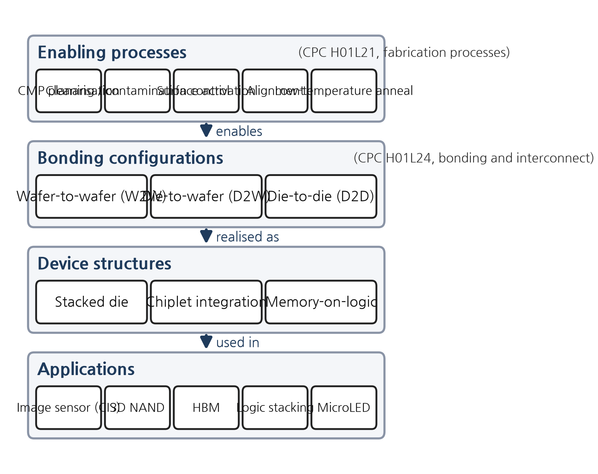
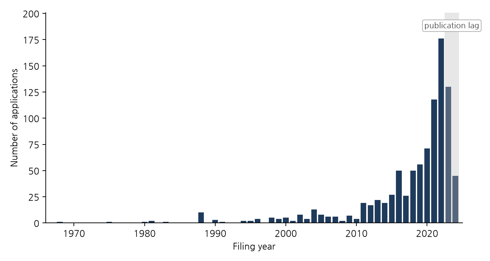
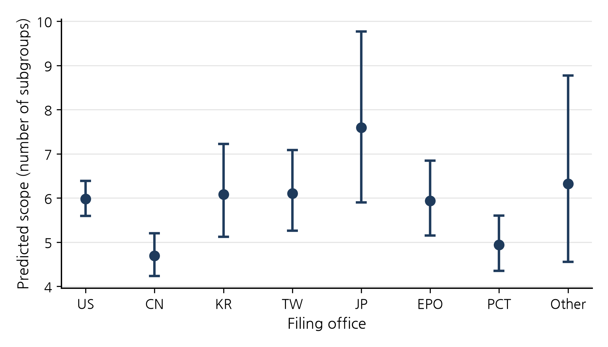
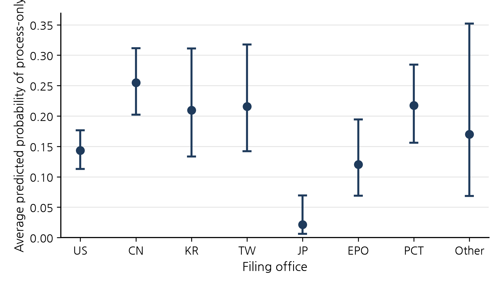
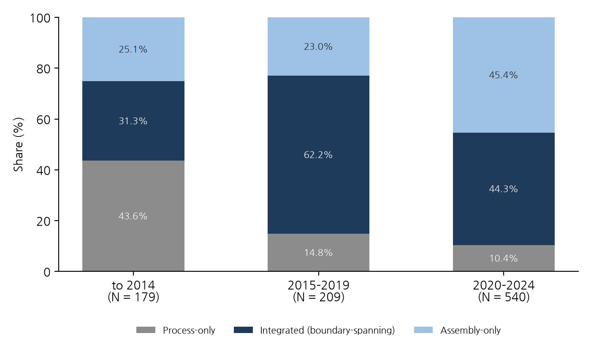

# Front-end/back-end technological convergence in semiconductor hybrid bonding patents: Determinants of boundary-spanning patents and jurisdictional strategy differentiation

**HyungKyu Lee**

Department of Management of Technology, Hanyang University, Seoul, Republic of Korea

Corresponding author: HyungKyu Lee, [institutional e-mail]

*Manuscript prepared for submission to* Technology Analysis & Strategic Management. *Article type: research article. This is the non-anonymised version; the anonymised version omits the author block, acknowledgements, disclosure statement and funding.*

## Abstract

Research on technological convergence has concentrated on the blurring of boundaries between industries. This paper examines convergence within an industry, across the long-standing division between front-end fabrication and back-end assembly in semiconductor manufacturing. Hybrid bonding, the bumpless joining of copper pads and dielectric that now enables high-bandwidth memory and 3D logic, is a back-end process whose performance depends on front-end capabilities such as chemical–mechanical planarisation. Using 928 hybrid-bonding patent applications from EPO PATSTAT, we operationalise convergence at the level of the individual patent as boundary spanning: an integrated application that claims fabrication-process technology (CPC H01L21) together with bonding and interconnect (H01L24), as distinct from assembly-only and process-only applications. Multinomial and binary logit estimates show that technological scope is the strongest correlate of boundary spanning, that process-only claiming declines consistently whereas integrated claiming peaks in 2015–2019 and gives way to assembly-level claiming in 2020–2024, and that filing office matters: Chinese-office applications are narrower and tilted towards process-only claiming, although the tilt loses significance once the publication-lag-truncated 2023–2024 filings are excluded, whereas the Japanese-office results rest on 26 applications and are not robust. The results extend convergence theory to the intra-industry, cross-stage case, link the patent-level mechanism to the architecture of the semiconductor value chain, and offer a reproducible co-classification design for other process technologies.

**Keywords:** technological convergence; industry architecture; hybrid bonding; advanced packaging; patent scope; multinomial logit

## 1. Introduction

For half a century the semiconductor industry has been organised around a clear division of labour. Transistors are fabricated on the wafer in the front end, and finished wafers are diced, assembled and packaged in the back end. The two stages have been separated technologically, organisationally and geographically. Front-end fabrication concentrated in capital-intensive fabs run by integrated device manufacturers (IDMs) and later by foundries (Kapoor 2013), while packaging and test were progressively outsourced to specialised outsourced assembly and test providers (OSATs) (Macher and Mowery 2004; Brown and Linden 2009). Because the interface between the stages was standardised, an innovation in one stage rarely required capabilities from the other.

This division of labour has recently come under strain. As dimensional scaling has slowed and its cost has risen, the industry has looked for performance gains not in the transistor itself but in how dies are partitioned, stacked and connected (Arden et al. 2010; Iyer 2016; Khan, Hounshell, and Fuchs 2018). Advanced packaging has become a source of competitive advantage, and its most demanding process, hybrid bonding, joins copper pads and the surrounding oxide directly, without solder bumps, enabling interconnect pitches below 10 µm that microbumps cannot reach and, in research settings, below 1 µm (Lau 2021, 2022). Hybrid bonding is strategically important because its success depends on capabilities that have traditionally belonged to the front end: nanometre-scale chemical–mechanical planarisation, surface activation and sub-micron alignment. A core back-end process has come to depend on front-end know-how. Leading foundries have responded by internalising advanced-packaging platforms rather than handing them to subcontractors (Lau 2022), and industry analysts increasingly diagnose a blurring of the boundary between fabrication and packaging (Yole Group 2024).

This paper asks whether that blurring can be observed, measured and explained at the level of the individual invention. Our point of departure is the literature on technological convergence, which studies how previously distinct technological and industrial domains come to overlap and recombine (Rosenberg 1963; Kodama 1992; Curran and Leker 2011; Sick and Bröring 2022), but we extend that literature in a direction it has largely neglected. Most empirical work on convergence concerns the meeting of different industries: information and communication technology and consumer electronics (Gambardella and Torrisi 1998; Hacklin, Marxt, and Fahrni 2009), food and pharmaceuticals (Bröring, Cloutier, and Leker 2006; Curran, Bröring, and Leker 2010), nanotechnology and biotechnology (No and Park 2010). Convergence that cuts across the stages of a single industry's value chain has been treated only rarely. The closest precedent is the radio-frequency identification (RFID) study by Karvonen and Kässi (2012), which used patent citations to analyse the technological interface between upstream and downstream firms in a value chain; it dealt with knowledge flows between firms, however, and did not test at the level of the individual patent whether a process technology crosses the boundary between manufacturing stages. Yet it is precisely this kind of convergence that reshapes the industry architecture (Jacobides, Knudsen, and Augier 2006) that determines who does what and who captures value.

We take hybrid bonding as a suitable case for such a test. Using 928 hybrid-bonding patent applications extracted from the European Patent Office's (EPO) PATSTAT database, together with their Cooperative Patent Classification (CPC) symbols, we define a boundary-spanning patent as an integrated application that claims bonding and interconnect technology (CPC H01L24) together with fabrication-process technology (CPC H01L21) within a single invention, and we distinguish it from assembly-only applications that claim only bonding and process-only applications that claim only fabrication. Co-classification is a standard patent-based signal of convergence (Curran and Leker 2011; Preschitschek et al. 2013; Kwon et al. 2020); the novelty here lies in applying it not between two industries but to a boundary that runs through one. We ask three research questions. First, how prevalent is boundary spanning, and how has its form changed as the technology has matured? Second, which attributes of a patent, such as its technological scope, filing date and filing office, are associated with boundary spanning? Third, how do these patterns relate to the filing and protection strategies revealed at each filing office (jurisdiction)?

The results can be summarised in three points. First, boundary spanning is not a marginal phenomenon. Integrated claims that combine the two stages are the modal type, at 45.8% of applications, and 63.6% of applications claim front-end technology (under the operational definition, set out in Section 4.2, that any H01L21 symbol counts as a fabrication-process claim). Second, technological scope is the strongest correlate. Each additional CPC subgroup within H01L21 and H01L24 that a patent spans raises the relative risk of its being integrated by about 40%, and by about 26% under an adjusted scope measure that removes the mechanical floor of the integrated type. Broad patents move towards integration; narrow patents specialise in one stage. Over time, the share of pure front-end claiming has fallen consistently in every specification (43.6% before 2015 to 10.4% in 2020–2024). Integrated claiming, by contrast, peaked at 62.2% in 2015–2019 and then fell to 44.3% in 2020–2024 as assembly-level claiming grew again. Convergence, that is, appears to proceed not as a steady increase in boundary-spanning claims but as a two-phase recomposition: from process-only to integrated claims, and then from integrated claims to claims on bonded structures. Because the second phase was not predicted by H2, this recomposition reading is a post hoc, exploratory interpretation, and we present it in Section 6.1 with the caveat that our data cannot rule out the alternative explanation of changing classification practice. Third, filing-office differences appear in a way that fits industry architecture and catch-up. Applications at the Chinese office are narrower and far more likely to be process-only, a result that survives most specifications but whose significance weakens once the publication-lag-truncated 2023–2024 filings are excluded. Applications at the Japanese office are rarely process-only in several specifications, but that result disappears in the post-2010 sample, and the finding that they are broader is not significant under robust standard errors; with 26 observations we withhold judgement.

The paper makes three contributions to the technology and innovation management literature. Conceptually, it extends convergence theory from the between-industry case to the intra-industry, cross-stage case and connects it to the literature on vertical specialisation and industry architecture in semiconductors (Langlois and Steinmueller 1999; Kapoor and Adner 2012; Kapoor 2013). Empirically, by moving the unit of analysis from aggregate co-classification indices to the individual patent, it estimates the determinants of boundary spanning with discrete-choice models and reveals the strategic heterogeneity that aggregate indices average away (see Cho and Kim 2014). Methodologically, it offers a transparent and reproducible design, two CPC classes, one co-classification rule and standard count and discrete-choice estimators, that can be applied to other process technologies in which a downstream stage has begun to absorb upstream capabilities.

The paper proceeds as follows. Section 2 reviews the theoretical background and derives the hypotheses. Section 3 describes the empirical context, hybrid-bonding technology and the industry landscape. Section 4 presents the data and methods, and Section 5 the results. Section 6 discusses theoretical and practical implications and limitations, and Section 7 concludes.

## 2. Theoretical background and hypotheses

### 2.1 Technological convergence: concept, stages and drivers

The idea that a technology developed in one domain migrates to another has a long lineage. Analysing the emergence of the nineteenth-century machine-tool industry, Rosenberg (1963) used the term technological convergence for the process by which firms came to recognise that processes developed for particular products, such as firearms, sewing machines and bicycles, could be applied to others. Kodama (1992) conceptualised technology fusion as the combination of previously separate technical fields to create capabilities that neither possessed alone, and argued that it requires a different organisation of R&D from breakthrough research. Later work distinguished the convergence of technologies from the convergence of markets and industries. Gambardella and Torrisi (1998) found that the convergence of underlying technologies in the electronics industry did not necessarily imply convergence in firms' product markets; Athreye and Keeble (2000) traced how convergence in computing reshaped ownership and firm boundaries; and Fai and von Tunzelmann (2001) used patent data to examine whether the technological competencies of large firms in different industries were converging.

Drawing on the information and communication technology (ICT) industry, Hacklin, Marxt, and Fahrni (2009) proposed that convergence unfolds from knowledge convergence through technological and applicational convergence to industrial convergence, and that these stages follow one another while feedback between them creates coevolutionary cycles. Curran and Leker (2011) formalised the distinction between scientific, technological, market and industrial convergence and showed how each can be monitored with patent indicators (for an example that also uses publication indicators, see Curran, Bröring, and Leker 2010). This literature has since matured into a distinct stream within technology and innovation management, with a review by Sick and Bröring (2022), a taxonomy of convergence patterns (Geum, Kim, and Lee 2016), a framework for assessing the degree of convergence in high-technology environments (Sick et al. 2019) and an analysis of the strategic choices firms face when industries converge (Hacklin, Battistini, and von Krogh 2013). Firm-level evidence on the drivers of convergence has accumulated only recently: Hwang (2020) found, with panel data on Korean ICT firms, that collaboration among ICT firms is the type of collaboration most strongly associated with convergence, and Caviggioli (2016) identified the characteristics of technological fields in which convergence is likely to occur.

Two features of this literature matter for the present study. First, its focus is on the meeting of different domains. The canonical cases, telecommunications and computing, food and pharmaceuticals, nanotechnology and biotechnology, all involve firms from different industries discovering that their knowledge bases overlap. Second, convergence is usually measured with indicators that aggregate co-classification, citation or semantic similarity between two technological fields (Curran, Bröring, and Leker 2010; Karvonen and Kässi 2013; Preschitschek et al. 2013; Cho and Kim 2014; Song, Elvers, and Leker 2017). Such indicators are well suited to detecting whether and when fields converge. They are less able to explain which inventions embody convergence and why, because the strategic heterogeneity of individual patents is buried in the average.

### 2.2 Convergence across the stages of a value chain: the semiconductor case

A different kind of boundary is the one that separates the stages of a single industry's value chain. The semiconductor industry provides an unusually clear case because its stage structure has been a sustained object of research on vertical specialisation and industry architecture. Langlois and Steinmueller (1999) traced how competitive advantage shifted among firms and countries as the industry's structure evolved. Macher and Mowery (2004) documented the vertical specialisation that separated design from fabrication and fabrication from assembly, giving rise to fabless firms, foundries and assembly and test subcontractors. Brown and Linden (2009) described the successive crises through which this architecture was renegotiated. Kapoor (2013) showed that integration persisted even as specialisation advanced: firms that retained capabilities spanning stages responded to technological transitions differently from specialists, and their choices shaped the industry's architecture. Studying semiconductor (DRAM) producers across technology generations, Kapoor and Adner (2012) distinguished what firms make from what they know and found that, when components and systems are interdependent, knowledge boundaries broader than production boundaries confer an advantage. This is consistent with the observation of Brusoni, Prencipe, and Pavitt (2001) that firms "know more than they make" when the rate of change of component technologies is uneven and their interdependencies are hard to predict. Adner and Kapoor (2010) added that the beneficiaries of a new technology generation depend on whether the innovation challenges in the ecosystem lie in upstream components or downstream complements.

The relevance of this literature to convergence becomes clear once one recognises that vertical specialisation depends on stable interfaces between stages. Ernst (2005) showed that the modularity on which vertical specialisation in chip design relies reaches its limits as complexity grows. Jacobides, Knudsen, and Augier (2006) argued that industry architecture, the template that defines who does what and how value is distributed, is itself an object of competition, and that innovations that change the interdependence between stages provoke its renegotiation. Hybrid bonding is such an innovation. Because yield depends on capabilities located in the front end, wafer-level planarisation, surface chemistry and alignment, the interface between fabrication and packaging is no longer stable. The result is convergence not between two industries but between two stages of one industry: back-end firms must acquire front-end capabilities, and front-end firms find that their capabilities extend naturally into packaging. This is a phenomenon that the literature on the end of Moore's law anticipated at a general level (Arden et al. 2010; Iyer 2016; Khan, Hounshell, and Fuchs 2018) and that the packaging-engineering literature has described technically (Lau 2021, 2022), but few have proposed a way of observing it in the record of invention.

It is worth being explicit about the difference between convergence as used here and integration as studied in the vertical-integration literature. The unit of analysis in the vertical-integration literature (Macher and Mowery 2004; Kapoor 2013) is the organisational boundary: which firm performs which stage. The unit of analysis in the convergence literature is the knowledge and technology base: whether technologies from different domains are combined within a single invention (Kodama 1992; Curran and Leker 2011). In the stage model of Hacklin, Marxt, and Fahrni (2009), technological convergence precedes industrial convergence: knowledge bases overlap first, and organisational boundaries are redrawn on that basis. What we observe in patent claims is this prior stage, the technological convergence that proceeds before or beneath the organisational decision of a foundry to internalise packaging. Read alongside Kapoor and Adner's (2012) argument for the advantage of knowledge boundaries broader than production boundaries, a boundary-spanning patent is direct evidence that a knowledge boundary has extended across a process stage, and it measures the technological precondition of the organisational integration that the vertical-integration literature observes as an outcome.

### 2.3 Measuring convergence with patents: from field-level indices to the boundary-spanning patent

Patents are the most widely used data for measuring convergence because classification codes locate each invention in one or more technological fields and citations record knowledge flows between fields (Curran and Leker 2011). Three measurement traditions can be distinguished. The first builds field-level indices from co-classification. Cho and Kim (2014) applied entropy and gravity concepts to International Patent Classification (IPC) co-occurrence and citation networks in printed electronics; Lee, Han, and Sohn (2015) predicted convergence patterns with large-scale triadic patents; Jeong, Kim, and Choi (2015) placed convergence within a developmental-stage framework; and Kwon et al. (2020) anticipated technology-driven industry convergence through large-scale patent analysis. The second uses text and representation learning to detect convergence before classification catches up: Preschitschek et al. (2013) compared semantic analysis with IPC co-classification, and Zhu and Motohashi (2022) trained graph convolutional networks on keyword vectors from patent text. The third examines the drivers of convergence at the field or firm level (Caviggioli 2016; Hwang 2020).

This study belongs to the first tradition in its choice of co-classification as the signal, but it departs from it in the unit of analysis. Instead of aggregating co-classification into a field-level index, we classify each patent as assembly-only if it holds only back-end bonding symbols (H01L24), process-only if it holds only front-end fabrication symbols (H01L21), and integrated if it holds both, and we call the integrated type the boundary-spanning patent. This classification is directly interpretable as convergence at the level of the invention, can be modelled with standard discrete-choice estimators and preserves the heterogeneity between patents that field-level indices average away. The union of the integrated and process-only types, that is, any patent holding at least one front-end symbol, is labelled separately as front-end orientation to keep it distinct from boundary spanning.

Two strands of patent research motivate the explanatory variables. The first is the literature on patent scope. Lerner (1994) measured scope by the number of classification classes a patent spans and showed that scope has economic value; Marco, Sarnoff, and deGrazia (2019) refined the measurement of scope through claim characteristics. Within semiconductors, Hall and Ziedonis (2001) documented the surge in patenting after the mid-1980s and Ziedonis (2004) showed that firms build larger portfolios where markets for technology are fragmented, conditions under which broad claiming is a rational strategy. The second strand concerns jurisdictional differences in patenting behaviour. Filings at different offices reflect different applicant populations, examination practices and strategic purposes. Chinese patent statistics are shaped by institutional and market factors such as patent-law reform and foreign direct investment (Hu and Jefferson 2009) and by subsidy policies that affect the quality of applications (Dang and Motohashi 2015), and China's position in the semiconductor value chain has changed rapidly under geopolitical pressure (Grimes and Du 2022). Japanese claiming practice changed after the 1988 reform that permitted multiple claims (Sakakibara and Branstetter 2001), and Japanese firms have long been strong in semiconductor equipment and materials (Langlois and Steinmueller 1999). More generally, the catch-up literature holds that latecomers follow the incumbents' path stage by stage or skip some stages, depending on the characteristics of the technological regime (Lee and Lim 2001). Applied to patent claiming, this suggests that filings from a catch-up position will concentrate on particular production stages rather than on whole systems.

### 2.4 Hypotheses

From this discussion we derive four hypotheses about which hybrid-bonding patents cross the front-end/back-end boundary.

**Technological scope.** Kodama's (1992) fusion describes the combination of knowledge from different technical fields to create capabilities that neither field possesses alone; Rosenberg's (1963) convergence describes the application of a process technology developed in one domain to problems in another. In either case a convergent invention spans more than one technological domain. If boundary spanning is a form of convergence, patents that span more classification symbols should be more likely to be integrated, that is, to include both the bonding class and the front-end class. Part of this relation is mechanical: the more symbols a patent carries, the more likely one of them is in H01L21, and an integrated patent by definition carries at least one symbol from each class, so its scope is at least two. Part of it is strategic: a patent that claims the whole process flow from wafer preparation to the bonded stack necessarily reaches into fabrication, whereas a patent that claims only the assembly step or the bonded structure does not, and the patent-scope literature shows that the choice of scope is part of a protection strategy (Lerner 1994; Ziedonis 2004). The mechanical component is isolated separately in Section 5.4 with an adjusted scope measure that excludes the first symbol from each class.

> **H1.** The broader the technological scope of a hybrid-bonding patent, the more likely it is to cross the front-end/back-end boundary, that is, to be an integrated patent that claims bonding (H01L24) and fabrication-process (H01L21) technology within a single invention.

**Maturity.** Stage models of convergence (Hacklin, Marxt, and Fahrni 2009; Jeong, Kim, and Choi 2015) imply that the form of convergence changes as a technology matures. The early inventions in hybrid bonding concerned the fabrication steps that made direct bonding possible, surface preparation, low-temperature annealing and planarisation, and were naturally classified as process inventions. As the technology moved from wafer-to-wafer applications in image sensors and 3D NAND to die-to-wafer integration for high-bandwidth memory and logic, invention shifted to bonded structures and integrated stacks (Lau 2021). We therefore expect the share of pure front-end (process-only) claiming to decline over time relative to assembly-level claiming, while boundary-spanning (integrated) claiming persists.

> **H2.** As hybrid bonding matures, the probability that a patent takes the process-only form declines relative to assembly-level claiming, whereas the probability that it takes the integrated (boundary-spanning) form does not decline.

**Jurisdiction and industry architecture.** Where a patent is filed reflects who is inventing and for what purpose. Taken together, the stage-by-stage logic of the catch-up literature (Lee and Lim 2001), the evidence on Chinese patenting (Hu and Jefferson 2009; Dang and Motohashi 2015) and China's position in the semiconductor value chain (Grimes and Du 2022) lead us to expect that applications at the Chinese office concentrate on internalising particular fabrication steps and are therefore narrower and more often process-only. Conversely, the strength of Japanese firms in equipment and materials (Langlois and Steinmueller 1999) suggests that applications at the Japanese office are broad and rarely process-only. Because the 1988 reform moved Japan to a multiple-claim system like that of the United States (Sakakibara and Branstetter 2001), differences in claim systems are not a source of contrast between the two offices for post-reform Japanese filings.

> **H3a.** Applications filed at the Chinese office are narrower in technological scope than applications filed at the US office and more likely to be front-end oriented (to claim H01L21), and in particular to take the process-only form.

> **H3b.** Applications filed at the Japanese office are broader in technological scope than applications filed at the US office and less likely to take the process-only form.

These hypotheses concern associations between patent attributes and boundary spanning and do not assert causal effects, a distinction we return to in Section 6.3.

## 3. Research context: hybrid-bonding technology and the industry landscape

Hybrid bonding brings two planarised surfaces, each patterned with copper pads in a dielectric, into direct contact so that dielectric bonds to dielectric at room temperature and copper bonds to copper after a low-temperature anneal, forming a permanent interconnect. Because there are no solder bumps, the interconnect pitch can fall below 1 µm, an order of magnitude finer than microbump flip-chip, and the bond interface is thin enough to be almost an extension of the metal-interconnect stage of wafer fabrication (the back end of line, BEOL) (Lau 2021, 2022). The process exists in two forms. Wafer-to-wafer (W2W) bonding joins whole wafers and was commercialised first in CMOS image sensors and 3D NAND. Die-to-wafer (D2W) bonding attaches individual dies to a wafer and is the form required for heterogeneous integration of chiplets, high-bandwidth memory (HBM) stacks and 3D logic. In both forms the yield-determining steps, chemical–mechanical planarisation to sub-nanometre roughness, plasma or chemical surface activation, particle control and sub-micron alignment, are capabilities that the CPC places in the fabrication-process class. They belong not to H01L24, the bonding and interconnect class, but to H01L21, the semiconductor fabrication-process class (Section 4.1, Table 1). Figure 1 summarises the enabling processes, structures and application products around hybrid bonding. Enabling processes such as through-silicon vias (TSVs), chemical–mechanical planarisation (CMP) and laser or plasma dicing govern bond quality; the bonded result feeds structures such as chiplets, backside power delivery networks (BSPDNs) and co-packaged optics (CPO); on the application side, W2W serves 3D NAND and image sensors, and D2W serves HBM, CPUs and GPUs.

**Figure 1.** Enabling processes, structures and application products of hybrid bonding.

The industry landscape points in the same direction. An independent analysis of the hybrid-bonding patent landscape names TSMC, Adeia, YMTC, Intel and Samsung as the leading applicants (Yole Group 2024). That a licensing firm holding foundational technology (Adeia), a foundry that has internalised advanced-packaging platforms (TSMC) and memory manufacturers stand side by side at the top is itself evidence that bonding technology no longer belongs to back-end specialists alone. The way leading foundries and IDMs have built advanced packaging as in-house platforms rather than leaving it to assembly and test subcontractors (Lau 2022) points in the same direction as Kapoor's (2013) observation that firms which retain integrative capabilities across stages shape the industry's architecture. Whether this landscape leaves a systematic trace in which patents cross the front-end/back-end boundary is the question addressed below.

## 4. Data and methods

### 4.1 Data

The data come from the 2025 edition of the European Patent Office's PATSTAT Global (European Patent Office 2025). Candidate records were retrieved by CPC class H01L21 (processes and apparatus for the manufacture of semiconductor devices) and H01L24 (arrangements for connecting or disconnecting semiconductor bodies), including their indexing codes, and then filtered to remove false positives by requiring the application title to contain at least one of the process keywords *hybrid bonding*, *direct bonding*, *Cu–Cu*, *copper to copper* or *metal-oxide bond* (OR between keywords, AND with the CPC condition; Table 1). The extraction yields 5,277 application–CPC records, each pairing one application with one CPC symbol. Aggregated to the application level, these give 928 unique applications filed between 1968 and 2024. Because symbols outside the two classes were not retained at extraction, every record belongs to a subgroup of the two classes that define the front-end/back-end boundary in this study (202 unique symbols in H01L21, 60 in H01L24, 262 in total). Technological scope, as used below, therefore measures the breadth of detailed technology a patent claims within the two classes and does not capture extension into fields outside semiconductors.

**Table 1.** Search strategy for hybrid-bonding patents (primary CPC classification and secondary keyword filter).

| Step | CPC code | Description | Main technologies |
|---|---|---|---|
| Primary | H01L21 | Processes or apparatus specially adapted for the manufacture or treatment of semiconductor devices or components | **Semiconductor fabrication-process technology**: centred on wafer fabrication, such as direct wafer bonding (21/18, 21/20), device isolation, SOI, BEOL interconnect and TSV (21/76), substrate and insulating-layer treatment (21/02) and chemical–mechanical planarisation and post-treatment (21/30–21/32), but also including assembly-stage manufacturing (21/48, 21/50–21/58, 21/60, 21/78) and process equipment (21/67–21/68) (composition in the sample: Section 4.2) |
| Primary | H01L24 | Arrangements and methods for electrically connecting or disconnecting semiconductor bodies | **Core packaging-interconnection technology**: wire bonding, flip-chip bonding, TSV, hybrid bonding, solder bump and ball formation, redistribution processes |
| Secondary | Keywords | *hybrid bonding*, *direct bonding*, *Cu–Cu*, *copper to copper*, *metal-oxide bond* (OR between keywords; AND with the primary classification) | Removal of false positives |

*Note:* H01L2224 is the indexing code for the connection technologies of H01L24 and tags bonding metals, forms and equipment in detail (for example H01L2224/08145, direct bonding combining metal-to-metal and dielectric-to-dielectric bonds). The indexing codes of both classes were included in the primary (search) classification, but only symbols of the main classes H01L21 and H01L24 were retained in the extracted application–CPC records, so indexing codes do not enter the scope measure.

Two properties of the data should be stated at the outset. First, the keyword filter also captures irrelevant uses of "direct bonding": direct-bonded-copper (DBC) ceramic substrates and power modules, copper alloys and lead frames, diamond-to-molybdenum bonding and laser precursors, among others. A substantial share of the pre-2010 observations consists of such irrelevant-use filings and of silicon direct wafer bonding (for example SOI wafer manufacture), a precursor technology. We keep the sample as extracted so that the results remain comparable with the original analysis, but we report re-estimates that exclude the 68 irrelevant-use applications identified by title in the eighth robustness item of Section 5.4 and in Section S2 of the Supplementary material. Second, the extracted data carry no DOCDB family identifier. If applications with the same normalised title (lower-cased, non-alphanumeric characters removed) are treated as an approximation to a family, the 928 applications comprise 473 titles, of which 186 are repeated between two and 17 times (641 applications) and 149 span more than one filing office. Differences between offices therefore reflect, to a considerable extent, compositional differences in which inventions are filed in which jurisdiction, and the effect of non-independent observations on the standard errors is examined in the seventh robustness item of Section 5.4 with title-clustered standard errors and a de-duplicated sample.

### 4.2 Variables

Table 2 defines the variables. Technological scope (*breadth*) is the number of unique CPC subgroup symbols in H01L21 and H01L24 assigned to an application, an application of Lerner's (1994) class-count measure of scope within the two classes. *Tech_cat* assigns each application to one of three mutually exclusive strategy types: assembly-only (H01L24 symbols only), integrated (both H01L24 and H01L21 symbols) and process-only (H01L21 symbols only); the integrated type is the measure of boundary spanning. *Has_process* is a binary indicator equal to one if the application holds at least one H01L21 symbol, and measures front-end orientation, the union of the integrated and process-only types. Throughout, saying that an application "claims" a technology is shorthand for the presence of that class's CPC symbol on the application; CPC symbols are assigned by examiners to the technical content of an invention and need not coincide with the wording of the claims. The two variables play different roles: the main test of boundary spanning is the integrated equation of *tech_cat*, and *has_process* is an auxiliary indicator that asks only whether front-end technology is claimed. *Ccode* is the office at which the application was filed, with eight levels (US, CN, KR, TW, JP, EP, WO and other) and the US office as the reference. *Yc* is the filing year measured as years elapsed since the first filing in the sample.

One caveat concerns the composition of H01L21. Besides wafer fabrication, H01L21 also contains assembly-stage manufacturing (21/48 packaging parts and substrates, 21/50–21/58 assembly, mounting and encapsulation, 21/60 lead attachment, 21/78 dicing) and process equipment and handling (21/67–21/68). Of the 1,636 H01L21 records in the sample, 905 (55.3%) fall in wafer-fabrication groups, 328 (20.0%) in equipment and handling groups and 403 (24.6%) in assembly-stage groups, and 107 of the 590 front-end-oriented applications hold only assembly-stage symbols. Front-end orientation and the integrated type are therefore operational concepts defined by the presence of an H01L21 symbol, that is, by a fabrication-process claim according to the institutional boundary of the CPC; re-estimates under a strict definition that excludes the assembly-stage groups are reported in the sixth robustness item of Section 5.4.

**Table 2.** Variable definitions.

| Variable | Definition | Type |
|---|---|---|
| breadth | Number of unique CPC subgroup symbols in H01L21 and H01L24 on the application (technological scope) | Count, 1–21 |
| breadth_adj | breadth − has_process − has_assembly (symbols in excess of the first symbol in each class; Section 5.4) | Count, 0–19 |
| tech_cat | Assembly-only (H01L24 only) / integrated (both = boundary spanning) / process-only (H01L21 only) | Categorical, 3 |
| has_process | 1 if the application holds at least one H01L21 (fabrication-process) symbol (front-end orientation), 0 otherwise | Binary |
| ccode | Filing office: US (reference), CN, KR, TW, JP, EP, WO, other | Categorical, 8 |
| yc | Filing year as years since the first filing in the sample (1968 = 0); sample mean 49.7 (2017.7) | Integer, 0–56 |

Technological scope averages 5.69 subgroups (standard deviation 4.07, range 1–21): 7.89 for integrated applications (2.63 in H01L21 plus 5.26 in H01L24), 4.16 for assembly-only and 3.15 for process-only applications. The US office accounts for the most applications (382), followed by China (175), the Patent Cooperation Treaty (PCT) route (113), the EPO (83), Taiwan (75), Korea (58), Japan (26) and other offices (16). Figure 2 shows the filing-year profile: little activity before 2010, a steep rise in the late 2010s to a peak around 2022, and a fall in 2023–2024 that reflects the lag before recent applications are published rather than a real decline. By strategy type, 425 applications (45.8%) are integrated, 338 (36.4%) assembly-only and 165 (17.8%) process-only. The boundary-spanning (integrated) patent is the modal type, and the 590 integrated and process-only applications together (63.6%) are front-end oriented.

**Figure 2.** Hybrid-bonding applications by filing year, 1968–2024 (N = 928). The fall in 2023–2024 is a publication-lag artefact.

Table 3 summarises the distribution of strategy types and technological scope by filing office. Two features of the raw data stand out before any regression. First, the integrated type is the most common type, at around half of applications, at the EPO and the Taiwanese, Japanese and US offices, but reaches only about 40% at the Chinese office and on the PCT route. Second, the process-only share is high at the Chinese (24.6%) and Korean (27.6%) offices and low at the Japanese (11.5%), EPO (12.0%) and US (13.9%) offices, and mean scope is narrowest at the Chinese office (4.83) and on the PCT route (5.04) and broadest at the Japanese office (6.88). Filing dates differ across offices, however: half of the Japanese-office applications were filed before 2012 (median filing year 2011.5), whereas the median PCT filing dates from 2022. Whether these differences survive controls for filing date and scope is established by the regressions in Section 5.

**Table 3.** Strategy-type distribution and technological scope by filing office (N = 928; parentheses in the strategy-type columns are row shares, in the scope column standard deviations).

| Filing office | N | Assembly-only | Integrated (boundary-spanning) | Process-only | Front-end oriented (%) | Mean scope (SD) | Median filing year |
|---|---:|---|---|---|---:|---|---:|
| United States (US) | 382 | 148 (38.7%) | 181 (47.4%) | 53 (13.9%) | 61.3 | 5.99 (4.02) | 2020 |
| China (CN) | 175 | 63 (36.0%) | 69 (39.4%) | 43 (24.6%) | 64.0 | 4.83 (3.39) | 2021 |
| PCT (WO) | 113 | 43 (38.1%) | 46 (40.7%) | 24 (21.2%) | 61.9 | 5.04 (3.57) | 2022 |
| EPO (EP) | 83 | 29 (34.9%) | 44 (53.0%) | 10 (12.0%) | 65.1 | 5.94 (3.75) | 2021 |
| Taiwan (TW) | 75 | 24 (32.0%) | 39 (52.0%) | 12 (16.0%) | 68.0 | 6.27 (4.23) | 2021 |
| Korea (KR) | 58 | 17 (29.3%) | 25 (43.1%) | 16 (27.6%) | 70.7 | 5.84 (4.64) | 2018 |
| Japan (JP) | 26 | 10 (38.5%) | 13 (50.0%) | 3 (11.5%) | 61.5 | 6.88 (7.00) | 2011.5 |
| Other | 16 | 4 (25.0%) | 8 (50.0%) | 4 (25.0%) | 75.0 | 5.81 (6.23) | 2015.5 |
| All | 928 | 338 (36.4%) | 425 (45.8%) | 165 (17.8%) | 63.6 | 5.69 (4.07) | 2021 |

*Ccode* is the office at which the application was filed; WO and EP are international and regional filing routes. Differences between offices are therefore interpreted as differences in filing and protection strategy, that is, in what was judged worth protecting in each jurisdiction.

### 4.3 Empirical strategy

Because the dependent variables differ in statistical character, the models are chosen accordingly. As technological scope is a count, we start from ordinary least squares (OLS) as a benchmark, test the residuals for heteroskedasticity (Breusch–Pagan) and inspect the residual-versus-fitted plot, then estimate Poisson and negative binomial models and test for overdispersion through the negative binomial's dispersion parameter (Hausman, Hall, and Griliches 1984; Cameron and Trivedi 2013). The count models are reported as coefficients with standard errors in Table 4 and interpreted in the text as their exponentials, incidence-rate ratios (IRRs). The scope model serves two purposes: to characterise scope, which is an explanatory variable in the boundary-spanning models, and to test the scope component of H3b.

Strategy type is modelled as a discrete choice. The multinomial logit (McFadden 1974) models *tech_cat* with assembly-only as the base category and is reported as relative-risk ratios (RRRs), so that the integrated (boundary-spanning) and process-only types are interpreted against the same base. This is the main test of H1 and H2. Before it, a binary logit predicts *has_process* (front-end orientation) from scope, the year trend and filing office, reported as odds ratios (ORs) and evaluated by the area under the receiver operating characteristic (ROC) curve (AUC) (Hosmer, Lemeshow, and Sturdivant 2013). The binary logit is a simpler model that asks only whether front-end technology is claimed and serves as a preliminary check on the multinomial results. The multinomial logit assumes the independence of irrelevant alternatives (IIA); the sensitivity of the results to this assumption is checked in Section 5.4 by re-estimation on a reduced choice set, and the estimates are interpreted as relative tendencies against the assembly-only base. Hypothesis tests use the 5% significance level, with results at the 10% level mentioned only as weak evidence, and office contrasts not covered by the hypotheses (Taiwan, PCT and other) are read as exploratory results without correction for multiple testing. For the linear benchmark we also compute heteroskedasticity-robust standard errors; the point estimates are unchanged and the year, China and PCT coefficients remain significant (only the Japan coefficient loses significance), which indicates that the problem with the linear benchmark lies in functional form rather than in the error structure.

## 5. Results

### 5.1 Technological scope

Table 4 reports the OLS, robust OLS, Poisson and negative binomial estimates of technological scope side by side. In the linear benchmark the year trend is positive and significant (0.070, p < 0.01) but the model's explanatory power is low (R² = 0.033). The residuals reject homoskedasticity (Breusch–Pagan test with all regressors in the auxiliary regression, χ²(8) = 99.6, p < 0.001; Koenker's version relaxing normality, LM = 39.7, p < 0.001), and the residual-versus-fitted plot (Figure S1 in the Supplementary material) shows the diagonal striping and fan shape typical of count data: the spread of the residuals grows with the fitted value, and the residuals are bounded from below. Heteroskedasticity-robust (HC1) standard errors leave the point estimates unchanged and preserve the significance of the year, China and PCT coefficients, but the Japan coefficient loses significance (p = 0.04 to 0.19). Correcting the standard errors, however, does not resolve the functional-form problem that arises from fitting a linear model to a count outcome, so we move to count models. The negative binomial's dispersion parameter is clearly distinguishable from zero (α = 0.268, standard error 0.020; ln(α) = −1.316, standard error 0.076); the likelihood-ratio test against Poisson for α = 0 is a boundary test with χ̄²(01) = 596.3 (p < 0.001), and the Poisson's Pearson χ² per degree of freedom of 2.92 also indicates overdispersion. The Akaike information criterion (AIC) falls from 5,477 for the Poisson to 4,883 for the negative binomial. Under overdispersion the Poisson standard errors are underestimated, at 60–65% of the negative binomial's (for example 0.040 against 0.062 for China and 0.080 against 0.133 for Japan); the change in the Japan coefficient's significance from 1% under Poisson to 10% under the negative binomial results from this difference together with a modest fall in the coefficient from 0.280 to 0.239. Applying heteroskedasticity-robust standard errors to the Poisson yields values equal to or larger than the negative binomial's (0.063 for China, 0.190 for Japan), so the Poisson stars overstate precision. We therefore take the negative binomial as the main model.

**Table 4.** Determinants of technological scope by specification (N = 928; US office is the reference; standard errors in parentheses; exponentiated Poisson and negative binomial coefficients are incidence-rate ratios (IRRs); the OLS AIC rests on a normal likelihood and is not directly comparable with the Poisson and negative binomial AICs, and is shown for reference only; no significance stars are attached to the ln(α) row (the test of α = 0 is the likelihood-ratio test in the text); \* p < 0.10, \*\* p < 0.05, \*\*\* p < 0.01).

| | OLS | OLS (robust) | Poisson | Negative binomial |
|---|:---:|:---:|:---:|:---:|
| Filing year (yc) | 0.070\*\*\* (0.019) | 0.070\*\*\* (0.020) | 0.013\*\*\* (0.002) | 0.014\*\*\* (0.003) |
| China (CN) | −1.321\*\*\* (0.370) | −1.321\*\*\* (0.330) | −0.241\*\*\* (0.040) | −0.242\*\*\* (0.062) |
| Korea (KR) | 0.089 (0.570) | 0.089 (0.630) | 0.017 (0.059) | 0.017 (0.094) |
| Taiwan (TW) | 0.102 (0.510) | 0.102 (0.544) | 0.016 (0.051) | 0.021 (0.083) |
| Japan (JP) | 1.737\*\* (0.845) | 1.737 (1.328) | 0.280\*\*\* (0.080) | 0.239\* (0.133) |
| EPO (EP) | −0.032 (0.487) | −0.032 (0.453) | −0.005 (0.050) | −0.007 (0.080) |
| PCT (WO) | −1.071\*\* (0.432) | −1.071\*\*\* (0.399) | −0.193\*\*\* (0.047) | −0.191\*\*\* (0.073) |
| Other | 0.124 (1.029) | 0.124 (1.556) | 0.024 (0.106) | 0.056 (0.171) |
| Constant | 2.506\*\*\* (0.944) | 2.506\*\* (1.046) | 1.143\*\*\* (0.107) | 1.069\*\*\* (0.175) |
| ln(α) | | | | −1.316 (0.076) |
| R² | 0.033 | 0.033 | — | — |
| AIC | 5,224.9 | 5,224.9 | 5,477.2 | 4,883.0 |

Three patterns emerge. First, the full-period linear trend has an IRR of 1.015, so the number of subgroups grows by about 1.5% a year, but this trend is driven by the sparse early filings before 2010. In the post-2010 sample the sign reverses (IRR 0.970, p < 0.01): more recent applications are narrower (Section 5.4). We therefore refrain from a definite interpretation of the time trend in scope. Second, relative to the US reference, applications at the Chinese office are about 21% narrower (IRR 0.785, p < 0.01) and PCT applications about 17% narrower (IRR 0.826, p < 0.01), whereas applications at the Japanese office are the broadest in the sample (IRR 1.270, p < 0.10). Third, Korea (IRR 1.018), Taiwan (1.021) and the EPO (0.993) are indistinguishable from the US reference. Figure 3 plots the model-implied predicted scope by filing office. Because the Japan coefficient is significant only at the 10% level and not under heteroskedasticity-robust standard errors, the scope component of H3b receives only weak evidence (Section 5.4); the narrowness of Chinese-office applications supports the scope component of H3a and fits the catch-up interpretation.

**Figure 3.** Predicted technological scope by filing office (negative binomial; filing year fixed at the sample mean yc = 49.7 (2017.7); delta-method 95% confidence intervals).

### 5.2 Front-end orientation: binary logit

Table 5 reports the binary logit for front-end orientation (*has_process*). Technological scope is the strongest predictor: each additional CPC subgroup raises the odds that a patent claims fabrication-process technology by about 27% (OR 1.267, p < 0.01). The direction agrees with H1, but because front-end orientation includes process-only patents that do not cross the boundary, the main test of H1 is the multinomial logit of the next section. The year trend runs the other way (OR 0.946 per year, p < 0.01), which we interpret as a falling share of front-end-oriented filings as bonding- and assembly-level inventions became the mainstream of the field. Among offices only the Chinese office differs significantly from the US reference, with 65% higher odds of claiming front-end technology (OR 1.650, p < 0.05), which supports H3a. The odds ratio for the Japanese office is below one (0.483) but rests on 26 applications and is imprecisely estimated. The in-sample area under the ROC curve is 0.707, at the lower end of the "acceptable" range (0.7–0.8) of Hosmer, Lemeshow, and Sturdivant (2013) (Figure S2 in the Supplementary material).

**Table 5.** Binary logit of front-end orientation (has_process = 1 if any H01L21 symbol is present; office reference = US). Odds ratios; parentheses are delta-method standard errors of the odds ratios (significance from z tests on the log odds); \* p < 0.10, \*\* p < 0.05, \*\*\* p < 0.01.

| | Odds ratio | Standard error |
|---|:---:|:---:|
| Filing year (yc) | 0.946\*\*\* | (0.011) |
| Technological scope | 1.267\*\*\* | (0.034) |
| China (CN) | 1.650\*\* | (0.338) |
| Korea (KR) | 1.430 | (0.467) |
| Taiwan (TW) | 1.555 | (0.451) |
| Japan (JP) | 0.483 | (0.233) |
| EPO (EP) | 1.170 | (0.312) |
| PCT (WO) | 1.398 | (0.329) |
| Other | 2.132 | (1.307) |
| N | 928 | |
| Log-likelihood | −547.6 | |
| AIC | 1,115.1 | |
| AUC | 0.707 | |

### 5.3 Strategy types: multinomial logit

The binary model cannot distinguish the two ways in which a patent may fail to cross the boundary: staying in assembly alone or in fabrication alone. The multinomial logit in Table 6 separates them and is the main test of boundary spanning (the integrated type). Read against the assembly-only base, broader technological scope is associated with a higher relative risk of the integrated type (RRR 1.403, p < 0.01) and a lower relative risk of the process-only type (RRR 0.905, p < 0.05; this coefficient is not significant under family-clustered standard errors, Section 5.4). Broad patents span both stages; narrow patents specialise in one. H1 is supported: scope is associated not merely with the presence of a front-end symbol but with the combination of front-end and back-end claims within a single invention.

The year trend shows what has changed over time. The relative risk of a process-only patent falls by about 8.7% a year (RRR 0.913, p < 0.01), whereas the relative risk of an integrated patent is flat along the full-period linear trend (RRR 0.993, not significant). The negative year coefficient in Table 5 therefore mainly reflects the decline of process-only inventions. A linear trend, however, hides the rise and fall of the integrated share. The period analysis in Section 5.4 shows that the integrated type peaked in 2015–2019 and then lost share relative to assembly-level claiming in 2020–2024, and in the post-2010 sample the year coefficient of the integrated type is also significantly negative. The first part of H2 (the decline of process-only claiming) is therefore strongly supported, but the second part (the persistence of integrated claiming) holds only for the full-period average and receives partial support.

**Table 6.** Multinomial logit of strategy type (outcome base category = assembly-only; office reference = US). Relative-risk ratios; parentheses are delta-method standard errors of the relative-risk ratios (significance from z tests on the log relative risks); \* p < 0.10, \*\* p < 0.05, \*\*\* p < 0.01.

| | Integrated | Standard error | Process-only | Standard error |
|---|:---:|:---:|:---:|:---:|
| Filing year (yc) | 0.993 | (0.015) | 0.913\*\*\* | (0.013) |
| Technological scope | 1.403\*\*\* | (0.043) | 0.905\*\* | (0.044) |
| China (CN) | 1.205 | (0.280) | 2.687\*\*\* | (0.740) |
| Korea (KR) | 1.166 | (0.444) | 1.906 | (0.799) |
| Taiwan (TW) | 1.312 | (0.422) | 2.102\* | (0.857) |
| Japan (JP) | 1.046 | (0.583) | 0.086\*\*\* | (0.070) |
| EPO (EP) | 1.307 | (0.380) | 0.858 | (0.376) |
| PCT (WO) | 1.126 | (0.302) | 1.997\*\* | (0.645) |
| Other | 2.326 | (1.585) | 1.901 | (1.480) |
| N | 928 | | | |
| Log-likelihood | −774.5 | | | |
| AIC | 1,589.0 | | | |

The jurisdictional contrasts are concentrated in the process-only equation. The relative risk of a process-only patent is far higher at the Chinese office than at the US office (RRR 2.687, p < 0.01) and higher on the PCT route (RRR 1.997, p < 0.05), with only weak evidence for Taiwan (RRR 2.102, p = 0.07), whereas it is very low at the Japanese office (RRR 0.086, p < 0.01). None of the office coefficients in the integrated equation is significant: once scope and timing are controlled, the propensity to file boundary-spanning patents does not differ systematically across offices (the only exception is the high Japan coefficient in the post-2010 sample; Section 5.4). Figure 4 plots the average predicted probability of the process-only strategy by office, obtained by assigning every application to the office in question while holding its other covariates at their observed values and averaging over the sample; unlike Figure 3, which fixes the covariates at their means, these values are averaged over the whole sample. About one in four Chinese-office applications (0.255) is predicted to be process-only, compared with about one in seven at the US office (0.143) and one in fifty at the Japanese office (0.021). H3a is supported, and the process-only component of H3b is supported in the full-period sample; the robustness of both is examined in Section 5.4.

**Figure 4.** Average predicted probability of the process-only strategy by filing office (multinomial logit; other covariates held at each application's observed values, averaged over the sample after setting the office; 95% confidence intervals from the sampling distribution of the parameter estimates).

### 5.4 Summary of hypothesis tests and robustness

Table 7 summarises the hypothesis tests; the verdicts take account of the robustness analyses below (Table 8 and Table S1). H1 is supported in the integrated equation of the multinomial logit and survives the adjusted scope measure, family de-duplication, the strict front-end definition and the exclusion of irrelevant-use filings. H2 is supported in every specification for the decline of process-only claiming, but the persistence of integrated claiming holds only for the full-period average, so H2 receives partial support. H3a is judged supported because the narrowness of Chinese-office applications holds in every specification and their process-only tilt in most, with the explicit exception that the tilt loses significance once the publication-lag-truncated 2023–2024 filings are excluded. For H3b, judgement on the scope component is withheld because it is not significant under robust standard errors, whereas the process-only component holds in every specification except the post-2010 sample and receives partial support.

**Table 7.** Hypotheses and results (\* p < 0.10, \*\* p < 0.05, \*\*\* p < 0.01; the source table of each coefficient is given in the cell). Verdict criteria: supported = the main-test coefficient is significant at the 5% level in the predicted direction and keeps its sign and 5% significance in most of the robustness specifications of Table 8 (exceptions stated); partially supported = holds only for some components of the hypothesis or in some specifications; judgement withheld = significant only in the baseline model and loses significance under robust standard errors or in subsamples.

| Hypothesis | Prediction | Evidence | Verdict |
|---|---|---|---|
| H1 | Broader scope, more boundary spanning (integrated) | Main test: RRR integrated 1.403\*\*\*, process-only 0.905\*\* (Table 6); adjusted scope 1.262\*\*\*, family de-duplication 1.295\*\*\*, strict front-end definition 1.352\*\*\*, irrelevant uses excluded 1.384\*\*\* (Table 8); auxiliary: front-end orientation OR 1.267\*\*\* (Table 5) | Supported |
| H2 | Process-only declines over time; integrated persists | Process-only: declines in every specification (RRR 0.913\*\*\*, Table 6; period dummies 0.273\*\*\*/0.101\*\*\*, Table 8). Integrated: flat over the full period (0.993; Table 6) but peaks in 2015–2019 and then declines (Wald test of the difference between the two period coefficients p < 0.001; post-2010 sample 0.934\*\*, strict front-end definition 0.967\*\*, irrelevant uses excluded 0.949\*\*; Table 8) | Partially supported (decline of process-only only) |
| H3a | Chinese-office applications narrower and more front-end oriented (especially process-only) | Scope: IRR 0.785\*\*\* (Table 4), holds in every specification (Table 8). Process-only: RRR 2.687\*\*\* (Table 6), 2.720–3.299\*\*\* (Table 8), but 1.651 (n.s.) when 2023–2024 is excluded. Front-end orientation OR 1.650\*\* (Table 5), 1.467\* with adjusted scope | Supported (process-only component loses significance when 2023–2024 is excluded) |
| H3b | Japanese-office applications broader and rarely process-only | Scope: IRR 1.270\* (Table 4) but not significant under robust standard errors (p = 0.20); the post-2010 estimate of 1.577\*\*\* (Supplementary material, Section S1) depends on four same-family filings with scope 21. Process-only: RRR 0.086\*\*\* (Table 6), holds under adjusted scope, family de-duplication, the strict front-end definition, exclusion of irrelevant uses and exclusion of 2023–2024, but not significant in the post-2010 sample (3.240; Table 8); N = 26 | Scope component: judgement withheld; process-only component: partially supported |

The robustness of the results was checked by re-estimating the models from the raw data (5,277 application–CPC records) with alternative variable definitions and samples. Table S1 in the Supplementary material gives the distribution of strategy types by period, and Table 8 compares the key coefficients across specifications.

**First, the mechanical component of technological scope.** An integrated patent by definition carries at least one symbol from each of H01L21 and H01L24, so its scope is at least two, whereas assembly-only and process-only patents have scope of at least one. To remove this floor we re-estimated the models with an adjusted scope measure that excludes the first symbol from each class (breadth_adj = breadth − has_process − has_assembly). The effect in the integrated equation falls from RRR 1.403 to 1.262 but remains significant at the 1% level (the front-end-orientation OR in the binary logit also falls, from 1.267 to 1.179, and remains significant). The scope coefficient in the process-only equation (0.915, p < 0.05) and the Chinese- and Japanese-office coefficients are practically unchanged. H1 is supported after the mechanical floor is removed. The adjusted measure, however, removes only the definitional floor, not the compositional advantage that an integrated patent can accumulate additional symbols in both classes; 1.262 therefore still contains part of the compositional association and should be read as an upper bound on the strategic association between scope and boundary spanning.

**Second, period definition and the post-2010 subsample.** The periods were not chosen after the fact: they are five-year calendar intervals (2015–2019 and 2020–2024), with the sparse filings of 1968–2014 grouped into the first period (179, 209 and 540 applications respectively). In Table S1 the process-only share falls monotonically from 43.6% before 2015 to 14.8% in 2015–2019 and 10.4% in 2020–2024. The integrated share jumps from 31.3% to 62.2% and then falls to 44.3%, and the assembly-only share rises from 25.1% and 23.0% to 45.4% (Figure 5). In a multinomial logit with period dummies instead of the linear trend, the relative risk of the integrated type is 1.707 in 2015–2019 (p = 0.09) and 0.762 in 2020–2024 (not significant) relative to the pre-2015 period, and the difference between the two period coefficients is significant (Wald χ²(1) = 13.9, p < 0.001); the process-only type falls to 0.273 and 0.101 (both p < 0.01). Moving the boundaries one year earlier or later (2013/2018 or 2015/2020) leaves the decline of the process-only type significant at the 1% level in both periods, while the rise and fall of the integrated type keeps its direction but moves in and out of significance at the 10% level. In the post-2010 sample (N = 830) the year coefficient of the integrated type is significantly negative (0.934, p < 0.05) and the process-only type declines more steeply (0.862, p < 0.01). In the same sample the year trend in scope changes sign (IRR 0.970, p < 0.01). In sum, the decline of process-only claiming is consistent across specifications, whereas the persistence of the integrated share is confined to the full-period linear average.

**Third, filing-office effects.** The relative risk of the process-only type at the Chinese office remains significant at the 1% level across specifications: 2.687 (full period), 2.720 (adjusted scope), 2.701 (post-2010), 2.898 (period dummies), 2.721 (family de-duplication), 3.299 (strict front-end definition) and 3.235 (irrelevant uses excluded), and the narrowness of Chinese-office scope (IRR 0.785–0.808) holds in every specification. Once 2023–2024 is excluded, however, the process-only relative risk falls to 1.651 (p = 0.12) and loses significance (fifth item). The Japanese-office results split into two components. The process-only relative risk of 0.086 holds with period dummies (0.239, p < 0.05), family de-duplication (0.061, p < 0.05), the strict front-end definition (0.103, p < 0.01), exclusion of irrelevant uses (0.015, p < 0.01) and exclusion of 2023–2024 (0.061, p < 0.01), but vanishes in the post-2010 sample (3.240, not significant), where the integrated relative risk is 6.795 (p < 0.10). There are only 26 Japanese-office applications, 11 of them filed before 2010, so the post-2010 Japan coefficients rest on one assembly-only, 13 integrated and one process-only application and cannot be trusted. The "other" offices (16 applications) have no process-only filing after 2010, so that coefficient is not identified (Supplementary material, Section S1). The scope component is weaker still. The negative binomial coefficient for Japan (IRR 1.270) is not significant under heteroskedasticity-robust standard errors (p = 0.20), and the post-2010 IRR of 1.577 (p < 0.01) depends on four same-family filings with a scope of 21; excluding them gives 1.057 (p = 0.75). We therefore withhold judgement on the scope component of H3b and judge the process-only component partially supported.

**Fourth, the competing explanation of changing classification practice.** We checked whether the decline of process-only claiming might reflect wider assignment of bonding codes rather than the content of inventions. Of the 60 H01L24 subgroups, 28 appear on applications filed before 2010; 97.6% of the 662 applications with bonding symbols filed from 2015 onwards carry at least one of these pre-existing symbols, and 76.7% of the H01L24 records in that period are assigned to them, so the creation of new symbols is not the main driver. Because the CPC, introduced in 2013, is assigned retroactively to earlier documents, however, the year in which a symbol first appears in the sample does not reveal when it was created, and this check alone cannot rule out a change in classification practice. Indeed, the number of H01L24 symbols per application rose from 3.03 before 2015 to 4.73 in 2015–2019 and fell to 3.91 in 2020–2024; the share of applications with at least one bonding symbol rose from 56.4% to 85.2% and 89.6%; and the number of H01L21 symbols fell from 2.12 and 2.23 to 1.46 in 2020–2024. These changes are consistent both with a shift in the centre of invention from process to bonded structure and with wider assignment of bonding codes and still-incomplete assignment of process codes to recently published documents, and our data cannot separate the two. The recomposition interpretation is offered subject to this caveat.

**Fifth, choice of estimator and sample truncation.** The sign and significance of the year and Chinese-office effects are identical across OLS, robust OLS, Poisson and negative binomial models (Table 4). Because the fall in filings in 2023–2024 is a publication-lag artefact, we also re-estimated the models without those two years (N = 753). The scope, year and Japan coefficients hold (scope to integrated RRR 1.418, p < 0.01; year to process-only 0.909, p < 0.01; Japan to process-only 0.061, p < 0.01), but the process-only relative risk at the Chinese office falls to 1.651 (p = 0.12) and the front-end-orientation odds ratio to 1.389 (p = 0.16), both losing significance. The reason is that 18 of the 39 Chinese-office applications filed in 2023–2024 are process-only, against three of 65 at the US office. Applications from these two years have a mean scope of 4.7 symbols, below the 5.4–6.4 of 2019–2022; this may reflect incomplete CPC assignment to recently published applications or the continuation of the narrowing trend found in the post-2010 sample, and our data cannot tell which. The process-only tilt of the Chinese office therefore depends substantially on the last two years of filings, and we cannot exclude that this part is an artefact of incomplete classification. The narrowness of Chinese-office scope (IRR 0.808, p < 0.01) holds in this sample too. The multinomial results are read as relative tendencies against the assembly-only base. As an indirect check on the independence of irrelevant alternatives, a binary logit of integrated against assembly-only in the sample without process-only applications (N = 763) gives coefficients for scope (OR 1.463), year (0.987) and the Chinese office (1.177) that are almost identical to those of the integrated equation of the multinomial logit (1.403, 0.993, 1.205), so there is no sign that the presence of the third alternative distorts the integrated equation.

**Sixth, the operational character of the front-end definition.** Besides wafer fabrication such as lithography, etching, deposition and wafer bonding, H01L21 contains main groups of an assembly-stage character: manufacture of parts before assembly (21/48), assembly, mounting and encapsulation (21/50–21/58), lead attachment (21/60) and dicing (21/78) (Section 4.2). If the variables are rebuilt under a strict definition that does not count assembly-stage symbols as fabrication-process claims (excluding 20 applications left without a symbol in either class, N = 908), front-end orientation falls to 52.0% and the distribution becomes 425 assembly-only (46.8%), 338 integrated (37.2%) and 145 process-only (16.0%) applications, so that assembly-only becomes the modal type. The signs and significance of the coefficients hold, however: scope to integrated RRR 1.352 (p < 0.01), year to process-only 0.898 (p < 0.01), China to process-only 3.299 (p < 0.01) and Japan to process-only 0.103 (p < 0.01); the year coefficient of the integrated type becomes negative over the full period (0.967, p < 0.05), so the second part of H2 is weaker under this definition, and the process-only relative risks for Korea (2.636), Taiwan (2.683) and the PCT route (2.170) become significant at the 5% level. The descriptive finding that the integrated type is modal therefore depends on the operational definition that treats all of H01L21 as fabrication process, but the conclusions of the hypothesis tests do not.

**Seventh, family duplication and non-independence of observations.** As noted in Section 4.1, the 928 applications comprise 473 titles, 186 of them repeated. The standard errors in Tables 4–6 assume independence across applications. With title-clustered standard errors, scope to integrated, China to process-only, year to process-only and the scope coefficient of the binary logit remain significant at the 1% level, but scope to process-only (RRR 0.905) has p = 0.29, Japan to process-only p = 0.06, the negative binomial year trend p = 0.13 and the negative binomial Japan coefficient p = 0.25, all losing significance. In a sample that keeps only the earliest application per title (N = 473), the shares are 39.5% assembly-only, 36.6% integrated and 23.9% process-only, and the core results hold: scope to integrated 1.295, scope to process-only 0.826, China to process-only 2.721 and year to process-only 0.935 (all p < 0.01), and Japan to process-only 0.061 (p < 0.05). Among the 37 US–China pairs with the same title, scope is identical in 34 pairs (92%) and strategy type in 36, so differences between offices should be read not as differences in how the same invention is claimed but as compositional differences in which inventions are filed in which jurisdiction.

**Eighth, irrelevant uses of the search terms.** As noted in Section 4.1, the keyword filter also captures irrelevant uses of "direct bonding". Excluding the 68 applications whose titles contain such terms (36 filed before 2015; 35 US, 11 China, 7 Japan, 7 EPO, 5 PCT, 2 Korea, 1 Taiwan) gives a sample of 860 (listed in Section S2 of the Supplementary material) in which 47.4% are integrated, 35.4% assembly-only and 17.2% process-only, and the core results hold: scope to integrated 1.384 (p < 0.01), China to process-only 3.235 (p < 0.01), Japan to process-only 0.015 (p < 0.01) and year to process-only 0.820 (p < 0.01). The year coefficient of the integrated type becomes negative (0.949, p < 0.05) and the negative binomial year trend disappears (1.001, not significant), showing that the positive full-period trend in scope depends on the early irrelevant-use filings. Many of the 71 pre-2010 observations that remain are silicon direct wafer bonding applications (for example SOI wafer manufacture), a precursor technology of the dielectric bond in hybrid bonding.

**Figure 5.** Strategy-type shares by period (N = 928).

**Table 8.** Key coefficients across specifications (multinomial logit RRRs, outcome base category = assembly-only; office reference = US; negative binomial as IRR; \* p < 0.10, \*\* p < 0.05, \*\*\* p < 0.01).

| Specification | N | Scope → integrated | Scope → process-only | Year → integrated | Year → process-only | China → process-only | Japan → process-only | Year → scope (NB IRR) |
|---|---:|---|---|---|---|---|---|---|
| Baseline (Tables 4 and 6) | 928 | 1.403\*\*\* | 0.905\*\* | 0.993 | 0.913\*\*\* | 2.687\*\*\* | 0.086\*\*\* | 1.015\*\*\* |
| Baseline with title-clustered standard errors | 928 | 1.403\*\*\* | 0.905 | 0.993 | 0.913\*\*\* | 2.687\*\*\* | 0.086\* | 1.015 |
| Adjusted scope (breadth_adj) | 928 | 1.262\*\*\* | 0.915\*\* | 1.002 | 0.911\*\*\* | 2.720\*\*\* | 0.087\*\*\* | — |
| Post-2010 sample | 830 | 1.385\*\*\* | 0.910\* | 0.934\*\* | 0.862\*\*\* | 2.701\*\*\* | 3.240 | 0.970\*\*\* |
| Period dummies (2015–2019 / 2020–2024) | 928 | 1.397\*\*\* | 0.897\*\* | 1.707\* / 0.762 | 0.273\*\*\* / 0.101\*\*\* | 2.898\*\*\* | 0.239\*\* | — |
| 2023–2024 excluded | 753 | 1.418\*\*\* | 0.908\* | 0.989 | 0.909\*\*\* | 1.651 | 0.061\*\*\* | 1.022\*\*\* |
| Family de-duplication (earliest filing per title) | 473 | 1.295\*\*\* | 0.826\*\*\* | 0.997 | 0.935\*\*\* | 2.721\*\*\* | 0.061\*\* | 1.022\*\*\* |
| Strict front-end definition (assembly-stage groups excluded) | 908 | 1.352\*\*\* | 0.923\* | 0.967\*\* | 0.898\*\*\* | 3.299\*\*\* | 0.103\*\*\* | — |
| Irrelevant uses excluded | 860 | 1.384\*\*\* | 0.916\* | 0.949\*\* | 0.820\*\*\* | 3.235\*\*\* | 0.015\*\*\* | 1.001 |

*Note:* In the period-dummy specification the year columns give the RRR of each period relative to the pre-2015 period. The clustered row has the same point estimates as the baseline; only the significance stars are based on title-clustered standard errors. The post-2010 sample contains no process-only filing from the "other" offices (none of 10), so that coefficient is not identified; the other coefficients are unaffected. The strict front-end definition does not change the scope variable, so the negative binomial column equals the baseline. Full estimates with standard errors, p-values and log-likelihoods are given in Section S1 of the Supplementary material.

## 6. Discussion

### 6.1 Theoretical implications

**Intra-industry convergence.** The first implication concerns the scope of convergence theory. The literature reviewed in Section 2.1 treats convergence as something that happens between industries, and its stage models describe how knowledge from one industry migrates to another until the industries themselves merge (Hacklin, Marxt, and Fahrni 2009; Curran and Leker 2011). Our results show that the same conceptual apparatus applies to a boundary that runs through a single industry, such as that between the fabrication and assembly stages of semiconductor manufacturing, and that this boundary can be observed at the level of the individual invention. The modal hybrid-bonding patent is the integrated type that combines the two stages within one invention (45.8%), and 63.6% of patents claim front-end technology. If, as Jacobides, Knudsen, and Augier (2006) argue, industry architecture is the template of the division of labour, intra-industry convergence of this kind is the mechanism through which the template is renegotiated: once the interface between stages loses its stability, inventions begin to claim both sides of it. In this respect the contribution differs from that of the vertical-integration literature. What Kapoor (2013) showed is that organisational integration persisted within the division of labour; what we show is the technological basis of that integration, namely that the knowledge of the two stages is being combined within individual inventions. In the stage logic of convergence theory (Hacklin, Marxt, and Fahrni 2009) the latter precedes the former, so the distribution of boundary-spanning patents may serve as a leading indicator of where and how industry architecture will be reorganised, ahead of organisational change.

**Scope as the micro-mechanism of convergence.** The second implication concerns mechanism. Kodama's (1992) technology fusion was formulated at the level of the firm's R&D organisation, and convergence indices are formulated at the level of the field. Our patent-level evidence locates the mechanism in the scope of the individual invention: patents that span more CPC subgroups are the patents that combine front-end and back-end claims, whereas narrow patents specialise in one stage. This is consistent with Lerner's (1994) finding that scope has value and with Ziedonis's (2004) account of broad portfolios in fragmented markets for technology, but it adds a convergence reading. In a technology whose yield depends on the capabilities of an adjacent stage, breadth of scope is not only a protection strategy but the form that convergence takes within the claims.

**Recomposition rather than accumulation.** The third implication concerns dynamics. A naive reading of convergence would predict a monotonic rise in the share of boundary-spanning patents over time, and our H2 likewise expected the integrated share at least to persist. The results did not bear this out (Table 7). The period distribution (Table S1) shows a two-phase recomposition. In the first phase (before 2015 to 2015–2019) the process-only share fell from 43.6% to 14.8% and the integrated share rose from 31.3% to 62.2%. The inventions that mattered early in the technology's life concerned fabrication steps such as planarisation, surface activation and annealing and were claimed as process inventions; as the technology matured, process knowledge became something claimed together with the bonded structure, a component of the patent rather than its object. In the second phase (2020–2024) the integrated share fell to 44.3% and the assembly-only share rose to 45.4%. As applications moved from W2W to D2W and HBM and chiplet products approached volume production, the centre of invention can be read as having shifted to the bonded structure and the stack architecture themselves; front-end knowledge appears to have receded from an object stated in the claims to a foundation that structure inventions presuppose. This is the coevolutionary logic of Hacklin, Marxt, and Fahrni (2009) observed within a single technology: convergence proceeds not by more patents crossing the boundary but by the boundary-crossing content changing form in stages. The interpretation carries two caveats. First, the period in which the share of applications with a bonding symbol rose from 56.4% to 85.2% coincides with the first phase, so the fall in process-only and the rise in integrated claiming could also be produced by wider assignment of bonding codes, and the fall in H01L21 symbols per application in the second phase could reflect either a change in the content of invention or a change in the assignment of process codes; our data cannot tell them apart (Section 5.4). Second, some post-2020 filings are not yet observed because of the publication lag, so the second-phase shares are provisional.

**The traces of industry architecture and catch-up in claiming.** The fourth implication connects the patent-level results to the strategy literature. The jurisdictional contrasts are concentrated in the process-only equation and fit the interpretation offered in Section 2.4. Chinese-office applications are narrow and tilted towards the process-only type. This is the filing profile expected of firms at the catch-up stage, which internalise particular fabrication steps before claiming whole integrated stacks; it fits the stage-by-stage logic of the catch-up literature (Lee and Lim 2001), and it is consistent with the evidence that China's patent surge was driven by institutional change and foreign direct investment (Hu and Jefferson 2009) and that count-rewarding subsidy policies lowered application quality (Dang and Motohashi 2015). The filing office is a variable that reveals what was judged worth protecting in which market. If applicants select from their patent families the inventions that need protection in each jurisdiction, then the finding that Chinese-office applications are narrow and tilted towards the process-only type is consistent with the reading that the Chinese jurisdiction is an arena of competition and protection around front-end process technology. Filings that seek to internalise a fabrication step and filings that seek to pre-empt it produce the same jurisdictional profile, and both are faces of catch-up dynamics.

Japanese-office applications in the full-period sample tend to be rarely process-only and broad, which fits the strength of equipment and materials suppliers that patent across the whole process flow rather than around a single step (Langlois and Steinmueller 1999). But the result rests on 26 applications. The rarity of process-only claiming disappears in the post-2010 sample, and the breadth of scope is not significant under robust standard errors (Section 5.4), so the interpretation for Japan is provisional. Korea and Taiwan resemble the US reference in the scope and integrated equations, which is natural given the position of memory manufacturers and foundries that compete head-on with US applicants. Taiwan's higher tendency towards process-only claiming (significant only at the 10% level; Korea points the same way but is not significant in the baseline and only becomes significant at the 5% level under the strict front-end definition) is noteworthy, but our data cannot distinguish whether it reflects catch-up-stage internalisation as at the Chinese office or the moves of leading foundries that have internalised advanced-packaging platforms and brought front-end capabilities into the bonding process (Lau 2022; Yole Group 2024). A process-only profile shows only that protection around a particular fabrication step is concentrated in that jurisdiction; it does not tell us whether the applicant is a follower or a leader. Taken together, these patterns suggest that industry architecture, who occupies which stage where, shapes which inventions stay within a single stage, that is, remain process-only. Because the propensity to file boundary-spanning integrated patents does not differ across offices once scope and timing are controlled (Section 5.3), the jurisdictional trace lies not in the inventions that cross the boundary but in those that stay within one stage. This extends Kapoor's (2013) argument that firms' integration choices shape industry architecture down to the level of the claims that firms write.

### 6.2 Managerial and policy implications

For back-end firms the results carry a clear warning. The traditional assembly-and-test model relied on a stable interface with fabrication; in hybrid bonding that interface has dissolved, and the patents that define the technology reach into front-end processes. Our data contain neither applicant information nor patent-value indicators, so we cannot say who has occupied which claims. Combined with the independent landscape analysis (Yole Group 2024) that names foundries, IDMs and a licensing firm as the leading applicants, however, assembly specialists without planarisation and surface-chemistry capabilities are likely to be at a disadvantage in the competition over integrated claims. The association between boundary spanning and scope suggests that the capability required is not a single process step but the ability to claim the whole flow from wafer preparation to the bonded stack.

For foundries and IDMs the results suggest that internalising advanced packaging is not merely a capacity decision but a knowledge-boundary decision in the sense of Kapoor and Adner (2012): firms whose knowledge boundary extends across process stages should find integrated claims easier to write. For equipment and materials suppliers, the Japanese-office profile observed in the full-period sample, rarely process-only, suggests a differentiated and defensible position at the front-end/back-end interface, although the result should be read provisionally given the small sample and its sensitivity to the period and to the method of computing standard errors.

For policy the jurisdictional contrasts are suggestive. The Chinese-office profile suggests that competition over front-end process steps is concentrated in that jurisdiction, consistent with stage-by-stage catch-up dynamics. Because the propensity for integrated claiming does not differ across offices once scope and timing are controlled (Section 5.3), the distinctive feature of the Chinese profile is not a shortage of integrated claims but an excess of process-only relative to assembly-only claims, a pattern that industrial policies rewarding patent counts (Dang and Motohashi 2015) would reinforce. The Korean-office coefficients are not significant in the baseline specification (the process-only relative risk is significant at the 5% level only under the strict front-end definition; Section 5.4), so the implications for Korea are inferred from the sample-wide pattern rather than from a Korea-specific effect. For Korea, where memory manufacturers depend on hybrid bonding for the next generation of HBM, the results imply that competitiveness in packaging will be determined not by packaging know-how alone but by front-end capabilities in planarisation, surface chemistry and alignment metrology and by the ability to combine them into integrated claims.

### 6.3 Limitations and future research

The study has four limitations. First, its jurisdictional unit is the filing office, so its conclusions concern what is protected in each jurisdiction. Without applicant information we cannot tell whether the narrow, process-only profile of the Chinese office originates in catch-up filings by Chinese firms, in narrow defensive secondary filings by foreign firms in China or in the examination and classification practice of the Chinese office; the catch-up interpretation of Section 6.1 is one reading compatible with these alternatives. Linking applicant-level information would allow more precise estimation, for example with firm fixed effects. The sample also contains irrelevant uses of the search terms and family duplicates; excluding them or correcting the standard errors for clustering does not change the core conclusions, but weaker results, such as the scope-to-process-only coefficient and the Japanese-office scope coefficient, lose significance (Section 5.4). Second, the estimates are associational. Scope and strategy are plausibly determined jointly, and the data offer no credible instrument, so we do not attempt causal identification. The compositional element in the association between scope and the integrated type is isolated with the adjusted scope measure (Section 5.4), but scope itself is measured only within the two classes H01L21 and H01L24, and because the H01L21 class that defines the boundary also contains assembly-stage manufacturing, the descriptive finding that the integrated type is modal depends on the operational definition (sixth robustness item, Section 5.4). Since symbols from other classes were not retained at extraction, scope in the original sense of Lerner (1994), including extension into fields outside semiconductors, would have to be reconstructed from the full set of CPC symbols. Third, the convergence signal is CPC co-classification, which is deterministic and reproducible but lags invention. Text-based methods (Preschitschek et al. 2013; Zhu and Motohashi 2022) can detect boundary spanning before examiners assign front-end codes, at the cost of depending on a trained model; in our setting, where the boundary between H01L21 and H01L24 is institutionally clear, we judged reproducibility the greater virtue, but in settings where the boundary is less codified the trade-off may run the other way. Fourth, because each application is a set of CPC symbols, the co-classification structure of patents is many-to-many, and our binary and three-way coding projects that structure onto a single boundary. A hypergraph representation that preserves higher-order co-occurrence, and generality indices in the tradition of Trajtenberg, Henderson, and Jaffe (1997) and Petralia (2020), would allow a direct test of the general-purpose character suggested by the diffusion of hybrid bonding into logic, memory, image sensors and power devices (see Bresnahan and Trajtenberg 1995; Hall and Trajtenberg 2004).

The design is open to replication in other contexts. Process technologies in which a downstream stage begins to depend on upstream capabilities, such as advanced lithography in display manufacturing, cell-to-pack integration in batteries or additive manufacturing in aerospace assembly, can all be examined with the same two-class co-classification rule and discrete-choice estimators. Comparative studies across such settings would show whether the recomposition dynamics observed here are general.

## 7. Conclusion

Technological convergence has been studied almost entirely as a meeting of industries. This paper has shown that convergence also occurs across the stages of a single industry's value chain, that it can be observed in the claims of individual patents and that its determinants can be estimated. In hybrid bonding, a back-end process whose performance depends on front-end capabilities, the modal invention under an operational definition that counts any H01L21 symbol as a fabrication-process claim is the type that integrates the two stages within one invention (45.8%), and 63.6% of applications claim fabrication-process technology. Boundary spanning is strongly associated with technological scope (and remains so once the mechanical component is removed); over time it has proceeded not through a monotonic rise in boundary-spanning claims but through a two-phase recomposition, from process-only to integrated claims and from integrated claims to claims on bonded structures; and it bears the traces of industry architecture and catch-up. The recomposition reading is offered with the caveat that our data cannot rule out the alternative explanation of changing classification practice. The finding that Chinese-office applications are narrow and tilted towards the process-only type holds in most specifications, but the significance of the process-only tilt weakens once the publication-lag-truncated last two years are excluded, and the Japanese-office results, resting on 26 applications, are sensitive to the sample period and to the method of computing standard errors. The traces of front-end and back-end technology combined within single inventions are clearly visible in the record of invention, but the combination appears not as a monotonically expanding convergence but as a recomposition that changes form, and its structure can be explained by convergence theory extended to the intra-industry case and joined to the literature on industry architecture.

## Acknowledgements

[To be completed by the author.]

## Disclosure statement

The author reports there are no competing interests to declare.

## Funding

This research received no specific grant from any funding agency in the public, commercial or not-for-profit sectors.

## Data availability statement

The patent data were extracted from EPO PATSTAT Global under licence and cannot be redistributed. The list of application identifiers, the variable-construction rules and the estimation code that reproduce all tables and figures are available from the author on reasonable request.

## References

Adner, R., and R. Kapoor. 2010. "Value Creation in Innovation Ecosystems: How the Structure of Technological Interdependence Affects Firm Performance in New Technology Generations." *Strategic Management Journal* 31 (3): 306–333. https://doi.org/10.1002/smj.821.

Arden, W., M. Brillouët, P. Cogez, M. Graef, B. Huizing, and R. Mahnkopf. 2010. *"More-than-Moore" White Paper*. International Technology Roadmap for Semiconductors (ITRS).

Athreye, S., and D. Keeble. 2000. "Technological Convergence, Globalisation and Ownership in the UK Computer Industry." *Technovation* 20 (5): 227–245. https://doi.org/10.1016/S0166-4972(99)00135-2.

Bresnahan, T. F., and M. Trajtenberg. 1995. "General Purpose Technologies 'Engines of Growth'?" *Journal of Econometrics* 65 (1): 83–108. https://doi.org/10.1016/0304-4076(94)01598-T.

Bröring, S., L. M. Cloutier, and J. Leker. 2006. "The Front End of Innovation in an Era of Industry Convergence: Evidence from Nutraceuticals and Functional Foods." *R&D Management* 36 (5): 487–498. https://doi.org/10.1111/j.1467-9310.2006.00449.x.

Brown, C., and G. Linden. 2009. *Chips and Change: How Crisis Reshapes the Semiconductor Industry*. Cambridge, MA: MIT Press.

Brusoni, S., A. Prencipe, and K. Pavitt. 2001. "Knowledge Specialization, Organizational Coupling, and the Boundaries of the Firm: Why Do Firms Know More Than They Make?" *Administrative Science Quarterly* 46 (4): 597–621. https://doi.org/10.2307/3094825.

Cameron, A. C., and P. K. Trivedi. 2013. *Regression Analysis of Count Data*. 2nd ed. Cambridge: Cambridge University Press.

Caviggioli, F. 2016. "Technology Fusion: Identification and Analysis of the Drivers of Technology Convergence Using Patent Data." *Technovation* 55–56: 22–32. https://doi.org/10.1016/j.technovation.2016.04.003.

Cho, Y., and M. Kim. 2014. "Entropy and Gravity Concepts as New Methodological Indexes to Investigate Technological Convergence: Patent Network-Based Approach." *PLOS ONE* 9 (6): e98009. https://doi.org/10.1371/journal.pone.0098009.

Curran, C.-S., S. Bröring, and J. Leker. 2010. "Anticipating Converging Industries Using Publicly Available Data." *Technological Forecasting and Social Change* 77 (3): 385–395. https://doi.org/10.1016/j.techfore.2009.10.002.

Curran, C.-S., and J. Leker. 2011. "Patent Indicators for Monitoring Convergence – Examples from NFF and ICT." *Technological Forecasting and Social Change* 78 (2): 256–273. https://doi.org/10.1016/j.techfore.2010.06.021.

Dang, J., and K. Motohashi. 2015. "Patent Statistics: A Good Indicator for Innovation in China? Patent Subsidy Program Impacts on Patent Quality." *China Economic Review* 35: 137–155. https://doi.org/10.1016/j.chieco.2015.03.012.

Ernst, D. 2005. "Complexity and Internationalisation of Innovation—Why Is Chip Design Moving to Asia?" *International Journal of Innovation Management* 9 (1): 47–73. https://doi.org/10.1142/S1363919605001186.

European Patent Office. 2025. *PATSTAT Global* (2025 edition) [Database]. Vienna: EPO.

Fai, F., and N. von Tunzelmann. 2001. "Industry-Specific Competencies and Converging Technological Systems: Evidence from Patents." *Structural Change and Economic Dynamics* 12 (2): 141–170. https://doi.org/10.1016/S0954-349X(00)00035-7.

Gambardella, A., and S. Torrisi. 1998. "Does Technological Convergence Imply Convergence in Markets? Evidence from the Electronics Industry." *Research Policy* 27 (5): 445–463. https://doi.org/10.1016/S0048-7333(98)00062-6.

Geum, Y., M.-S. Kim, and S. Lee. 2016. "How Industrial Convergence Happens: A Taxonomical Approach Based on Empirical Evidences." *Technological Forecasting and Social Change* 107: 112–120. https://doi.org/10.1016/j.techfore.2016.03.020.

Grimes, S., and D. Du. 2022. "China's Emerging Role in the Global Semiconductor Value Chain." *Telecommunications Policy* 46 (2): 101959. https://doi.org/10.1016/j.telpol.2020.101959.

Hacklin, F., B. Battistini, and G. von Krogh. 2013. "Strategic Choices in Converging Industries." *MIT Sloan Management Review* 55 (1): 65–73.

Hacklin, F., C. Marxt, and F. Fahrni. 2009. "Coevolutionary Cycles of Convergence: An Extrapolation from the ICT Industry." *Technological Forecasting and Social Change* 76 (6): 723–736. https://doi.org/10.1016/j.techfore.2009.03.003.

Hall, B. H., and M. Trajtenberg. 2004. *Uncovering GPTs with Patent Data*. NBER Working Paper 10901. Cambridge, MA: National Bureau of Economic Research. https://doi.org/10.3386/w10901.

Hall, B. H., and R. H. Ziedonis. 2001. "The Patent Paradox Revisited: An Empirical Study of Patenting in the U.S. Semiconductor Industry, 1979–1995." *RAND Journal of Economics* 32 (1): 101–128. https://doi.org/10.2307/2696400.

Hausman, J., B. H. Hall, and Z. Griliches. 1984. "Econometric Models for Count Data with an Application to the Patents–R&D Relationship." *Econometrica* 52 (4): 909–938. https://doi.org/10.2307/1911191.

Hosmer, D. W., S. Lemeshow, and R. X. Sturdivant. 2013. *Applied Logistic Regression*. 3rd ed. Hoboken, NJ: Wiley.

Hu, A. G., and G. H. Jefferson. 2009. "A Great Wall of Patents: What Is Behind China's Recent Patent Explosion?" *Journal of Development Economics* 90 (1): 57–68. https://doi.org/10.1016/j.jdeveco.2008.11.004.

Hwang, I. 2020. "The Effect of Collaborative Innovation on ICT-Based Technological Convergence: A Patent-Based Analysis." *PLOS ONE* 15 (2): e0228616. https://doi.org/10.1371/journal.pone.0228616.

Iyer, S. S. 2016. "Heterogeneous Integration for Performance and Scaling." *IEEE Transactions on Components, Packaging and Manufacturing Technology* 6 (7): 973–982. https://doi.org/10.1109/TCPMT.2015.2511626.

Jacobides, M. G., T. Knudsen, and M. Augier. 2006. "Benefiting from Innovation: Value Creation, Value Appropriation and the Role of Industry Architectures." *Research Policy* 35 (8): 1200–1221. https://doi.org/10.1016/j.respol.2006.09.005.

Jeong, S., J.-C. Kim, and J. Y. Choi. 2015. "Technology Convergence: What Developmental Stage Are We In?" *Scientometrics* 104 (3): 841–871. https://doi.org/10.1007/s11192-015-1606-6.

Kapoor, R. 2013. "Persistence of Integration in the Face of Specialization: How Firms Navigated the Winds of Disintegration and Shaped the Architecture of the Semiconductor Industry." *Organization Science* 24 (4): 1195–1213. https://doi.org/10.1287/orsc.1120.0802.

Kapoor, R., and R. Adner. 2012. "What Firms Make vs. What They Know: How Firms' Production and Knowledge Boundaries Affect Competitive Advantage in the Face of Technological Change." *Organization Science* 23 (5): 1227–1248. https://doi.org/10.1287/orsc.1110.0686.

Karvonen, M., and T. Kässi. 2012. "Industry Convergence Analysis with Patent Citations in Changing Value Systems." *International Journal of Business and Systems Research* 6 (2): 150–175. https://doi.org/10.1504/IJBSR.2012.046353.

Karvonen, M., and T. Kässi. 2013. "Patent Citations as a Tool for Analysing the Early Stages of Convergence." *Technological Forecasting and Social Change* 80 (6): 1094–1107. https://doi.org/10.1016/j.techfore.2012.05.006.

Khan, H. N., D. A. Hounshell, and E. R. H. Fuchs. 2018. "Science and Research Policy at the End of Moore's Law." *Nature Electronics* 1 (1): 14–21. https://doi.org/10.1038/s41928-017-0005-9.

Kodama, F. 1992. "Technology Fusion and the New R&D." *Harvard Business Review* 70 (4): 70–78.

Kwon, O., Y. An, M. Kim, and C. Lee. 2020. "Anticipating Technology-Driven Industry Convergence: Evidence from Large-Scale Patent Analysis." *Technology Analysis & Strategic Management* 32 (4): 363–378. https://doi.org/10.1080/09537325.2019.1661374.

Langlois, R. N., and W. E. Steinmueller. 1999. "The Evolution of Competitive Advantage in the Worldwide Semiconductor Industry, 1947–1996." In *Sources of Industrial Leadership: Studies of Seven Industries*, edited by D. C. Mowery and R. R. Nelson, 19–78. Cambridge: Cambridge University Press.

Lau, J. H. 2021. "State-Of-The-Art and Outlooks of Chiplets Heterogeneous Integration and Hybrid Bonding." *Journal of Microelectronics and Electronic Packaging* 18 (4): 145–160. https://doi.org/10.4071/imaps.1542066.

Lau, J. H. 2022. "Recent Advances and Trends in Advanced Packaging." *IEEE Transactions on Components, Packaging and Manufacturing Technology* 12 (2): 228–252. https://doi.org/10.1109/TCPMT.2022.3144461.

Lee, K., and C. Lim. 2001. "Technological Regimes, Catching-Up and Leapfrogging: Findings from the Korean Industries." *Research Policy* 30 (3): 459–483. https://doi.org/10.1016/S0048-7333(00)00088-3.

Lee, W. S., E. J. Han, and S. Y. Sohn. 2015. "Predicting the Pattern of Technology Convergence Using Big-Data Technology on Large-Scale Triadic Patents." *Technological Forecasting and Social Change* 100: 317–329. https://doi.org/10.1016/j.techfore.2015.07.022.

Lerner, J. 1994. "The Importance of Patent Scope: An Empirical Analysis." *RAND Journal of Economics* 25 (2): 319–333. https://doi.org/10.2307/2555833.

Macher, J. T., and D. C. Mowery. 2004. "Vertical Specialization and Industry Structure in High Technology Industries." In *Business Strategy over the Industry Lifecycle*, Advances in Strategic Management, vol. 21, edited by J. A. C. Baum and A. M. McGahan, 317–356. Bingley: Emerald.

Marco, A. C., J. D. Sarnoff, and C. A. W. deGrazia. 2019. "Patent Claims and Patent Scope." *Research Policy* 48 (9): 103790. https://doi.org/10.1016/j.respol.2019.04.014.

McFadden, D. 1974. "Conditional Logit Analysis of Qualitative Choice Behavior." In *Frontiers in Econometrics*, edited by P. Zarembka, 105–142. New York: Academic Press.

No, H. J., and Y. Park. 2010. "Trajectory Patterns of Technology Fusion: Trend Analysis and Taxonomical Grouping in Nanobiotechnology." *Technological Forecasting and Social Change* 77 (1): 63–75. https://doi.org/10.1016/j.techfore.2009.06.006.

Petralia, S. 2020. "Mapping General Purpose Technologies with Patent Data." *Research Policy* 49 (7): 104013. https://doi.org/10.1016/j.respol.2020.104013.

Preschitschek, N., H. Niemann, J. Leker, and M. G. Moehrle. 2013. "Anticipating Industry Convergence: Semantic Analyses vs IPC Co-Classification Analyses of Patents." *Foresight* 15 (6): 446–464. https://doi.org/10.1108/FS-10-2012-0075.

Rosenberg, N. 1963. "Technological Change in the Machine Tool Industry, 1840–1910." *Journal of Economic History* 23 (4): 414–443. https://doi.org/10.1017/S0022050700109155.

Sakakibara, M., and L. Branstetter. 2001. "Do Stronger Patents Induce More Innovation? Evidence from the 1988 Japanese Patent Law Reforms." *RAND Journal of Economics* 32 (1): 77–100. https://doi.org/10.2307/2696399.

Sick, N., and S. Bröring. 2022. "Exploring the Research Landscape of Convergence from a TIM Perspective: A Review and Research Agenda." *Technological Forecasting and Social Change* 175: 121321. https://doi.org/10.1016/j.techfore.2021.121321.

Sick, N., N. Preschitschek, J. Leker, and S. Bröring. 2019. "A New Framework to Assess Industry Convergence in High Technology Environments." *Technovation* 84–85: 48–58. https://doi.org/10.1016/j.technovation.2018.08.001.

Song, C. H., D. Elvers, and J. Leker. 2017. "Anticipation of Converging Technology Areas — A Refined Approach for the Identification of Attractive Fields of Innovation." *Technological Forecasting and Social Change* 116: 98–115. https://doi.org/10.1016/j.techfore.2016.11.001.

Trajtenberg, M., R. Henderson, and A. Jaffe. 1997. "University versus Corporate Patents: A Window on the Basicness of Invention." *Economics of Innovation and New Technology* 5 (1): 19–50. https://doi.org/10.1080/10438599700000006.

Yole Group. 2024. *Hybrid Bonding Patent Landscape Analysis 2024*. Industry report. Sophia Antipolis: KnowMade (Yole Group).

Zhu, C., and K. Motohashi. 2022. "Identifying the Technology Convergence Using Patent Text Information: A Graph Convolutional Networks (GCN)-Based Approach." *Technological Forecasting and Social Change* 176: 121477. https://doi.org/10.1016/j.techfore.2022.121477.

Ziedonis, R. H. 2004. "Don't Fence Me In: Fragmented Markets for Technology and the Patent Acquisition Strategies of Firms." *Management Science* 50 (6): 804–820. https://doi.org/10.1287/mnsc.1040.0208.

## Supplementary material

Supplementary material (Tables S1–S28, Figures S1–S2 and the list of excluded applications) is provided in the separate file supplement_v9_en.md/.docx.
