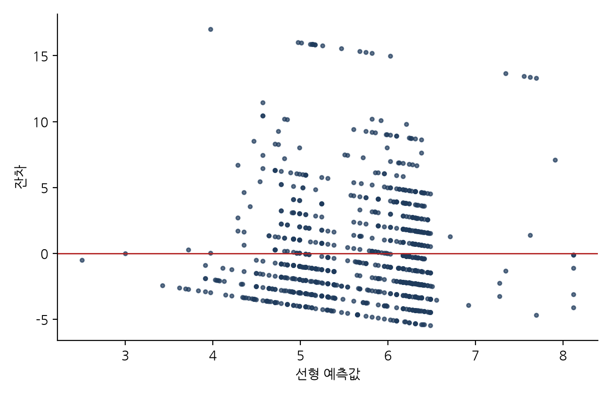
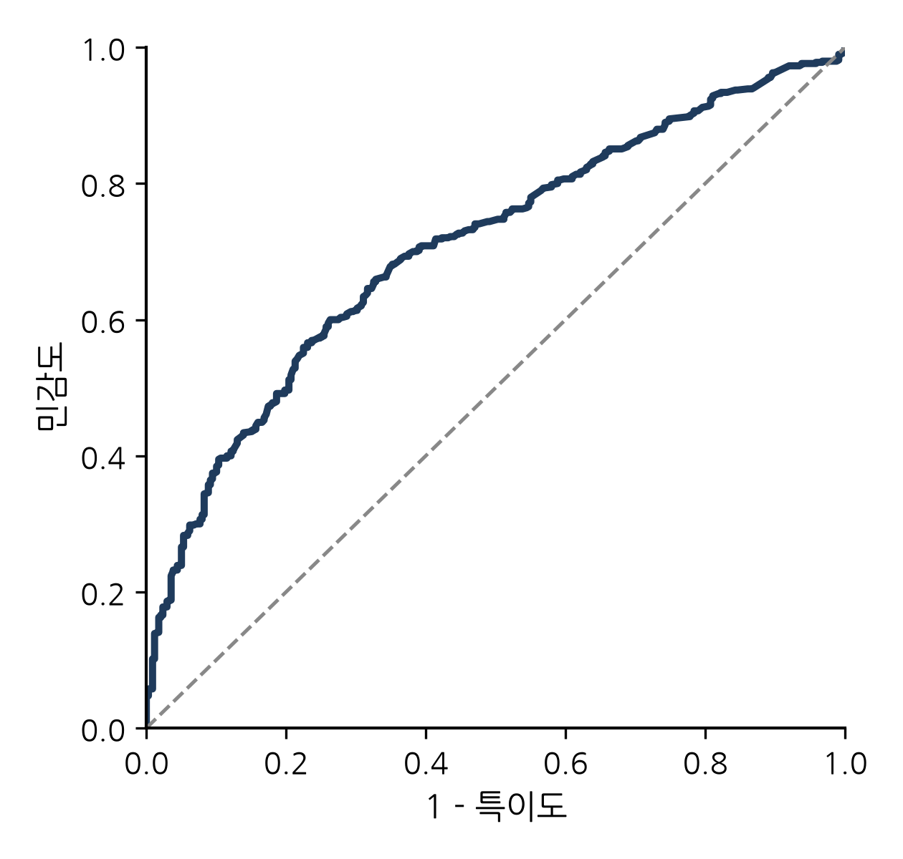

※ 투고규정 확인 전 임시 서식(2026-09-24). 기술혁신연구(기술경영경제학회) 투고규정 원문을 확인한 뒤 초록 분량·참고문헌 표기·표/그림 체재를 최종 조정할 것.

# 반도체 하이브리드 본딩 특허에 나타난 전공정–후공정 간 기술융합: 경계를 넘는 특허의 결정요인과 관할권별 전략 분화

이형규*

\* 한양대학교 기술경영학과 석사과정, [e-mail]

**국문요약**

기술융합 연구는 주로 서로 다른 산업 사이의 경계가 흐려지는 현상을 다루어 왔다. 본 연구는 한 산업 안에서 일어나는 융합, 곧 반도체 제조의 전공정과 후공정 사이의 융합을 하이브리드 본딩 특허로 검토한다. 유럽특허청 PATSTAT에서 추출한 하이브리드 본딩 특허출원 928건을 이용하여, 접합·인터커넥트(H01L24)와 제조공정(H01L21)을 한 발명 안에서 함께 청구하는 통합형 특허를 경계를 넘는 특허로 정의하고 조립 단독형·공정 단독형과 구분하였다. 다항·이항 로짓과 음이항 모형의 추정 결과, 첫째 기술범위가 경계 넘기의 가장 강한 상관요인이며(통합형 상대위험비 1.40, 조정 범위 1.26), 둘째 순수 전공정 청구는 일관되게 줄었으나 통합형 청구는 2015–2019년 정점 후 2020–2024년에 조립 수준 청구에 자리를 내주었고, 셋째 중국 출원청 출원은 범위가 좁고 공정 단독형에 치우치되 공개 시차로 절단된 2023–2024년을 제외하면 공정 단독형 편중의 유의성이 약해지며, 일본 출원청 결과는 26건의 표본으로는 판정을 유보한다. 본 연구는 융합 이론을 산업 내·공정단계 간 사례로 확장하고, 특허 수준의 메커니즘을 반도체 가치사슬의 아키텍처와 연결하며, 다른 공정기술에 적용할 수 있는 재현 가능한 공동분류 설계를 제공한다.

**주제어:** 기술융합; 산업 아키텍처; 하이브리드 본딩; 첨단 패키징; 특허 범위; 다항 로짓

---

## Ⅰ. 서론

반세기 동안 반도체 산업은 명확한 분업 구조를 중심으로 조직되어 왔다. 트랜지스터는 전공정(front end)에서 웨이퍼 위에 만들어지고, 완성된 웨이퍼는 후공정(back end)에서 절단·조립·패키징되었다. 두 단계는 기술적으로도, 조직적으로도, 지리적으로도 분리되어 있었다. 전공정 제조는 종합반도체기업(IDM)과 이후 파운드리가 운영하는 자본집약적 팹에 집중된 반면(Kapoor, 2013), 패키징과 테스트는 점차 전문 조립·테스트 하청업체(OSAT)로 외주화되었다(Macher & Mowery, 2004; Brown & Linden, 2009). 두 단계 사이의 인터페이스가 표준화되어 있었기 때문에, 한 단계의 혁신이 다른 단계의 역량을 요구하는 일은 드물었다.

이러한 분업 구조가 최근 흔들리고 있다. 미세화(dimensional scaling)가 둔화되고 그 비용이 상승하면서, 산업은 트랜지스터 자체가 아니라 다이를 어떻게 분할·적층·연결하는가에서 성능 향상의 여지를 찾기 시작하였다(Arden et al., 2010; Iyer, 2016; Khan et al., 2018). 첨단 패키징은 경쟁우위의 원천이 되었고, 그 가운데 가장 까다로운 공정인 하이브리드 본딩은 솔더 범프 없이 구리 패드와 주변 산화막을 직접 접합하여 마이크로범프로는 도달하기 어려운 10 µm 이하, 연구 단계에서는 1 µm 이하의 인터커넥트 피치를 가능하게 한다(Lau, 2021, 2022). 하이브리드 본딩이 전략적으로 중요한 이유는, 그 성패가 나노미터급 화학적 기계연마, 표면 활성화, 서브미크론 정렬처럼 전통적으로 전공정에 속해 온 역량에 달려 있기 때문이다. 후공정의 핵심 공정이 사실상 전공정 노하우에 의존하게 된 것이다. 선도 파운드리들은 첨단 패키징 플랫폼을 하청업체에 넘기지 않고 내재화하는 방식으로 대응하였고(Lau, 2022), 산업계에서는 제조와 패키징의 경계가 흐려지고 있다는 진단이 늘고 있다(Yole Group, 2024).

본 연구는 이러한 경계의 흐려짐을 개별 발명 수준에서 관찰하고 측정하고 설명할 수 있는지를 묻는다. 이를 위해 기술융합 문헌, 곧 서로 구분되던 기술·산업 영역이 겹치고 다시 결합하는 과정을 다룬 연구(Rosenberg, 1963; Kodama, 1992; Curran & Leker, 2011; Sick & Bröring, 2022)를 출발점으로 삼되, 그동안 거의 주목받지 못한 방향으로 논의를 넓힌다. 융합에 관한 실증 연구의 대부분은 정보통신기술과 가전(Gambardella & Torrisi, 1998; Hacklin et al., 2009), 식품과 제약(Bröring et al., 2006; Curran et al., 2010), 나노기술과 바이오기술(No & Park, 2010)처럼 서로 다른 산업이 만나는 경우를 다루어 왔다. 반면 한 산업 내부에서 가치사슬 단계를 가로지르는 융합은 드물게만 다루어졌다. 가치사슬 상·하류 기업 간의 기술 인터페이스를 특허 인용으로 분석한 Karvonen & Kässi(2012)의 무선인식(RFID) 연구가 가장 가까운 선례이지만, 이는 기업 간 지식 흐름을 다루었을 뿐 하나의 공정기술이 제조 단계의 경계를 넘는지를 개별 특허 수준에서 검정하지는 않았다. 그러나 누가 무엇을 하고 누가 가치를 가져가는가를 정하는 산업 아키텍처(Jacobides et al., 2006)를 바꾸는 것은 바로 이런 종류의 융합이다.

본 연구는 하이브리드 본딩을 이러한 검토에 적합한 사례로 삼는다. 유럽특허청(EPO)의 PATSTAT에서 추출한 하이브리드 본딩 특허출원 928건과 그 협력적 특허분류(Cooperative Patent Classification, CPC) 기호를 이용하여, 경계를 넘는 특허(boundary-spanning patent)를 접합·인터커넥트(CPC H01L24)와 제조공정 기술(CPC H01L21)을 하나의 발명 안에서 함께 청구하는 통합형 특허로 정의하고, 접합만 청구하는 조립 단독형 및 제조공정만 청구하는 공정 단독형과 구분한다. 공동분류(co-classification)는 융합을 포착하는 표준적인 특허 기반 신호이며(Curran & Leker, 2011; Preschitschek et al., 2013; Kwon et al., 2020), 본 연구의 새로움은 이를 두 산업 사이가 아니라 한 산업을 관통하는 경계에 적용한다는 데 있다. 이에 따라 세 가지 연구질문을 설정한다. 첫째, 경계 넘기는 얼마나 보편적이며 기술이 성숙함에 따라 그 형태는 어떻게 변하였는가? 둘째, 기술범위, 출원 시점, 출원청 등 특허의 어떤 속성이 경계 넘기와 연관되는가? 셋째, 이러한 패턴은 각 출원청(관할권)에서 드러나는 출원·보호 전략과 어떻게 관련되는가?

분석 결과는 세 가지로 요약된다. 첫째, 경계 넘기는 주변적 현상이 아니다. 두 단계를 결합한 통합형(integrated) 청구가 출원의 45.8%로 최빈 유형이며, 전공정 기술을 청구하는 출원은 63.6%에 이른다(H01L21 기호의 보유를 제조공정 청구로 보는 조작적 정의 기준; 제Ⅳ장 2절). 둘째, 기술범위가 가장 강력한 상관요인이다. 특허가 걸치는 H01L21·H01L24 계열 CPC 서브그룹이 하나 늘 때마다 통합형이 될 상대위험이 약 40% 높아지며, 통합형의 기계적 하한을 제거한 조정 범위로도 약 26% 높아진다. 넓은 특허는 통합형으로, 좁은 특허는 한 단계 특화형으로 이동한다. 시간이 흐르면서 순수 전공정 청구의 비중은 모든 모형 설정에서 일관되게 줄었다(2014년 이전 43.6% → 2020–2024년 10.4%). 반면 통합형은 2015–2019년에 62.2%로 정점에 이른 뒤 2020–2024년에는 조립 수준 청구가 다시 늘면서 44.3%로 낮아졌다. 즉 융합은 경계를 넘는 청구가 꾸준히 늘어나는 형태가 아니라, 공정 단독형에서 통합형으로, 다시 통합형에서 접합 구조 청구로 이어지는 두 단계의 재구성(recomposition)으로 진행된 것으로 읽힌다. 둘째 단계는 H2가 예측하지 않은 결과이므로 이 재구성 해석은 사후적·탐색적 해석이며, 분류 관행 변화라는 대안 설명을 자료로 배제하지 못한다는 유보 아래 제Ⅵ장 1절에서 제시한다. 셋째, 출원청에 따른 차이가 산업 아키텍처와 추격 양상에 들어맞는 방식으로 나타난다. 중국 출원청 출원은 범위가 좁고 공정 단독형일 가능성이 훨씬 높으며, 이 결과는 대부분의 모형 설정에서 유지되지만 공개 시차로 절단된 2023–2024년 출원을 제외하면 공정 단독형 편중의 유의성이 약해진다. 일본 출원청 출원이 공정 단독형을 취하는 일이 드물다는 결과는 여러 설정에서 유지되나 2010년 이후 표본에서는 사라지고, 범위가 넓다는 결과는 로버스트 표준오차에서 유의하지 않아, 26건이라는 표본 크기 안에서는 판정을 유보한다.

본 연구는 기술혁신경영 문헌에 세 가지로 기여한다. 개념적으로는 융합 이론을 산업 간 사례에서 산업 내·공정단계 간 사례로 확장하고, 이를 반도체의 수직 전문화와 산업 아키텍처 문헌(Langlois & Steinmueller, 1999; Kapoor & Adner, 2012; Kapoor, 2013)과 연결한다. 실증적으로는 분석 단위를 집계된 공동분류 지수에서 개별 특허로 옮김으로써 경계 넘기의 결정요인을 이산선택 모형으로 추정하고, 집계 지수가 평균 속에 감추는 전략적 이질성을 드러낸다(Cho & Kim, 2014 참조). 방법론적으로는 두 개의 CPC 클래스, 하나의 공동분류 규칙, 표준 카운트·이산선택 추정량이라는 투명하고 재현 가능한 설계를 제시하며, 이 설계는 하류 단계가 상류 역량을 흡수하기 시작한 다른 공정기술에도 적용할 수 있다.

논문의 구성은 다음과 같다. 제Ⅱ장은 이론적 배경을 검토하고 가설을 도출한다. 제Ⅲ장은 실증 맥락인 하이브리드 본딩 기술과 산업 지형을 기술한다. 제Ⅳ장은 데이터와 방법을, 제Ⅴ장은 결과를 제시한다. 제Ⅵ장은 이론적·실무적 함의와 한계를 논의하고, 제Ⅶ장은 결론을 맺는다.

## Ⅱ. 이론적 배경과 가설

### 1. 기술융합: 개념, 단계, 동인

한 영역에서 개발된 기술이 다른 영역으로 이동한다는 생각은 오랜 계보를 갖는다. Rosenberg(1963)는 19세기 공작기계 산업의 출현을 분석하면서, 총기·재봉틀·자전거 등 특정 제품을 위해 개발된 공정이 다른 제품에도 적용될 수 있음을 기업들이 인식해 가는 과정을 기술적 수렴(technological convergence)이라 불렀다. Kodama(1992)는 이전에는 분리되어 있던 기술 분야들을 결합하여 어느 한쪽도 단독으로는 갖지 못한 역량을 창출하는 과정을 기술융합(technology fusion)으로 개념화하고, 이것이 돌파형 연구와는 다른 R&D 조직을 요구한다고 주장하였다. 후속 연구는 기술의 융합을 시장의 융합, 산업의 융합과 구분하였다. Gambardella & Torrisi(1998)는 전자산업에서 기반 기술의 융합이 기업 제품시장의 융합을 반드시 함의하지는 않음을 발견하였고, Athreye & Keeble(2000)은 컴퓨팅에서의 융합이 소유구조와 기업 경계를 어떻게 재편했는지를 추적하였으며, Fai와 von Tunzelmann(2001)은 특허 데이터로 서로 다른 산업 대기업들의 기술 역량이 수렴하고 있는지를 검토하였다.

Hacklin et al.(2009)은 정보통신기술 산업을 바탕으로 융합이 지식 융합에서 기술 융합과 응용 융합을 거쳐 산업 융합으로 전개되며, 이 단계들이 순차적으로 이어지되 단계 간 되먹임을 통해 공진화적 순환을 이룬다고 제안하였다. Curran & Leker(2011)는 과학·기술·시장·산업 융합의 구분을 정식화하고 이를 특허 지표로 모니터링하는 방법을 보였다(논문 지표를 함께 쓴 예는 Curran et al., 2010). 이 문헌은 이후 기술혁신경영 분야의 독립된 연구 흐름으로 성숙하였고, Sick & Bröring(2022)의 리뷰, 융합 패턴의 유형론(Geum et al., 2016), 첨단기술 환경에서 융합 정도를 평가하는 프레임워크(Sick et al., 2019), 산업이 융합할 때 기업이 직면하는 전략적 선택의 분석(Hacklin et al., 2013)으로 이어졌다. 융합의 동인에 관한 기업 수준의 실증은 비교적 최근에 축적되기 시작하였다. Hwang(2020)은 한국 정보통신기술(ICT) 기업 패널 자료로 ICT 기업 간 협력이 융합과 가장 강하게 연관된 협력 유형임을 발견하였고, Caviggioli(2016)는 융합이 일어나기 쉬운 기술 분야의 특성을 식별하였다.

이 문헌의 두 가지 특징이 본 연구에 중요하다. 첫째, 초점이 서로 다른 영역의 만남에 있다. 통신과 컴퓨팅, 식품과 제약, 나노기술과 바이오기술 등 전형적 사례는 모두 서로 다른 산업의 기업들이 자신들의 지식 기반이 중첩됨을 발견하는 상황이다. 둘째, 융합은 통상 두 기술 분야 사이의 공동분류, 인용 또는 의미적 유사성을 집계한 지표로 측정된다(Curran et al., 2010; Karvonen & Kässi, 2013; Preschitschek et al., 2013; Cho & Kim, 2014; Song et al., 2017). 이러한 지표는 분야가 융합하는지, 언제 융합하는지를 알아내는 데 적합하다. 그러나 어떤 발명이 융합을 담고 있으며 왜 그러한지를 설명하는 데는 한계가 있다. 개별 특허의 전략적 이질성이 평균 속에 묻히기 때문이다.

### 2. 가치사슬 단계 간 융합: 반도체의 경우

이와 다른 종류의 경계가 한 산업의 가치사슬 단계들을 가르는 경계다. 반도체 산업은 그 단계 구분이 수직 전문화와 산업 아키텍처 연구의 지속적 대상이 되어 왔다는 점에서 특히 명확한 사례를 제공한다. Langlois & Steinmueller(1999)는 산업 구조가 진화하면서 경쟁우위가 기업과 국가 사이에서 어떻게 이동했는지를 추적하였다. Macher & Mowery(2004)는 설계와 제조, 제조와 조립을 분리하여 팹리스, 파운드리, 조립·테스트 하청업체를 낳은 수직 전문화를 기록하였다. Brown & Linden(2009)은 이 아키텍처가 재협상된 연속적 위기들을 기술하였다. Kapoor(2013)는 전문화가 진행되는 가운데서도 통합이 지속되었음을 보였다. 단계를 가로지르는 역량을 유지한 기업은 전문기업과 다른 방식으로 기술 전환에 대응하였고, 그 선택이 산업 아키텍처를 형성하였다. Kapoor & Adner(2012)는 기술 세대를 거치는 반도체(DRAM) 생산자들을 연구하면서 기업이 만드는 것과 아는 것을 구분하였고, 부품과 시스템이 상호의존적일 때 생산 경계보다 넓은 지식 경계가 우위를 준다는 것을 발견하였다. 이는 부품 기술의 변화 속도가 고르지 않고 상호의존을 예측하기 어려울 때 기업이 "만드는 것보다 더 많이 안다"는 Brusoni et al.(2001)의 관찰과 맥을 같이한다. Adner & Kapoor(2010)는 생태계 내에서 혁신 난제가 상류 부품에 있는가 하류 보완재에 있는가에 따라 새로운 기술 세대의 수혜자가 달라진다고 덧붙였다.

이 문헌과 융합의 연관성은 수직 전문화가 단계 간의 안정적 인터페이스에 의존한다는 점을 인식할 때 분명해진다. Ernst(2005)는 칩 설계의 수직 전문화가 의존하는 모듈성이 복잡성이 커지면서 한계를 갖는다는 것을 보였다. Jacobides et al.(2006)은 누가 무엇을 하고 가치가 어떻게 배분되는지를 정의하는 템플릿인 산업 아키텍처가 그 자체로 경쟁의 대상이며, 단계 간 상호의존을 바꾸는 혁신은 그 재협상을 불러온다고 주장하였다. 하이브리드 본딩이 바로 그러한 혁신이다. 수율이 웨이퍼 수준 평탄화, 표면 화학, 정렬 등 전공정에 자리한 역량에 달려 있으므로 제조와 패키징 사이의 인터페이스는 더 이상 안정적이지 않다. 그 결과는 두 산업 사이가 아니라 한 산업의 두 단계 사이에서 일어나는 융합이다. 후공정 기업은 전공정 역량을 획득해야 하고, 전공정 기업은 자신의 역량이 패키징으로 자연스럽게 확장됨을 발견한다. 이는 무어의 법칙 종언에 관한 문헌이 일반적 수준에서 예견하고(Arden et al., 2010; Iyer, 2016; Khan et al., 2018) 패키징 공학 문헌이 기술적으로 기술해 온 현상이다(Lau, 2021, 2022). 그러나 이를 발명의 기록 속에서 관찰하는 방법은 거의 제시되지 않았다.

여기서 본 연구가 말하는 융합과 수직통합 문헌이 다루는 통합의 차이를 분명히 해 둘 필요가 있다. 수직통합 문헌(Macher & Mowery, 2004; Kapoor, 2013)의 분석 단위는 조직 경계로, 어느 기업이 어느 단계를 직접 수행하는가를 묻는다. 반면 융합 문헌의 분석 단위는 지식·기술 기반으로, 서로 다른 영역의 기술이 하나의 발명 안에서 결합되는가를 묻는다(Kodama, 1992; Curran & Leker, 2011). Hacklin et al.(2009)의 단계 모형에서 기술 융합은 산업 융합에 선행한다. 즉 지식 기반이 먼저 중첩되고, 그 위에서 조직 경계가 재편된다. 본 연구가 특허 청구항에서 관찰하는 것은 이 선행 단계, 즉 파운드리가 패키징을 내재화하는 조직적 결정 이전 또는 이면에서 진행되는 기술적 수렴이다. Kapoor & Adner(2012)가 생산 경계보다 넓은 지식 경계의 우위를 논한 것과 연결하면, 경계를 넘는 특허는 지식 경계가 공정 단계를 넘어 확장되었음을 보여주는 직접적 증거이며, 수직통합 문헌이 결과로 관찰하는 조직적 통합의 기술적 전제 조건을 측정한다고 할 수 있다.

### 3. 특허로 융합 측정하기: 분야 수준 지수에서 경계를 넘는 특허로

특허는 분류 코드가 각 발명을 하나 이상의 기술 분야에 위치시키고 인용이 분야 간 지식 흐름을 기록하기 때문에 융합 측정에 가장 널리 쓰이는 자료다(Curran & Leker, 2011). 세 가지 측정 전통을 구분할 수 있다. 첫째는 공동분류로부터 분야 수준 지수를 구축하는 전통이다. Cho & Kim(2014)은 인쇄전자 분야 국제특허분류(IPC) 공출현·인용 네트워크에 엔트로피와 중력 개념을 적용하였고, Lee et al.(2015)은 대규모 삼극특허로 융합 패턴을 예측하였으며, Jeong et al.(2015)은 융합을 발전단계 프레임워크 안에 위치시켰고, Kwon et al.(2020)은 대규모 특허 분석으로 기술 주도 산업융합을 예측하였다. 둘째는 분류가 따라잡기 전에 융합을 탐지하기 위해 텍스트와 표상 학습을 이용하는 전통이다. Preschitschek et al.(2013)은 의미 분석과 IPC 공동분류를 비교하였고, Zhu & Motohashi(2022)는 특허 텍스트 키워드 벡터에 그래프 합성곱 신경망을 학습시켰다. 셋째는 분야 또는 기업 수준에서 융합의 동인을 검토하는 전통이다(Caviggioli, 2016; Hwang, 2020).

본 연구는 공동분류를 신호로 택한다는 점에서 첫째 전통에 속하지만 분석 단위에서 이와 구별된다. 공동분류를 분야 수준 지수로 집계하는 대신, 각 특허를 후공정 접합 기호(H01L24)만 보유하는 조립 단독형, 전공정 제조 기호(H01L21)만 보유하는 공정 단독형, 그리고 둘을 함께 보유하는 통합형으로 구분하고, 통합형을 경계를 넘는 특허라 부른다. 이 구분은 발명 수준의 융합으로 직접 해석되고, 표준 이산선택 추정량으로 모형화할 수 있으며, 분야 수준 지수가 평균해 버리는 특허 간 이질성을 보존한다. 통합형과 공정 단독형을 합한 집합, 즉 전공정 기호를 하나라도 보유하는 특허는 전공정 지향(front-end orientation)으로 따로 이름 붙여 경계 넘기와 구별한다.

설명변수의 선정에는 두 흐름의 특허 연구가 근거를 제공한다. 첫째는 특허 범위(patent scope) 연구다. Lerner(1994)는 특허가 걸치는 분류 클래스 수로 범위를 측정하고 범위가 경제적 가치를 가짐을 보였으며, Marco et al.(2019)은 청구항 특성을 통해 범위 측정을 정교화하였다. 반도체에 국한하면, Hall & Ziedonis(2001)는 1980년대 중반 이후 특허 급증을 기록하였고, Ziedonis(2004)는 기술 시장이 파편화된 곳에서 기업이 더 큰 포트폴리오를 구축함을 보였다. 이는 넓은 청구가 합리적 전략이 되는 조건이다. 둘째는 관할권에 따른 특허 행태의 차이에 관한 연구다. 서로 다른 특허청에 대한 출원은 서로 다른 출원인 집단, 심사 관행, 전략적 목적을 반영한다. 중국 특허 통계는 특허법 개정과 외국인직접투자 등 제도·시장 요인(Hu & Jefferson, 2009)과 출원의 질에 영향을 미치는 보조금 정책(Dang & Motohashi, 2015)에 의해 형성되며, 반도체 가치사슬에서 중국의 위치는 지정학적 압력 아래 빠르게 변해 왔다(Grimes & Du, 2022). 일본의 청구 관행은 다항 청구를 허용한 1988년 개혁 이후 바뀌었고(Sakakibara & Branstetter, 2001), 일본 기업은 오랫동안 반도체 장비·소재에 강했다(Langlois & Steinmueller, 1999). 보다 일반적으로 추격 문헌은 후발자가 기술 체제의 특성에 따라 선발자의 경로를 단계적으로 따르거나 일부 단계를 건너뛰며 추격한다고 본다(Lee & Lim, 2001). 이를 특허 청구에 적용하면, 추격 단계의 출원은 시스템 전체보다 특정 생산 단계에 집중될 것으로 예상할 수 있다.

### 4. 가설

이상의 논의로부터 어떤 하이브리드 본딩 특허가 전/후공정 경계를 넘는지에 관한 네 가지 가설을 도출한다.

**기술범위.** Kodama(1992)의 융합은 서로 다른 기술 분야의 지식을 결합하여 어느 한쪽도 단독으로는 갖지 못한 역량을 만드는 과정을, Rosenberg(1963)의 수렴은 한 영역에서 개발된 공정 기술이 다른 영역의 문제에 적용되는 과정을 기술한다. 어느 쪽이든 융합적 발명은 둘 이상의 기술 영역에 걸친다. 경계 넘기가 융합의 한 형태라면, 더 많은 기술 분류 기호에 걸치는 특허가 접합 클래스와 전공정 클래스를 함께 포함하는 통합형일 가능성이 더 높아야 한다. 이 관계에는 기계적인 부분이 있다. 기호가 많을수록 그중 하나가 H01L21일 가능성도 커지고, 통합형은 정의상 두 클래스의 기호를 각각 하나 이상 가지므로 범위가 2 이상이기 때문이다. 그러나 전략적인 부분도 있다. 웨이퍼 준비에서 접합된 적층까지 전체 공정 흐름을 청구하는 특허는 필연적으로 제조에 닿는 반면, 조립 단계나 접합 구조만 청구하는 특허는 그렇지 않다. 범위의 선택이 보호 전략의 일부라는 점은 특허 범위 문헌이 보여 준 바와 같다(Lerner, 1994; Ziedonis, 2004). 기계적인 부분은 제Ⅴ장 4절에서 각 클래스의 첫 기호를 제외한 조정 범위로 따로 떼어 확인한다.

> **H1.** 하이브리드 본딩 특허의 기술범위가 넓을수록 전/후공정 경계를 넘을, 즉 접합(H01L24) 기술과 제조공정(H01L21) 기술을 하나의 발명 안에서 함께 청구하는 통합형일 가능성이 높다.

**성숙.** 융합의 단계 모형(Hacklin et al., 2009; Jeong et al., 2015)은 기술이 성숙하면서 융합의 형태가 변한다고 본다. 하이브리드 본딩의 초기 발명은 표면 준비, 저온 어닐링, 평탄화 등 직접 접합을 가능케 한 제조 단계에 관한 것이었고 자연스럽게 공정 발명으로 분류되었다. 기술이 이미지센서와 3D NAND의 웨이퍼-투-웨이퍼 용도에서 고대역폭 메모리와 로직을 위한 다이-투-웨이퍼 집적으로 이동하면서, 발명은 접합된 구조와 통합된 적층으로 옮겨갔다(Lau, 2021). 따라서 순수 전공정(공정 단독형) 청구의 비중이 조립 수준 청구 대비 시간에 따라 감소하는 반면, 경계를 넘는(통합형) 청구는 지속될 것으로 예상한다.

> **H2.** 하이브리드 본딩이 성숙함에 따라, 특허가 공정 단독형을 취할 확률은 조립 수준 청구 대비 감소하는 반면, 통합형(경계를 넘는) 형태를 취할 확률은 감소하지 않는다.

**관할권과 산업 아키텍처.** 특허가 어디에 출원되는가는 누가 무엇을 위해 발명하는가를 반영한다. 추격 문헌의 단계적 추격 논리(Lee & Lim, 2001), 중국 특허에 관한 증거(Hu & Jefferson, 2009; Dang & Motohashi, 2015), 반도체 가치사슬에서 중국의 위치(Grimes & Du, 2022)를 종합하면, 중국 출원청 출원은 특정 제조 단계의 내재화에 집중하여 범위가 더 좁고 공정 단독형이 더 많을 것으로 예상할 수 있다. 반대로 일본 기업의 장비·소재 강점(Langlois & Steinmueller, 1999)은 일본 출원청 출원이 넓고 공정 단독형이 드물 것임을 시사한다. 1988년 개혁으로 일본도 미국과 같은 다항 청구 체계로 이행하였으므로(Sakakibara & Branstetter, 2001), 개혁 이후의 일본 출원에 대해서는 청구 체계의 차이가 두 출원청 간 대비의 원천이 되지 않는다.

> **H3a.** 중국 출원청에 출원된 출원은 미국 출원청 출원보다 기술범위가 좁고, 전공정 지향적(H01L21 청구)일 가능성, 특히 공정 단독형을 취할 가능성이 높다.

> **H3b.** 일본 출원청에 출원된 출원은 미국 출원청 출원보다 기술범위가 넓고 공정 단독형을 취할 가능성이 낮다.

이들 가설은 특허 속성과 경계 넘기 사이의 연관에 관한 것이며 인과효과를 주장하지 않는다. 이 구분은 제Ⅵ장 3절에서 다시 논의한다.

## Ⅲ. 연구 맥락: 하이브리드 본딩 기술과 산업 지형

하이브리드 본딩은 유전체 안에 구리 패드가 패터닝된 두 평탄화 표면을 직접 접촉시켜, 상온에서 유전체가 유전체에 접합되고 저온 어닐링 후 구리가 구리에 접합되게 함으로써 영구적 인터커넥트를 만든다. 솔더 범프가 없기 때문에 인터커넥트 피치는 마이크로범프 플립칩보다 한 자릿수 작은 1 µm 이하로 내려갈 수 있고, 접합 계면은 웨이퍼 제조공정의 금속 배선 단계(back-end-of-line, BEOL)의 연장에 가까울 만큼 얇다(Lau, 2021, 2022). 공정은 두 형태로 존재한다. 웨이퍼-투-웨이퍼(W2W) 접합은 웨이퍼 전체를 접합하며 CMOS 이미지센서와 3D NAND에서 먼저 상용화되었다. 다이-투-웨이퍼(D2W) 접합은 개별 다이를 웨이퍼에 부착하며, 칩렛의 이종 집적, 고대역폭 메모리(HBM) 적층, 3D 로직에 요구되는 형태다. 두 형태 모두에서 수율을 결정하는 단계, 즉 서브나노미터 거칠기로의 화학적 기계연마, 플라즈마 또는 화학적 표면 활성화, 파티클 제어, 서브미크론 정렬은 CPC 분류상 제조공정 클래스에 속하는 역량이다. 이들은 접합·인터커넥트 클래스인 H01L24가 아니라 반도체 제조공정 클래스인 H01L21에 속한다(제Ⅳ장 1절, <표 1>). <그림 1>은 하이브리드 본딩을 둘러싼 기반 공정, 구조, 적용 제품을 정리한 것이다. 실리콘 관통전극(TSV), 화학적 기계연마(CMP), 레이저·플라즈마 다이싱 같은 기반 공정이 접합의 품질을 좌우하고, 접합의 결과는 칩렛, 후면 전력공급망(BSPDN), 공동 패키징 광학(CPO) 같은 구조로 이어진다. 적용 제품 쪽에서는 W2W가 3D NAND와 이미지센서에, D2W가 HBM·CPU·GPU 등에 쓰인다.

<그림 1> 하이브리드 본딩의 기반 공정, 구조, 적용 제품

산업 지형 역시 같은 방향을 가리킨다. 하이브리드 본딩 특허 랜드스케이프에 대한 독립적 산업 분석은 TSMC, Adeia, YMTC, Intel, Samsung을 선도 출원인으로 지목한다(Yole Group, 2024). 원천기술을 보유한 라이선싱 기업(Adeia), 첨단 패키징 플랫폼을 내재화한 파운드리(TSMC), 그리고 메모리 제조사가 나란히 선두에 있다는 사실 자체가, 접합 기술이 더 이상 후공정 전문기업의 영역에 머물지 않음을 보여준다. 선도 파운드리와 종합반도체기업이 첨단 패키징을 조립·테스트 하청업체에 맡기지 않고 자체 플랫폼으로 구축해 온 과정(Lau, 2022)은, 단계를 가로지르는 통합 역량을 유지한 기업이 산업 아키텍처를 형성한다는 Kapoor(2013)의 관찰과 같은 방향을 가리킨다. 이러한 지형이 어떤 특허가 전/후공정 경계를 넘는지에 체계적인 흔적을 남기는가가 이하에서 다루는 질문이다.

## Ⅳ. 데이터와 방법

### 1. 데이터

데이터는 유럽특허청의 PATSTAT Global 2025년판에서 가져왔다(European Patent Office, 2025). 후보 레코드는 CPC 분류 H01L21(반도체 장치 제조를 위한 공정·장치)과 H01L24(반도체 바디의 연결·분리 배치) 및 그 인덱싱 코드로 검색한 뒤, 위양성을 제거하기 위해 출원 제목이 공정 키워드(*hybrid bonding*, *direct bonding*, *Cu–Cu*, *copper to copper*, *metal-oxide bond*) 가운데 하나 이상을 포함하는 조건으로 필터링하였다(키워드 간에는 OR, CPC 조건과는 AND; <표 1>). 추출 결과는 출원–CPC 레코드 5,277건이며 각 레코드는 하나의 출원과 하나의 CPC 기호의 쌍이다. 출원 수준으로 응집하면 1968–2024년에 출원된 고유 출원 928건이 된다. 추출 단계에서 두 클래스에 속하지 않는 기호는 보존되지 않았으므로, 모든 레코드는 본 연구에서 전/후공정 경계를 정의하는 두 클래스 H01L21과 H01L24의 서브그룹(H01L21 계열 202개, H01L24 계열 60개, 합계 262개 고유 기호)으로 구성된다. 따라서 이하의 기술범위는 두 클래스 내부에서 특허가 청구하는 세부 기술의 폭을 측정하며, 반도체 외부 분야로의 확장은 포착하지 않는다.

<표 1> 하이브리드 본딩 특허의 검색 전략(CPC 1차 분류와 키워드 2차 분류)

| 검색 순서 | CPC 코드 | 설명 | 주요 기술 |
|---|---|---|---|
| 1차 분류 | H01L21 | 반도체 장치 또는 부품의 제조 또는 처리에 특별히 적합한 공정 및 장치 | **반도체 제조공정 기술**: 웨이퍼 직접 접합(21/18, 21/20), 소자 분리·SOI·BEOL 배선·TSV(21/76), 기판·절연층 처리(21/02), 화학적 기계연마·후처리(21/30–21/32) 등 웨이퍼 제조공정이 중심이나, 조립 단계 제조공정(21/48, 21/50–21/58, 21/60, 21/78)과 공정 장치(21/67–21/68)도 포함(표본 내 구성은 제Ⅳ장 2절) |
| 1차 분류 | H01L24 | 반도체 바디(body)의 전기적 연결 또는 분리를 위한 장치 및 방법 | **패키징 인터커넥션 핵심 기술**: 와이어 본딩, 플립칩 본딩, TSV, 하이브리드 본딩, 솔더 범프/볼 형성, 재배선 공정 |
| 2차 분류 | 키워드 | *hybrid bonding*, *direct bonding*, *Cu–Cu*, *copper to copper*, *metal-oxide bond* (키워드 간 OR; 1차 분류와 AND) | 위양성 제거 |

*주:* H01L2224는 H01L24의 연결 기술에 대한 인덱싱 코드로, 접합 금속·형태·장비를 세부 태깅한다(예: H01L2224/08145, 금속–금속 및 유전체–유전체 접합을 결합한 직접 접합). 1차 분류(검색)에는 두 클래스의 인덱싱 코드를 포함하였으나, 추출된 출원–CPC 레코드에는 H01L21·H01L24 본 클래스의 기호만 보존되었으므로 인덱싱 코드는 기술범위 계산에 포함되지 않는다.

두 가지 자료 특성을 밝혀 둔다. 첫째, 키워드 필터는 직접 접합(direct bonding)의 무관한 용법도 포착한다. 세라믹 기판에 구리를 직접 접합하는 DBC 기판과 전력 모듈, 구리 합금과 리드프레임, 다이아몬드와 몰리브덴의 접합, 레이저 전구체 등이 그 예이며, 2010년 이전 관측치의 상당수는 이러한 무관 용법 출원과 실리콘 웨이퍼 직접 접합(SOI 웨이퍼 제조 등) 전구 기술 출원이다. 본 연구는 원 분석과의 비교 가능성을 위해 표본을 그대로 두되, 제목 기준으로 식별한 무관 용법 출원 68건을 제외한 재추정 결과를 제Ⅴ장 4절 여덟째 항목과 부록 B에 보고한다. 둘째, 추출 자료에는 DOCDB 패밀리 식별자가 없다. 제목을 소문자로 바꾸고 영숫자 이외의 문자를 제거한 뒤 같은 제목을 가진 출원을 패밀리의 근사로 보면, 928건은 473개 제목으로 구성되며 186개 제목이 2회에서 17회까지(641건) 반복되고 그중 149개는 둘 이상의 출원청에 걸친다. 따라서 출원청 간 차이는 상당 부분 같은 발명이 어느 관할권에 출원되었는가의 구성 차이를 반영하며, 관측치의 비독립성이 표준오차에 미치는 영향은 제Ⅴ장 4절 일곱째 항목에서 제목 군집 표준오차와 중복 제거 표본으로 점검한다.

### 2. 변수

<표 2>는 변수를 정의한다. 기술범위(breadth)는 출원에 부여된 H01L21·H01L24 계열의 고유 CPC 서브그룹 기호 수로, 분류 기호 수로 범위를 재는 Lerner(1994)의 전통을 두 클래스 내부에 적용한 측정치다. tech_cat은 각 출원을 서로 겹치지 않는 세 전략 유형, 즉 조립 단독형(assembly-only; H01L24 기호만), 통합형(integrated; H01L24와 H01L21 모두), 공정 단독형(process-only; H01L21 기호만)에 배정하며, 통합형이 경계 넘기의 측정치다. has_process는 출원이 H01L21 기호를 하나라도 보유하면 1인 이항 지표로, 통합형과 공정 단독형을 합한 전공정 지향의 측정치다. 이하에서 어떤 기술을 '청구한다'는 표현은 해당 클래스의 CPC 기호가 출원에 부여되어 있다는 뜻의 약칭이다. CPC 기호는 심사관이 발명의 기술 내용에 부여하는 것으로 청구항의 문언과 반드시 일치하지는 않는다. 두 변수는 역할이 다르다. 경계 넘기의 본 검정은 tech_cat의 통합형 방정식이며, has_process는 전공정 기술이 청구되는지 여부만을 묻는 보조 지표다. ccode는 출원이 제출된 출원청으로, 8개 수준(US, CN, KR, TW, JP, EP, WO, 기타)이며 미국 출원청이 기준이다. yc는 표본 최초 출원 이후 경과 연수로 측정한 출원연도다.

H01L21의 구성에 관해 한 가지 단서를 둔다. H01L21은 웨이퍼 제조공정 외에 조립 단계의 제조공정(21/48 패키징 부품·기판, 21/50–21/58 조립·실장·봉지, 21/60 리드 부착, 21/78 다이싱)과 공정 장치·핸들링(21/67–21/68)도 포함한다. 표본의 H01L21 계열 레코드 1,636건 중 웨이퍼 제조공정 그룹이 905건(55.3%), 장치·핸들링 그룹이 328건(20.0%), 조립 단계 그룹이 403건(24.6%)이며, 전공정 지향 출원 590건 가운데 107건은 조립 단계 그룹의 기호만 보유한다. 따라서 본 연구의 전공정 지향과 통합형은 H01L21 기호의 보유, 곧 CPC의 제도적 경계에 따른 제조공정 클래스 청구의 유무로 정의한 조작적 개념이며, 조립 단계 그룹을 제외한 엄격한 정의로 재추정한 결과는 제Ⅴ장 4절 여섯째 항목에 보고한다.

<표 2> 변수 정의

| 변수 | 정의 | 유형 |
|---|---|---|
| breadth | 출원의 H01L21·H01L24 계열 고유 CPC 서브그룹 기호 수(기술범위) | 카운트, 1–21 |
| breadth_adj | breadth − has_process − has_assembly(각 클래스의 첫 기호를 제외한 초과 기호 수; 제Ⅴ장 4절) | 카운트, 0–19 |
| tech_cat | 조립 단독형(H01L24만) / 통합형(둘 다 = 경계 넘기) / 공정 단독형(H01L21만) | 범주, 3 |
| has_process | H01L21(제조공정) 기호를 하나라도 보유하면 1(전공정 지향), 아니면 0 | 이항 |
| ccode | 출원청: US(기준), CN, KR, TW, JP, EP, WO, 기타 | 범주, 8 |
| yc | 출원연도, 표본 최초 출원(1968년 = 0) 이후 경과 연수; 표본 평균 49.7(2017.7년) | 정수, 0–56 |

기술범위는 평균 5.69개 서브그룹(표준편차 4.07, 범위 1–21)이며, 유형별로는 통합형 7.89개(H01L21 계열 2.63개 + H01L24 계열 5.26개), 조립 단독형 4.16개, 공정 단독형 3.15개다. 미국 출원청이 382건으로 가장 많고, 중국(175), 특허협력조약(PCT) 경로(113), EPO(83), 대만(75), 한국(58), 일본(26), 기타(16)가 뒤를 잇는다. <그림 2>는 출원연도 프로필을 보여준다. 2010년 이전에는 활동이 미미하다가 2010년대 후반에 가파르게 상승하여 2022년경 정점에 이르고, 2023–2024년의 하락은 실제 감소가 아니라 최근 출원이 공개되기까지의 시차를 반영한다. 전략 유형별로는 425건(45.8%)이 통합형, 338건(36.4%)이 조립 단독형, 165건(17.8%)이 공정 단독형이다. 경계를 넘는 특허(통합형)가 최빈 유형이며, 통합형과 공정 단독형을 합한 590건(63.6%)이 전공정 지향에 해당한다.

<그림 2> 출원연도별 하이브리드 본딩 출원, 1968–2024(N = 928). 2023–2024년의 하락은 공개 시차 인공물이다

<표 3>은 출원청별로 전략 유형의 분포와 기술범위를 정리한 것이다. 회귀분석에 앞서 원자료에서 두 가지가 눈에 띈다. 첫째, 통합형은 EPO·대만·일본·미국에서 절반 안팎으로 가장 많은 유형이지만, 중국과 PCT 경로에서는 40% 수준에 그친다. 둘째, 공정 단독형의 비중은 중국(24.6%)과 한국(27.6%)에서 높고 일본(11.5%), EPO(12.0%), 미국(13.9%)에서 낮으며, 기술범위 평균은 중국(4.83)과 PCT(5.04)가 가장 좁고 일본(6.88)이 가장 넓다. 다만 출원청마다 출원 시기가 다르다. 일본 출원은 절반이 2011년 이전에 출원된 반면(출원연도 중앙값 2011.5년) PCT 출원의 중앙 연도는 2022년이다. 따라서 이 차이가 출원 시기와 범위를 통제한 뒤에도 남는지는 제Ⅴ장의 회귀분석으로 확인한다.

<표 3> 출원청별 전략 유형 분포와 기술범위(N = 928; 전략 유형 열의 괄호 안은 행 비중, 기술범위 열의 괄호 안은 표준편차)

| 출원청 | N | 조립 단독형 | 통합형(경계 넘기) | 공정 단독형 | 전공정 지향(%) | 기술범위 평균(표준편차) | 출원연도 중앙값 |
|---|---:|---|---|---|---:|---|---:|
| 미국(US) | 382 | 148 (38.7%) | 181 (47.4%) | 53 (13.9%) | 61.3 | 5.99 (4.02) | 2020 |
| 중국(CN) | 175 | 63 (36.0%) | 69 (39.4%) | 43 (24.6%) | 64.0 | 4.83 (3.39) | 2021 |
| PCT(WO) | 113 | 43 (38.1%) | 46 (40.7%) | 24 (21.2%) | 61.9 | 5.04 (3.57) | 2022 |
| EPO(EP) | 83 | 29 (34.9%) | 44 (53.0%) | 10 (12.0%) | 65.1 | 5.94 (3.75) | 2021 |
| 대만(TW) | 75 | 24 (32.0%) | 39 (52.0%) | 12 (16.0%) | 68.0 | 6.27 (4.23) | 2021 |
| 한국(KR) | 58 | 17 (29.3%) | 25 (43.1%) | 16 (27.6%) | 70.7 | 5.84 (4.64) | 2018 |
| 일본(JP) | 26 | 10 (38.5%) | 13 (50.0%) | 3 (11.5%) | 61.5 | 6.88 (7.00) | 2011.5 |
| 기타 | 16 | 4 (25.0%) | 8 (50.0%) | 4 (25.0%) | 75.0 | 5.81 (6.23) | 2015.5 |
| 전체 | 928 | 338 (36.4%) | 425 (45.8%) | 165 (17.8%) | 63.6 | 5.69 (4.07) | 2021 |

ccode는 출원이 제출된 출원청이며, WO와 EP는 국제·지역 출원 경로다. 따라서 출원청 간 차이는 각 관할권에서 무엇이 보호할 가치가 있다고 판단되었는가, 즉 출원·보호 전략의 차이로 해석한다.

### 3. 실증 전략

종속변수의 통계적 성격이 서로 다르므로 모형은 이에 맞추어 선택한다. 기술범위가 카운트이므로 벤치마크로 최소제곱법(OLS)에서 출발하여 잔차의 이분산성(Breusch–Pagan)을 검정하고 잔차–적합값 도표를 살핀 뒤, Poisson과 음이항 모형을 추정하고 음이항의 과산포 모수를 통해 과산포를 검정한다(Hausman et al., 1984; Cameron & Trivedi, 2013). 카운트 모형은 <표 4>에 계수와 표준오차를 보고하고, 본문에서는 그 지수인 발생률비(IRR)로 해석한다. 기술범위 모형은 경계 넘기 모형의 설명변수인 범위의 특성을 파악하고 H3b의 범위 성분을 검정하는 두 가지 목적을 갖는다.

전략 유형은 이산선택으로 모형화한다. 다항 로짓(McFadden, 1974)은 조립 단독형을 기준 범주로 tech_cat을 모형화하고 상대위험비(RRR)로 보고하여, 통합형(경계 넘기)과 공정 단독형을 동일한 기준 범주 대비로 해석할 수 있게 한다. 이것이 H1과 H2의 본 검정이다. 이에 앞서 이항 로짓은 기술범위, 연도 추세, 출원청으로 has_process(전공정 지향)를 예측하며, 승산비(OR)로 보고하고 수신자 조작 특성(ROC) 곡선 하면적(AUC)으로 평가한다(Hosmer et al., 2013). 이항 로짓은 전공정 기술이 청구되는지만을 묻는 단순한 모형으로, 다항 로짓 결과의 예비 점검 역할을 한다. 다항 로짓은 무관 대안의 독립성(IIA)을 가정한다. 이 가정의 민감도는 제Ⅴ장 4절에서 한 대안을 제외한 축소 표본 추정으로 점검하며, 추정치는 조립 단독형 기준 대비 상대적 경향으로 해석한다. 가설 판정에는 5% 유의수준을 쓰고 10% 수준은 약한 증거로만 언급하며, 가설에 포함되지 않은 출원청 대비(대만·PCT·기타)는 다중 검정을 보정하지 않은 탐색적 결과로 읽는다. 선형 벤치마크에서는 이분산에 로버스트한 표준오차를 병행 산출하였으며, 점추정치는 동일하고 연도·중국·PCT 계수의 유의성이 유지되어(일본 계수만 유의성을 잃는다) 선형 벤치마크의 문제가 오차 구조보다 함수 형태에 있다고 판단하였다.

## Ⅴ. 결과

### 1. 기술범위

<표 4>는 OLS, 로버스트 OLS, Poisson, 음이항의 기술범위 추정치를 함께 보고한다. 선형 벤치마크에서 연도 추세는 양이고 유의하지만(0.070, p < 0.01) 모형의 설명력은 낮다(R² = 0.033). 잔차는 등분산 가정을 기각하며(설명변수 전체를 보조회귀에 넣은 Breusch–Pagan 검정, χ²(8) = 99.6, p < 0.001; 정규성 가정을 완화한 Koenker형 LM = 39.7, p < 0.001), <그림 3>의 잔차–적합값 도표는 카운트 자료에서 흔히 나타나는 대각선 줄무늬와 부채꼴 모양을 보인다. 적합값이 커질수록 잔차의 퍼짐이 커지고, 잔차는 아래쪽으로 막혀 있다. 이분산 로버스트 표준오차(HC1)는 점추정치를 바꾸지 않고 연도·중국·PCT 계수의 유의성도 유지하지만, 일본 계수는 유의성을 잃는다(p = 0.04 → 0.19). 그러나 표준오차의 보정은 카운트 종속변수에 선형 모형을 적용한 데서 비롯한 함수 형태의 문제를 해결하지 못하므로, 이하에서는 카운트 모형으로 옮겨간다. 음이항의 과산포 모수는 0과 뚜렷이 구분되고(α = 0.268, 표준오차 0.020; ln(α) = −1.316, 표준오차 0.076), α = 0에 대한 Poisson 대비 우도비 검정은 경계값 검정으로 χ̄²(01) = 596.3(p < 0.001)이며, Poisson의 Pearson χ²/자유도도 2.92로 과산포를 가리킨다. 아카이케 정보기준(AIC)은 Poisson의 5,477에서 음이항의 4,883으로 낮아진다. Poisson의 표준오차는 과산포 아래에서 과소추정되어 음이항 표준오차의 60–65% 수준에 그치며(예: 중국 0.040 대 0.062, 일본 0.080 대 0.133), 일본 계수의 유의수준이 Poisson의 1%에서 음이항의 10%로 바뀌는 것은 계수가 0.280에서 0.239로 다소 줄어든 데 더해 이 표준오차 차이가 작용한 결과다. Poisson에 이분산 로버스트 표준오차를 적용하면 음이항과 같거나 더 큰 값(중국 0.063, 일본 0.190)이 얻어지므로, Poisson의 별표는 추정 정밀도를 과대평가한다. 따라서 음이항을 주된 모형으로 삼는다.

<표 4> 모형 설정별 기술범위 결정요인(N = 928; 미국 출원청이 기준; 괄호 안은 표준오차; Poisson·음이항 계수의 지수가 발생률비(IRR); OLS의 AIC는 정규 우도에 기반하므로 Poisson·음이항의 AIC와 직접 비교할 수 없으며 참고로만 제시; ln(α) 행에는 유의성 표시를 붙이지 않음(α = 0의 검정은 본문의 우도비 검정); \* p < 0.10, \*\* p < 0.05, \*\*\* p < 0.01)

| | OLS | OLS(로버스트) | Poisson | 음이항 |
|---|:---:|:---:|:---:|:---:|
| 출원연도(yc) | 0.070\*\*\* (0.019) | 0.070\*\*\* (0.020) | 0.013\*\*\* (0.002) | 0.014\*\*\* (0.003) |
| 중국(CN) | −1.321\*\*\* (0.370) | −1.321\*\*\* (0.330) | −0.241\*\*\* (0.040) | −0.242\*\*\* (0.062) |
| 한국(KR) | 0.089 (0.570) | 0.089 (0.630) | 0.017 (0.059) | 0.017 (0.094) |
| 대만(TW) | 0.102 (0.510) | 0.102 (0.544) | 0.016 (0.051) | 0.021 (0.083) |
| 일본(JP) | 1.737\*\* (0.845) | 1.737 (1.328) | 0.280\*\*\* (0.080) | 0.239\* (0.133) |
| EPO(EP) | −0.032 (0.487) | −0.032 (0.453) | −0.005 (0.050) | −0.007 (0.080) |
| PCT(WO) | −1.071\*\* (0.432) | −1.071\*\*\* (0.399) | −0.193\*\*\* (0.047) | −0.191\*\*\* (0.073) |
| 기타 | 0.124 (1.029) | 0.124 (1.556) | 0.024 (0.106) | 0.056 (0.171) |
| 상수 | 2.506\*\*\* (0.944) | 2.506\*\* (1.046) | 1.143\*\*\* (0.107) | 1.069\*\*\* (0.175) |
| ln(α) | | | | −1.316 (0.076) |
| R² | 0.033 | 0.033 | — | — |
| AIC | 5,224.9 | 5,224.9 | 5,477.2 | 4,883.0 |

<그림 3> OLS 잔차–적합값 도표(N = 928)

세 가지 패턴이 확인된다. 첫째, 전 기간 선형 추세의 발생률비(IRR)는 1.015로 서브그룹 수가 연간 약 1.5%씩 증가하지만, 이 추세는 2010년 이전의 희소한 초기 출원에 의해 좌우된다. 2010년 이후 표본에서는 부호가 반전되어(IRR 0.970, p < 0.01) 최근 출원일수록 범위가 오히려 좁다(제Ⅴ장 4절). 따라서 범위의 시간 추세에 대해서는 단정적 해석을 삼간다. 둘째, 미국 기준 대비 중국 출원청 출원은 약 21% 좁고(IRR 0.785, p < 0.01) PCT 출원은 약 17% 좁은(IRR 0.826, p < 0.01) 반면, 일본 출원청 출원은 표본에서 가장 넓다(IRR 1.270, p < 0.10). 셋째, 한국(IRR 1.018), 대만(1.021), EPO(0.993)는 미국 기준과 구분되지 않는다. <그림 4>는 모형이 함의하는 출원청별 예측 기술범위를 도시한다. 일본 출원청 계수는 10% 수준에서만 유의하고 이분산 로버스트 표준오차에서는 유의하지 않으므로 H3b의 범위 성분은 약한 증거에 그치며(제Ⅴ장 4절), 중국 출원청 출원의 범위가 좁다는 결과는 H3a의 범위 성분을 지지하고 추격 해석과 들어맞는다.

<그림 4> 출원청별 예측 기술범위(음이항; 출원연도는 표본 평균 yc = 49.7(2017.7년)에 고정; 델타법 95% 신뢰구간)

### 2. 전공정 지향: 이항 로짓

<표 5>는 전공정 지향(has_process)에 대한 이항 로짓을 보고한다. 기술범위가 가장 강력한 예측변수다. CPC 서브그룹이 하나 늘 때마다 특허가 제조공정 기술을 청구할 승산이 약 27% 높아진다(OR 1.267, p < 0.01). 이 결과는 H1과 방향이 일치하지만, 전공정 지향에는 경계를 넘지 않는 공정 단독형이 포함되므로 H1의 본 검정은 다음 절의 다항 로짓에서 이루어진다. 연도 추세는 반대 방향이다(연간 OR 0.946, p < 0.01). 접합·조립 수준의 발명이 분야의 주류가 되면서 전공정 지향 출원의 비중이 감소한 것으로 해석된다. 출원청 중에서는 중국 출원청만 미국 기준과 유의하게 다르며, 전공정 기술을 청구할 승산이 65% 높다(OR 1.650, p < 0.05). 이는 H3a를 지지한다. 일본 출원청의 승산비는 1 미만(0.483)이지만 26건에 기반하므로 추정이 부정확하다. 표본 내 ROC 곡선 하면적은 0.707로, Hosmer et al.(2013)의 기준(0.7–0.8)에서 받아들일 만한(acceptable) 판별력의 하한에 해당한다(<그림 5>).

<표 5> 전공정 지향의 이항 로짓(has_process = H01L21 기호 보유 시 1; 출원청 기준 = 미국). 승산비; 괄호 안은 델타법으로 계산한 승산비의 표준오차(유의성은 로그 승산비의 z 검정); \* p < 0.10, \*\* p < 0.05, \*\*\* p < 0.01

| | 승산비 | 표준오차 |
|---|:---:|:---:|
| 출원연도(yc) | 0.946\*\*\* | (0.011) |
| 기술범위 | 1.267\*\*\* | (0.034) |
| 중국(CN) | 1.650\*\* | (0.338) |
| 한국(KR) | 1.430 | (0.467) |
| 대만(TW) | 1.555 | (0.451) |
| 일본(JP) | 0.483 | (0.233) |
| EPO(EP) | 1.170 | (0.312) |
| PCT(WO) | 1.398 | (0.329) |
| 기타 | 2.132 | (1.307) |
| N | 928 | |
| 로그우도 | −547.6 | |
| AIC | 1,115.1 | |
| AUC | 0.707 | |

<그림 5> 전공정 지향 로짓의 ROC 곡선(AUC = 0.707)

### 3. 전략 유형: 다항 로짓

이항 모형은 특허가 경계를 넘지 않는 두 가지 방식, 즉 조립에만 머무는 경우와 제조에만 머무는 경우를 구분하지 못한다. <표 6>의 다항 로짓은 이를 분리하며, 경계 넘기(통합형)에 대한 본 검정이다. 조립 단독형 대비로 읽으면, 기술범위가 넓을수록 통합형일 상대위험은 높고(RRR 1.403, p < 0.01) 공정 단독형일 상대위험은 낮다(RRR 0.905, p < 0.05; 다만 이 계수는 패밀리 군집 표준오차에서는 유의하지 않다, 제Ⅴ장 4절). 넓은 특허는 두 단계에 걸치고, 좁은 특허는 한 단계에 특화한다. H1은 지지된다. 범위는 단순히 전공정 기호의 존재가 아니라 하나의 발명 안에서 전공정과 후공정 청구의 결합과 연관된다.

연도 추세는 시간에 따라 무엇이 변했는지를 보여준다. 공정 단독형 특허의 상대위험은 연간 약 8.7%씩 떨어지는 반면(RRR 0.913, p < 0.01), 통합형 특허의 상대위험은 전 기간 선형 추세에서 평탄하다(RRR 0.993, 비유의). <표 5>의 음의 연도 계수는 일차적으로 공정 단독형 발명의 감소를 반영한다. 다만 선형 추세는 통합형 비중이 오르내린 움직임을 가린다. 제Ⅴ장 4절의 기간별 분석은 통합형이 2015–2019년에 정점에 이른 뒤 2020–2024년에는 조립 수준 청구 대비 비중을 잃었음을 보여주며, 2010년 이후 표본에서는 통합형의 연도 계수도 유의하게 음이다. 따라서 H2의 첫째 부분(공정 단독형의 감소)은 강하게 지지되지만, 둘째 부분(통합형의 유지)은 전 기간 평균에 대해서만 성립하는 부분 지지에 그친다.

<표 6> 전략 유형의 다항 로짓(결과 기준 범주 = 조립 단독형; 출원청 기준 = 미국). 상대위험비; 괄호 안은 델타법으로 계산한 상대위험비의 표준오차(유의성은 로그 상대위험비의 z 검정); \* p < 0.10, \*\* p < 0.05, \*\*\* p < 0.01

| | 통합형 | 표준오차 | 공정 단독형 | 표준오차 |
|---|:---:|:---:|:---:|:---:|
| 출원연도(yc) | 0.993 | (0.015) | 0.913\*\*\* | (0.013) |
| 기술범위 | 1.403\*\*\* | (0.043) | 0.905\*\* | (0.044) |
| 중국(CN) | 1.205 | (0.280) | 2.687\*\*\* | (0.740) |
| 한국(KR) | 1.166 | (0.444) | 1.906 | (0.799) |
| 대만(TW) | 1.312 | (0.422) | 2.102\* | (0.857) |
| 일본(JP) | 1.046 | (0.583) | 0.086\*\*\* | (0.070) |
| EPO(EP) | 1.307 | (0.380) | 0.858 | (0.376) |
| PCT(WO) | 1.126 | (0.302) | 1.997\*\* | (0.645) |
| 기타 | 2.326 | (1.585) | 1.901 | (1.480) |
| N | 928 | | | |
| 로그우도 | −774.5 | | | |
| AIC | 1,589.0 | | | |

관할권 대비는 공정 단독형 방정식에 집중되어 있다. 중국 출원청은 미국 출원청보다 공정 단독형 특허의 상대위험이 훨씬 높고(RRR 2.687, p < 0.01), PCT 경로(RRR 1.997, p < 0.05)도 높고 대만은 약한 증거만 있는(RRR 2.102, p = 0.07) 반면, 일본 출원청은 거의 그렇지 않다(RRR 0.086, p < 0.01). 통합형 방정식의 출원청 계수는 어느 것도 유의하지 않다. 범위와 시점을 통제하면 경계를 넘는 특허를 출원하는 성향은 출원청 간에 체계적으로 다르지 않다(2010년 이후 표본에서 일본만 예외적으로 높다; 제Ⅴ장 4절). <그림 6>은 각 출원을 해당 출원청에 두고 다른 공변량은 관측값에 둔 채 평균한 공정 단독형 전략의 예측 확률(평균 예측확률)을 도시한다. <그림 4>가 공변량을 평균에 고정한 예측인 것과 달리 이 값은 표본 전체에서 평균한 것이다. 중국 출원청 출원은 약 4건 중 1건(0.255)이 공정 단독형으로 예측되는 반면, 미국 출원청은 약 7건 중 1건(0.143), 일본 출원청은 약 50건 중 1건(0.021)이다. H3a는 지지되며, H3b의 공정 단독형 성분은 전 기간 표본에서 지지된다. 두 결과의 강건성은 제Ⅴ장 4절에서 다룬다.

<그림 6> 출원청별 공정 단독형 전략의 평균 예측확률(다항 로짓; 다른 공변량은 각 출원의 관측값에 둔 채 출원청만 바꾸어 평균; 모수 추정치의 표본추출 분포에서 얻은 95% 신뢰구간)

### 4. 가설 검정 요약과 강건성

<표 7>은 가설 검정 결과를 요약하며, 판정에는 아래의 강건성 분석(<표 8>·<표 9>)을 반영하였다. H1은 다항 로짓의 통합형 방정식에서 지지되고 조정 범위, 패밀리 중복 제거, 엄격한 전공정 정의, 무관 용법 제외 표본에서도 유지된다. H2는 공정 단독형의 감소에 대해서는 모든 모형 설정에서 지지되지만 통합형의 유지에 대해서는 전 기간 평균에서만 성립하여 부분 지지로 판정한다. H3a는 기술범위의 협소함이 모든 설정에서, 공정 단독형 편중이 대부분의 설정에서 유지되어 지지로 판정하되, 공개 시차로 절단된 2023–2024년을 제외하면 공정 단독형 편중의 유의성이 사라진다는 예외를 명시한다. H3b는 범위 성분이 로버스트 표준오차에서 유의하지 않아 판정을 유보하고, 공정 단독형 성분은 2010년 이후 표본을 제외한 설정에서 유지되어 부분 지지로 판정한다.

<표 7> 가설과 결과 요약(\* p < 0.10, \*\* p < 0.05, \*\*\* p < 0.01; 계수의 출처는 각 셀의 표 번호). 판정 기준: 지지 = 본 검정 계수가 예측 방향으로 5% 수준에서 유의하고 <표 9>의 강건성 설정 대부분에서 부호와 5% 유의성이 유지됨(예외는 명시); 부분 지지 = 가설의 일부 성분 또는 일부 설정에서만 유지됨; 판정 유보 = 기준 모형에서만 유의하고 로버스트 표준오차 또는 하위표본에서 유의성을 잃음

| 가설 | 예측 | 증거 | 판정 |
|---|---|---|---|
| H1 | 범위가 넓을수록 경계 넘기(통합형) | 본 검정: RRR 통합형 1.403\*\*\*, 공정 단독형 0.905\*\*(<표 6>); 조정 범위 1.262\*\*\*, 패밀리 중복 제거 1.295\*\*\*, 엄격 전공정 정의 1.352\*\*\*, 무관 용법 제외 1.384\*\*\*(<표 9>); 보조: 전공정 지향 OR 1.267\*\*\*(<표 5>) | 지지 |
| H2 | 공정 단독형은 시간에 따라 감소, 통합형은 유지 | 공정 단독형: 모든 모형 설정에서 감소(RRR 0.913\*\*\*, <표 6>; 기간 더미 0.273\*\*\*/0.101\*\*\*, <표 9>). 통합형: 전 기간 평탄(0.993; <표 6>)이나 2015–2019년 정점 후 감소(두 기간 계수 차이 Wald p < 0.001; 2010년 이후 표본 0.934\*\*, 엄격 전공정 정의 0.967\*\*, 무관 용법 제외 0.949\*\*; <표 9>) | 부분 지지(공정 단독형의 감소만) |
| H3a | 중국 출원청 출원이 기술범위가 좁고 더 전공정 지향적(특히 공정 단독형) | 기술범위: IRR 0.785\*\*\*(<표 4>), 모든 설정에서 유지(<표 9>). 공정 단독형: RRR 2.687\*\*\*(<표 6>), 2.720–3.299\*\*\*(<표 9>)이나 2023–2024년 제외 시 1.651(비유의). 전공정 지향 OR 1.650\*\*(<표 5>), 조정 범위에서는 1.467\* | 지지(공정 단독형 성분은 2023–2024년 제외 시 유의성 상실) |
| H3b | 일본 출원청 출원이 더 넓고 공정 단독형이 드묾 | 기술범위: IRR 1.270\*(<표 4>)이나 로버스트 표준오차에서 비유의(p = 0.20); 2010년 이후 표본의 1.577\*\*\*(부록 A)는 기술범위 21의 동일 패밀리 4건에 의존. 공정 단독형: RRR 0.086\*\*\*(<표 6>), 조정 범위·패밀리 중복 제거·엄격 전공정 정의·무관 용법 제외·2023–2024년 제외에서 유지되나 2010년 이후 표본에서는 비유의(3.240; <표 9>); N = 26 | 기술범위 성분은 판정 유보, 공정 단독형 성분은 부분 지지 |

결과의 강건성은 원자료(출원–CPC 레코드 5,277건)로 변수 구성과 표본을 바꾸어 다시 추정하는 방식으로 점검하였다. <표 8>은 기간별 전략 유형의 분포를, <표 9>는 핵심 계수를 모형 설정별로 비교한다.

**첫째, 기술범위의 기계적 성분.** 통합형은 정의상 H01L21과 H01L24의 기호를 각각 하나 이상 가지므로 기술범위가 2 이상이며, 조립·공정 단독형은 1 이상이다. 이 하한을 제거하기 위해 각 클래스의 첫 기호를 제외한 조정 범위(breadth_adj = breadth − has_process − has_assembly)로 재추정하였다. 통합형 방정식의 효과는 RRR 1.403에서 1.262로 줄지만 여전히 1% 수준에서 유의하다(이항 로짓의 전공정 지향 OR도 1.267에서 1.179로 줄지만 유의하다). 공정 단독형 방정식의 범위 계수(0.915, p < 0.05)와 중국·일본 출원청 계수는 사실상 변하지 않는다. H1은 기계적 하한을 제거한 뒤에도 지지된다. 다만 조정 범위는 정의상의 하한만 제거할 뿐, 통합형이 두 클래스 모두에서 추가 기호를 얻을 수 있다는 구성상의 이점까지 제거하지는 못한다. 따라서 1.262는 구성상의 연관을 완전히 배제한 값이 아니라 그 일부를 여전히 포함한 값이며, 범위와 경계 넘기 사이의 전략적 연관의 크기에 대한 상한으로 읽어야 한다.

**둘째, 기간 구분과 2010년 이후 하위표본.** 기간은 사후에 고른 것이 아니라 5년 단위 달력 구간(2015–2019년, 2020–2024년)으로 나누었으며, 출원이 희소한 1968–2014년은 첫 기간으로 묶었다(각 179·209·540건). <표 8>에서 공정 단독형의 비중은 2014년 이전 43.6%에서 2015–2019년 14.8%, 2020–2024년 10.4%로 단조 감소한다. 통합형은 31.3%에서 62.2%로 급증한 뒤 44.3%로 낮아지고, 조립 단독형은 25.1%와 23.0%에서 45.4%로 늘어난다(<그림 7>). 선형 연도 추세 대신 기간 더미를 넣은 다항 로짓에서 통합형의 상대위험은 2014년 이전 대비 2015–2019년에 1.707(p = 0.09), 2020–2024년에 0.762(비유의)이며, 두 기간 계수의 차이는 유의하다(Wald χ²(1) = 13.9, p < 0.001). 공정 단독형은 0.273과 0.101(모두 p < 0.01)로 낮아진다. 경계를 1년 앞당기거나 늦추어도(2013/2018년, 2015/2020년) 공정 단독형의 감소는 두 기간 모두 1% 수준에서 유지되며, 통합형의 상승 후 하락은 방향이 같지만 유의성은 경계에 따라 10% 수준을 오간다. 2010년 이후 표본(N = 830)에서는 통합형의 연도 계수가 0.934(p < 0.05)로 유의하게 음이며, 공정 단독형은 0.862(p < 0.01)로 더 가파르게 감소한다. 같은 표본에서 기술범위의 연도 추세는 IRR 0.970(p < 0.01)으로 부호가 바뀐다. 정리하면 공정 단독형의 감소는 모든 모형 설정에서 일관되지만, 통합형이 비중을 유지한다는 결과는 전 기간 선형 평균에 국한된다.

**셋째, 출원청 효과.** 중국 출원청의 공정 단독형 상대위험은 2.687(전 기간), 2.720(조정 범위), 2.701(2010년 이후), 2.898(기간 더미), 2.721(패밀리 중복 제거), 3.299(엄격 전공정 정의), 3.235(무관 용법 제외)로 1% 수준에서 유지되며, 기술범위의 협소함(IRR 0.785–0.808)도 모든 설정에서 유지된다. 다만 2023–2024년을 제외하면 공정 단독형 상대위험은 1.651(p = 0.12)로 유의성을 잃는다(다섯째 항목). 일본 출원청의 결과는 두 성분이 갈린다. 공정 단독형 상대위험 0.086은 기간 더미(0.239, p < 0.05), 패밀리 중복 제거(0.061, p < 0.05), 엄격 전공정 정의(0.103, p < 0.01), 무관 용법 제외(0.015, p < 0.01), 2023–2024년 제외(0.061, p < 0.01)에서 유지되지만 2010년 이후 표본에서는 3.240(비유의)으로 사라지고, 같은 표본에서 통합형 상대위험은 6.795(p < 0.10)로 나타난다. 일본 출원청 출원은 26건에 불과하고 그중 11건이 2010년 이전 출원이어서, 2010년 이후 표본의 일본 계수는 조립 단독형 1건, 통합형 13건, 공정 단독형 1건 위에서 추정된 값이며 신뢰할 수 없다. 기타 출원청(16건)도 2010년 이후 표본에서는 공정 단독형이 0건이어서 해당 계수는 식별되지 않는다(부록 A). 범위 성분은 더 약하다. 음이항의 일본 계수(IRR 1.270)는 이분산 로버스트 표준오차에서 유의하지 않고(p = 0.20), 2010년 이후 표본의 IRR 1.577(p < 0.01)은 기술범위가 21인 동일 패밀리 출원 4건에 의존하여 이를 제외하면 1.057(p = 0.75)이 된다. 따라서 H3b의 범위 성분은 판정을 유보하고 공정 단독형 성분은 부분 지지로 판정한다.

**넷째, 분류 관행 변화라는 경쟁 설명.** 공정 단독형의 감소가 발명 내용이 아니라 접합 코드의 부여 확대를 반영할 가능성을 점검하였다. H01L24 계열 서브그룹 60개 중 28개는 2009년 이전 출원에도 부여되어 있고, 2015년 이후 접합 기호를 가진 출원 662건 중 97.6%는 이들 기존 기호를 하나 이상 보유하며 같은 기간 H01L24 계열 레코드의 76.7%가 이들 기호에 부여되어 있어, 새 기호의 신설이 주된 원인은 아니다. 다만 CPC는 2013년 도입 이후 과거 문헌에 소급 부여되므로 표본 내 최초 등장 연도는 기호의 신설 시점을 알려주지 못하며, 이 점검만으로 분류 관행 변화를 배제할 수는 없다. 실제로 출원당 H01L24 계열 기호 수는 2014년 이전 3.03개에서 2015–2019년 4.73개로 늘었다가 2020–2024년 3.91개로 낮아졌고, 접합 기호를 하나라도 가진 출원의 비율은 56.4%에서 85.2%, 89.6%로 높아진 반면, H01L21 계열 기호 수는 2.12개, 2.23개에서 2020–2024년 1.46개로 줄었다. 이 변화는 발명의 중심이 공정에서 접합 구조로 옮겨갔다는 해석과도, 접합 코드가 더 폭넓게 부여되고 최근 공개 문헌의 공정 코드 부여가 아직 완결되지 않았다는 해석과도 맞아떨어지며, 본 연구의 자료로는 둘을 가려낼 수 없다. 재구성 해석은 이 유보 아래 제시한다.

**다섯째, 추정 모형의 선택과 표본 절단.** 연도와 중국 출원청 효과의 부호와 유의성은 OLS, 로버스트 OLS, Poisson, 음이항 모형에서 동일하다(<표 4>). 2023–2024년의 출원 감소는 공개 시차의 인공물이므로, 이 두 해를 제외한 표본(N = 753)으로도 재추정하였다. 범위·연도·일본 계수는 유지되지만(범위 → 통합형 RRR 1.418, p < 0.01; 연도 → 공정 단독형 0.909, p < 0.01; 일본 → 공정 단독형 0.061, p < 0.01), 중국 출원청의 공정 단독형 상대위험은 1.651(p = 0.12)로, 전공정 지향 승산비는 1.389(p = 0.16)로 낮아져 유의성을 잃는다. 2023–2024년 중국 출원청 출원 39건 중 18건이 공정 단독형인 반면 미국 출원청은 65건 중 3건에 그치기 때문이다. 이 두 해의 출원은 평균 범위가 4.7개로 2019–2022년의 5.4–6.4개보다 작은데, 이는 최근 공개된 출원의 CPC 부여가 아직 완결되지 않은 결과일 수도 있고 2010년 이후 표본에서 확인된 범위 축소 추세의 연장일 수도 있어 본 연구의 자료로는 가려낼 수 없다. 따라서 중국 출원청의 공정 단독형 편중은 최근 2년의 출원에 상당 부분 의존하며, 그 부분이 분류 미완결의 인공물일 가능성을 배제할 수 없다. 중국 출원청 출원의 범위가 좁다는 결과(IRR 0.808, p < 0.01)는 이 표본에서도 유지된다. 다항 결과는 조립 단독형 기준 대비 상대적 경향으로 읽는다. 무관 대안의 독립성 가정을 간접 점검하기 위해 공정 단독형을 제외한 표본(N = 763)에서 통합형 대 조립 단독형을 이항 로짓으로 추정하면 범위(OR 1.463), 연도(0.987), 중국 출원청(1.177)의 계수가 다항 로짓 통합형 방정식의 값(1.403, 0.993, 1.205)과 거의 같아, 세 번째 대안의 존재가 통합형 방정식의 추정을 왜곡한다는 징후는 없다.

**여섯째, 전공정 정의의 조작성.** H01L21은 리소그래피, 식각, 증착, 웨이퍼 접합 등 웨이퍼 제조공정 외에 조립 전 부품 제조(21/48), 조립·실장·봉지(21/50–21/58), 리드 부착(21/60), 다이싱(21/78) 등 조립 단계 성격의 메인그룹도 포함한다(제Ⅳ장 2절). 조립 단계 그룹의 기호를 제조공정 청구로 세지 않는 엄격한 정의로 변수를 다시 만들면(어느 클래스의 기호도 남지 않는 20건 제외, N = 908), 전공정 지향은 52.0%로 낮아지고 유형 분포는 조립 단독형 425건(46.8%), 통합형 338건(37.2%), 공정 단독형 145건(16.0%)으로 바뀌어 조립 단독형이 최빈 유형이 된다. 그러나 계수의 부호와 유의성은 유지된다. 범위 → 통합형 RRR 1.352(p < 0.01), 연도 → 공정 단독형 0.898(p < 0.01), 중국 → 공정 단독형 3.299(p < 0.01), 일본 → 공정 단독형 0.103(p < 0.01)이며, 통합형의 연도 계수는 0.967(p < 0.05)로 전 기간에서도 음이 되어 H2의 둘째 부분은 이 정의에서 더 약해진다. 한국(2.636), 대만(2.683), PCT(2.170)의 공정 단독형 상대위험은 이 정의에서 5% 수준에서 유의해진다. 따라서 통합형이 최빈 유형이라는 기술통계는 H01L21 전체를 제조공정으로 보는 조작적 정의에 의존하지만, 가설 검정의 결론은 정의에 좌우되지 않는다.

**일곱째, 패밀리 중복과 관측치의 비독립성.** 제Ⅳ장 1절에서 밝힌 대로 928건은 473개 제목으로 구성되며 186개 제목이 반복된다. <표 4>–<표 6>의 표준오차는 출원 간 독립을 가정하므로, 제목 군집 표준오차로 다시 계산하면 범위 → 통합형, 중국 → 공정 단독형, 연도 → 공정 단독형, 이항 로짓의 범위 계수는 1% 수준에서 유지되지만, 범위 → 공정 단독형(RRR 0.905)은 p = 0.29, 일본 → 공정 단독형은 p = 0.06, 음이항의 연도 추세는 p = 0.13, 음이항의 일본 계수는 p = 0.25로 유의성을 잃는다. 제목당 최초 출원 1건만 남긴 표본(N = 473)에서는 조립 단독형 39.5%, 통합형 36.6%, 공정 단독형 23.9%이며, 범위 → 통합형 1.295, 범위 → 공정 단독형 0.826, 중국 → 공정 단독형 2.721, 연도 → 공정 단독형 0.935(모두 p < 0.01), 일본 → 공정 단독형 0.061(p < 0.05)로 핵심 결과가 유지된다. 같은 제목의 미국–중국 쌍 37개에서 기술범위는 34쌍(92%)이 동일하고 전략 유형은 36쌍이 동일하므로, 출원청 간 차이는 같은 발명의 청구 방식 차이가 아니라 어떤 발명이 어느 관할권에 출원되는가의 구성 차이로 읽어야 한다.

**여덟째, 검색어의 무관한 용법.** 제Ⅳ장 1절에서 밝힌 대로 키워드 필터는 직접 접합의 무관한 용법도 포착한다. 제목에 이러한 용어가 포함된 68건(2014년 이전 36건; 미국 35, 중국 11, 일본 7, EPO 7, PCT 5, 한국 2, 대만 1)을 제외한 표본(N = 860; 목록은 부록 B)에서 유형 분포는 통합형 47.4%, 조립 단독형 35.4%, 공정 단독형 17.2%이며, 범위 → 통합형 1.384(p < 0.01), 중국 → 공정 단독형 3.235(p < 0.01), 일본 → 공정 단독형 0.015(p < 0.01), 연도 → 공정 단독형 0.820(p < 0.01)으로 핵심 결과가 유지된다. 통합형의 연도 계수는 0.949(p < 0.05)로 음이 되고 음이항의 연도 추세는 1.001(비유의)로 사라져, 전 기간 표본의 양의 범위 추세는 초기의 무관 용법 출원에 의존한 것임을 보여준다. 2010년 이전 관측치 가운데 남는 71건의 상당수는 실리콘 웨이퍼 직접 접합(SOI 웨이퍼 제조 등) 출원으로, 하이브리드 본딩의 유전체 접합을 이루는 전구 기술이다.

<표 8> 기간별 전략 유형 분포(N = 928; 괄호 안은 행 비중)

| 출원 기간 | 조립 단독형 | 통합형(경계 넘기) | 공정 단독형 | N | 전공정 지향(%) |
|---|---|---|---|---:|---:|
| –2014 | 45 (25.1%) | 56 (31.3%) | 78 (43.6%) | 179 | 74.9 |
| 2015–2019 | 48 (23.0%) | 130 (62.2%) | 31 (14.8%) | 209 | 77.0 |
| 2020–2024 | 245 (45.4%) | 239 (44.3%) | 56 (10.4%) | 540 | 54.6 |

<그림 7> 기간별 전략 유형 비중(N = 928)

<표 9> 핵심 계수의 모형 설정별 비교(다항 로짓 RRR, 결과 기준 범주 = 조립 단독형; 출원청 기준 = 미국; 음이항은 IRR; \* p < 0.10, \*\* p < 0.05, \*\*\* p < 0.01)

| 모형 설정 | N | 기술범위 → 통합형 | 기술범위 → 공정 단독형 | 연도 → 통합형 | 연도 → 공정 단독형 | 중국 → 공정 단독형 | 일본 → 공정 단독형 | 연도 → 기술범위(음이항 IRR) |
|---|---:|---|---|---|---|---|---|---|
| 기준(<표 4>·<표 6>) | 928 | 1.403\*\*\* | 0.905\*\* | 0.993 | 0.913\*\*\* | 2.687\*\*\* | 0.086\*\*\* | 1.015\*\*\* |
| 기준 + 제목 군집 표준오차 | 928 | 1.403\*\*\* | 0.905 | 0.993 | 0.913\*\*\* | 2.687\*\*\* | 0.086\* | 1.015 |
| 조정 범위(breadth_adj) | 928 | 1.262\*\*\* | 0.915\*\* | 1.002 | 0.911\*\*\* | 2.720\*\*\* | 0.087\*\*\* | — |
| 2010년 이후 표본 | 830 | 1.385\*\*\* | 0.910\* | 0.934\*\* | 0.862\*\*\* | 2.701\*\*\* | 3.240 | 0.970\*\*\* |
| 기간 더미(2015–2019년 / 2020–2024년) | 928 | 1.397\*\*\* | 0.897\*\* | 1.707\* / 0.762 | 0.273\*\*\* / 0.101\*\*\* | 2.898\*\*\* | 0.239\*\* | — |
| 2023–2024년 제외 | 753 | 1.418\*\*\* | 0.908\* | 0.989 | 0.909\*\*\* | 1.651 | 0.061\*\*\* | 1.022\*\*\* |
| 패밀리 중복 제거(제목당 최초 1건) | 473 | 1.295\*\*\* | 0.826\*\*\* | 0.997 | 0.935\*\*\* | 2.721\*\*\* | 0.061\*\* | 1.022\*\*\* |
| 엄격 전공정 정의(조립 단계 그룹 제외) | 908 | 1.352\*\*\* | 0.923\* | 0.967\*\* | 0.898\*\*\* | 3.299\*\*\* | 0.103\*\*\* | — |
| 무관 용법 제외 | 860 | 1.384\*\*\* | 0.916\* | 0.949\*\* | 0.820\*\*\* | 3.235\*\*\* | 0.015\*\*\* | 1.001 |

*주:* 기간 더미 모형의 연도 열은 2014년 이전 대비 각 기간의 RRR이다. 군집 표준오차 행은 점추정치가 기준 모형과 같고 유의성 표시만 제목 군집 표준오차 기준이다. 2010년 이후 표본에는 기타 출원청의 공정 단독형 출원이 없어(10건 중 0건) 해당 계수는 식별되지 않으며, 다른 계수에는 영향이 없다. 엄격 전공정 정의는 기술범위 변수를 바꾸지 않으므로 음이항 열은 기준과 같다. 표준오차·p값·로그우도를 포함한 전체 추정 결과는 부록 A에 수록한다.

## Ⅵ. 논의

### 1. 이론적 함의

**산업 내 융합.** 첫 번째 함의는 융합 이론의 범위에 관한 것이다. 제Ⅱ장 1절에서 검토한 문헌은 융합을 산업 사이에서 일어나는 것으로 다루며, 그 단계 모형은 한 산업의 지식이 다른 산업으로 이주하여 결국 산업 자체가 합쳐지는 과정을 기술한다(Hacklin et al., 2009; Curran & Leker, 2011). 본 연구의 결과는 같은 개념 장치가 반도체 제조의 제조 단계와 조립 단계 사이처럼 한 산업을 관통하는 경계에도 적용되며, 그 경계가 개별 발명 수준에서 관찰될 수 있음을 보인다. 하이브리드 본딩 특허의 최빈 유형은 두 단계를 한 발명 안에 결합한 통합형(45.8%)이며, 전공정 기술을 청구하는 특허는 63.6%에 이른다. Jacobides et al.(2006)의 견해대로 산업 아키텍처가 분업의 템플릿이라면, 이러한 산업 내 융합은 템플릿이 재협상되는 메커니즘이다. 단계 간 인터페이스가 안정성을 잃으면 발명이 그 양쪽을 모두 청구하기 시작하는 것이다. 이 점에서 본 연구의 기여는 수직통합 문헌과 구별된다. Kapoor(2013)가 보인 것은 분업 속에서 조직적 통합이 지속되었다는 사실이고, 본 연구가 보인 것은 그 통합의 기술적 기초, 즉 두 단계의 지식이 개별 발명 안에서 결합되고 있다는 사실이다. 융합 이론의 단계 논리(Hacklin et al., 2009)를 따르면 후자가 전자에 선행하며, 따라서 경계를 넘는 특허의 분포는 산업 아키텍처가 어디서 어떻게 재편될지를 조직적 변화보다 앞서 알려주는 선행 지표가 될 수 있다.

**융합의 미시 메커니즘으로서의 범위.** 두 번째 함의는 메커니즘에 관한 것이다. Kodama(1992)의 기술융합은 기업 R&D 조직 수준에서 정식화되었고, 융합 지수는 분야 수준에서 정식화된다. 본 연구의 특허 수준 증거는 메커니즘을 개별 발명의 범위에 위치시킨다. 더 많은 CPC 서브그룹에 걸치는 특허가 전공정과 후공정 청구를 결합하는 특허이며, 좁은 특허는 한 단계에 특화한다. 이는 범위가 가치를 지닌다는 Lerner(1994)의 발견 및 파편화된 기술 시장에서의 넓은 포트폴리오에 관한 Ziedonis(2004)의 설명과 부합하지만, 융합적 해석을 더한다. 수율이 인접 단계의 역량에 달린 기술에서 범위의 넓음은 보호 전략일 뿐 아니라 청구항 속에서 융합이 취하는 형태다.

**축적이 아닌 재구성.** 세 번째 함의는 동학에 관한 것이다. 융합을 단순하게 이해하면 경계를 넘는 특허의 비중이 시간에 따라 단조 상승할 것으로 예측하게 되고, 본 연구의 H2도 통합형 비중이 적어도 유지될 것으로 예상하였다. 그러나 결과는 그렇지 않았다(<표 7>). 기간별 분포(<표 8>)는 두 단계의 재구성(recomposition)을 보여준다. 첫 단계(2014년 이전 → 2015–2019년)에서는 공정 단독형이 43.6%에서 14.8%로 줄고 통합형이 31.3%에서 62.2%로 늘었다. 기술 생애의 초기에 중요했던 발명은 평탄화, 표면 활성화, 어닐링 등 제조 단계에 관한 것이었고 공정 발명으로 청구되었으나, 기술이 성숙하면서 공정 지식은 그 자체로 특허의 대상이 되기보다 접합 구조와 함께 청구되는 것, 곧 특허의 한 구성요소가 되었다. 둘째 단계(2020–2024년)에서는 통합형이 44.3%로 낮아지고 조립 단독형이 45.4%로 늘었다. W2W에서 D2W 응용으로 이동하고 HBM·칩렛 제품이 양산에 다가서면서, 발명의 중심이 접합 구조와 적층 아키텍처 자체로 옮겨간 것으로 읽을 수 있다. 전공정 지식은 이제 청구항에 명시되는 대상이 아니라, 접합 구조 발명이 전제하는 기반으로 물러난 것으로 볼 수 있다. 이는 Hacklin et al.(2009)의 공진화 논리를 단일 기술 안에서 관찰한 것으로, 융합은 더 많은 특허가 경계를 넘음으로써가 아니라 경계 넘는 내용이 단계적으로 형태를 바꿈으로써 진행된다. 다만 이 해석은 두 가지 유보를 안는다. 첫째, 접합 기호를 가진 출원의 비율이 56.4%에서 85.2%로 높아진 시기는 첫째 단계와 겹치므로, 공정 단독형의 감소와 통합형의 증가는 접합 코드의 부여 확대라는 분류 관행의 변화로도 만들어질 수 있고, 둘째 단계에서 출원당 H01L21 계열 기호 수가 줄어든 것 역시 발명 내용의 변화인지 공정 코드 부여 관행의 변화인지 본 연구의 자료로는 가려낼 수 없다(제Ⅴ장 4절). 둘째, 2020년 이후 출원의 일부는 공개 시차로 아직 관측되지 않았으므로 둘째 단계의 비중은 잠정적이다.

**산업 아키텍처와 추격이 청구에 남기는 흔적.** 네 번째 함의는 특허 수준 결과를 전략 문헌과 연결한다. 관할권 대비는 공정 단독형 방정식에 집중되어 있으며 제Ⅱ장 4절에서 제시한 해석과 들어맞는다. 중국 출원청 출원은 범위가 좁고 공정 단독형에 편중되어 있다. 이는 통합된 적층 전체를 청구하기 전에 특정 제조 단계를 내재화하는 추격 단계 기업에서 예상되는 출원 프로필로, 추격이 단계적으로 진행된다는 추격 문헌의 논리(Lee & Lim, 2001)와 들어맞으며, 중국 특허의 양적 팽창이 제도 변화와 외국인직접투자에 힘입었고(Hu & Jefferson, 2009) 건수를 보상하는 보조금 정책이 출원의 질을 낮추었다는 증거(Dang & Motohashi, 2015)와도 일관된다. 출원청은 어느 시장에서 무엇을 보호할 가치가 있다고 판단되었는가를 드러내는 변수다. 출원인이 자신의 특허 패밀리 가운데 각 관할권에서 보호가 필요한 발명을 골라 출원한다고 보면, 중국 출원청 출원이 좁고 공정 단독형에 편중되어 있다는 결과는 중국 관할권이 전공정 공정 기술을 둘러싼 경쟁과 보호의 장이라는 해석과 부합한다. 특정 제조 단계를 내재화하려는 출원과 그 단계를 선점하려는 출원은 같은 관할권 프로필을 만들며, 둘 다 추격 동학의 양면이다.

일본 출원청 출원은 전 기간 표본에서 공정 단독형이 드물고 범위가 넓은 경향을 보이며, 이는 단일 단계 주변이 아니라 전체 공정 흐름에 걸쳐 특허를 내는 장비·소재 공급사의 강점(Langlois & Steinmueller, 1999)과 부합한다. 그러나 이 결과는 26건의 표본에 의존한다. 공정 단독형이 드물다는 부분은 2010년 이후 표본에서 사라지고, 범위가 넓다는 부분은 로버스트 표준오차에서 유의하지 않으므로(제Ⅴ장 4절), 일본에 관한 해석은 잠정적이다. 한국과 대만은 범위와 통합형 방정식에서 미국 기준과 유사한데, 이는 미국 출원인과 정면으로 경쟁하는 메모리 제조사와 파운드리의 위치를 생각하면 자연스럽다. 대만의 높은 공정 단독형 경향(10% 수준에서만 유의; 한국은 같은 방향이나 기준 모형에서는 유의하지 않고 엄격한 전공정 정의에서만 5% 수준에서 유의하다)은 주목할 만하지만, 본 연구의 자료로는 이것이 중국 출원청과 같은 추격 단계의 내재화인지, 선도 파운드리가 첨단 패키징 플랫폼을 내재화하며 전공정 역량을 접합 공정에 투입해 온 움직임(Lau, 2022; Yole Group, 2024)인지 구별할 수 없다. 공정 단독형 프로필은 특정 제조 단계를 둘러싼 보호가 그 관할권에 집중되어 있음을 보여줄 뿐, 출원인이 추격자인지 선도자인지는 말해 주지 않는다. 종합하면 이러한 패턴은 누가 어느 단계를 어디에서 점유하는가라는 산업 아키텍처가 어떤 발명이 한 단계 안에 머무는지, 곧 공정 단독형으로 남는지를 형성함을 시사한다. 범위와 시점을 통제하면 경계를 넘는 통합형을 출원하는 성향 자체는 출원청 간에 다르지 않으므로(제Ⅴ장 3절), 관할권의 흔적은 경계를 넘는 발명이 아니라 한 단계에 머무는 발명에 남는다. 이는 기업의 통합 선택이 산업 아키텍처를 형성한다는 Kapoor(2013)의 주장을 기업이 작성하는 청구항 수준으로 확장한 것이다.

### 2. 실무적·정책적 함의

후공정 기업에게 본 연구의 결과는 분명한 경고를 담고 있다. 전통적 조립·테스트 모형은 제조와의 안정적 인터페이스에 의존했으나, 하이브리드 본딩에서 그 인터페이스는 해체되었고, 기술을 정의하는 특허는 전공정 공정에 닿는다. 본 연구의 자료에는 출원인 정보와 특허 가치 지표가 없으므로 누가 어떤 청구를 점유했는지는 말할 수 없다. 다만 독립적 랜드스케이프 분석(Yole Group, 2024)이 파운드리·종합반도체기업·라이선싱 기업을 선도 출원인으로 지목하는 점과 결합하면, 평탄화와 표면 화학 역량이 없는 조립 전문기업은 통합형 청구를 둘러싼 경쟁에서 불리한 위치에 있을 개연성이 크다. 경계 넘기가 범위와 연관된다는 결과는 요구되는 역량이 단일 공정 단계가 아니라 웨이퍼 준비에서 접합된 적층까지의 흐름 전체를 청구할 수 있는 능력임을 시사한다.

파운드리와 종합반도체기업에게 결과는 첨단 패키징의 내재화가 단순한 생산능력 결정이 아니라 Kapoor & Adner(2012)의 의미에서 지식 경계 결정임을 시사한다. 지식 경계가 공정 단계를 넘어 확장된 기업일수록 통합형 청구를 작성하기 쉬울 것이다. 장비·소재 공급사에게는 전 기간 표본에서 관찰된 일본 출원청의 프로필, 즉 공정 단독형이 드문 프로필이 전/후공정 인터페이스에서의 차별적이고 방어 가능한 위치를 시사한다. 다만 이 결과는 표본이 작고 기간과 표준오차 계산 방식에 민감하므로 잠정적으로 읽어야 한다.

정책에 대해서는 관할권 대비가 시사적이다. 중국 관할권의 프로필은 전공정 공정 단계를 둘러싼 경쟁이 그곳에 집중되어 있음을 시사하며, 이는 단계별로 진행되는 추격 동학과 일치한다. 다만 범위와 시점을 통제하면 통합형 청구의 성향 자체는 출원청 간에 다르지 않으므로(제Ⅴ장 3절), 중국 관할권 프로필의 특징은 통합형 청구의 부족이 아니라 조립 단독형 대비 공정 단독형의 과잉에 있다. 특허 건수를 보상하는 산업정책(Dang & Motohashi, 2015)은 이 패턴을 강화할 것이다. 한국 출원청 계수는 기준 모형 설정에서 유의하지 않으므로(엄격한 전공정 정의에서만 공정 단독형 상대위험이 5% 수준에서 유의하다; 제Ⅴ장 4절), 한국에 대한 함의는 한국 고유의 효과가 아니라 표본 전체의 패턴에서 추론한 것이다. 메모리 제조사가 차세대 HBM을 위해 하이브리드 본딩에 의존하는 한국에 대해 결과는, 패키징 경쟁력이 패키징 노하우만이 아니라 평탄화, 표면 화학, 정렬 계측 등 전공정 역량과 이를 통합형 청구로 결합하는 능력에 의해 결정될 것임을 함의한다.

### 3. 한계와 향후 연구

본 연구는 네 가지 한계를 갖는다. 첫째, 본 연구의 관할권 단위는 출원청이므로 결론은 각 관할권에서 무엇이 보호되는가에 관한 것이다. 출원인 정보가 없으므로 중국 출원청의 좁고 공정 단독형에 치우친 프로필이 중국 기업의 추격 출원에서 비롯되는지, 외국 기업이 중국에서 낸 범위 좁은 방어적 2차 출원이나 중국 특허청의 심사·분류 관행에서 비롯되는지는 가려낼 수 없으며, 제Ⅵ장 1절의 추격 해석은 이 대안들과 양립하는 한 가지 해석이다. 출원인 수준의 정보를 결합하면 기업 고정효과 등으로 추정을 더 정밀하게 할 수 있다. 또한 표본은 키워드 필터의 무관한 용법과 패밀리 중복을 포함하며, 이를 제외하거나 군집 표준오차로 보정한 결과는 핵심 결론을 바꾸지 않지만 기술범위 → 공정 단독형과 일본 출원청의 범위 계수처럼 약한 결과는 유의성을 잃는다(제Ⅴ장 4절). 둘째, 추정치는 연관적이다. 범위와 전략은 공동 결정될 개연성이 있고, 데이터에 신뢰할 만한 도구변수가 없어 인과 식별을 시도하지 않는다. 기술범위와 통합형 사이의 연관에 있는 구성상의 요소는 조정 범위로 분리하였으나(제Ⅴ장 4절), 기술범위 자체가 H01L21·H01L24 두 클래스 내부에서만 측정된다는 한계는 남는다. 또한 경계를 정의하는 H01L21 클래스가 조립 단계의 제조공정도 포함하므로, 통합형이 최빈 유형이라는 기술통계는 조작적 정의에 따라 달라진다(제Ⅴ장 4절 여섯째 항목). 추출 단계에서 다른 클래스의 기호가 보존되지 않았으므로, 반도체 외부 분야로의 확장을 포함하는 본래 의미의 기술범위(Lerner, 1994)는 전체 CPC 기호를 확보하여 재구성해야 한다. 셋째, 융합 신호는 CPC 공동분류로, 결정론적이고 재현 가능하지만 발명에 뒤처진다. 텍스트 기반 방법(Preschitschek et al., 2013; Zhu & Motohashi, 2022)은 심사관이 전공정 코드를 부여하기 전에 경계 넘기를 탐지할 수 있으나 학습된 모형에 의존한다는 비용이 따른다. H01L21과 H01L24의 경계가 제도적으로 명확한 본 연구의 설정에서는 재현가능성이 더 큰 미덕이라고 판단하였다. 경계가 덜 코드화된 설정에서는 이 상충관계가 반대로 작동할 수 있다. 넷째, 각 출원이 CPC 기호의 집합이라는 점에서 특허의 공동분류 구조는 다대다이며, 본 연구의 이항·삼분 부호화는 그 구조를 단일 경계로 투영한다. 고차 공출현을 보존하는 하이퍼그래프 표현과 Trajtenberg et al.(1997) 및 Petralia(2020) 전통의 일반성(generality) 지수는 하이브리드 본딩이 로직·메모리·이미지센서·전력소자로 확산되는 데서 시사되는 범용기술적 성격을 직접 검정할 수 있게 할 것이다(Bresnahan & Trajtenberg, 1995; Hall & Trajtenberg, 2004 참조).

나아가 본 연구의 설계는 다른 맥락에서의 재현에 열려 있다. 디스플레이 제조의 첨단 리소그래피, 배터리의 셀-투-팩 통합, 항공우주 조립의 적층제조처럼 하류 단계가 상류 역량에 의존하기 시작하는 공정기술은 모두 동일한 두 클래스 공동분류 규칙과 이산선택 추정량으로 검토할 수 있다. 그러한 설정 간 비교 연구는 여기서 관찰된 재구성 동학이 일반적인지를 보여줄 것이다.

## Ⅶ. 결론

기술융합은 그동안 거의 전적으로 산업 간의 만남으로 연구되어 왔다. 본 연구는 융합이 한 산업의 가치사슬 단계들을 가로질러서도 일어나며, 개별 특허의 청구항에서 관찰될 수 있고, 그 결정요인이 추정될 수 있음을 보였다. 성능이 전공정 역량에 달린 후공정 공정인 하이브리드 본딩에서, H01L21 기호의 보유를 제조공정 청구로 보는 조작적 정의에서 최빈 발명은 두 단계를 한 발명 안에 통합하는 유형(45.8%)이며 제조공정 기술을 청구하는 출원은 63.6%에 이른다. 경계 넘기는 기술범위와 강하게 연관되고(기계적 성분을 제거한 뒤에도 유지), 시간이 갈수록 경계를 넘는 청구의 단조 증가가 아니라 공정 단독형에서 통합형으로, 다시 통합형에서 접합 구조 청구로 이어지는 두 단계의 재구성을 통해 진행되었으며, 산업 아키텍처와 추격의 흔적을 지닌다. 다만 재구성 해석은 분류 관행 변화라는 대안 설명을 자료로 배제하지 못한다는 유보 아래 제시한다. 중국 출원청 출원이 좁고 공정 단독형에 치우친다는 결과는 대부분의 모형 설정에서 유지되지만 공개 시차로 절단된 최근 2년을 제외하면 공정 단독형 편중의 유의성이 약해지고, 일본 출원청에 관한 결과는 26건의 표본 위에서 표본 기간과 표준오차 계산 방식에 민감하다. 오랫동안 분리되어 있던 전공정과 후공정이 한 발명 안에서 결합된 흔적은 발명의 기록 속에서 뚜렷하게 관찰되지만, 그 결합은 단조적으로 확대되는 수렴이 아니라 형태를 바꾸는 재구성으로 나타났으며, 그 구조는 산업 내 사례로 확장되고 산업 아키텍처 문헌과 결합된 융합 이론으로 설명할 수 있다.

---

## 참고문헌

Adner, R., & Kapoor, R. (2010). Value creation in innovation ecosystems: How the structure of technological interdependence affects firm performance in new technology generations. *Strategic Management Journal*, *31*(3), 306–333. https://doi.org/10.1002/smj.821

Arden, W., Brillouët, M., Cogez, P., Graef, M., Huizing, B., & Mahnkopf, R. (2010). *"More-than-Moore" white paper*. International Technology Roadmap for Semiconductors (ITRS).

Athreye, S., & Keeble, D. (2000). Technological convergence, globalisation and ownership in the UK computer industry. *Technovation*, *20*(5), 227–245. https://doi.org/10.1016/S0166-4972(99)00135-2

Bresnahan, T. F., & Trajtenberg, M. (1995). General purpose technologies "Engines of growth"? *Journal of Econometrics*, *65*(1), 83–108. https://doi.org/10.1016/0304-4076(94)01598-T

Bröring, S., Cloutier, L. M., & Leker, J. (2006). The front end of innovation in an era of industry convergence: Evidence from nutraceuticals and functional foods. *R&D Management*, *36*(5), 487–498. https://doi.org/10.1111/j.1467-9310.2006.00449.x

Brown, C., & Linden, G. (2009). *Chips and change: How crisis reshapes the semiconductor industry*. MIT Press.

Brusoni, S., Prencipe, A., & Pavitt, K. (2001). Knowledge specialization, organizational coupling, and the boundaries of the firm: Why do firms know more than they make? *Administrative Science Quarterly*, *46*(4), 597–621. https://doi.org/10.2307/3094825

Cameron, A. C., & Trivedi, P. K. (2013). *Regression analysis of count data* (2nd ed.). Cambridge University Press.

Caviggioli, F. (2016). Technology fusion: Identification and analysis of the drivers of technology convergence using patent data. *Technovation*, *55–56*, 22–32. https://doi.org/10.1016/j.technovation.2016.04.003

Cho, Y., & Kim, M. (2014). Entropy and gravity concepts as new methodological indexes to investigate technological convergence: Patent network-based approach. *PLOS ONE*, *9*(6), e98009. https://doi.org/10.1371/journal.pone.0098009

Curran, C.-S., Bröring, S., & Leker, J. (2010). Anticipating converging industries using publicly available data. *Technological Forecasting and Social Change*, *77*(3), 385–395. https://doi.org/10.1016/j.techfore.2009.10.002

Curran, C.-S., & Leker, J. (2011). Patent indicators for monitoring convergence – Examples from NFF and ICT. *Technological Forecasting and Social Change*, *78*(2), 256–273. https://doi.org/10.1016/j.techfore.2010.06.021

Dang, J., & Motohashi, K. (2015). Patent statistics: A good indicator for innovation in China? Patent subsidy program impacts on patent quality. *China Economic Review*, *35*, 137–155. https://doi.org/10.1016/j.chieco.2015.03.012

Ernst, D. (2005). Complexity and internationalisation of innovation—why is chip design moving to Asia? *International Journal of Innovation Management*, *9*(1), 47–73. https://doi.org/10.1142/S1363919605001186

European Patent Office. (2025). *PATSTAT Global* (2025 ed.) [Database]. EPO.

Fai, F., & von Tunzelmann, N. (2001). Industry-specific competencies and converging technological systems: Evidence from patents. *Structural Change and Economic Dynamics*, *12*(2), 141–170. https://doi.org/10.1016/S0954-349X(00)00035-7

Gambardella, A., & Torrisi, S. (1998). Does technological convergence imply convergence in markets? Evidence from the electronics industry. *Research Policy*, *27*(5), 445–463. https://doi.org/10.1016/S0048-7333(98)00062-6

Geum, Y., Kim, M.-S., & Lee, S. (2016). How industrial convergence happens: A taxonomical approach based on empirical evidences. *Technological Forecasting and Social Change*, *107*, 112–120. https://doi.org/10.1016/j.techfore.2016.03.020

Grimes, S., & Du, D. (2022). China's emerging role in the global semiconductor value chain. *Telecommunications Policy*, *46*(2), 101959. https://doi.org/10.1016/j.telpol.2020.101959

Hacklin, F., Battistini, B., & von Krogh, G. (2013). Strategic choices in converging industries. *MIT Sloan Management Review*, *55*(1), 65–73.

Hacklin, F., Marxt, C., & Fahrni, F. (2009). Coevolutionary cycles of convergence: An extrapolation from the ICT industry. *Technological Forecasting and Social Change*, *76*(6), 723–736. https://doi.org/10.1016/j.techfore.2009.03.003

Hall, B. H., & Trajtenberg, M. (2004). *Uncovering GPTs with patent data* (NBER Working Paper No. 10901). National Bureau of Economic Research. https://doi.org/10.3386/w10901

Hall, B. H., & Ziedonis, R. H. (2001). The patent paradox revisited: An empirical study of patenting in the U.S. semiconductor industry, 1979–1995. *RAND Journal of Economics*, *32*(1), 101–128. https://doi.org/10.2307/2696400

Hausman, J., Hall, B. H., & Griliches, Z. (1984). Econometric models for count data with an application to the patents–R&D relationship. *Econometrica*, *52*(4), 909–938. https://doi.org/10.2307/1911191

Hosmer, D. W., Lemeshow, S., & Sturdivant, R. X. (2013). *Applied logistic regression* (3rd ed.). Wiley.

Hu, A. G., & Jefferson, G. H. (2009). A great wall of patents: What is behind China's recent patent explosion? *Journal of Development Economics*, *90*(1), 57–68. https://doi.org/10.1016/j.jdeveco.2008.11.004

Hwang, I. (2020). The effect of collaborative innovation on ICT-based technological convergence: A patent-based analysis. *PLOS ONE*, *15*(2), e0228616. https://doi.org/10.1371/journal.pone.0228616

Iyer, S. S. (2016). Heterogeneous integration for performance and scaling. *IEEE Transactions on Components, Packaging and Manufacturing Technology*, *6*(7), 973–982. https://doi.org/10.1109/TCPMT.2015.2511626

Jacobides, M. G., Knudsen, T., & Augier, M. (2006). Benefiting from innovation: Value creation, value appropriation and the role of industry architectures. *Research Policy*, *35*(8), 1200–1221. https://doi.org/10.1016/j.respol.2006.09.005

Jeong, S., Kim, J.-C., & Choi, J. Y. (2015). Technology convergence: What developmental stage are we in? *Scientometrics*, *104*(3), 841–871. https://doi.org/10.1007/s11192-015-1606-6

Kapoor, R. (2013). Persistence of integration in the face of specialization: How firms navigated the winds of disintegration and shaped the architecture of the semiconductor industry. *Organization Science*, *24*(4), 1195–1213. https://doi.org/10.1287/orsc.1120.0802

Kapoor, R., & Adner, R. (2012). What firms make vs. what they know: How firms' production and knowledge boundaries affect competitive advantage in the face of technological change. *Organization Science*, *23*(5), 1227–1248. https://doi.org/10.1287/orsc.1110.0686

Karvonen, M., & Kässi, T. (2012). Industry convergence analysis with patent citations in changing value systems. *International Journal of Business and Systems Research*, *6*(2), 150–175. https://doi.org/10.1504/IJBSR.2012.046353

Karvonen, M., & Kässi, T. (2013). Patent citations as a tool for analysing the early stages of convergence. *Technological Forecasting and Social Change*, *80*(6), 1094–1107. https://doi.org/10.1016/j.techfore.2012.05.006

Khan, H. N., Hounshell, D. A., & Fuchs, E. R. H. (2018). Science and research policy at the end of Moore's law. *Nature Electronics*, *1*(1), 14–21. https://doi.org/10.1038/s41928-017-0005-9

Kodama, F. (1992). Technology fusion and the new R&D. *Harvard Business Review*, *70*(4), 70–78.

Kwon, O., An, Y., Kim, M., & Lee, C. (2020). Anticipating technology-driven industry convergence: Evidence from large-scale patent analysis. *Technology Analysis & Strategic Management*, *32*(4), 363–378. https://doi.org/10.1080/09537325.2019.1661374

Langlois, R. N., & Steinmueller, W. E. (1999). The evolution of competitive advantage in the worldwide semiconductor industry, 1947–1996. In D. C. Mowery & R. R. Nelson (Eds.), *Sources of industrial leadership: Studies of seven industries* (pp. 19–78). Cambridge University Press.

Lau, J. H. (2021). State-of-the-art and outlooks of chiplets heterogeneous integration and hybrid bonding. *Journal of Microelectronics and Electronic Packaging*, *18*(4), 145–160. https://doi.org/10.4071/imaps.1542066

Lau, J. H. (2022). Recent advances and trends in advanced packaging. *IEEE Transactions on Components, Packaging and Manufacturing Technology*, *12*(2), 228–252. https://doi.org/10.1109/TCPMT.2022.3144461

Lee, K., & Lim, C. (2001). Technological regimes, catching-up and leapfrogging: Findings from the Korean industries. *Research Policy*, *30*(3), 459–483. https://doi.org/10.1016/S0048-7333(00)00088-3

Lee, W. S., Han, E. J., & Sohn, S. Y. (2015). Predicting the pattern of technology convergence using big-data technology on large-scale triadic patents. *Technological Forecasting and Social Change*, *100*, 317–329. https://doi.org/10.1016/j.techfore.2015.07.022

Lerner, J. (1994). The importance of patent scope: An empirical analysis. *RAND Journal of Economics*, *25*(2), 319–333. https://doi.org/10.2307/2555833

Macher, J. T., & Mowery, D. C. (2004). Vertical specialization and industry structure in high technology industries. In J. A. C. Baum & A. M. McGahan (Eds.), *Business strategy over the industry lifecycle* (Advances in Strategic Management, Vol. 21, pp. 317–356). Emerald.

Marco, A. C., Sarnoff, J. D., & deGrazia, C. A. W. (2019). Patent claims and patent scope. *Research Policy*, *48*(9), 103790. https://doi.org/10.1016/j.respol.2019.04.014

McFadden, D. (1974). Conditional logit analysis of qualitative choice behavior. In P. Zarembka (Ed.), *Frontiers in econometrics* (pp. 105–142). Academic Press.

No, H. J., & Park, Y. (2010). Trajectory patterns of technology fusion: Trend analysis and taxonomical grouping in nanobiotechnology. *Technological Forecasting and Social Change*, *77*(1), 63–75. https://doi.org/10.1016/j.techfore.2009.06.006

Petralia, S. (2020). Mapping general purpose technologies with patent data. *Research Policy*, *49*(7), 104013. https://doi.org/10.1016/j.respol.2020.104013

Preschitschek, N., Niemann, H., Leker, J., & Moehrle, M. G. (2013). Anticipating industry convergence: Semantic analyses vs IPC co-classification analyses of patents. *Foresight*, *15*(6), 446–464. https://doi.org/10.1108/FS-10-2012-0075

Rosenberg, N. (1963). Technological change in the machine tool industry, 1840–1910. *Journal of Economic History*, *23*(4), 414–443. https://doi.org/10.1017/S0022050700109155

Sakakibara, M., & Branstetter, L. (2001). Do stronger patents induce more innovation? Evidence from the 1988 Japanese patent law reforms. *RAND Journal of Economics*, *32*(1), 77–100. https://doi.org/10.2307/2696399

Sick, N., & Bröring, S. (2022). Exploring the research landscape of convergence from a TIM perspective: A review and research agenda. *Technological Forecasting and Social Change*, *175*, 121321. https://doi.org/10.1016/j.techfore.2021.121321

Sick, N., Preschitschek, N., Leker, J., & Bröring, S. (2019). A new framework to assess industry convergence in high technology environments. *Technovation*, *84–85*, 48–58. https://doi.org/10.1016/j.technovation.2018.08.001

Song, C. H., Elvers, D., & Leker, J. (2017). Anticipation of converging technology areas — A refined approach for the identification of attractive fields of innovation. *Technological Forecasting and Social Change*, *116*, 98–115. https://doi.org/10.1016/j.techfore.2016.11.001

Trajtenberg, M., Henderson, R., & Jaffe, A. (1997). University versus corporate patents: A window on the basicness of invention. *Economics of Innovation and New Technology*, *5*(1), 19–50. https://doi.org/10.1080/10438599700000006

Yole Group. (2024). *Hybrid bonding patent landscape analysis 2024* [Industry report]. KnowMade (Yole Group).

Zhu, C., & Motohashi, K. (2022). Identifying the technology convergence using patent text information: A graph convolutional networks (GCN)-based approach. *Technological Forecasting and Social Change*, *176*, 121477. https://doi.org/10.1016/j.techfore.2022.121477

Ziedonis, R. H. (2004). Don't fence me in: Fragmented markets for technology and the patent acquisition strategies of firms. *Management Science*, *50*(6), 804–820. https://doi.org/10.1287/mnsc.1040.0208

## 부록 A. 강건성 분석 전체 추정 결과

> 본문 제Ⅴ장 4절(<표 8>·<표 9>)의 근거. 원자료: EPO PATSTAT 추출 출원–CPC 레코드 5,277건(출원 928건). 추정: Python statsmodels(NegativeBinomial, Logit, MNLogit; Stata `nbreg`/`logit`/`mlogit`과 동일 명세). 기준선(본문 <표 4>–<표 6>)은 원 Stata 분석과 소수점 셋째 자리까지 일치한다. 아래 표의 표준오차는 로그 척도 계수의 표준오차이며(본문 <표 5>·<표 6>의 괄호 값은 델타법으로 계산한 비율 척도의 표준오차), 유의성은 로그 척도의 z 검정이다. \* p < 0.10, \*\* p < 0.05, \*\*\* p < 0.01. 출원청 기준은 미국이며, 다항 로짓의 결과 기준 범주는 조립 단독형이다.

### A.0 자료 구조와 진단 통계

- 추출 파일의 CPC 기호는 H01L21/\*와 H01L24/\* 두 클래스뿐이다(고유 262개). 다른 클래스(H01L2224 인덱싱 코드 등)는 추출 단계에서 보존되지 않았으므로 기술범위는 두 클래스 내부의 고유 서브그룹 수다.
- H01L21 레코드 1,636건의 메인그룹 구성: 웨이퍼 제조공정 그룹 905건, 장치·핸들링 그룹(21/67–21/68) 328건, 조립 단계 그룹(21/48, 21/50–21/58, 21/60, 21/78) 403건.
- OLS 잔차 이분산: Breusch–Pagan(설명변수 전체) χ²(8) = 99.6, p < 0.001; Koenker형 LM = 39.7, p < 0.001. 적합값만 넣은 보조회귀(Stata `estat hettest` 기본형)는 기각하지 못한다(χ²(1) = 0.90, p = 0.34).
- Poisson 대 음이항: 경계값 우도비 검정 χ̄²(01) = 596.3, p < 0.001; Poisson Pearson χ²/자유도 = 2.92.
- 이분산 로버스트(HC1) 표준오차: OLS 일본 계수 p = 0.040 → 0.191; Poisson 로버스트 표준오차 중국 0.063, 일본 0.190.

### A.1 기준 모형(본문 <표 4>–<표 6>과 동일)

**음이항(기술범위)** (N = 928; α = 0.268 (표준오차 0.020); 로그우도 = -2431.5; AIC = 4883.0)

| | IRR | 로그 계수 표준오차 | p |
|---|:---:|:---:|:---:|
| 출원연도(yc) | 1.015\*\*\* | (0.003) | 0.000 |
| 중국(CN) | 0.785\*\*\* | (0.062) | 0.000 |
| 한국(KR) | 1.018 | (0.094) | 0.853 |
| 대만(TW) | 1.021 | (0.083) | 0.801 |
| 일본(JP) | 1.270\* | (0.133) | 0.073 |
| EPO(EP) | 0.993 | (0.080) | 0.933 |
| PCT(WO) | 0.826\*\*\* | (0.073) | 0.009 |
| 기타 | 1.057 | (0.171) | 0.745 |

**이항 로짓** (종속변수 has_process(전공정 지향); N = 928; 로그우도 = -547.6; AIC = 1115.1; AUC = 0.707)

| | 승산비 | 로그 계수 표준오차 | p |
|---|:---:|:---:|:---:|
| 출원연도(yc) | 0.946\*\*\* | (0.011) | 0.000 |
| 기술범위 | 1.267\*\*\* | (0.027) | 0.000 |
| 중국(CN) | 1.650\*\* | (0.205) | 0.015 |
| 한국(KR) | 1.430 | (0.327) | 0.274 |
| 대만(TW) | 1.555 | (0.290) | 0.128 |
| 일본(JP) | 0.483 | (0.482) | 0.131 |
| EPO(EP) | 1.170 | (0.267) | 0.555 |
| PCT(WO) | 1.398 | (0.235) | 0.155 |
| 기타 | 2.132 | (0.613) | 0.217 |

**다항 로짓** (N = 928; 로그우도 = -774.5; AIC = 1589.0)

| | 통합형 RRR | 로그 계수 표준오차 | p | 공정 단독형 RRR | 로그 계수 표준오차 | p |
|---|:---:|:---:|:---:|:---:|:---:|:---:|
| 출원연도(yc) | 0.993 | (0.015) | 0.654 | 0.913\*\*\* | (0.015) | 0.000 |
| 기술범위 | 1.403\*\*\* | (0.031) | 0.000 | 0.905\*\* | (0.048) | 0.039 |
| 중국(CN) | 1.205 | (0.233) | 0.423 | 2.687\*\*\* | (0.276) | 0.000 |
| 한국(KR) | 1.166 | (0.381) | 0.687 | 1.906 | (0.419) | 0.124 |
| 대만(TW) | 1.312 | (0.322) | 0.399 | 2.102\* | (0.407) | 0.068 |
| 일본(JP) | 1.046 | (0.557) | 0.935 | 0.086\*\*\* | (0.816) | 0.003 |
| EPO(EP) | 1.307 | (0.291) | 0.358 | 0.858 | (0.438) | 0.726 |
| PCT(WO) | 1.126 | (0.268) | 0.659 | 1.997\*\* | (0.323) | 0.032 |
| 기타 | 2.326 | (0.681) | 0.215 | 1.901 | (0.779) | 0.409 |

### A.2 이분산 로버스트 및 패밀리(제목) 군집 표준오차

**음이항, HC1 로버스트 표준오차** (N = 928; α = 0.268 (표준오차 0.020); 로그우도 = -2431.5; AIC = 4883.0)

| | IRR | 로그 계수 표준오차 | p |
|---|:---:|:---:|:---:|
| 출원연도(yc) | 1.015\*\*\* | (0.005) | 0.002 |
| 중국(CN) | 0.785\*\*\* | (0.064) | 0.000 |
| 한국(KR) | 1.018 | (0.111) | 0.875 |
| 대만(TW) | 1.021 | (0.090) | 0.816 |
| 일본(JP) | 1.270 | (0.185) | 0.197 |
| EPO(EP) | 0.993 | (0.079) | 0.932 |
| PCT(WO) | 0.826\*\* | (0.079) | 0.015 |
| 기타 | 1.057 | (0.284) | 0.845 |

**음이항, 제목 군집 표준오차** (N = 928; α = 0.268 (표준오차 0.056); 로그우도 = -2431.5; AIC = 4883.0)

| | IRR | 로그 계수 표준오차 | p |
|---|:---:|:---:|:---:|
| 출원연도(yc) | 1.015 | (0.010) | 0.129 |
| 중국(CN) | 0.785\*\*\* | (0.065) | 0.000 |
| 한국(KR) | 1.018 | (0.083) | 0.833 |
| 대만(TW) | 1.021 | (0.067) | 0.755 |
| 일본(JP) | 1.270 | (0.207) | 0.249 |
| EPO(EP) | 0.993 | (0.087) | 0.939 |
| PCT(WO) | 0.826\*\*\* | (0.058) | 0.001 |
| 기타 | 1.057 | (0.304) | 0.855 |

**이항 로짓, 제목 군집 표준오차** (종속변수 has_process(전공정 지향); N = 928; 로그우도 = -547.6; AIC = 1115.1; AUC = 0.707)

| | 승산비 | 로그 계수 표준오차 | p |
|---|:---:|:---:|:---:|
| 출원연도(yc) | 0.946\*\*\* | (0.016) | 0.000 |
| 기술범위 | 1.267\*\*\* | (0.041) | 0.000 |
| 중국(CN) | 1.650\*\* | (0.213) | 0.019 |
| 한국(KR) | 1.430 | (0.316) | 0.258 |
| 대만(TW) | 1.555\* | (0.236) | 0.061 |
| 일본(JP) | 0.483 | (0.665) | 0.274 |
| EPO(EP) | 1.170 | (0.247) | 0.524 |
| PCT(WO) | 1.398\* | (0.197) | 0.090 |
| 기타 | 2.132 | (0.623) | 0.224 |

**다항 로짓, 제목 군집 표준오차** (N = 928; 로그우도 = -774.5; AIC = 1589.0)

| | 통합형 RRR | 로그 계수 표준오차 | p | 공정 단독형 RRR | 로그 계수 표준오차 | p |
|---|:---:|:---:|:---:|:---:|:---:|:---:|
| 출원연도(yc) | 0.993 | (0.021) | 0.737 | 0.913\*\*\* | (0.022) | 0.000 |
| 기술범위 | 1.403\*\*\* | (0.050) | 0.000 | 0.905 | (0.094) | 0.292 |
| 중국(CN) | 1.205 | (0.244) | 0.445 | 2.687\*\*\* | (0.265) | 0.000 |
| 한국(KR) | 1.166 | (0.427) | 0.720 | 1.906\* | (0.372) | 0.083 |
| 대만(TW) | 1.312 | (0.263) | 0.303 | 2.102\*\* | (0.349) | 0.033 |
| 일본(JP) | 1.046 | (0.581) | 0.938 | 0.086\* | (1.301) | 0.059 |
| EPO(EP) | 1.307 | (0.275) | 0.331 | 0.858 | (0.420) | 0.715 |
| PCT(WO) | 1.126 | (0.221) | 0.591 | 1.997\*\*\* | (0.262) | 0.008 |
| 기타 | 2.326 | (0.749) | 0.260 | 1.901 | (0.619) | 0.299 |

*주:* 점추정치는 기준 모형과 같다. 제목 군집 수 = 473.

### A.3 조정 범위(breadth_adj = breadth − has_process − has_assembly)

**이항 로짓, 조정 범위** (종속변수 has_process(전공정 지향); N = 928; 로그우도 = -573.7; AIC = 1167.4; AUC = 0.652)

| | 승산비 | 로그 계수 표준오차 | p |
|---|:---:|:---:|:---:|
| 출원연도(yc) | 0.956\*\*\* | (0.011) | 0.000 |
| 기술범위 | 1.179\*\*\* | (0.025) | 0.000 |
| 중국(CN) | 1.467\* | (0.198) | 0.054 |
| 한국(KR) | 1.398 | (0.319) | 0.293 |
| 대만(TW) | 1.493 | (0.280) | 0.153 |
| 일본(JP) | 0.540 | (0.468) | 0.188 |
| EPO(EP) | 1.183 | (0.261) | 0.519 |
| PCT(WO) | 1.271 | (0.229) | 0.295 |
| 기타 | 1.954 | (0.607) | 0.270 |

**다항 로짓, 조정 범위** (N = 928; 로그우도 = -829.4; AIC = 1698.7)

| | 통합형 RRR | 로그 계수 표준오차 | p | 공정 단독형 RRR | 로그 계수 표준오차 | p |
|---|:---:|:---:|:---:|:---:|:---:|:---:|
| 출원연도(yc) | 1.002 | (0.014) | 0.871 | 0.911\*\*\* | (0.015) | 0.000 |
| 기술범위 | 1.262\*\*\* | (0.027) | 0.000 | 0.915\*\* | (0.044) | 0.043 |
| 중국(CN) | 1.096 | (0.220) | 0.677 | 2.720\*\*\* | (0.274) | 0.000 |
| 한국(KR) | 1.161 | (0.360) | 0.677 | 1.913 | (0.419) | 0.122 |
| 대만(TW) | 1.297 | (0.302) | 0.388 | 2.131\* | (0.406) | 0.063 |
| 일본(JP) | 1.053 | (0.526) | 0.922 | 0.087\*\*\* | (0.817) | 0.003 |
| EPO(EP) | 1.302 | (0.278) | 0.342 | 0.868 | (0.435) | 0.745 |
| PCT(WO) | 1.031 | (0.254) | 0.904 | 2.016\*\* | (0.322) | 0.029 |
| 기타 | 2.021 | (0.664) | 0.289 | 1.923 | (0.775) | 0.399 |

### A.4 2010년 이후 하위표본

**음이항, 2010년 이후** (N = 830; α = 0.183 (표준오차 0.017); 로그우도 = -2131.7; AIC = 4283.5)

| | IRR | 로그 계수 표준오차 | p |
|---|:---:|:---:|:---:|
| 출원연도(yc) | 0.970\*\*\* | (0.006) | 0.000 |
| 중국(CN) | 0.794\*\*\* | (0.057) | 0.000 |
| 한국(KR) | 0.999 | (0.096) | 0.989 |
| 대만(TW) | 1.021 | (0.076) | 0.790 |
| 일본(JP) | 1.577\*\*\* | (0.141) | 0.001 |
| EPO(EP) | 1.014 | (0.076) | 0.858 |
| PCT(WO) | 0.842\*\* | (0.068) | 0.012 |
| 기타 | 0.716 | (0.204) | 0.101 |

**음이항, 2010년 이후에서 기술범위 21의 일본 출원 4건 제외** (N = 826; α = 0.178 (표준오차 0.017); 로그우도 = -2112.2; AIC = 4244.5)

| | IRR | 로그 계수 표준오차 | p |
|---|:---:|:---:|:---:|
| 출원연도(yc) | 0.972\*\*\* | (0.006) | 0.000 |
| 중국(CN) | 0.793\*\*\* | (0.057) | 0.000 |
| 한국(KR) | 0.999 | (0.095) | 0.993 |
| 대만(TW) | 1.019 | (0.076) | 0.804 |
| 일본(JP) | 1.057 | (0.176) | 0.751 |
| EPO(EP) | 1.013 | (0.075) | 0.860 |
| PCT(WO) | 0.841\*\* | (0.068) | 0.011 |
| 기타 | 0.716\* | (0.203) | 0.099 |

**이항 로짓, 2010년 이후** (종속변수 has_process(전공정 지향); N = 830; 로그우도 = -487.3; AIC = 994.6; AUC = 0.723)

| | 승산비 | 로그 계수 표준오차 | p |
|---|:---:|:---:|:---:|
| 출원연도(yc) | 0.905\*\*\* | (0.025) | 0.000 |
| 기술범위 | 1.269\*\*\* | (0.028) | 0.000 |
| 중국(CN) | 1.676\*\* | (0.210) | 0.014 |
| 한국(KR) | 1.005 | (0.362) | 0.989 |
| 대만(TW) | 1.588 | (0.296) | 0.119 |
| 일본(JP) | 5.858\* | (1.073) | 0.100 |
| EPO(EP) | 1.263 | (0.288) | 0.416 |
| PCT(WO) | 1.321 | (0.246) | 0.257 |
| 기타 | 1.319 | (0.678) | 0.683 |

**다항 로짓, 2010년 이후** (N = 830; 로그우도 = -683.0; AIC = 1406.0)

| | 통합형 RRR | 로그 계수 표준오차 | p | 공정 단독형 RRR | 로그 계수 표준오차 | p |
|---|:---:|:---:|:---:|:---:|:---:|:---:|
| 출원연도(yc) | 0.934\*\* | (0.027) | 0.013 | 0.862\*\*\* | (0.033) | 0.000 |
| 기술범위 | 1.385\*\*\* | (0.032) | 0.000 | 0.910\* | (0.051) | 0.063 |
| 중국(CN) | 1.240 | (0.234) | 0.358 | 2.701\*\*\* | (0.290) | 0.001 |
| 한국(KR) | 0.958 | (0.394) | 0.914 | 1.131 | (0.560) | 0.825 |
| 대만(TW) | 1.400 | (0.323) | 0.299 | 2.088\* | (0.434) | 0.090 |
| 일본(JP) | 6.795\* | (1.085) | 0.078 | 3.240 | (1.456) | 0.419 |
| EPO(EP) | 1.447 | (0.302) | 0.221 | 0.709 | (0.578) | 0.553 |
| PCT(WO) | 1.184 | (0.271) | 0.533 | 1.694 | (0.364) | 0.148 |
| 기타 | 1.940 | (0.684) | 0.332 | 0.000 | (58079.484) | 1.000 |

*주:* 2010년 이후 일본 출원청 15건은 조립 단독형 1건·통합형 13건·공정 단독형 1건이며, 기타 출원청 10건에는 공정 단독형이 없어 기타 → 공정 단독형 계수는 완전분리로 식별되지 않는다(표시된 값은 무의미).

### A.5 기간 더미 명세와 경계 민감도

**다항 로짓, 기간 더미(–2014 / 2015–2019 / 2020–2024)** (N = 928; 로그우도 = -751.3)

| | 통합형 RRR | p | 공정 단독형 RRR | p |
|---|:---:|:---:|:---:|:---:|
| 기술범위 | 1.397\*\*\* | 0.000 | 0.897\*\* | 0.023 |
| 2015–2019년(2014년 이전 대비) | 1.707\* | 0.092 | 0.273\*\*\* | 0.000 |
| 2020–2024년(2014년 이전 대비) | 0.762 | 0.319 | 0.101\*\*\* | 0.000 |
| 중국(CN) | 1.172 | 0.500 | 2.898\*\*\* | 0.000 |
| 한국(KR) | 1.124 | 0.758 | 1.802 | 0.170 |
| 대만(TW) | 1.358 | 0.346 | 2.340\*\* | 0.044 |
| 일본(JP) | 1.114 | 0.843 | 0.239\*\* | 0.044 |
| EPO(EP) | 1.306 | 0.365 | 0.856 | 0.726 |
| PCT(WO) | 1.145 | 0.617 | 2.034\*\* | 0.037 |
| 기타 | 2.612 | 0.159 | 1.666 | 0.530 |

*주:* 통합형 방정식의 두 기간 계수 차이에 대한 Wald 검정: χ²(1) = 13.9, p = 0.0002.

**경계 1년 앞당김(–2013 / 2014–2018 / 2019–2024)** (N = 928; 로그우도 = -754.4)

| | 통합형 RRR | p | 공정 단독형 RRR | p |
|---|:---:|:---:|:---:|:---:|
| 기술범위 | 1.398\*\*\* | 0.000 | 0.896\*\* | 0.023 |
| 2015–2019년(2014년 이전 대비) | 1.913\* | 0.061 | 0.367\*\*\* | 0.003 |
| 2020–2024년(2014년 이전 대비) | 0.820 | 0.497 | 0.108\*\*\* | 0.000 |
| 중국(CN) | 1.208 | 0.419 | 2.752\*\*\* | 0.000 |
| 한국(KR) | 1.136 | 0.737 | 1.689 | 0.220 |
| 대만(TW) | 1.416 | 0.284 | 2.390\*\* | 0.039 |
| 일본(JP) | 1.126 | 0.830 | 0.230\*\* | 0.038 |
| EPO(EP) | 1.274 | 0.410 | 0.889 | 0.790 |
| PCT(WO) | 1.152 | 0.600 | 1.997\*\* | 0.039 |
| 기타 | 2.587 | 0.163 | 1.576 | 0.575 |

*주:* 통합형 방정식의 두 기간 계수 차이에 대한 Wald 검정: χ²(1) = 12.7, p = 0.0004.

**경계 1년 늦춤(–2015 / 2016–2020 / 2021–2024)** (N = 928; 로그우도 = -758.8)

| | 통합형 RRR | p | 공정 단독형 RRR | p |
|---|:---:|:---:|:---:|:---:|
| 기술범위 | 1.395\*\*\* | 0.000 | 0.888\*\* | 0.013 |
| 2015–2019년(2014년 이전 대비) | 1.258 | 0.412 | 0.216\*\*\* | 0.000 |
| 2020–2024년(2014년 이전 대비) | 0.639\* | 0.078 | 0.128\*\*\* | 0.000 |
| 중국(CN) | 1.243 | 0.354 | 2.718\*\*\* | 0.000 |
| 한국(KR) | 1.161 | 0.695 | 1.832 | 0.152 |
| 대만(TW) | 1.457 | 0.249 | 2.359\*\* | 0.040 |
| 일본(JP) | 1.096 | 0.865 | 0.272\* | 0.066 |
| EPO(EP) | 1.367 | 0.287 | 0.903 | 0.814 |
| PCT(WO) | 1.209 | 0.484 | 1.996\*\* | 0.039 |
| 기타 | 2.587 | 0.166 | 1.784 | 0.469 |

*주:* 통합형 방정식의 두 기간 계수 차이에 대한 Wald 검정: χ²(1) = 12.0, p = 0.0005.

### A.6 2023–2024년(공개 시차 절단) 제외

**음이항, 2022년 이전** (N = 753; α = 0.289 (표준오차 0.024); 로그우도 = -2006.9; AIC = 4033.7)

| | IRR | 로그 계수 표준오차 | p |
|---|:---:|:---:|:---:|
| 출원연도(yc) | 1.022\*\*\* | (0.004) | 0.000 |
| 중국(CN) | 0.808\*\*\* | (0.071) | 0.003 |
| 한국(KR) | 1.017 | (0.099) | 0.865 |
| 대만(TW) | 1.108 | (0.095) | 0.281 |
| 일본(JP) | 1.388\*\* | (0.153) | 0.032 |
| EPO(EP) | 0.988 | (0.087) | 0.886 |
| PCT(WO) | 0.912 | (0.087) | 0.289 |
| 기타 | 1.106 | (0.181) | 0.578 |

**이항 로짓, 2022년 이전** (종속변수 has_process(전공정 지향); N = 753; 로그우도 = -426.1; AIC = 872.3; AUC = 0.733)

| | 승산비 | 로그 계수 표준오차 | p |
|---|:---:|:---:|:---:|
| 출원연도(yc) | 0.936\*\*\* | (0.013) | 0.000 |
| 기술범위 | 1.288\*\*\* | (0.030) | 0.000 |
| 중국(CN) | 1.389 | (0.231) | 0.155 |
| 한국(KR) | 1.360 | (0.340) | 0.366 |
| 대만(TW) | 1.671 | (0.349) | 0.141 |
| 일본(JP) | 0.186\*\*\* | (0.573) | 0.003 |
| EPO(EP) | 1.004 | (0.285) | 0.988 |
| PCT(WO) | 1.703\* | (0.297) | 0.073 |
| 기타 | 2.650 | (0.684) | 0.154 |

**다항 로짓, 2022년 이전** (N = 753; 로그우도 = -607.4; AIC = 1254.7)

| | 통합형 RRR | 로그 계수 표준오차 | p | 공정 단독형 RRR | 로그 계수 표준오차 | p |
|---|:---:|:---:|:---:|:---:|:---:|:---:|
| 출원연도(yc) | 0.989 | (0.018) | 0.543 | 0.909\*\*\* | (0.016) | 0.000 |
| 기술범위 | 1.418\*\*\* | (0.034) | 0.000 | 0.908\* | (0.054) | 0.077 |
| 중국(CN) | 1.231 | (0.258) | 0.420 | 1.651 | (0.319) | 0.116 |
| 한국(KR) | 1.095 | (0.396) | 0.818 | 1.808 | (0.430) | 0.169 |
| 대만(TW) | 1.480 | (0.381) | 0.304 | 1.876 | (0.492) | 0.201 |
| 일본(JP) | 0.400 | (0.748) | 0.220 | 0.061\*\*\* | (0.836) | 0.001 |
| EPO(EP) | 1.078 | (0.313) | 0.810 | 0.804 | (0.449) | 0.628 |
| PCT(WO) | 1.387 | (0.335) | 0.330 | 2.167\*\* | (0.385) | 0.045 |
| 기타 | 2.979 | (0.747) | 0.144 | 2.172 | (0.837) | 0.354 |

2023–2024년 출원 가운데 중국 출원청 39건 중 공정 단독형 18건, 미국 출원청 65건 중 3건. 출원연도별 평균 기술범위: 2019년 6.36, 2020년 6.42, 2021년 5.64, 2022년 5.40, 2023년 4.72, 2024년 4.78.

### A.7 패밀리 중복 제거(정규화한 제목당 최초 출원 1건, N = 473)

유형 분포: 조립 단독형 187건(39.5%), 통합형 173건(36.6%), 공정 단독형 113건(23.9%). 같은 제목의 미국–중국 쌍 37개 중 기술범위 동일 34쌍, 전략 유형 동일 36쌍, 중국 쪽이 좁은 쌍 3개.

**음이항, 중복 제거** (N = 473; α = 0.234 (표준오차 0.028); 로그우도 = -1172.0; AIC = 2364.0)

| | IRR | 로그 계수 표준오차 | p |
|---|:---:|:---:|:---:|
| 출원연도(yc) | 1.022\*\*\* | (0.004) | 0.000 |
| 중국(CN) | 0.792\*\*\* | (0.077) | 0.003 |
| 한국(KR) | 0.919 | (0.127) | 0.506 |
| 대만(TW) | 1.111 | (0.149) | 0.479 |
| 일본(JP) | 1.302 | (0.183) | 0.150 |
| EPO(EP) | 1.435\*\*\* | (0.119) | 0.002 |
| PCT(WO) | 0.751\*\* | (0.131) | 0.029 |
| 기타 | 1.342 | (0.272) | 0.279 |

**이항 로짓, 중복 제거** (종속변수 has_process(전공정 지향); N = 473; 로그우도 = -301.7; AIC = 623.3; AUC = 0.645)

| | 승산비 | 로그 계수 표준오차 | p |
|---|:---:|:---:|:---:|
| 출원연도(yc) | 0.959\*\*\* | (0.013) | 0.002 |
| 기술범위 | 1.141\*\*\* | (0.033) | 0.000 |
| 중국(CN) | 1.870\*\* | (0.246) | 0.011 |
| 한국(KR) | 1.563 | (0.405) | 0.270 |
| 대만(TW) | 2.069 | (0.526) | 0.167 |
| 일본(JP) | 0.626 | (0.602) | 0.436 |
| EPO(EP) | 1.791 | (0.445) | 0.190 |
| PCT(WO) | 1.308 | (0.393) | 0.495 |
| 기타 | 1.243 | (0.926) | 0.814 |

**다항 로짓, 중복 제거** (N = 473; 로그우도 = -425.3; AIC = 890.6)

| | 통합형 RRR | 로그 계수 표준오차 | p | 공정 단독형 RRR | 로그 계수 표준오차 | p |
|---|:---:|:---:|:---:|:---:|:---:|:---:|
| 출원연도(yc) | 0.997 | (0.018) | 0.858 | 0.935\*\*\* | (0.016) | 0.000 |
| 기술범위 | 1.295\*\*\* | (0.039) | 0.000 | 0.826\*\*\* | (0.061) | 0.002 |
| 중국(CN) | 1.366 | (0.288) | 0.280 | 2.721\*\*\* | (0.320) | 0.002 |
| 한국(KR) | 1.429 | (0.485) | 0.462 | 1.807 | (0.499) | 0.236 |
| 대만(TW) | 1.267 | (0.633) | 0.708 | 3.485\*\* | (0.636) | 0.050 |
| 일본(JP) | 1.572 | (0.673) | 0.501 | 0.061\*\* | (1.222) | 0.022 |
| EPO(EP) | 2.412\* | (0.480) | 0.067 | 0.699 | (0.764) | 0.640 |
| PCT(WO) | 1.042 | (0.489) | 0.933 | 1.636 | (0.496) | 0.321 |
| 기타 | 0.167 | (2.128) | 0.400 | 1.847 | (1.010) | 0.543 |

### A.8 엄격한 전공정 정의(조립 단계 메인그룹 제외, N = 908)

유형 분포: 조립 단독형 425건, 통합형 338건, 공정 단독형 145건(두 클래스 모두 기호가 남지 않는 20건 제외). 전공정 지향 비율 52.0%. 기간별 비중(조립/통합/공정): –2014 27.2/31.2/41.6; 2015–2019 25.5/61.8/12.8; 2020–2024 61.4/29.8/8.8.

**이항 로짓, 엄격 정의** (종속변수 has_process(엄격 정의); N = 908; 로그우도 = -557.7; AIC = 1135.3; AUC = 0.710)

| | 승산비 | 로그 계수 표준오차 | p |
|---|:---:|:---:|:---:|
| 출원연도(yc) | 0.928\*\*\* | (0.012) | 0.000 |
| 기술범위 | 1.235\*\*\* | (0.024) | 0.000 |
| 중국(CN) | 1.963\*\*\* | (0.202) | 0.001 |
| 한국(KR) | 2.027\*\* | (0.320) | 0.027 |
| 대만(TW) | 2.040\*\* | (0.282) | 0.011 |
| 일본(JP) | 0.666 | (0.490) | 0.406 |
| EPO(EP) | 1.140 | (0.260) | 0.615 |
| PCT(WO) | 1.486\* | (0.235) | 0.092 |
| 기타 | 2.523 | (0.585) | 0.114 |

**다항 로짓, 엄격 정의** (N = 908; 로그우도 = -755.9; AIC = 1551.8)

| | 통합형 RRR | 로그 계수 표준오차 | p | 공정 단독형 RRR | 로그 계수 표준오차 | p |
|---|:---:|:---:|:---:|:---:|:---:|:---:|
| 출원연도(yc) | 0.967\*\* | (0.015) | 0.025 | 0.898\*\*\* | (0.015) | 0.000 |
| 기술범위 | 1.352\*\*\* | (0.028) | 0.000 | 0.923\* | (0.045) | 0.076 |
| 중국(CN) | 1.401 | (0.235) | 0.151 | 3.299\*\*\* | (0.285) | 0.000 |
| 한국(KR) | 1.684 | (0.371) | 0.161 | 2.636\*\* | (0.422) | 0.022 |
| 대만(TW) | 1.763\* | (0.315) | 0.071 | 2.683\*\* | (0.416) | 0.018 |
| 일본(JP) | 1.401 | (0.536) | 0.530 | 0.103\*\*\* | (0.833) | 0.006 |
| EPO(EP) | 1.215 | (0.288) | 0.500 | 0.956 | (0.443) | 0.918 |
| PCT(WO) | 1.193 | (0.274) | 0.518 | 2.170\*\* | (0.339) | 0.022 |
| 기타 | 2.631 | (0.663) | 0.145 | 2.385 | (0.758) | 0.251 |

### A.9 검색어의 무관한 용법 제외(N = 860; 제외 목록은 부록 B)

**음이항, 무관 용법 제외** (N = 860; α = 0.254 (표준오차 0.020); 로그우도 = -2270.0; AIC = 4560.0)

| | IRR | 로그 계수 표준오차 | p |
|---|:---:|:---:|:---:|
| 출원연도(yc) | 1.001 | (0.004) | 0.730 |
| 중국(CN) | 0.785\*\*\* | (0.063) | 0.000 |
| 한국(KR) | 0.961 | (0.094) | 0.675 |
| 대만(TW) | 1.012 | (0.082) | 0.885 |
| 일본(JP) | 1.397\*\* | (0.145) | 0.021 |
| EPO(EP) | 0.989 | (0.082) | 0.892 |
| PCT(WO) | 0.820\*\*\* | (0.073) | 0.007 |
| 기타 | 0.938 | (0.169) | 0.705 |

**이항 로짓, 무관 용법 제외** (종속변수 has_process(전공정 지향); N = 860; 로그우도 = -482.8; AIC = 985.6; AUC = 0.752)

| | 승산비 | 로그 계수 표준오차 | p |
|---|:---:|:---:|:---:|
| 출원연도(yc) | 0.883\*\*\* | (0.018) | 0.000 |
| 기술범위 | 1.266\*\*\* | (0.028) | 0.000 |
| 중국(CN) | 1.831\*\*\* | (0.218) | 0.005 |
| 한국(KR) | 1.169 | (0.349) | 0.656 |
| 대만(TW) | 1.630 | (0.297) | 0.100 |
| 일본(JP) | 1.006 | (0.656) | 0.993 |
| EPO(EP) | 1.400 | (0.290) | 0.246 |
| PCT(WO) | 1.377 | (0.248) | 0.197 |
| 기타 | 1.698 | (0.640) | 0.408 |

**다항 로짓, 무관 용법 제외** (N = 860; 로그우도 = -682.7; AIC = 1405.4)

| | 통합형 RRR | 로그 계수 표준오차 | p | 공정 단독형 RRR | 로그 계수 표준오차 | p |
|---|:---:|:---:|:---:|:---:|:---:|:---:|
| 출원연도(yc) | 0.949\*\* | (0.022) | 0.015 | 0.820\*\*\* | (0.023) | 0.000 |
| 기술범위 | 1.384\*\*\* | (0.031) | 0.000 | 0.916\* | (0.050) | 0.078 |
| 중국(CN) | 1.350 | (0.241) | 0.214 | 3.235\*\*\* | (0.303) | 0.000 |
| 한국(KR) | 1.128 | (0.385) | 0.754 | 1.175 | (0.510) | 0.752 |
| 대만(TW) | 1.402 | (0.323) | 0.296 | 2.294\* | (0.445) | 0.062 |
| 일본(JP) | 1.643 | (0.654) | 0.448 | 0.015\*\*\* | (1.466) | 0.004 |
| EPO(EP) | 1.522 | (0.306) | 0.170 | 1.089 | (0.494) | 0.863 |
| PCT(WO) | 1.145 | (0.274) | 0.622 | 2.046\* | (0.366) | 0.050 |
| 기타 | 2.051 | (0.680) | 0.291 | 0.996 | (0.914) | 0.997 |

### A.10 무관 대안의 독립성(IIA) 간접 점검

공정 단독형을 제외한 표본(통합형 대 조립 단독형, N = 763)의 이항 로짓: 기술범위 OR 1.463, 출원연도 0.987, 중국 1.177, 한국 1.206, 대만 1.440, 일본 1.243, EPO 1.316, PCT 1.150, 기타 2.162. 본문 <표 6> 통합형 방정식(1.403, 0.993, 1.205, 1.166, 1.312, 1.046, 1.307, 1.126, 2.326)과 큰 차이가 없다.

### A.11 분류 관행 점검에 쓴 집계

- H01L24 계열 서브그룹 60개 중 2009년 이전 출원에도 부여된 기호 28개. 2015년 이후 접합 기호 보유 출원 662건 중 기존 기호 보유 비율 97.6%; 같은 기간 H01L24 레코드 중 기존 기호 비율 76.7%.
- 출원당 H01L24 기호 수: –2014 3.03, 2015–2019 4.73, 2020–2024 3.91; H01L21 기호 수: –2014 2.12, 2015–2019 2.23, 2020–2024 1.46; 접합 기호 보유 비율: –2014 56.4%, 2015–2019 85.2%, 2020–2024 89.6%.

### A.12 <그림 4>·<그림 6>의 예측값

- <그림 4>(음이항, 출원연도를 표본 평균 yc = 49.7에 고정): US 5.98 [5.59, 6.39], CN 4.69 [4.23, 5.20], KR 6.08 [5.12, 7.22], TW 6.10 [5.26, 7.08], JP 7.59 [5.90, 9.77], EP 5.94 [5.15, 6.85], WO 4.94 [4.35, 5.60], Other 6.32 [4.55, 8.77].
- <그림 6>(다항 로짓, 평균 예측확률): US 0.143 [0.113, 0.177], CN 0.255 [0.202, 0.312], KR 0.209 [0.133, 0.311], TW 0.216 [0.142, 0.318], JP 0.021 [0.006, 0.069], EP 0.120 [0.069, 0.194], WO 0.217 [0.156, 0.284], Other 0.170 [0.069, 0.352]. 공변량을 평균에 고정한 예측(참고): US 0.102, CN 0.216, KR 0.166, TW 0.170, JP 0.009, EP 0.078, WO 0.176, Other 0.113.

## 부록 B. 검색어의 무관한 용법으로 제외한 출원 목록

> 본문 제Ⅳ장 1절·제Ⅴ장 4절 여덟째 항목의 근거. 제목에 다음 용어가 포함된 출원을 직접 접합(direct bonding)의 무관한 용법으로 판정하였다: 세라믹·DBC(direct bonded copper)·알루미나·지르코니아·질화알루미늄 기판, 구리 합금(copper alloy having … direct bonding property), 다이아몬드–몰리브덴, 레이저 전구체(precursor), 정전 척, 전력 모듈·전력소자 기판, 히트 스프레더, 직접 접합 금속 기판(direct bonded metal/copper substrate), 직접 접합 회로 조립체(direct bond circuit assembly), sp3–sp2 하이브리드 결합(화학 결합의 뜻). 총 68건(2014년 이전 36건). 출원청별: US 35, CN 11, JP 7, EP 7, WO 5, KR 2, TW 1, Other 0. 유형별: Assembly 34, Integrated 17, Process 17, None 0.

| 출원연도 | 출원청 | 기술범위 | 전략 유형 | 제목 |
|---|---|---:|---|---|
| 1968 | US | 2 | Integrated | DIRECT BONDING OF DIAMOND TO MOLYBDENUM |
| 1975 | US | 3 | Assembly | Direct bonding of metals to ceramics and metals |
| 1981 | US | 1 | Process | Blister-free direct bonding of metals to ceramics and metals |
| 1988 | JP | 1 | Assembly | COPPER ALLOY HAVING GOOD DIRECT BONDING PROPERTIES |
| 1988 | JP | 1 | Assembly | COPPER ALLOY HAVING SUPERIOR DIRECT BONDING PROPERTY |
| 1988 | JP | 1 | Assembly | COPPER ALLOY HAVING SUPERIOR DIRECT BONDING PROPERTY |
| 1988 | JP | 1 | Assembly | COPPER ALLOY HAVING GOOD DIRECT BONDING PROPERTIES |
| 1988 | JP | 1 | Assembly | COPPER ALLOY HAVING SUPERIOR DIRECT BONDING PROPERTY |
| 1988 | US | 1 | Assembly | Direct bond circuit assembly with crimped lead frame |
| 1988 | US | 2 | Assembly | Direct bond circuit assembly with ground plane |
| 1988 | US | 3 | Integrated | Hermetic direct bond circuit assembly |
| 1988 | JP | 1 | Assembly | COPPER ALLOY HAVING GOOD DIRECT BONDING PROPERTIES |
| 1990 | EP | 2 | Process | Direct bonded metal-substrate structures. |
| 1990 | US | 2 | Integrated | Circuit assembly and method with direct bonded terminal pin |
| 1994 | US | 2 | Assembly | Direct bonded heat spreader |
| 1995 | EP | 1 | Assembly | Zirconia-added alumina substrate with direct bonding of copper |
| 1996 | US | 1 | Assembly | Zirconia-added alumina substrate with direct bonding of copper |
| 1996 | EP | 1 | Assembly | Zirconia-added alumina substrate with direct bonding of copper |
| 2001 | US | 3 | Assembly | High frequency power device with a plastic molded package and direct bonded substrate |
| 2002 | US | 8 | Process | System and method for fabricating efficient semiconductor lasers via use of precursors having a direct bond between a group III atom and a nitrogen atom |
| 2002 | US | 3 | Assembly | Method for manufacturing a power semiconductor device and direct bonded substrate thereof |
| 2002 | US | 2 | Assembly | Power device with a plastic molded package and direct bonded substrate |
| 2002 | KR | 2 | Assembly | POWER DEVICE WITH A PLASTIC MOLDED PACKAGE AND DIRECT BONDED SUBSTRATE |
| 2002 | EP | 2 | Assembly | Power device with a plastic molded package and direct bonded substrate |
| 2003 | EP | 3 | Assembly | Direct bonded substrate for a power semiconductor device. |
| 2003 | JP | 8 | Process | HIGHLY EFFICIENT SEMICONDUCTOR LASER MANUFACTURING SYSTEM AND METHOD USING PRECURSOR HAVING DIRECT BONDING BETWEEN GROUP III ATOM AND NITROGEN ATOM |
| 2007 | US | 3 | Assembly | Method for direct bonding of metallic conductors to a ceramic substrate |
| 2010 | US | 3 | Assembly | NON-DIRECT BOND COPPER ISOLATED LATERAL WIDE BAND GAP SEMICONDUCTOR DEVICE |
| 2011 | WO | 1 | Process | ELECTRONICS SUBSTRATE WITH ENHANCED DIRECT BONDED METAL |
| 2011 | CN | 1 | Assembly | Microchannel direct bonded copper substrate and packaging structure and process of power device thereof |
| 2011 | CN | 3 | Assembly | Non-direct bond copper isolated lateral wide band gap semiconductor device |
| 2011 | US | 1 | Process | ELECTRONICS SUBSTRATE WITH ENHANCED DIRECT BONDED METAL |
| 2011 | WO | 1 | Assembly | MICROCHANNEL DIRECT BONDED COPPER SUBSTRATE AND PACKAGING STRUCTURE AND PROCESS OF POWER DEVICE THEREOF |
| 2013 | KR | 2 | Process | CERAMIC ELECTROSTATIC CHUCK FOR APPLICATIONS OF CO-FIRED BY DIRECT BONDING AND METHOD FOR MANUFACTURING THE SAME |
| 2014 | US | 5 | Assembly | Package structure with direct bond copper substrate |
| 2014 | US | 1 | Process | Method of producing electronics substrate with enhanced direct bonded metal |
| 2015 | US | 6 | Integrated | Direct bonded copper semiconductor packages and related methods |
| 2017 | US | 6 | Integrated | Direct bonded copper semiconductor packages and related methods |
| 2017 | US | 5 | Assembly | Electronic assembly with a direct bonded copper substrate |
| 2018 | US | 6 | Integrated | Direct bonded copper semiconductor packages and related methods |
| 2018 | WO | 1 | Process | LOW TEMPERATURE DIRECT BONDING OF ALUMINUM NITRIDE TO ALSIC SUBSTRATES |
| 2018 | CN | 1 | Assembly | Method for uniformizing temperature field of current assisted sintered nano-silver soldering paste on basis of DBC (Direct Bonded Copper) ceramic substrate |
| 2018 | EP | 5 | Assembly | ELECTRONIC ASSEMBLY WITH A DIRECT BONDED COPPER SUBSTRATE |
| 2018 | US | 3 | Assembly | Direct bonded copper power module with elevated common source inductance |
| 2018 | US | 1 | Process | Low temperature direct bonding of aluminum nitride to AlSiC substrates |
| 2018 | CN | 5 | Assembly | ELECTRONIC ASSEMBLY WITH A DIRECT BONDED COPPER SUBSTRATE |
| 2019 | CN | 3 | Assembly | Direct bonded copper power module with elevated common source inductance |
| 2019 | US | 1 | Process | Direct bonded metal substrates with encapsulated phase change materials and electronic assemblies incorporating the same |
| 2019 | TW | 1 | Process | DIRECT BONDED COPPER CERAMIC SUBSTRATE |
| 2019 | US | 1 | Process | Direct bonded copper ceramic substrate |
| 2020 | US | 6 | Integrated | DIRECT BONDED COPPER SEMICONDUCTOR PACKAGES AND RELATED METHODS |
| 2020 | CN | 4 | Integrated | DIRECT BONDED COPPER SUBSTRATES FABRICATED USING SILVER SINTERING |
| 2020 | US | 4 | Integrated | Direct bonded copper substrates fabricated using silver sintering |
| 2020 | US | 2 | Assembly | Automotive power devices on direct bond copper embedded in PCB driver boards |
| 2022 | US | 8 | Integrated | DIRECT BOND COPPER SUBSTRATE WITH METAL FILLED CERAMIC SUBSTRATE INDENTATIONS |
| 2022 | WO | 9 | Integrated | HYBRID BOND SHEET AND COOLED SEMICONDUCTOR POWER MODULE |
| 2022 | US | 5 | Integrated | POWER MODULE PACKAGE WITH STACKED DIRECT BONDED METAL SUBSTRATES |
| 2022 | EP | 9 | Integrated | HYBRID BOND SHEET AND COOLED SEMICONDUCTOR POWER MODULE |
| 2022 | US | 4 | Assembly | DUAL SIDE COOLED POWER MODULE WITH THREE-DIMENSIONAL DIRECT BONDED METAL SUBSTRATES |
| 2022 | CN | 9 | Integrated | Hybrid bonding sheet and cooling semiconductor power module |
| 2023 | US | 4 | Integrated | Direct bonded copper substrates fabricated using silver sintering |
| 2023 | CN | 1 | Process | Method for forming sharp corner pattern on DBC (Direct Bonding Copper) substrate |
| 2023 | CN | 4 | Assembly | Two-sided cooling power module employing three-dimensional direct bonding metal substrates |
| 2023 | CN | 4 | Process | Preparation method and application of sp3-sp2 hybrid bonding network layer of diamond substrate |
| 2023 | US | 1 | Process | THICK FILM PRINTED COOLER FOR IMPROVED THERMAL MANAGEMENT OF DIRECT BONDED POWER DEVICES |
| 2023 | CN | 4 | Process | Method for fragmenting DBC (Direct Bonding Copper) substrate |
| 2024 | WO | 3 | Integrated | PACKAGE COMPRISING A DIRECT BONDED METAL SUBSTRATE AND A COOLING JACKET, METHOD OF FORMING THE PACKAGE AND A DIRECT BONDED METAL SUBSTRATE |
| 2024 | US | 9 | Integrated | HYBRID BOND SHEET AND COOLED SEMICONDUCTOR POWER MODULE |

---

# Front-end/back-end technological convergence in semiconductor hybrid bonding patents: Determinants of boundary-spanning patents and jurisdictional strategy differentiation

HyungKyu Lee*

\* Master's student, Department of Management of Technology, Hanyang University, Seoul, Republic of Korea

**Abstract**

Research on technological convergence has concentrated on the blurring of boundaries between industries. This paper examines convergence within an industry, across the division between front-end fabrication and back-end assembly in semiconductor manufacturing, using 928 hybrid-bonding patent applications from EPO PATSTAT. We define a boundary-spanning patent as an integrated application that claims fabrication-process technology (CPC H01L21) together with bonding and interconnect (H01L24), as distinct from assembly-only and process-only applications, and model it with negative binomial, binary logit and multinomial logit estimators. Technological scope is the strongest correlate of boundary spanning (relative-risk ratio 1.40 for the integrated type, 1.26 with the mechanical floor removed). Pure front-end claiming declines consistently, whereas integrated claiming peaks in 2015–2019 and gives way to assembly-level claiming in 2020–2024. Applications at the Chinese office are narrower and tilted towards process-only claiming in most specifications, although the tilt loses significance once the publication-lag-truncated 2023–2024 filings are excluded; the Japanese-office results rest on 26 applications and are not robust. The results extend convergence theory to the intra-industry, cross-stage case, connect the patent-level mechanism to the architecture of the semiconductor value chain, and offer a reproducible co-classification design for other process technologies.

**Key Words:** technological convergence; industry architecture; hybrid bonding; advanced packaging; patent scope; multinomial logit
