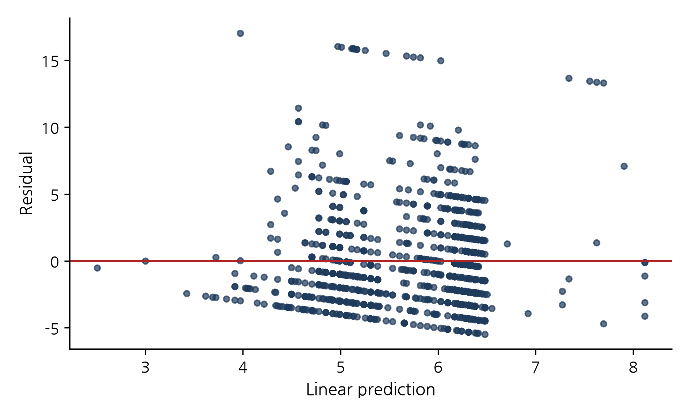
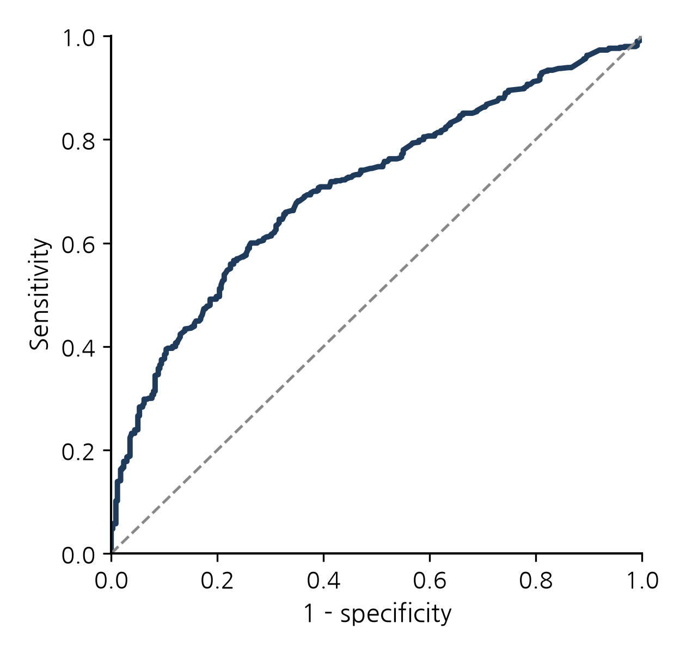

# Supplementary material

Front-end/back-end technological convergence in semiconductor hybrid bonding patents: Determinants of boundary-spanning patents and jurisdictional strategy differentiation

> Source of the robustness analyses in Section 5.4 of the main text. Raw data: 5,277 application–CPC records (928 applications) extracted from EPO PATSTAT. Estimation: Python statsmodels (NegativeBinomial, Logit, MNLogit; identical specifications to Stata `nbreg`/`logit`/`mlogit`). The baseline estimates (main-text Tables 4–6) match the original Stata analysis to three decimal places. Standard errors in the tables below are those of the log-scale coefficients (the parentheses in main-text Tables 5 and 6 are delta-method standard errors on the ratio scale), and significance is from z tests on the log scale. \* p < 0.10, \*\* p < 0.05, \*\*\* p < 0.01. The office reference is the US office, and the outcome base category of the multinomial logit is assembly-only.

## S0. Period distribution and diagnostic figures

**Table S1.** Strategy-type distribution by period (N = 928; row shares in parentheses).

| Filing period | Assembly-only | Integrated (boundary-spanning) | Process-only | N | Front-end oriented (%) |
|---|---|---|---|---:|---:|
| to 2014 | 45 (25.1%) | 56 (31.3%) | 78 (43.6%) | 179 | 74.9 |
| 2015–2019 | 48 (23.0%) | 130 (62.2%) | 31 (14.8%) | 209 | 77.0 |
| 2020–2024 | 245 (45.4%) | 239 (44.3%) | 56 (10.4%) | 540 | 54.6 |

**Figure S1.** OLS residuals versus fitted values (N = 928).

**Figure S2.** ROC curve of the front-end-orientation logit (AUC = 0.707).

## S1. Full robustness estimates

### S1.0 Data structure and diagnostics

- The CPC symbols in the extracted file belong to two classes only, H01L21/\* and H01L24/\* (262 unique symbols). Other classes (for example the H01L2224 indexing codes) were not retained at extraction, so technological scope is the number of unique subgroups within the two classes.
- Main-group composition of the 1,636 H01L21 records: wafer-fabrication groups 905, equipment and handling groups (21/67–21/68) 328, assembly-stage groups (21/48, 21/50–21/58, 21/60, 21/78) 403.
- OLS residual heteroskedasticity: Breusch–Pagan (all regressors) χ²(8) = 99.6, p < 0.001; Koenker version LM = 39.7, p < 0.001. The auxiliary regression on fitted values only (Stata `estat hettest` default) does not reject (χ²(1) = 0.90, p = 0.34).
- Poisson versus negative binomial: boundary likelihood-ratio test χ̄²(01) = 596.3, p < 0.001; Poisson Pearson χ²/df = 2.92.
- Heteroskedasticity-robust (HC1) standard errors: OLS Japan coefficient p = 0.040 → 0.191; Poisson robust standard errors China 0.063, Japan 0.190.

### S1.1 Baseline models (identical to main-text Tables 4–6)

**Table S2.** Negative binomial (technological scope) (N = 928; α = 0.268 (SE 0.020); log-likelihood = -2431.5; AIC = 4883.0)

| | IRR | SE (log) | p |
|---|:---:|:---:|:---:|
| Filing year (yc) | 1.015\*\*\* | (0.003) | 0.000 |
| China (CN) | 0.785\*\*\* | (0.062) | 0.000 |
| Korea (KR) | 1.018 | (0.094) | 0.853 |
| Taiwan (TW) | 1.021 | (0.083) | 0.801 |
| Japan (JP) | 1.270\* | (0.133) | 0.073 |
| EPO (EP) | 0.993 | (0.080) | 0.933 |
| PCT (WO) | 0.826\*\*\* | (0.073) | 0.009 |
| Other | 1.057 | (0.171) | 0.745 |

**Table S3.** Binary logit (dependent variable has_process (front-end orientation); N = 928; log-likelihood = -547.6; AIC = 1115.1; AUC = 0.707)

| | Odds ratio | SE (log) | p |
|---|:---:|:---:|:---:|
| Filing year (yc) | 0.946\*\*\* | (0.011) | 0.000 |
| Technological scope | 1.267\*\*\* | (0.027) | 0.000 |
| China (CN) | 1.650\*\* | (0.205) | 0.015 |
| Korea (KR) | 1.430 | (0.327) | 0.274 |
| Taiwan (TW) | 1.555 | (0.290) | 0.128 |
| Japan (JP) | 0.483 | (0.482) | 0.131 |
| EPO (EP) | 1.170 | (0.267) | 0.555 |
| PCT (WO) | 1.398 | (0.235) | 0.155 |
| Other | 2.132 | (0.613) | 0.217 |

**Table S4.** Multinomial logit (N = 928; log-likelihood = -774.5; AIC = 1589.0)

| | Integrated RRR | SE (log) | p | Process-only RRR | SE (log) | p |
|---|:---:|:---:|:---:|:---:|:---:|:---:|
| Filing year (yc) | 0.993 | (0.015) | 0.654 | 0.913\*\*\* | (0.015) | 0.000 |
| Technological scope | 1.403\*\*\* | (0.031) | 0.000 | 0.905\*\* | (0.048) | 0.039 |
| China (CN) | 1.205 | (0.233) | 0.423 | 2.687\*\*\* | (0.276) | 0.000 |
| Korea (KR) | 1.166 | (0.381) | 0.687 | 1.906 | (0.419) | 0.124 |
| Taiwan (TW) | 1.312 | (0.322) | 0.399 | 2.102\* | (0.407) | 0.068 |
| Japan (JP) | 1.046 | (0.557) | 0.935 | 0.086\*\*\* | (0.816) | 0.003 |
| EPO (EP) | 1.307 | (0.291) | 0.358 | 0.858 | (0.438) | 0.726 |
| PCT (WO) | 1.126 | (0.268) | 0.659 | 1.997\*\* | (0.323) | 0.032 |
| Other | 2.326 | (0.681) | 0.215 | 1.901 | (0.779) | 0.409 |

### S1.2 Heteroskedasticity-robust and family (title) clustered standard errors

**Table S5.** Negative binomial, HC1 robust standard errors (N = 928; α = 0.268 (SE 0.020); log-likelihood = -2431.5; AIC = 4883.0)

| | IRR | SE (log) | p |
|---|:---:|:---:|:---:|
| Filing year (yc) | 1.015\*\*\* | (0.005) | 0.002 |
| China (CN) | 0.785\*\*\* | (0.064) | 0.000 |
| Korea (KR) | 1.018 | (0.111) | 0.875 |
| Taiwan (TW) | 1.021 | (0.090) | 0.816 |
| Japan (JP) | 1.270 | (0.185) | 0.197 |
| EPO (EP) | 0.993 | (0.079) | 0.932 |
| PCT (WO) | 0.826\*\* | (0.079) | 0.015 |
| Other | 1.057 | (0.284) | 0.845 |

**Table S6.** Negative binomial, title-clustered standard errors (N = 928; α = 0.268 (SE 0.056); log-likelihood = -2431.5; AIC = 4883.0)

| | IRR | SE (log) | p |
|---|:---:|:---:|:---:|
| Filing year (yc) | 1.015 | (0.010) | 0.129 |
| China (CN) | 0.785\*\*\* | (0.065) | 0.000 |
| Korea (KR) | 1.018 | (0.083) | 0.833 |
| Taiwan (TW) | 1.021 | (0.067) | 0.755 |
| Japan (JP) | 1.270 | (0.207) | 0.249 |
| EPO (EP) | 0.993 | (0.087) | 0.939 |
| PCT (WO) | 0.826\*\*\* | (0.058) | 0.001 |
| Other | 1.057 | (0.304) | 0.855 |

**Table S7.** Binary logit, title-clustered standard errors (dependent variable has_process (front-end orientation); N = 928; log-likelihood = -547.6; AIC = 1115.1; AUC = 0.707)

| | Odds ratio | SE (log) | p |
|---|:---:|:---:|:---:|
| Filing year (yc) | 0.946\*\*\* | (0.016) | 0.000 |
| Technological scope | 1.267\*\*\* | (0.041) | 0.000 |
| China (CN) | 1.650\*\* | (0.213) | 0.019 |
| Korea (KR) | 1.430 | (0.316) | 0.258 |
| Taiwan (TW) | 1.555\* | (0.236) | 0.061 |
| Japan (JP) | 0.483 | (0.665) | 0.274 |
| EPO (EP) | 1.170 | (0.247) | 0.524 |
| PCT (WO) | 1.398\* | (0.197) | 0.090 |
| Other | 2.132 | (0.623) | 0.224 |

**Table S8.** Multinomial logit, title-clustered standard errors (N = 928; log-likelihood = -774.5; AIC = 1589.0)

| | Integrated RRR | SE (log) | p | Process-only RRR | SE (log) | p |
|---|:---:|:---:|:---:|:---:|:---:|:---:|
| Filing year (yc) | 0.993 | (0.021) | 0.737 | 0.913\*\*\* | (0.022) | 0.000 |
| Technological scope | 1.403\*\*\* | (0.050) | 0.000 | 0.905 | (0.094) | 0.292 |
| China (CN) | 1.205 | (0.244) | 0.445 | 2.687\*\*\* | (0.265) | 0.000 |
| Korea (KR) | 1.166 | (0.427) | 0.720 | 1.906\* | (0.372) | 0.083 |
| Taiwan (TW) | 1.312 | (0.263) | 0.303 | 2.102\*\* | (0.349) | 0.033 |
| Japan (JP) | 1.046 | (0.581) | 0.938 | 0.086\* | (1.301) | 0.059 |
| EPO (EP) | 1.307 | (0.275) | 0.331 | 0.858 | (0.420) | 0.715 |
| PCT (WO) | 1.126 | (0.221) | 0.591 | 1.997\*\*\* | (0.262) | 0.008 |
| Other | 2.326 | (0.749) | 0.260 | 1.901 | (0.619) | 0.299 |

*Note:* Point estimates equal the baseline. Number of title clusters = 473.

### S1.3 Adjusted scope (breadth_adj = breadth − has_process − has_assembly)

**Table S9.** Binary logit, adjusted scope (dependent variable has_process (front-end orientation); N = 928; log-likelihood = -573.7; AIC = 1167.4; AUC = 0.652)

| | Odds ratio | SE (log) | p |
|---|:---:|:---:|:---:|
| Filing year (yc) | 0.956\*\*\* | (0.011) | 0.000 |
| Technological scope | 1.179\*\*\* | (0.025) | 0.000 |
| China (CN) | 1.467\* | (0.198) | 0.054 |
| Korea (KR) | 1.398 | (0.319) | 0.293 |
| Taiwan (TW) | 1.493 | (0.280) | 0.153 |
| Japan (JP) | 0.540 | (0.468) | 0.188 |
| EPO (EP) | 1.183 | (0.261) | 0.519 |
| PCT (WO) | 1.271 | (0.229) | 0.295 |
| Other | 1.954 | (0.607) | 0.270 |

**Table S10.** Multinomial logit, adjusted scope (N = 928; log-likelihood = -829.4; AIC = 1698.7)

| | Integrated RRR | SE (log) | p | Process-only RRR | SE (log) | p |
|---|:---:|:---:|:---:|:---:|:---:|:---:|
| Filing year (yc) | 1.002 | (0.014) | 0.871 | 0.911\*\*\* | (0.015) | 0.000 |
| Technological scope | 1.262\*\*\* | (0.027) | 0.000 | 0.915\*\* | (0.044) | 0.043 |
| China (CN) | 1.096 | (0.220) | 0.677 | 2.720\*\*\* | (0.274) | 0.000 |
| Korea (KR) | 1.161 | (0.360) | 0.677 | 1.913 | (0.419) | 0.122 |
| Taiwan (TW) | 1.297 | (0.302) | 0.388 | 2.131\* | (0.406) | 0.063 |
| Japan (JP) | 1.053 | (0.526) | 0.922 | 0.087\*\*\* | (0.817) | 0.003 |
| EPO (EP) | 1.302 | (0.278) | 0.342 | 0.868 | (0.435) | 0.745 |
| PCT (WO) | 1.031 | (0.254) | 0.904 | 2.016\*\* | (0.322) | 0.029 |
| Other | 2.021 | (0.664) | 0.289 | 1.923 | (0.775) | 0.399 |

### S1.4 Post-2010 subsample

**Table S11.** Negative binomial, 2010 onwards (N = 830; α = 0.183 (SE 0.017); log-likelihood = -2131.7; AIC = 4283.5)

| | IRR | SE (log) | p |
|---|:---:|:---:|:---:|
| Filing year (yc) | 0.970\*\*\* | (0.006) | 0.000 |
| China (CN) | 0.794\*\*\* | (0.057) | 0.000 |
| Korea (KR) | 0.999 | (0.096) | 0.989 |
| Taiwan (TW) | 1.021 | (0.076) | 0.790 |
| Japan (JP) | 1.577\*\*\* | (0.141) | 0.001 |
| EPO (EP) | 1.014 | (0.076) | 0.858 |
| PCT (WO) | 0.842\*\* | (0.068) | 0.012 |
| Other | 0.716 | (0.204) | 0.101 |

**Table S12.** Negative binomial, 2010 onwards excluding the four Japanese-office filings with scope 21 (N = 826; α = 0.178 (SE 0.017); log-likelihood = -2112.2; AIC = 4244.5)

| | IRR | SE (log) | p |
|---|:---:|:---:|:---:|
| Filing year (yc) | 0.972\*\*\* | (0.006) | 0.000 |
| China (CN) | 0.793\*\*\* | (0.057) | 0.000 |
| Korea (KR) | 0.999 | (0.095) | 0.993 |
| Taiwan (TW) | 1.019 | (0.076) | 0.804 |
| Japan (JP) | 1.057 | (0.176) | 0.751 |
| EPO (EP) | 1.013 | (0.075) | 0.860 |
| PCT (WO) | 0.841\*\* | (0.068) | 0.011 |
| Other | 0.716\* | (0.203) | 0.099 |

**Table S13.** Binary logit, 2010 onwards (dependent variable has_process (front-end orientation); N = 830; log-likelihood = -487.3; AIC = 994.6; AUC = 0.723)

| | Odds ratio | SE (log) | p |
|---|:---:|:---:|:---:|
| Filing year (yc) | 0.905\*\*\* | (0.025) | 0.000 |
| Technological scope | 1.269\*\*\* | (0.028) | 0.000 |
| China (CN) | 1.676\*\* | (0.210) | 0.014 |
| Korea (KR) | 1.005 | (0.362) | 0.989 |
| Taiwan (TW) | 1.588 | (0.296) | 0.119 |
| Japan (JP) | 5.858\* | (1.073) | 0.100 |
| EPO (EP) | 1.263 | (0.288) | 0.416 |
| PCT (WO) | 1.321 | (0.246) | 0.257 |
| Other | 1.319 | (0.678) | 0.683 |

**Table S14.** Multinomial logit, 2010 onwards (N = 830; log-likelihood = -683.0; AIC = 1406.0)

| | Integrated RRR | SE (log) | p | Process-only RRR | SE (log) | p |
|---|:---:|:---:|:---:|:---:|:---:|:---:|
| Filing year (yc) | 0.934\*\* | (0.027) | 0.013 | 0.862\*\*\* | (0.033) | 0.000 |
| Technological scope | 1.385\*\*\* | (0.032) | 0.000 | 0.910\* | (0.051) | 0.063 |
| China (CN) | 1.240 | (0.234) | 0.358 | 2.701\*\*\* | (0.290) | 0.001 |
| Korea (KR) | 0.958 | (0.394) | 0.914 | 1.131 | (0.560) | 0.825 |
| Taiwan (TW) | 1.400 | (0.323) | 0.299 | 2.088\* | (0.434) | 0.090 |
| Japan (JP) | 6.795\* | (1.085) | 0.078 | 3.240 | (1.456) | 0.419 |
| EPO (EP) | 1.447 | (0.302) | 0.221 | 0.709 | (0.578) | 0.553 |
| PCT (WO) | 1.184 | (0.271) | 0.533 | 1.694 | (0.364) | 0.148 |
| Other | 1.940 | (0.684) | 0.332 | 0.000 | (58079.484) | 1.000 |

*Note:* The 15 Japanese-office applications from 2010 onwards comprise one assembly-only, 13 integrated and one process-only application; the 10 "other" applications contain no process-only filing, so the Other → process-only coefficient is not identified (quasi-complete separation; the value shown is meaningless).

### S1.5 Period-dummy specification and boundary sensitivity

**Table S15.** Multinomial logit, period dummies (to 2014 / 2015–2019 / 2020–2024) (N = 928; log-likelihood = -751.3)

| | Integrated RRR | p | Process-only RRR | p |
|---|:---:|:---:|:---:|:---:|
| Technological scope | 1.397\*\*\* | 0.000 | 0.897\*\* | 0.023 |
| Second period (vs first) | 1.707\* | 0.092 | 0.273\*\*\* | 0.000 |
| Third period (vs first) | 0.762 | 0.319 | 0.101\*\*\* | 0.000 |
| China (CN) | 1.172 | 0.500 | 2.898\*\*\* | 0.000 |
| Korea (KR) | 1.124 | 0.758 | 1.802 | 0.170 |
| Taiwan (TW) | 1.358 | 0.346 | 2.340\*\* | 0.044 |
| Japan (JP) | 1.114 | 0.843 | 0.239\*\* | 0.044 |
| EPO (EP) | 1.306 | 0.365 | 0.856 | 0.726 |
| PCT (WO) | 1.145 | 0.617 | 2.034\*\* | 0.037 |
| Other | 2.612 | 0.159 | 1.666 | 0.530 |

*Note:* Wald test of the difference between the two period coefficients in the integrated equation: χ²(1) = 13.9, p = 0.0002.

**Table S16.** Boundaries one year earlier (to 2013 / 2014–2018 / 2019–2024) (N = 928; log-likelihood = -754.4)

| | Integrated RRR | p | Process-only RRR | p |
|---|:---:|:---:|:---:|:---:|
| Technological scope | 1.398\*\*\* | 0.000 | 0.896\*\* | 0.023 |
| Second period (vs first) | 1.913\* | 0.061 | 0.367\*\*\* | 0.003 |
| Third period (vs first) | 0.820 | 0.497 | 0.108\*\*\* | 0.000 |
| China (CN) | 1.208 | 0.419 | 2.752\*\*\* | 0.000 |
| Korea (KR) | 1.136 | 0.737 | 1.689 | 0.220 |
| Taiwan (TW) | 1.416 | 0.284 | 2.390\*\* | 0.039 |
| Japan (JP) | 1.126 | 0.830 | 0.230\*\* | 0.038 |
| EPO (EP) | 1.274 | 0.410 | 0.889 | 0.790 |
| PCT (WO) | 1.152 | 0.600 | 1.997\*\* | 0.039 |
| Other | 2.587 | 0.163 | 1.576 | 0.575 |

*Note:* Wald test of the difference between the two period coefficients in the integrated equation: χ²(1) = 12.7, p = 0.0004.

**Table S17.** Boundaries one year later (to 2015 / 2016–2020 / 2021–2024) (N = 928; log-likelihood = -758.8)

| | Integrated RRR | p | Process-only RRR | p |
|---|:---:|:---:|:---:|:---:|
| Technological scope | 1.395\*\*\* | 0.000 | 0.888\*\* | 0.013 |
| Second period (vs first) | 1.258 | 0.412 | 0.216\*\*\* | 0.000 |
| Third period (vs first) | 0.639\* | 0.078 | 0.128\*\*\* | 0.000 |
| China (CN) | 1.243 | 0.354 | 2.718\*\*\* | 0.000 |
| Korea (KR) | 1.161 | 0.695 | 1.832 | 0.152 |
| Taiwan (TW) | 1.457 | 0.249 | 2.359\*\* | 0.040 |
| Japan (JP) | 1.096 | 0.865 | 0.272\* | 0.066 |
| EPO (EP) | 1.367 | 0.287 | 0.903 | 0.814 |
| PCT (WO) | 1.209 | 0.484 | 1.996\*\* | 0.039 |
| Other | 2.587 | 0.166 | 1.784 | 0.469 |

*Note:* Wald test of the difference between the two period coefficients in the integrated equation: χ²(1) = 12.0, p = 0.0005.

### S1.6 Exclusion of 2023–2024 (publication-lag truncation)

**Table S18.** Negative binomial, filings up to 2022 (N = 753; α = 0.289 (SE 0.024); log-likelihood = -2006.9; AIC = 4033.7)

| | IRR | SE (log) | p |
|---|:---:|:---:|:---:|
| Filing year (yc) | 1.022\*\*\* | (0.004) | 0.000 |
| China (CN) | 0.808\*\*\* | (0.071) | 0.003 |
| Korea (KR) | 1.017 | (0.099) | 0.865 |
| Taiwan (TW) | 1.108 | (0.095) | 0.281 |
| Japan (JP) | 1.388\*\* | (0.153) | 0.032 |
| EPO (EP) | 0.988 | (0.087) | 0.886 |
| PCT (WO) | 0.912 | (0.087) | 0.289 |
| Other | 1.106 | (0.181) | 0.578 |

**Table S19.** Binary logit, filings up to 2022 (dependent variable has_process (front-end orientation); N = 753; log-likelihood = -426.1; AIC = 872.3; AUC = 0.733)

| | Odds ratio | SE (log) | p |
|---|:---:|:---:|:---:|
| Filing year (yc) | 0.936\*\*\* | (0.013) | 0.000 |
| Technological scope | 1.288\*\*\* | (0.030) | 0.000 |
| China (CN) | 1.389 | (0.231) | 0.155 |
| Korea (KR) | 1.360 | (0.340) | 0.366 |
| Taiwan (TW) | 1.671 | (0.349) | 0.141 |
| Japan (JP) | 0.186\*\*\* | (0.573) | 0.003 |
| EPO (EP) | 1.004 | (0.285) | 0.988 |
| PCT (WO) | 1.703\* | (0.297) | 0.073 |
| Other | 2.650 | (0.684) | 0.154 |

**Table S20.** Multinomial logit, filings up to 2022 (N = 753; log-likelihood = -607.4; AIC = 1254.7)

| | Integrated RRR | SE (log) | p | Process-only RRR | SE (log) | p |
|---|:---:|:---:|:---:|:---:|:---:|:---:|
| Filing year (yc) | 0.989 | (0.018) | 0.543 | 0.909\*\*\* | (0.016) | 0.000 |
| Technological scope | 1.418\*\*\* | (0.034) | 0.000 | 0.908\* | (0.054) | 0.077 |
| China (CN) | 1.231 | (0.258) | 0.420 | 1.651 | (0.319) | 0.116 |
| Korea (KR) | 1.095 | (0.396) | 0.818 | 1.808 | (0.430) | 0.169 |
| Taiwan (TW) | 1.480 | (0.381) | 0.304 | 1.876 | (0.492) | 0.201 |
| Japan (JP) | 0.400 | (0.748) | 0.220 | 0.061\*\*\* | (0.836) | 0.001 |
| EPO (EP) | 1.078 | (0.313) | 0.810 | 0.804 | (0.449) | 0.628 |
| PCT (WO) | 1.387 | (0.335) | 0.330 | 2.167\*\* | (0.385) | 0.045 |
| Other | 2.979 | (0.747) | 0.144 | 2.172 | (0.837) | 0.354 |

Among 2023–2024 filings, 18 of the 39 Chinese-office applications and 3 of the 65 US-office applications are process-only. Mean scope by filing year: 2019: 6.36, 2020: 6.42, 2021: 5.64, 2022: 5.40, 2023: 4.72, 2024: 4.78.

### S1.7 Family de-duplication (earliest filing per normalised title, N = 473)

Type distribution: assembly-only 187 (39.5%), integrated 173 (36.6%), process-only 113 (23.9%). Among the 37 US–China pairs with the same title, scope is identical in 34 pairs and strategy type in 36; the Chinese filing is narrower in 3 pairs.

**Table S21.** Negative binomial, de-duplicated (N = 473; α = 0.234 (SE 0.028); log-likelihood = -1172.0; AIC = 2364.0)

| | IRR | SE (log) | p |
|---|:---:|:---:|:---:|
| Filing year (yc) | 1.022\*\*\* | (0.004) | 0.000 |
| China (CN) | 0.792\*\*\* | (0.077) | 0.003 |
| Korea (KR) | 0.919 | (0.127) | 0.506 |
| Taiwan (TW) | 1.111 | (0.149) | 0.479 |
| Japan (JP) | 1.302 | (0.183) | 0.150 |
| EPO (EP) | 1.435\*\*\* | (0.119) | 0.002 |
| PCT (WO) | 0.751\*\* | (0.131) | 0.029 |
| Other | 1.342 | (0.272) | 0.279 |

**Table S22.** Binary logit, de-duplicated (dependent variable has_process (front-end orientation); N = 473; log-likelihood = -301.7; AIC = 623.3; AUC = 0.645)

| | Odds ratio | SE (log) | p |
|---|:---:|:---:|:---:|
| Filing year (yc) | 0.959\*\*\* | (0.013) | 0.002 |
| Technological scope | 1.141\*\*\* | (0.033) | 0.000 |
| China (CN) | 1.870\*\* | (0.246) | 0.011 |
| Korea (KR) | 1.563 | (0.405) | 0.270 |
| Taiwan (TW) | 2.069 | (0.526) | 0.167 |
| Japan (JP) | 0.626 | (0.602) | 0.436 |
| EPO (EP) | 1.791 | (0.445) | 0.190 |
| PCT (WO) | 1.308 | (0.393) | 0.495 |
| Other | 1.243 | (0.926) | 0.814 |

**Table S23.** Multinomial logit, de-duplicated (N = 473; log-likelihood = -425.3; AIC = 890.6)

| | Integrated RRR | SE (log) | p | Process-only RRR | SE (log) | p |
|---|:---:|:---:|:---:|:---:|:---:|:---:|
| Filing year (yc) | 0.997 | (0.018) | 0.858 | 0.935\*\*\* | (0.016) | 0.000 |
| Technological scope | 1.295\*\*\* | (0.039) | 0.000 | 0.826\*\*\* | (0.061) | 0.002 |
| China (CN) | 1.366 | (0.288) | 0.280 | 2.721\*\*\* | (0.320) | 0.002 |
| Korea (KR) | 1.429 | (0.485) | 0.462 | 1.807 | (0.499) | 0.236 |
| Taiwan (TW) | 1.267 | (0.633) | 0.708 | 3.485\*\* | (0.636) | 0.050 |
| Japan (JP) | 1.572 | (0.673) | 0.501 | 0.061\*\* | (1.222) | 0.022 |
| EPO (EP) | 2.412\* | (0.480) | 0.067 | 0.699 | (0.764) | 0.640 |
| PCT (WO) | 1.042 | (0.489) | 0.933 | 1.636 | (0.496) | 0.321 |
| Other | 0.167 | (2.128) | 0.400 | 1.847 | (1.010) | 0.543 |

### S1.8 Strict front-end definition (assembly-stage main groups excluded, N = 908)

Type distribution: assembly-only 425, integrated 338, process-only 145 (20 applications with no symbol left in either class excluded). Front-end orientation 52.0%. Period shares (assembly/integrated/process): to 2014 27.2/31.2/41.6; 2015–2019 25.5/61.8/12.8; 2020–2024 61.4/29.8/8.8.

**Table S24.** Binary logit, strict definition (dependent variable has_process (strict definition); N = 908; log-likelihood = -557.7; AIC = 1135.3; AUC = 0.710)

| | Odds ratio | SE (log) | p |
|---|:---:|:---:|:---:|
| Filing year (yc) | 0.928\*\*\* | (0.012) | 0.000 |
| Technological scope | 1.235\*\*\* | (0.024) | 0.000 |
| China (CN) | 1.963\*\*\* | (0.202) | 0.001 |
| Korea (KR) | 2.027\*\* | (0.320) | 0.027 |
| Taiwan (TW) | 2.040\*\* | (0.282) | 0.011 |
| Japan (JP) | 0.666 | (0.490) | 0.406 |
| EPO (EP) | 1.140 | (0.260) | 0.615 |
| PCT (WO) | 1.486\* | (0.235) | 0.092 |
| Other | 2.523 | (0.585) | 0.114 |

**Table S25.** Multinomial logit, strict definition (N = 908; log-likelihood = -755.9; AIC = 1551.8)

| | Integrated RRR | SE (log) | p | Process-only RRR | SE (log) | p |
|---|:---:|:---:|:---:|:---:|:---:|:---:|
| Filing year (yc) | 0.967\*\* | (0.015) | 0.025 | 0.898\*\*\* | (0.015) | 0.000 |
| Technological scope | 1.352\*\*\* | (0.028) | 0.000 | 0.923\* | (0.045) | 0.076 |
| China (CN) | 1.401 | (0.235) | 0.151 | 3.299\*\*\* | (0.285) | 0.000 |
| Korea (KR) | 1.684 | (0.371) | 0.161 | 2.636\*\* | (0.422) | 0.022 |
| Taiwan (TW) | 1.763\* | (0.315) | 0.071 | 2.683\*\* | (0.416) | 0.018 |
| Japan (JP) | 1.401 | (0.536) | 0.530 | 0.103\*\*\* | (0.833) | 0.006 |
| EPO (EP) | 1.215 | (0.288) | 0.500 | 0.956 | (0.443) | 0.918 |
| PCT (WO) | 1.193 | (0.274) | 0.518 | 2.170\*\* | (0.339) | 0.022 |
| Other | 2.631 | (0.663) | 0.145 | 2.385 | (0.758) | 0.251 |

### S1.9 Exclusion of irrelevant uses of the search terms (N = 860; list in Section S2)

**Table S26.** Negative binomial, irrelevant uses excluded (N = 860; α = 0.254 (SE 0.020); log-likelihood = -2270.0; AIC = 4560.0)

| | IRR | SE (log) | p |
|---|:---:|:---:|:---:|
| Filing year (yc) | 1.001 | (0.004) | 0.730 |
| China (CN) | 0.785\*\*\* | (0.063) | 0.000 |
| Korea (KR) | 0.961 | (0.094) | 0.675 |
| Taiwan (TW) | 1.012 | (0.082) | 0.885 |
| Japan (JP) | 1.397\*\* | (0.145) | 0.021 |
| EPO (EP) | 0.989 | (0.082) | 0.892 |
| PCT (WO) | 0.820\*\*\* | (0.073) | 0.007 |
| Other | 0.938 | (0.169) | 0.705 |

**Table S27.** Binary logit, irrelevant uses excluded (dependent variable has_process (front-end orientation); N = 860; log-likelihood = -482.8; AIC = 985.6; AUC = 0.752)

| | Odds ratio | SE (log) | p |
|---|:---:|:---:|:---:|
| Filing year (yc) | 0.883\*\*\* | (0.018) | 0.000 |
| Technological scope | 1.266\*\*\* | (0.028) | 0.000 |
| China (CN) | 1.831\*\*\* | (0.218) | 0.005 |
| Korea (KR) | 1.169 | (0.349) | 0.656 |
| Taiwan (TW) | 1.630 | (0.297) | 0.100 |
| Japan (JP) | 1.006 | (0.656) | 0.993 |
| EPO (EP) | 1.400 | (0.290) | 0.246 |
| PCT (WO) | 1.377 | (0.248) | 0.197 |
| Other | 1.698 | (0.640) | 0.408 |

**Table S28.** Multinomial logit, irrelevant uses excluded (N = 860; log-likelihood = -682.7; AIC = 1405.4)

| | Integrated RRR | SE (log) | p | Process-only RRR | SE (log) | p |
|---|:---:|:---:|:---:|:---:|:---:|:---:|
| Filing year (yc) | 0.949\*\* | (0.022) | 0.015 | 0.820\*\*\* | (0.023) | 0.000 |
| Technological scope | 1.384\*\*\* | (0.031) | 0.000 | 0.916\* | (0.050) | 0.078 |
| China (CN) | 1.350 | (0.241) | 0.214 | 3.235\*\*\* | (0.303) | 0.000 |
| Korea (KR) | 1.128 | (0.385) | 0.754 | 1.175 | (0.510) | 0.752 |
| Taiwan (TW) | 1.402 | (0.323) | 0.296 | 2.294\* | (0.445) | 0.062 |
| Japan (JP) | 1.643 | (0.654) | 0.448 | 0.015\*\*\* | (1.466) | 0.004 |
| EPO (EP) | 1.522 | (0.306) | 0.170 | 1.089 | (0.494) | 0.863 |
| PCT (WO) | 1.145 | (0.274) | 0.622 | 2.046\* | (0.366) | 0.050 |
| Other | 2.051 | (0.680) | 0.291 | 0.996 | (0.914) | 0.997 |

### S1.10 Indirect check of the independence of irrelevant alternatives

Binary logit of integrated against assembly-only in the sample without process-only applications (N = 763): technological scope OR 1.463, filing year 0.987, China 1.177, Korea 1.206, Taiwan 1.440, Japan 1.243, EPO 1.316, PCT 1.150, other 2.162. These are close to the integrated equation of main-text Table 6 (1.403, 0.993, 1.205, 1.166, 1.312, 1.046, 1.307, 1.126, 2.326).

### S1.11 Counts used in the classification-practice check

- Of the 60 H01L24 subgroups, 28 are assigned to applications filed before 2010. Of the 662 applications with bonding symbols filed from 2015 onwards, 97.6% carry at least one pre-existing symbol; 76.7% of the H01L24 records in that period are assigned to pre-existing symbols.
- H01L24 symbols per application: –2014 3.03, 2015–2019 4.73, 2020–2024 3.91; H01L21 symbols per application: –2014 2.12, 2015–2019 2.23, 2020–2024 1.46; share of applications with a bonding symbol: –2014 56.4%, 2015–2019 85.2%, 2020–2024 89.6%.

### S1.12 Predicted values behind main-text Figures 3 and 4

- Figure 3 (negative binomial, filing year fixed at the sample mean yc = 49.7): US 5.98 [5.59, 6.39], CN 4.69 [4.23, 5.20], KR 6.08 [5.12, 7.22], TW 6.10 [5.26, 7.08], JP 7.59 [5.90, 9.77], EP 5.94 [5.15, 6.85], WO 4.94 [4.35, 5.60], Other 6.32 [4.55, 8.77].
- Figure 4 (multinomial logit, average predicted probabilities): US 0.143 [0.113, 0.177], CN 0.255 [0.202, 0.312], KR 0.209 [0.133, 0.311], TW 0.216 [0.142, 0.318], JP 0.021 [0.006, 0.069], EP 0.120 [0.069, 0.194], WO 0.217 [0.156, 0.284], Other 0.170 [0.069, 0.352]. Predictions with covariates fixed at their means (for reference): US 0.102, CN 0.216, KR 0.166, TW 0.170, JP 0.009, EP 0.078, WO 0.176, Other 0.113.

## S2. Applications excluded as irrelevant uses of the search terms

> Basis of Section 4.1 and the eighth robustness item of Section 5.4 in the main text. Applications whose titles contain the following terms were judged irrelevant uses of "direct bonding": ceramic, DBC (direct bonded copper), alumina, zirconia and aluminium nitride substrates; copper alloys ("copper alloy having … direct bonding property"); diamond-to-molybdenum bonding; laser precursors; electrostatic chucks; power-module and power-device substrates; heat spreaders; direct bonded metal or copper substrates; direct bond circuit assemblies; and sp3–sp2 "hybrid bonding" in the chemical sense. Total 68 applications (36 filed before 2015). By office: US 35, CN 11, JP 7, EP 7, WO 5, KR 2, TW 1, Other 0. By type: Assembly 34, Integrated 17, Process 17, None 0.

| Filing year | Office | Scope | Strategy type | Title |
|---|---|---:|---|---|
| 1968 | US | 2 | Integrated | DIRECT BONDING OF DIAMOND TO MOLYBDENUM |
| 1975 | US | 3 | Assembly | Direct bonding of metals to ceramics and metals |
| 1981 | US | 1 | Process | Blister-free direct bonding of metals to ceramics and metals |
| 1988 | JP | 1 | Assembly | COPPER ALLOY HAVING GOOD DIRECT BONDING PROPERTIES |
| 1988 | JP | 1 | Assembly | COPPER ALLOY HAVING SUPERIOR DIRECT BONDING PROPERTY |
| 1988 | JP | 1 | Assembly | COPPER ALLOY HAVING SUPERIOR DIRECT BONDING PROPERTY |
| 1988 | JP | 1 | Assembly | COPPER ALLOY HAVING GOOD DIRECT BONDING PROPERTIES |
| 1988 | JP | 1 | Assembly | COPPER ALLOY HAVING SUPERIOR DIRECT BONDING PROPERTY |
| 1988 | US | 1 | Assembly | Direct bond circuit assembly with crimped lead frame |
| 1988 | US | 2 | Assembly | Direct bond circuit assembly with ground plane |
| 1988 | US | 3 | Integrated | Hermetic direct bond circuit assembly |
| 1988 | JP | 1 | Assembly | COPPER ALLOY HAVING GOOD DIRECT BONDING PROPERTIES |
| 1990 | EP | 2 | Process | Direct bonded metal-substrate structures. |
| 1990 | US | 2 | Integrated | Circuit assembly and method with direct bonded terminal pin |
| 1994 | US | 2 | Assembly | Direct bonded heat spreader |
| 1995 | EP | 1 | Assembly | Zirconia-added alumina substrate with direct bonding of copper |
| 1996 | US | 1 | Assembly | Zirconia-added alumina substrate with direct bonding of copper |
| 1996 | EP | 1 | Assembly | Zirconia-added alumina substrate with direct bonding of copper |
| 2001 | US | 3 | Assembly | High frequency power device with a plastic molded package and direct bonded substrate |
| 2002 | US | 8 | Process | System and method for fabricating efficient semiconductor lasers via use of precursors having a direct bond between a group III atom and a nitrogen atom |
| 2002 | US | 3 | Assembly | Method for manufacturing a power semiconductor device and direct bonded substrate thereof |
| 2002 | US | 2 | Assembly | Power device with a plastic molded package and direct bonded substrate |
| 2002 | KR | 2 | Assembly | POWER DEVICE WITH A PLASTIC MOLDED PACKAGE AND DIRECT BONDED SUBSTRATE |
| 2002 | EP | 2 | Assembly | Power device with a plastic molded package and direct bonded substrate |
| 2003 | EP | 3 | Assembly | Direct bonded substrate for a power semiconductor device. |
| 2003 | JP | 8 | Process | HIGHLY EFFICIENT SEMICONDUCTOR LASER MANUFACTURING SYSTEM AND METHOD USING PRECURSOR HAVING DIRECT BONDING BETWEEN GROUP III ATOM AND NITROGEN ATOM |
| 2007 | US | 3 | Assembly | Method for direct bonding of metallic conductors to a ceramic substrate |
| 2010 | US | 3 | Assembly | NON-DIRECT BOND COPPER ISOLATED LATERAL WIDE BAND GAP SEMICONDUCTOR DEVICE |
| 2011 | WO | 1 | Process | ELECTRONICS SUBSTRATE WITH ENHANCED DIRECT BONDED METAL |
| 2011 | CN | 1 | Assembly | Microchannel direct bonded copper substrate and packaging structure and process of power device thereof |
| 2011 | CN | 3 | Assembly | Non-direct bond copper isolated lateral wide band gap semiconductor device |
| 2011 | US | 1 | Process | ELECTRONICS SUBSTRATE WITH ENHANCED DIRECT BONDED METAL |
| 2011 | WO | 1 | Assembly | MICROCHANNEL DIRECT BONDED COPPER SUBSTRATE AND PACKAGING STRUCTURE AND PROCESS OF POWER DEVICE THEREOF |
| 2013 | KR | 2 | Process | CERAMIC ELECTROSTATIC CHUCK FOR APPLICATIONS OF CO-FIRED BY DIRECT BONDING AND METHOD FOR MANUFACTURING THE SAME |
| 2014 | US | 5 | Assembly | Package structure with direct bond copper substrate |
| 2014 | US | 1 | Process | Method of producing electronics substrate with enhanced direct bonded metal |
| 2015 | US | 6 | Integrated | Direct bonded copper semiconductor packages and related methods |
| 2017 | US | 6 | Integrated | Direct bonded copper semiconductor packages and related methods |
| 2017 | US | 5 | Assembly | Electronic assembly with a direct bonded copper substrate |
| 2018 | US | 6 | Integrated | Direct bonded copper semiconductor packages and related methods |
| 2018 | WO | 1 | Process | LOW TEMPERATURE DIRECT BONDING OF ALUMINUM NITRIDE TO ALSIC SUBSTRATES |
| 2018 | CN | 1 | Assembly | Method for uniformizing temperature field of current assisted sintered nano-silver soldering paste on basis of DBC (Direct Bonded Copper) ceramic substrate |
| 2018 | EP | 5 | Assembly | ELECTRONIC ASSEMBLY WITH A DIRECT BONDED COPPER SUBSTRATE |
| 2018 | US | 3 | Assembly | Direct bonded copper power module with elevated common source inductance |
| 2018 | US | 1 | Process | Low temperature direct bonding of aluminum nitride to AlSiC substrates |
| 2018 | CN | 5 | Assembly | ELECTRONIC ASSEMBLY WITH A DIRECT BONDED COPPER SUBSTRATE |
| 2019 | CN | 3 | Assembly | Direct bonded copper power module with elevated common source inductance |
| 2019 | US | 1 | Process | Direct bonded metal substrates with encapsulated phase change materials and electronic assemblies incorporating the same |
| 2019 | TW | 1 | Process | DIRECT BONDED COPPER CERAMIC SUBSTRATE |
| 2019 | US | 1 | Process | Direct bonded copper ceramic substrate |
| 2020 | US | 6 | Integrated | DIRECT BONDED COPPER SEMICONDUCTOR PACKAGES AND RELATED METHODS |
| 2020 | CN | 4 | Integrated | DIRECT BONDED COPPER SUBSTRATES FABRICATED USING SILVER SINTERING |
| 2020 | US | 4 | Integrated | Direct bonded copper substrates fabricated using silver sintering |
| 2020 | US | 2 | Assembly | Automotive power devices on direct bond copper embedded in PCB driver boards |
| 2022 | US | 8 | Integrated | DIRECT BOND COPPER SUBSTRATE WITH METAL FILLED CERAMIC SUBSTRATE INDENTATIONS |
| 2022 | WO | 9 | Integrated | HYBRID BOND SHEET AND COOLED SEMICONDUCTOR POWER MODULE |
| 2022 | US | 5 | Integrated | POWER MODULE PACKAGE WITH STACKED DIRECT BONDED METAL SUBSTRATES |
| 2022 | EP | 9 | Integrated | HYBRID BOND SHEET AND COOLED SEMICONDUCTOR POWER MODULE |
| 2022 | US | 4 | Assembly | DUAL SIDE COOLED POWER MODULE WITH THREE-DIMENSIONAL DIRECT BONDED METAL SUBSTRATES |
| 2022 | CN | 9 | Integrated | Hybrid bonding sheet and cooling semiconductor power module |
| 2023 | US | 4 | Integrated | Direct bonded copper substrates fabricated using silver sintering |
| 2023 | CN | 1 | Process | Method for forming sharp corner pattern on DBC (Direct Bonding Copper) substrate |
| 2023 | CN | 4 | Assembly | Two-sided cooling power module employing three-dimensional direct bonding metal substrates |
| 2023 | CN | 4 | Process | Preparation method and application of sp3-sp2 hybrid bonding network layer of diamond substrate |
| 2023 | US | 1 | Process | THICK FILM PRINTED COOLER FOR IMPROVED THERMAL MANAGEMENT OF DIRECT BONDED POWER DEVICES |
| 2023 | CN | 4 | Process | Method for fragmenting DBC (Direct Bonding Copper) substrate |
| 2024 | WO | 3 | Integrated | PACKAGE COMPRISING A DIRECT BONDED METAL SUBSTRATE AND A COOLING JACKET, METHOD OF FORMING THE PACKAGE AND A DIRECT BONDED METAL SUBSTRATE |
| 2024 | US | 9 | Integrated | HYBRID BOND SHEET AND COOLED SEMICONDUCTOR POWER MODULE |
