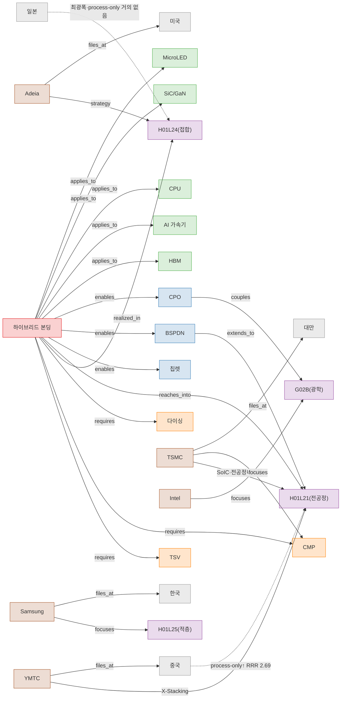

# 기술 네트워크 KG (초안) — 하이브리드 본딩

> 논문 §4.5(기술 네트워크) / §6 통합 논의의 **그림 초안**. 자료①②의 **검증된 사실만**으로
> 결정론적으로 구성(LLM 추출 아님 → 환각 없음). 산출물: `tech_network.png`(렌더),
> `tech_network.json`(트리플), `tech_network.dot`(GraphViz). 아래는 GitHub에서 바로 보이는 Mermaid.



**범례(노드 유형):** 🔴핵심공정 · 🟠동행공정(TSV/CMP/다이싱) · 🟣CPC · 🔵구조 · 🟢제품 · 🟤기업 · ⚪관할권

**읽는 법:** 하이브리드 본딩(후공정 H01L24)이 TSV·CMP·다이싱을 *요구*하고 전공정(H01L21)으로
*침투*하며(경계 흐려짐), 칩렛·BSPDN·CPO 구조를 거쳐 HBM·AI가속기 등 제품으로 확장된다.
기업·관할권 전략(Adeia=IP원천, TSMC=전공정내재화, YMTC=X-Stacking, 중국=process-only↑,
일본=최광폭)이 CPC 축에 매핑된다. → §4.8 기업사례·§6.3 교차표·표 6-2와 정합.

---

## kg-gen으로 의미 기반 KG도 뽑으려면 (LLM 키 필요)

위 그림은 *검증된 구조 KG*다. 추가로 **텍스트에서 자동 추출한 의미 KG**가 필요하면 키가 있을 때:

```bash
pip install kg-gen
export OPENAI_API_KEY=...        # LiteLLM 형식
python3 - <<'PY'
from kg_gen import KGGen
kg = KGGen(model="openai/gpt-4o-mini")
text = open("manuscript/sources/02_patent_analytics_termpaper_KO.txt").read()
graph = kg.generate(input_data=text)
import json; json.dump(graph.__dict__, open("rag/kg_output/auto_kg.json","w"), ensure_ascii=False, indent=1)
PY
```
> 자동 추출 KG는 **환각 가능** → 엔티티·관계를 원문과 대조한 뒤에만 논문에 반영(무결성 게이트).
> 본 결정론 KG는 그 대조의 **기준선(ground truth)** 으로도 쓸 수 있다.
